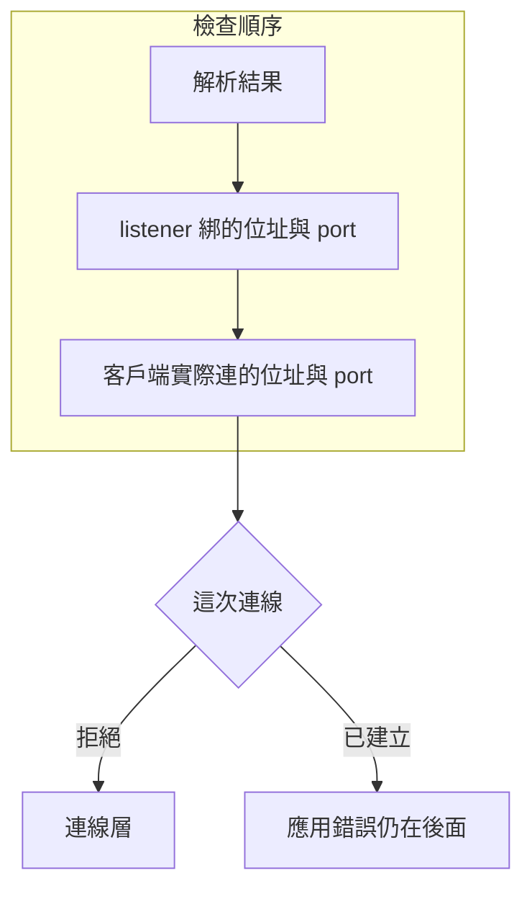

# 07｜名稱寫對了，圖還是交不出去

合成圖 `AOI-SYN-009` 要送到接收站。站名填對了，日誌仍只寫連線失敗。先別把 port 5000 記成工廠那台機器已經有程序在聽。

## 先預測

客戶端呼叫 `getaddrinfo("localhost")`，結果裡出現 `127.0.0.1`。先在紙上留下三欄，再往下看：

1. 解析結果裡有哪些位址？
2. 本機 listener 綁住的位址與 port 是什麼？
3. 客戶端實際連出去的位址與 port 是什麼？

名稱已經換成位址時，你認為連線建立了嗎？路由已經通到工廠了嗎？先寫預測。

三欄各自要有證據。只拿到第一欄，就停在第一欄。listener 的 port 若是系統現配的，紙上要留下那個數字，不要沿用口頭說的 5000。

## 沿着這條路徑



這張圖只排檢查順序。外網路由不在圖裡，本次也沒有量。

## 原理

`getaddrinfo` 把名稱換成一組 socket 位址，供之後建立 socket。Python 的說明見 [socket.getaddrinfo](https://docs.python.org/3.13/library/socket.html#socket.getaddrinfo)。POSIX 寫的是回傳一組 socket 位址，見 [getaddrinfo](https://pubs.opengroup.org/onlinepubs/9699919799/functions/getaddrinfo.html)。解析成功還沒有連線。

本次 macOS 與 Linux 容器上，`localhost` 都解析到 `127.0.0.1` 與 `::1`。那是執行解析的那一台自己的 loopback。不要把這兩個位址寫死成某一台工廠機器。

名稱 `no-such-name.invalid` 在 L04 會讓 `getaddrinfo` 失敗。這一欄停在名稱。

沒有 listener 時，對剛關閉的 `127.0.0.1` port 連線，得到 `ConnectionRefusedError`。這是連線層。L04 的做法是：先綁一個 `127.0.0.1` 上的臨時 port，記下 port，關掉那個 socket，再對同一位址與 port 連線。被拒只證明當時沒有人接受這次連線。

Python 回傳的是一串結果，每一筆之後用來建立 socket。同一次呼叫可以同時有 IPv4 與 IPv6。本次 `localhost` 就是兩筆都出現。有的系統可能只回一筆。不要把「這次有兩筆」寫成所有名稱、所有作業系統的固定格式。

三欄要逐個對。解析到 `127.0.0.1`，listener 若綁在別的位址，客戶端仍會走錯目的地。port 也要照同一順序看，不能只對名稱。客戶端連向 `127.0.0.1` 的 5000，而 listener 綁在同一個位址的另一個 port，仍是目的地不一致。

| 欄 | 這次有的證據 | 這次沒有的證據 |
|---|---|---|
| 名稱解析失敗 | `.invalid` 讓 `getaddrinfo` 失敗 | 看不出 port 有沒有人聽 |
| 連線被拒 | 剛關閉的 loopback port 得到 `ConnectionRefusedError` | 沒有 HTTP 狀態碼 |
| 連上之後的應用錯誤 | 要等連線建立，再看應用回應 | 狀態碼如何分層見 [HTTP](10-http.md) |
| 路由可達性 | 無 | 未測。本次沒有用外網證明 |

L04 的兩個程序只使用 loopback，不依賴外網。listener 綁 `127.0.0.1`，port 由系統分配。客戶端連的就是這個位址與這個 port。

## 反例

把 `localhost` 解析出的 `127.0.0.1` 抄進工廠設定，並假定接收站的 5000 port 有人在聽。名稱、監聽、目的地被折成一個數字。另一台機器上的 `localhost` 仍指向那台機器自己。

連線被拒之後去找 HTTP 狀態碼，欄位也會對錯。被拒發生在連線層，當時沒有應用回應。位元組怎麼切見 [串流](08-tcp-stream.md)。

用外網 ping 或一張路由表，補上「工廠 5000 一定聽得到」。L04 沒有這類流量。路由可達性維持未測。

現場排查若要看指令輸出，可另讀〈綁定位址〉。那一篇不取代上面這三欄。兩個程序誰先聽、誰後連，仍要回到 [程序](01-process.md) 看 PID 與退出。名稱解析成功，不代替那個程序還活著。

## 動手看

程式在 `examples/l04_layers.py`。於本書倉庫根目錄執行：

```bash
cd docs/systems-network-foundations/examples
python3 l04_layers.py
```

觀察四件事：`localhost` 的位址清單、`.invalid` 無法解析、剛關閉的 `127.0.0.1` port 被拒、自己的 listener 印出的 port。非 HTTP 位元組與 `GET` 的狀態碼留到 [HTTP](10-http.md)，本頁先不要把它們記成名稱問題。

本次 macOS 的 CPython 3.13.12，以及 Linux 容器的 CPython 3.13.15，都印出 `L04 PASS`，清單是 `127.0.0.1` 與 `::1`。你的機器若不同，把差異記下來。不要把差異改寫成某一台工廠主機的固定 IP。

跑完後在筆記寫三行：解析清單、被拒的那個 port、伺服器印出的 port。第三行必須等於客戶端實際連上的 port。這三行對得起來，才進入後面的 HTTP 檢查。

筆記至少留這幾列：

- 解析清單：本次兩台環境是 `127.0.0.1` 與 `::1`。
- 名稱失敗：`no-such-name.invalid` 讓 `getaddrinfo` 失敗。
- 連線被拒：剛關閉的 `127.0.0.1` port，例外是 `ConnectionRefusedError`。
- 伺服器 port：子程序印出的數字。客戶端連的就是這個 port。
- 路由：寫未測。不要補一筆沒有跑過的外網結果。

被拒用的是已經關掉的 socket。後面的伺服器另綁一次，印出自己的 port。兩個步驟各留一列。不要合成「工廠的 5000 一定有人聽」。數字碰巧相同也不把兩列併成一列。

## 題目

**Q07.** getaddrinfo("localhost") 得到 127.0.0.1。這表示工廠裡接收站的 5000 port 有程序在聽嗎？

用本頁的三欄寫出這句話碰到哪一欄就停。提示與解答不在這頁。

[返回地圖](00-map.md) · [實驗入口](labs.md) · [題目提示](hints.md) · [題目解答](answers.md)
