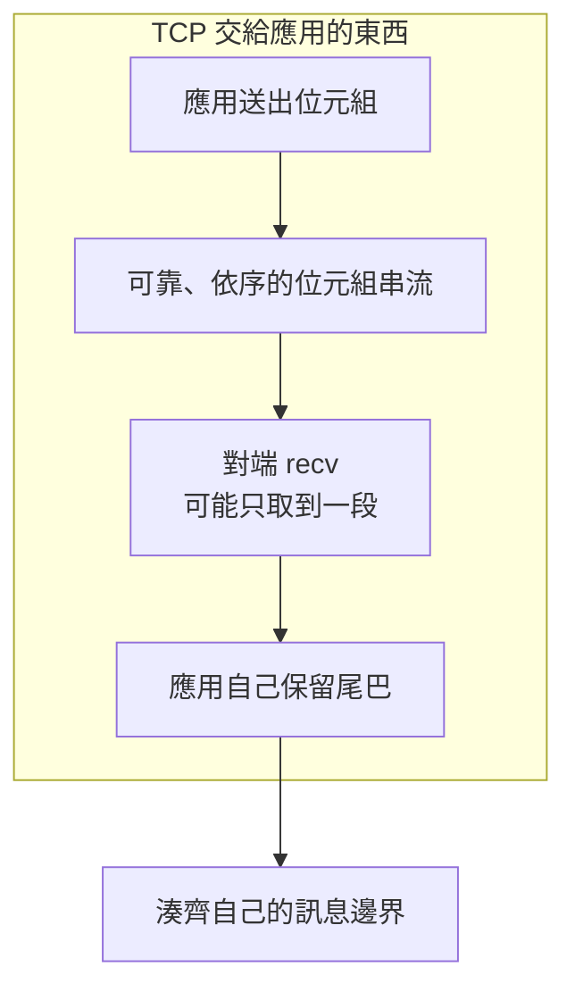

# 08｜send 回了 40，對端只拿到 11 bytes

接收站第一次 `recv` 拿到 11 bytes。交接程式把這 11 bytes 當成一張合成圖的完整描述，後面的欄位對不上。連線當時還開著。

[開啟逐步解說：一句話，怎樣才算收齊？](resources/tcp-stream/index.html) — 先猜訊息邊界，再換切法觀察完整訊息與緩衝區尾巴。

## 先預測

`send` 回傳 40。第一次 `recv` 拿到 11 bytes。先寫下你的預測：

1. 這 11 bytes 可以交給 AOI 解析器當成一筆完整訊息嗎？
2. 剩下的位元組還在這條串流的哪裡？
3. 連線一直開著時，有沒有一個「訊息到此結束」的記號？

再預測 `recv` 回傳 0 代表哪一層的事。先別把它當成圖檔正常收完。

`send` 回傳 40，只說明這次呼叫報告送出 40 個位元組。它沒有附上一筆「接收站已檢查完」的回條。若總長比 40 更長，剩下的要再送。

## 沿着這條路徑



圖上的切段是模型。一次 `send` 的回傳值不決定對端要呼叫幾次 `recv`。

## 原理

[RFC 9293](https://www.rfc-editor.org/rfc/rfc9293.html) §2.2 裡，TCP 向應用提供可靠、依序的 byte stream。可靠性來自序號、checksum 與重傳。同一節寫明沒有 liveness detection。連線還在，不表示對端程序仍然在處理這一張圖。

§3.7 寫明 segment 邊界不對應一次 `send` 或 `write`。應用看到的是位元組順序，看不到「這一次呼叫等於一筆 AOI 紀錄」。

確認的是已收到的 octet。應用把圖存好、檢查完、回覆業務結果，都要另有證據。對端應用處理完成不在這個確認裡。

Python [Socket HOWTO](https://docs.python.org/3.13/howto/sockets.html) 說明 `send` 與 `recv` 可能只處理一部分。呼叫端要自己迴圈，直到這筆應用資料送完或收齊。`recv` 回傳 0 表示對端關閉。之後這條連線不會再交來新的位元組。串流上沒有 EOT。訊息要自己定界，做法見 [訊息契約](09-message-contract.md)。HOWTO 裡的範例是示範，不是正式協定。

[`sendall`](https://docs.python.org/3.13/library/socket.html#socket.socket.sendall) 成功，只表示本端把那些位元組送進這次呼叫。成功回傳 `None`。出錯時，呼叫端不知道已經送出多少。兩種結果都還沒有接收站的業務回覆。

應用要自己留緩衝區。這一次 `recv` 多出來的位元組屬於下一筆的開頭，下一次還要用。少掉的位元組要等下一次 `recv`。連線仍開著時，空等不會得到 EOT。`recv` 回傳 0 才表示對端關閉，而且是關閉，之後沒有後續位元組。

沒有 liveness detection 時，對端程序卡住，TCP 仍可能維持已建立。牆鐘變長要另計，見 [同步與非同步](11-sync-async.md)。本頁不把「連線還在」寫成「判圖還在進行」。

名稱與 port 的檢查順序在 [位址與 port](07-address-port-dns.md)。本頁從連線已經建立之後看起。

## 反例

把第一次 `recv` 的 11 bytes 直接 `json.loads`。長度可能剛好落在字串中間，解析失敗；也可能碰巧像一筆較短的 JSON，內容卻是下一筆的開頭。

把 `recv` 回傳 0 當成一張圖的正常結尾。0 的意思是對端關閉這條連線。半截位元組會跟「圖已收完」混在同一條路徑。

`sendall` 沒有丟例外，就在畫面上標成接收站已收下 `AOI-SYN-009`。本端呼叫結束與對端處理結束是兩筆紀錄。

固定「送一次、收一次、緩衝區開 4096」也會在別的切段長度上失敗。串流允許任意切法。緩衝區比整筆圖大，仍可能只拿到前 11 bytes。

把 TCP 的確認時間填進 AOI 的完成時刻。確認對象是已收到的 octet。圖是否入庫、是否判過，要有應用自己的回覆。那份回覆同樣走這條串流，也要自己定界。

## 動手看

L05 的真 TCP 段在 `examples/l05_framing.py`。客戶端對同一筆位元組每次 `send` 1 byte。伺服器每次 `recv` 1 byte。兩邊的呼叫次數對不齊，接收端仍組出同一筆 `{"seen":"AOI-SYN-009"}`。

```bash
cd docs/systems-network-foundations/examples
python3 l05_framing.py
```

通過時印出 `L05 PASS`。這個結果說明切段之後仍可按契約拼回去。契約本身的長度、UTF-8 與 JSON 規則在 [訊息契約](09-message-contract.md)。本次沒有用外網或另一台工廠機器重跑這段。

看程式時對一下呼叫大小：客戶端的 `send` 長度是 1，伺服器的 `recv` 長度也是 1。拼起來的 JSON 仍是一整筆。不要把這次「碰巧都是 1」記成協定規定每次都收 1 byte。1 byte 只是把切段推到最小，用來對照「一次 send 對一次 recv」。

對這次輸出只記三件事：

- 程式印出 `L05 PASS`。
- 客戶端每次送 1 byte，伺服器每次收 1 byte。
- 組回來的物件是 `{"seen":"AOI-SYN-009"}`。

40 與 11 是本頁的預測題，不是這支程式的回傳值。不要把 PASS 改寫成「recv 拿到 40 bytes」。`sendall` 出錯時已送出的數量，這支程式也沒有另做一輪。

再留兩句界限。可靠性在 RFC 9293 §2.2 來自序號、checksum 與重傳。同一節沒有 liveness detection。確認到的是 octet 已經收到。接收站把圖判完，要有應用自己的訊息，而且那則訊息也要定界。

## 題目

**Q08.** send 回傳 40，第一次 recv 拿到 11 bytes。這 11 bytes 可以當成一筆完整訊息嗎？

寫出還缺哪一種邊界證據。提示與解答不在這頁。

[返回地圖](00-map.md) · [實驗入口](labs.md) · [題目提示](hints.md) · [題目解答](answers.md)
