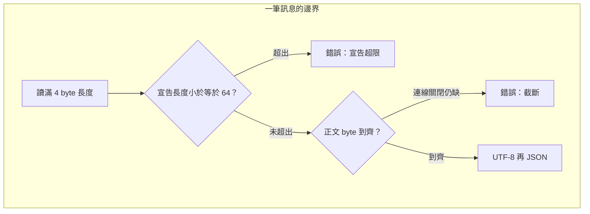

# 09｜半截 JSON 被送去判圖

接收站拿到一段像 JSON 的文字，長度欄寫 80，連線卻先斷了。有的程式仍把半截內容交給 AOI。後面的欄位是猜出來的。

[先用逐步解說理解訊息邊界](resources/tcp-stream/index.html) — 示範採換行定界；本章改用長度前綴與 UTF-8 JSON 契約。

## 先預測

契約先定成：4 byte 大端長度，後面是 UTF-8 JSON，正文上限 64 bytes。先預測這幾種輸入會得到訊息，還是得到錯誤：

1. 同一筆位元組在每個位置切開，分兩次送進 parser。
2. 兩筆完整訊息背對背接在同一個緩衝區。
3. 長度欄寫 80，正文只到 10 bytes，連線就關閉。
4. 長度合法，正文卻是非法 UTF-8，或不是 JSON。

串流為什麼要自帶邊界，見 [串流](08-tcp-stream.md)。本頁只問契約怎麼拒絕。

預測時分開兩種「還沒完成」：緩衝區還有尾巴、連線仍開著，這是繼續等；連線已經關閉而長度還沒到齊，這是錯誤。兩種都不要交出半筆 JSON。

## 沿着這條路徑



長度欄量的是後面的正文，不含這 4 byte。切段可以落在欄位中間。

## 原理

TCP 只維持位元組順序。[Socket HOWTO](https://docs.python.org/3.13/howto/sockets.html) 要求訊息自己定界：固定長度、分隔符、自帶長度，或靠關閉連線結束。HOWTO 的程式是示範，不是這次的正式協定。本頁採用自帶長度，並加上大小與編碼限制。

L05 的編碼是 `struct` 格式 `>I`：4 byte、大端、無號整數，值等於後面 UTF-8 JSON 的 byte 數。正文超過 64 bytes，編碼端直接拒絕。解碼端看到宣告長度大於 64，也拒絕，不等待那一段正文。

緩衝區每次接上新的一段。長度 4 byte 還沒到齊，就留下尾巴。宣告長度合法、正文還沒到齊，同樣留下尾巴，不交出訊息。連線結束時尾巴仍在，結果是截斷錯誤。完整的一筆才做兩步：先依 UTF-8 解碼，再 `json.loads`。非法 UTF-8 與非法 JSON 都是錯誤。

兩筆完整訊息接在一起時，一次推進可以交出兩筆。第二筆的開頭若跟第一筆同一次讀進來，必須留在緩衝區，不能丟掉，也不能塞進第一筆。

`recv` 回傳 0 只表示對端關閉，見 [串流](08-tcp-stream.md)。關閉發生在正文到齊之前，parser 交出錯誤。它不把已經收到的 10 bytes 補成一筆 JSON。

編碼用緊湊 JSON：分隔符是逗號與冒號，中間沒有空白。契約版本是 `v` 等於 1，正文必須是物件，而且 `id` 必須是非空字串。`{"v":1,"id":"AOI-SYN-009"}` 這種正文的 byte 數，就是長度欄要寫的數。多一個空白，長度就變了。上限 64 量的是這段 UTF-8 正文，不含前面的 4 byte。缺 `id`、`id` 不是字串、陣列或 `null`、以及 `v` 不是 1，都拒絕。

宣告長度大於 64 時，解碼端立刻拒絕。後面即使還有位元組，也不把它們解成圖。截斷是另一條：長度本身合法，正文卻在連線關閉時仍短於宣告。兩條都交出錯誤，都不交出訊息。L05 的超限樣本是宣告 65，再附 1 個 byte。

## 反例

看到第一個 `{` 就開始 `json.loads`，長度欄還沒讀完。下一次 `recv` 又把下一筆的開頭接進來，兩張圖合成一筆。

宣告長度是 80，程式仍把緩衝區裡現有的 10 bytes 交出去。上限與截斷兩道檢查都被跳過。接收站會把缺欄位的文字當成 `AOI-SYN-009` 的結果。

只在單元測試裡用整筆 `bytes` 呼叫一次 parser。真連線每次 1 byte 時，這支 parser 沒有在每個切點留尾巴，測試綠燈也補不上。

把 HOWTO 的示範類別直接當成產線協定。示範沒有這次的 64 byte 上限，也沒有 JSON 欄位契約。

長度欄用主機位元組序，而不是 `>I`。同一串位元組在另一種位元組序上會讀成另一個長度，正文邊界整段錯開。本契約固定大端。

只檢查 JSON 括號對稱，不檢查 UTF-8。非法 byte 可能在解碼時被替換掉，接收站會收下另一張圖的文字。L05 對非法 UTF-8 的要求是拒絕。

## 動手看

程式在 `examples/l05_framing.py`。

```bash
cd docs/systems-network-foundations/examples
python3 l05_framing.py
```

單元測試先組一筆 `{"v":1,"id":"AOI-SYN-001","ok":true}`。每個切點都要拼回同一筆，尾巴是空的。兩筆背對背要一次取出兩筆。接著應拒絕：只餵前 6 bytes 的截斷、宣告長度 65、非法 UTF-8、非法 JSON、缺欄位、錯誤型別、非物件，以及 `v` 不是 1。

回覆標頭只到 2 bytes 就關閉，或長度欄說還有 10 bytes 卻只剩 3 bytes 就關閉，讀取都在 1 秒內以截斷失敗。空的 `recv` 不會再轉下一圈。

另一段是兩個程序的真 TCP，仍在 loopback。客戶端每次 `send` 1 byte，伺服器每次 `recv` 1 byte，組出的回覆是 `{"v":1,"id":"AOI-SYN-009","seen":"AOI-SYN-009"}`。伺服器在收完請求後直接關閉，或只送出半截回覆再關閉，客戶端同樣在期限內失敗。通過時印出 `L05 PASS`。本次沒有在兩台工廠機器之間重跑。

單元測試的圖號是 `AOI-SYN-001`，TCP 那段的圖號是 `AOI-SYN-009`。兩筆都要各自對上，不要混成同一張圖。切點測試覆蓋該筆 frame 的每一個位置，含切在長度欄中間與切在 JSON 中間。背對背那次是同一個緩衝區裡連續兩筆完整 frame。

拒絕樣本對一下程式裡的餵法：

- 截斷：完整 frame 只留前 6 bytes，收尾時尾巴還在。
- 超限：長度欄是 65，後面再附 1 byte。
- 非法 UTF-8：長度欄是 1，正文是 `0xFF`。
- 非法 JSON：長度欄是 1，正文是 `{`。
- 欄位：`{}`、只有 `v`、`id` 是數字、`[]`、`null`、`v` 為 2。

這些都要成為錯誤。完整切點與背對背則要交出訊息。TCP 那段證明 1 byte 切段仍能組出帶版本與 `id` 的回覆，也證明回覆方向提早關閉時不會空轉。沒有在兩台機器之間重跑。

## 題目

**Q09.** 長度欄寫著 80，正文只到 10 bytes 連線就關閉。parser 應該交出訊息，還是交出錯誤？

先指出這筆輸入碰到契約的哪一條，再決定交出什麼。提示與解答不在這頁。

[返回地圖](00-map.md) · [實驗入口](labs.md) · [題目提示](hints.md) · [題目解答](answers.md)
