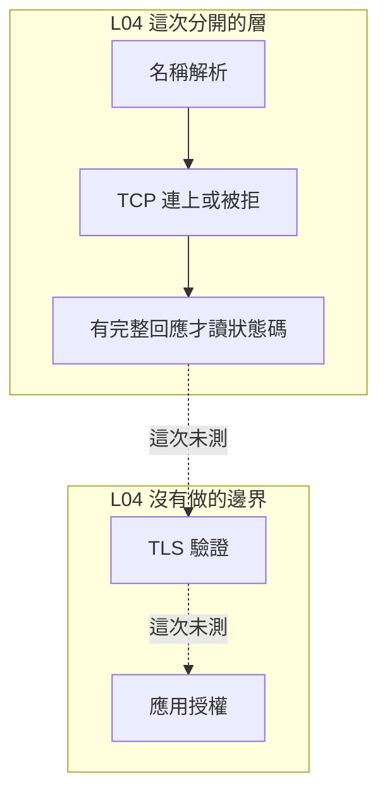

# 10｜TCP 連上了，紀錄卻寫成連線失敗

接收站的第一行是 `HTTP/1.1 404`。值班紀錄把這次記成連線失敗。缺圖與網路故障進了同一欄，補傳與換線會走錯。

## 先預測

TCP 已經連上。回應第一行是 `HTTP/1.1 404`，body 是 `missing`。先預測這次該記在哪一層：

1. 名稱解析失敗？
2. 連線被拒？
3. HTTP 層的結果？
4. TLS 已經驗證通過？應用已經授權這張圖？

沒有任何回應時，你會填哪一個狀態碼？先寫下來。L04 沒有做 TLS。

再分一次：`200` 與 `404` 都是已經拿到的回應。差在請求有沒有被接受。連線被拒則連第一行都沒有。

## 沿着這條路徑



虛線只標邊界，不表示這次有憑證或權限檢查。

## 原理

[RFC 9110](https://www.rfc-editor.org/rfc/rfc9110.html) 裡，狀態碼是回應的語意。2xx 表示請求被收到、理解並接受。404 是客戶端可讀懂的一類結果：請求沒有完成。它出現時，TCP 連線已經把這行回應帶過來了。連線失敗與這個狀態碼分欄記錄。

沒有回應就沒有狀態碼。逾時、拒絕、中途斷開，都不能事後填成 200 或 404。

[RFC 9112](https://www.rfc-editor.org/rfc/rfc9112.html) 的訊息框架靠 start-line、標頭、`Content-Length`、chunked，或關閉連線來決定正文範圍。連線關閉不一定是完整回應。只收到半截狀態列時，還沒有一個可記帳的狀態碼。

[RFC 8446](https://www.rfc-editor.org/rfc/rfc8446.html) §1 對下層的要求，是可靠、依序的位元組流。TCP 連得上還沒有 TLS 驗證。TLS 驗證通過，也還沒有應用授權。本頁不寫交握步驟。L04 沒有做 TLS，也沒有做授權。

標準庫 `http.client` 的 `status` 來自回應列。本書不用自寫的通用 HTTP parser 取代它。L04 的小伺服器是教學用的固定回應，用來把層次分開。客戶端只核對這次固定字串。不要把那段切片複製成產品 parser。L04 也沒有呼叫 `http.client`。別的程式若要讀狀態碼，走標準庫的回應物件。

`GET /ok` 的 200 落在 2xx：這次請求被收到、理解並接受。body `picture-ok` 是這支教學伺服器對這條路徑的固定正文。`GET /missing` 的 404 是 HTTP 層的結果，body 是 `missing`。兩次都已經連上。404 沒有表示 TCP 失敗。

位址與拒絕連線的分欄在 [位址與 port](07-address-port-dns.md)。位元組框架在 [串流](08-tcp-stream.md) 與 [訊息契約](09-message-contract.md)。L04 的長度靠 `Content-Length`，並在送完後關閉。chunked 這次沒有測。關閉連線仍不能單獨證明正文完整。

## 反例

把 `HTTP/1.1 404` 記成 `ConnectionRefusedError`。port 有程序在聽，而且已經寫出狀態列。缺的是 `/missing` 這張圖的 HTTP 結果。

TCP 一連上就記 200。狀態碼在回應列裡。只送出非 HTTP 的位元組時，L04 要求不得得到 `HTTP/1.1 200`。

看到 `Connection: close` 就認定 body 已經完整。框架還要看 `Content-Length` 或 chunked。關閉可以切斷半截回應。

連上 loopback 以後宣告 TLS 已驗證、操作員已獲授權。L04 的固定回應沒有這兩步。

## 動手看

L04 是兩個程序，程式在 `examples/l04_layers.py`，不依賴外網。

```bash
cd docs/systems-network-foundations/examples
python3 l04_layers.py
```

與本頁直接有關的檢查：

- 只送非 HTTP 的 TCP 位元組，不得得到 200。
- `GET /ok` 得到狀態列 `HTTP/1.1 200 OK`，body 是 `picture-ok`。
- `GET /missing` 得到 404，body 是 `missing`。

伺服器對這兩條路徑回固定文字，並帶上 `Content-Length` 與 `Connection: close`。通過時印出 `L04 PASS`。本次 macOS 與 Linux 容器都通過。這次沒有 TLS 客戶端，也沒有外網請求。

筆記分成四格：名稱、連線被拒、非 HTTP 不得得到 200、兩次 `GET` 的狀態列與 body。第四格再留兩格空白：TLS、應用授權。空白保持空白。不要用 200 或 404 把它們填上。

四格之外再留兩格空白：

- TLS：L04 沒有做。TCP 連得上還沒有 TLS 驗證。
- 應用授權：L04 沒有做。就算以後補上 TLS，授權仍是另一欄。

`picture-ok` 與 `missing` 只夠填 HTTP 那一格。空白不要用狀態碼填上。

## 題目

**Q10.** TCP 已經連上，回應第一行是 HTTP/1.1 404。這次要記成連線失敗，還是 HTTP 層的結果？

寫出這一層已經有的證據，以及 TLS、授權仍然缺的證據。提示與解答不在這頁。

[返回地圖](00-map.md) · [實驗入口](labs.md) · [題目提示](hints.md) · [題目解答](answers.md)
