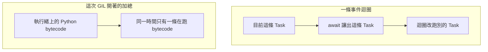

# 11｜改成 async 之後，兩段加總還是很久

接收站同時等對端的 1 byte，又要做兩段純 Python 加總。改走 asyncio 之後，等待時 CPU 接近 0，加總的牆鐘卻沒有變成一段的一半。

## 先預測

對端先睡 0.2 秒，再送 1 byte。先預測 blocking `recv` 與 `asyncio` 的 `sock_recv`：

1. 牆鐘會超過 0.15 秒嗎？
2. 這段 `process_time` 會跟著牆鐘一起變大嗎？

再預測：兩個 coroutine 裡都是純 Python 加總，這次建置的 GIL 開著。牆鐘會變成單段的一半嗎？會變成兩段序列時間的一半嗎？

牆鐘與 CPU 分開寫。牆鐘包含在等對端的時間。`process_time` 不含這段 sleep。兩數一起變大，或只有牆鐘變大，先選一個預測。

## 沿着這條路徑



上面兩塊是兩種等待。I/O 讓出之後，純 Python 加總仍受這次 GIL 約束。

## 原理

[asyncio 的 Task 說明](https://docs.python.org/3.13/library/asyncio-task.html) 寫明：事件迴圈一次跑一個 Task。`await` 讓出的是這條 Task。迴圈這時可以跑其他 Task、回呼或 I/O。讓出的不是「這段純 Python 迴圈自動拆到兩顆核」。

取消是協作的。`Task.cancel()` 會在之後的機會把取消送進那條 Task，不保證對方已經停。停了沒有，要看那條 Task 後來的結果。本頁的計時實驗沒有呼叫取消。

[threading 的說明](https://docs.python.org/3.13/library/threading.html) 寫明：預設 CPython 一次只有一條執行緒執行 Python bytecode。3.13 的 free-threaded 建置可以關掉 GIL，那不是預設，也不是本次跑的建置。GIL 不保證多步業務更新是原子的，那件事見 [共享狀態](12-shared-state.md)。

`asyncio.to_thread` 把函式放到別的執行緒。兩段純 Python 加總因此不在同一條 Task 裡連續寫完。bytecode 仍要拿 GIL。這次不能期待牆鐘變成單段的一半，也不能期待它變成序列時間的一半。

本次只描述 GIL 開著的建置。`sys._is_gil_enabled()` 在 macOS CPython 3.13.12 與容器 CPython 3.13.15 都是 `True`。free-threaded 通常是另一支執行檔。這次兩支解譯器都不是那種建置。

L06 的牆鐘是 `perf_counter` 兩次讀數的差，CPU 是 `process_time` 的差。後者不包含 sleep。所以對端睡 0.2 秒時，牆鐘會跟著等，CPU 不必跟著漲。這組差只描述這一次呼叫區間，不做成產線百分位。

兩段加總各跑同一個純 Python 迴圈。序列是同一條執行緒先後做完兩段。`to_thread` 是兩段各占一條執行緒，再由 `gather` 一起等。GIL 仍讓 bytecode 一次只有一條執行緒在跑。牆鐘因此靠近兩段相加，而不是單段的一半。本次數字甚至長過序列，執行緒調度的成本沒有再拆開量。

## 反例

用牆鐘判斷 CPU 很忙。對端睡 0.2 秒時，等待的牆鐘約 0.20 秒，`process_time` 接近 0。人在等，這段幾乎沒有消耗這次量到的 CPU 時間。

看到 `async def` 就認為兩段加總會重疊，牆鐘應落到單段的一半。事件迴圈一次跑一個 Task。加總迴圈中間若沒有 `await`，第二段要等第一段讓出。

把 `to_thread` 當成關掉 GIL。文件把 free-threaded 標成非預設。本次兩次讀數都是 GIL 開著。這組數字也不拿來推論 C++ 的執行時間。

把「已呼叫 cancel」記成對端 worker 已停。取消不保證對方已停。

## 動手看

程式在 `examples/l06_sync.py`。`socketpair` 的對端睡 0.2 秒，再送 1 byte。

```bash
cd docs/systems-network-foundations/examples
python3 l06_sync.py
```

blocking `recv` 與 `sock_recv` 的牆鐘都要超過 0.15 秒，這段 `process_time` 要低於 0.1 秒。本次約 0.20 秒牆鐘，CPU 接近 0。紀錄是：macOS 阻塞 0.209 秒／CPU 0.000 秒，非同步 0.207 秒／CPU 0.001 秒；Linux 容器阻塞 0.211 秒／CPU 0.000 秒，非同步 0.209 秒／CPU 0.001 秒。

兩個純 Python 加總丟進 `asyncio.to_thread`。macOS 這次 to_thread 牆鐘 0.083 秒，序列 0.056 秒。容器是 0.111 秒與 0.072 秒。兩次都沒有變成序列的一半，更沒有落到單段的一半。通過時印出 `L06 PASS` 與 `gil_enabled=True`。這是本機 socketpair，不是跨機延遲。

程式裡還有邏輯競爭的計數。那一段的 1 與 2 留在 [共享狀態](12-shared-state.md)。本頁只核對牆鐘、CPU 與 `gil_enabled`。

兩次實測可以併成一張表。單位是秒。GIL 欄是 `sys._is_gil_enabled()`。

| 量 | macOS CPython 3.13.12 | Linux 容器 CPython 3.13.15 |
|---|---|---|
| 阻塞牆鐘 | 0.209 | 0.211 |
| 阻塞 CPU | 0.000 | 0.000 |
| 非同步牆鐘 | 0.207 | 0.209 |
| 非同步 CPU | 0.001 | 0.001 |
| to_thread 牆鐘 | 0.083 | 0.111 |
| 序列牆鐘 | 0.056 | 0.072 |
| GIL | True | True |

表裡的等待都超過 0.15 秒，CPU 都低於 0.1 秒。to_thread 兩次都沒有短到序列的一半。這張表不包含 free-threaded，也不包含跨機延遲。

## 題目

**Q11.** 兩個 coroutine 裡都是純 Python 加總，而且這次建置的 GIL 開著。為什麼不能期待牆鐘變成一段的一半？

先分開事件迴圈一次跑一個 Task，以及 bytecode 與 GIL。提示與解答不在這頁。

[返回地圖](00-map.md) · [實驗入口](labs.md) · [題目提示](hints.md) · [題目解答](answers.md)
