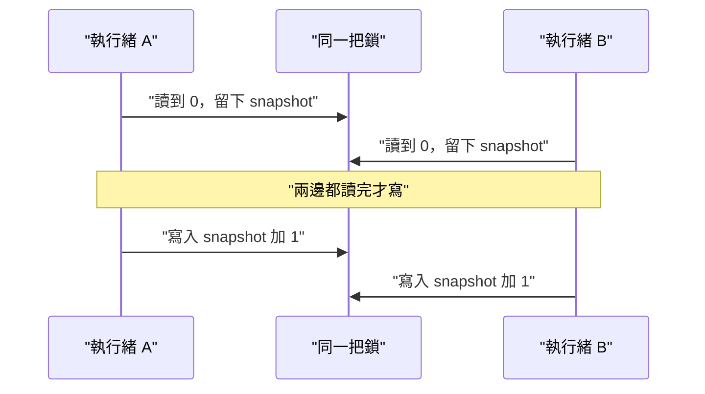

# 12｜兩次加一之後，計數停在 1

兩條執行緒各自把「已收下的圖數」加一。每次讀、每次寫都拿了鎖。同步之後再寫回，最後卻是 1。兩張圖都像是被數過，帳上只留一張。

## 先預測

共享的 `value` 從 0 開始。兩條執行緒都做這三步：在鎖裡讀到 `value`，離開鎖，等對方也讀完，再在鎖裡寫回 `snapshot + 1`。

1. 兩次讀到的 snapshot 各是多少？
2. 兩次寫回之後，`value` 是多少？
3. 若整段「讀到的值再加一」放在同一把鎖裡，結果差在哪？

GIL 開著時，這三步會自動合成一次更新嗎？先寫預測。等待與牆鐘在 [同步與非同步](11-sync-async.md)。

把兩條執行緒想成兩張圖各報一次「我收到了」。同步點的作用是讓兩邊都讀完，才允許寫回。先不要假設誰先寫、誰後寫會讓結果變成 2。

## 沿着這條路徑



兩次寫入都在鎖裡，寫的卻是同一個舊快照。

## 原理

鎖保證的是持有鎖那段時間，別人進不了這把鎖。[threading 的說明](https://docs.python.org/3.13/library/threading.html) 把鎖方法的狀態轉換說成原子的。那是鎖自己的 locked／unlocked。讀一次、放手、等對方、再寫一次，中間的業務不變條件沒有被這把鎖包住。

GIL 讓預設 CPython 一次只有一條執行緒執行 Python bytecode。3.13 free-threaded 不是預設。本次 macOS CPython 3.13.12 與容器 CPython 3.13.15 上，`sys._is_gil_enabled()` 都是 `True`。GIL 不保證多步業務更新原子。兩條執行緒仍可以先後讀到 0，再先後把 1 寫回去。

這次的正確邊界是：整個加一放在同一把鎖裡。讀和寫之間不讓另一條執行緒插進同一個計數。兩邊都從 0 開始各加一次時，結果是 2。先讀到 0 的那一次會寫成 1，另一條再讀時已經看到 1，寫成 2。

拆開的版本裡，同步點把兩次讀都擋在寫入之前。兩份 snapshot 都是 0。之後不管誰先寫，寫進去的都是 `0 + 1`。後寫的那一次把前一次的 1 再蓋成 1。最後留下 1。鎖仍有用：單次讀、單次寫不會同時改同一個整數。鎖沒有保住的是「讀到的值加一」這一整段。

C++ 的未同步 data race 是未定義行為，見 [intro.races](https://eel.is/c++draft/intro.races)。L06 的 C++ 程式在讀的那段與寫的那段都持有 mutex，中間另有同步讓兩邊都讀完。這是邏輯競爭，輸出有定義。不要執行未同步的 data race 來對答案。Python 這次用 `Lock` 與 `Barrier` 排出同樣的讀完再寫。整段加一的版本把等待放在鎖外，避免一邊握著鎖、另一邊永遠進不來。

## 反例

每步都加鎖，就宣布計數不會丟。鎖的範圍若只包住單次讀或單次寫，兩條執行緒仍共享同一個舊 snapshot。帳會停在 1。

在持有計數鎖時去等另一條執行緒。對方要拿同一把鎖才能到達同步點，兩邊都停住。這是死結風險。L06 的整段加一把鎖，同步點放在鎖外面，避免這條路徑。本次沒有把死結的輸出當成計數答案。

拿掉 C++ 的 mutex，看印出來的數字像不像 1 或 2。未同步的 data race 沒有這種標準答案。macOS 這次跑的是兩段都有 mutex 的程式，輸出 `split 1`、`whole 2`。Linux 容器這次沒有編譯器，沒有重跑該 C++ 程式，不要把 SKIP 補成同一行輸出。

## 動手看

Python 在 `examples/l06_sync.py`，C++ 在 `examples/l06_logic_race.cpp`。

```bash
cd docs/systems-network-foundations/examples
python3 l06_sync.py
```

分開的讀和寫應留下 1。整個加一應留下 2。macOS 與 Linux 容器的 Python 這次都通過，印出 `L06 PASS`。C++ 要在有編譯器的環境另跑；本次 macOS 原生印出 `split 1 whole 2`。

讀的是記憶體裡的整數，不是網路上的一張圖。圖的位元組邊界仍見 [訊息契約](09-message-contract.md)。計數若要代表五張圖都做完，還得看接受與拒絕，見 [佇列與背壓](13-queue-backpressure.md)。本頁的 1 與 2 只回答這次的讀改寫邊界。

兩種邊界並排看：

| 做法 | 鎖包住什麼 | 這次結果 |
|---|---|---|
| 讀與寫分開，中間同步 | 單次讀、單次寫 | 1 |
| 整個加一在同一把鎖裡 | 讀到的值再加一 | 2 |

Python 在 macOS 與 Linux 容器都得到這一對結果。C++ 的 `split 1`、`whole 2` 只來自這次有編譯器的 macOS。容器那一列是 SKIP，不要抄成同一行輸出。

未同步的 data race 不在表裡。那種寫法沒有可核對的標準輸出。

時間順序可以記成四拍：

1. 兩條執行緒都在鎖裡讀到 0，然後放手。
2. 同步點放開，兩邊都已經有 snapshot 0。
3. 第一條寫入 `snapshot + 1`，值變成 1。
4. 第二條寫入自己的 `snapshot + 1`，值仍是 1。

整段加一沒有這四拍。它在鎖裡讀到當下的值並立刻加一，所以兩次更新疊成 2。GIL 開著也不會把四拍收成一次業務更新。

## 題目

**Q12.** 兩條執行緒各自在鎖裡讀到 value，同步之後再在鎖裡寫回 snapshot+1。最後為什麼是 1？

先寫兩個 snapshot，再寫兩次寫入覆蓋了什麼。提示與解答不在這頁。

[返回地圖](00-map.md) · [實驗入口](labs.md) · [題目提示](hints.md) · [題目解答](answers.md)
