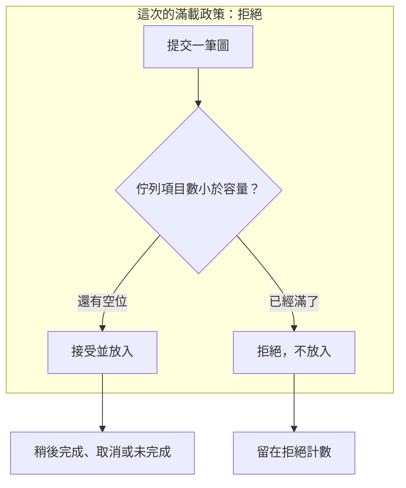

# 13｜佇列長度是 0，五張圖卻沒有都做完

來源連續交出五張合成圖。接收站的佇列一下子又變空。畫面上像是全部做完。帳上接受 2 筆、拒絕 3 筆。空佇列沒有說出被拒絕的那三張。

## 先預測

容量是 2。消費者先不要跑。來源提交 5 筆。滿了的政策先定成拒絕。先預測：

1. 接受幾筆，拒絕幾筆？
2. 佇列長度回到 0 時，完成數一定等於 5 嗎？
3. `qsize` 若是 0，下一次提交就一定不會阻塞嗎？

阻塞等待是另一種政策。本頁先不要假設 L07 量過那種等待。

五張圖的編號是 `AOI-SYN-0` 到 `AOI-SYN-4`。先猜哪幾張進得了容量 2 的佇列，哪幾張只會留下拒絕計數。

## 沿着這條路徑



拒絕的那一筆不進佇列。佇列後來變空，不會把這筆記成完成。

## 原理

[queue 文件](https://docs.python.org/3.13/library/queue.html) 裡，`maxsize` 是項目上限。預設的 `put` 在滿的時候阻塞，直到有項目被取走。那是文件裡的另一種滿載政策：呼叫端等。`put_nowait` 在滿的時候丟 `Full`，呼叫端可以改走拒絕。3.13 起 `Queue` 還有 `shutdown`。`qsize` 不能保證下一次 `put` 不阻塞。文件寫明 `qsize() > 0` 也不能保證下一次 `get` 不阻塞。

L07 沒有用 `qsize` 當對帳，也沒有呼叫 `shutdown`。它用自己的計數，容量 2，滿了就拒絕。這次沒有測阻塞等待有多長。

對帳用的是互斥計數，不是瞬間長度：

- 提交 = 接受 + 拒絕
- 接受 = 完成 + 取消 + 未完成

結束時還要看佇列長度與 in-flight。兩者都是 0，只表示沒有東西還卡在佇列或手上。被拒絕的圖在拒絕那一欄。取消與未完成這次是 0，這是這次的計數，不是「以後不會取消」。取消的語意見 [取消與未知](15-cancellation-unknown.md)。

in-flight 是已經取出、尚未完成的筆數。佇列可以先變空，手上仍有一筆。那時候長度 0 仍不能代表做完。L07 結束時這一欄也是 0，完成數仍要另看。消費者在來源把 5 筆都提交完之後才開始跑，所以拒絕發生在排隊階段，不是發生在做圖做到一半。

共享計數若拆成兩次加鎖，會丟更新，見 [共享狀態](12-shared-state.md)。本頁的計數在同一把條件鎖裡更新。標準庫滿載時的阻塞 `put` 沒有出現在這支程式裡。文件仍把那種等待列成政策，這裡點名即可。

## 反例

每隔一秒讀一次佇列長度，看到 0 就蓋「五張都做完」。消費者還沒啟動時，多出來的三張根本沒進去。結束後長度也是 0，完成數仍是 2。

用 `qsize() == 0` 決定可以再 `put` 而不會等。讀完之後，別的執行緒可能先放滿。文件不保證這次讀數管得到下一次呼叫。L07 沒有把 `qsize` 當對帳。

容量滿了就讓來源阻塞，並把這次 L07 的 2 與 3 解釋成「等一下就會全部接受」。阻塞是 queue 的另一種政策。L07 選的是拒絕，而且消費者當時還沒跑。這次沒有測阻塞等待。

`shutdown(immediate=True)` 可以清掉佇列並放開 `join`。文件寫這會違反 join 慣例上的不變量。清空不等於那些圖已經做完。L07 沒有用這條路徑。

## 動手看

程式在 `examples/l07_queue.py`。

```bash
cd docs/systems-network-foundations/examples
python3 l07_queue.py
```

容量 2。先不讓消費者跑，提交 5 筆，接受 2、拒絕 3。消費者再完成那 2 筆。結束時應同時成立：提交 = 接受 + 拒絕，接受 = 完成 + 取消 + 未完成，佇列長度與 in-flight 都是 0。取消與未完成這次是 0。

本次 macOS 與 Linux 容器的紀錄都是 `submitted 5`、`accepted 2`、`rejected 3`、`completed 2`、`cancelled 0`、`unfinished 0`、`queued 0`、`inflight 0`。通過時印出 `L07 PASS`。對帳的是這些計數。

消費者啟動前，程式就檢查過一輪：佇列裡 2 筆、接受 2、拒絕 3。那一輪長度不是 0。結束時長度變成 0，完成數是 2。兩輪都要留在筆記裡。只抄最後的 0，會把拒絕的三張圖抹掉。

兩輪快照都要留下：

| 時刻 | 佇列長度 | 接受 | 拒絕 | 完成 | in-flight |
|---|---|---|---|---|---|
| 消費者還沒跑 | 2 | 2 | 3 | 0 | 0 |
| 兩筆做完之後 | 0 | 2 | 3 | 2 | 0 |

結束那一輪還有取消 0、未完成 0。提交 5 等於接受 2 加拒絕 3。接受 2 等於完成 2 加取消 0 加未完成 0。長度 0 只對得上表的最後一列的第一欄。

阻塞的 `put` 與 `shutdown` 都沒有出現在這兩列。文件裡的阻塞政策這次沒有量等待時間。

## 題目

**Q13.** 佇列長度是 0。為什麼還不能說五張圖都做完？

用提交、接受、拒絕、完成這幾個數說明長度沒有涵蓋哪一欄。提示與解答不在這頁。

[返回地圖](00-map.md) · [實驗入口](labs.md) · [題目提示](hints.md) · [題目解答](answers.md)
