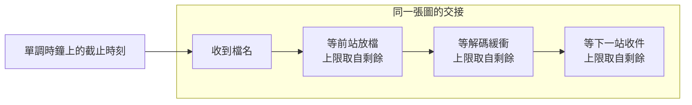

# 14｜每段都在時限內，整批圖還是太晚

交接站收合成 AOI 圖。路徑上有三段等待。每一段的上限都寫 0.15 秒。三張圖的批次還是拖過現場能等的 0.20 秒。

分段計時器沒有一段亮紅燈。整批交接已經晚了。現場對的是整批牆鐘。分段燈號可以全綠，整批仍然超時。

## 先預測

三段各允許等 0.15 秒。三個數字加起來是 0.45 秒。總預算只有 0.20 秒。

先寫下兩種牆鐘。第一種：三段共用進站時定下的截止時刻。後段只能用剩下的秒數。第二種：每一段都從自己的 0.15 秒起算，各自睡滿。

示意表假設 sleep 剛好等於要求的秒數。實測會比這張表長一點。

| 段 | 該段上限 | 進段時剩餘（示意） | 這一段最多睡 |
|---|---|---|---|
| 等前站放檔 | 0.15 秒 | 0.20 秒 | 0.15 秒 |
| 等解碼緩衝 | 0.15 秒 | 約 0.05 秒 | 約 0.05 秒 |
| 等下一站收件 | 0.15 秒 | 約 0 秒 | 不再睡 |

sleep 的實際暫停可以長於要求的秒數。預算測試要有容忍值。本次 L08 的容忍是 0.12 秒。共用預算的通過上限是 0.20 加上這個容忍，寫成 0.20+0.12 秒。

錯誤版的牆鐘若低於 0.40 秒，測試會失敗。那個版本沒有把「各段各睡滿」露出來。

## 沿着這條路徑

同一張合成圖進站之後，三段排在同一條交接上。進站當下記下截止時刻。每一段開始前先讀現在離截止還剩多少。

第一段看剩 0.20 秒，自己的上限是 0.15 秒，所以只睡 0.15 秒。第二段再讀時鐘。剩下的秒數比 0.15 秒短，它只睡剩下的那一段。第三段若已經到截止，就不再睡。

三段看見的是同一份剩餘。後面的段繼承前面用掉的時間。每一段的 0.15 秒只是單段上限。總預算仍是進站時的那一份 0.20 秒。

檔名到達、解碼緩衝、下一站收件，在這支實驗裡都用 sleep 代替。順序仍是同一條預算。前一段睡完，後一段才讀剩餘。

## 原理

剩餘時間要用不會因系統時鐘回撥而減少的時鐘。[time.monotonic](https://docs.python.org/3.13/library/time.html#time.monotonic) 符合這點。只有兩次讀數的差值有意義。單一次讀數對不上牆鐘的幾點幾分。

`time.perf_counter` 的差值含 sleep 這段暫停。用它量「這一段實際停了多久」可以。用它做截止，仍要先確認這次直譯器的時鐘關係。

`time.process_time` 是本程序的 user 加上 system CPU 時間，不含 sleep。交接在 sleep 裡空等時，這個差值幾乎不增加。它回答不了牆鐘預算。

`time.time` 可能變小。時鐘被往回調時，用它算出的剩餘會變大。後面的段又睡滿自己的一份。時鐘被往前調時，剩餘會突然變負，後面的段被提前停掉。

CPython 3.13 起，`perf_counter` 與 `monotonic` 使用同一時鐘。這是 CPython 的實作細節。選時鐘仍按差值的定義。截止用 `monotonic`。要含 sleep 的間隔用 `perf_counter`。要看本程序 CPU 用 `process_time`。

正確版在進站時做 `deadline = start + 0.20`。每一段睡 `min(0.15, remaining)`。剩餘不大於零就跳出，後面的段不再睡。錯誤版讓每一段都睡滿 0.15 秒。三段各拿一份完整等待。

## 反例

把每一段的 timeout 都設成總預算 0.20 秒，三段的計時器都可以維持在時限內。牆鐘仍可接近 0.60 秒。現場問的是整批有沒有在 0.20 秒內交接完。分段全綠回答不了這件事。

容忍值設成 0 也會誤殺。作業系統可以把一次 sleep 拉得比要求更長。共用預算的實測可以略高於 0.20 秒，仍落在 0.20+0.12 以內。這次測試接受這個差距。它不接受三段各自睡滿之後的約 0.46 秒。

用 `time.time()` 相減來裁剩餘，會把系統時鐘的跳動算進交接預算。單調時鐘的差值不跟那次回撥一起變小。

只量最後一段的耗時，也看不見前兩段已經把預算花掉。三個分段紀錄都要能對回同一個 deadline。

## 動手看

程式在 [examples/l08_deadline.py](examples/l08_deadline.py)。三段各 0.15 秒。共用剩餘預算 0.20 秒時，實測牆鐘約 0.20 秒。上限是 0.20+0.12。每段各自睡滿 0.15 秒的錯誤版約 0.46 秒。低於 0.40 秒就會失敗。

macOS 與 Linux 容器上的 Python 實驗都是 PASS。這組數字是受控 sleep，用來核對預算有沒有被複製三份。它不代表產線解碼一張 AOI 圖要 0.15 秒。

讀數要成對。進站時的 `monotonic` 定下 deadline。每一段開始再讀一次，兩者相減才是剩餘。單一次讀數沒有單位可對的「現在幾點」。

錯誤版的三段 sleep 之間不讀剩餘。0.15 秒加三次，牆鐘落到約 0.46 秒。正確版在第二段、第三段讀到的剩餘已經變短。後段睡不滿自己的 0.15 秒，因為截止時刻仍是進站那一個。

測試把正確版的上限放在 0.20+0.12。略長於 0.20 仍可通過。錯誤版只要牆鐘低於 0.40 秒就失敗。兩個門檻一起用。一個守住「共用一份」。一個抓得到「各睡各的」。

同一支程式還有完成、取消、丟掉回覆三條狀態。那些狀態在 [下一頁](15-cancellation-unknown.md)。這一頁只核對牆鐘有沒有守住同一份剩餘預算。

換一組秒數時，仍先寫 deadline，再讓每一段取 `min(單段上限, 剩餘)`。單段上限改成 0.15 以外的數字，總預算也要同時改測試的上限。容忍值仍要留下。這次寫死的容忍是 0.12 秒，只對 L08 這組 sleep。

同一份 deadline 用完之後，後面的段看到的剩餘不大於零。程式在這時跳出迴圈。第三段因此不會再睡滿 0.15 秒。牆鐘仍應落在 0.20+0.12 以內。

## 題目

**Q14.** 三段各允許等 0.15 秒，總預算只有 0.20 秒。正確版為什麼不能讓每一段都睡滿 0.15 秒？

[返回地圖](00-map.md) · [實驗入口](labs.md) · [題目提示](hints.md) · [題目解答](answers.md)
