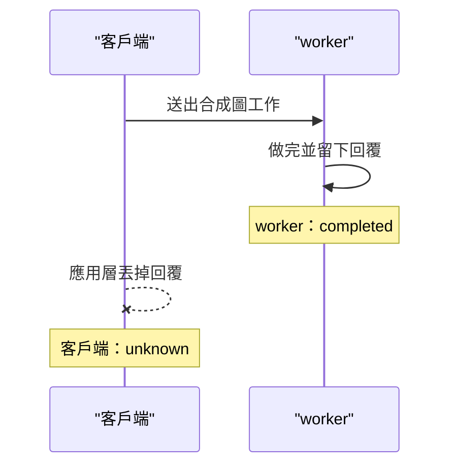

# 15｜客戶端不等了，圖可能已經寫完

交接站等不及，把這張合成 AOI 圖標成取消。下一站的帳上有時仍是完成。兩筆紀錄對不上。

操作人員問要不要再送一次。再送之前要先分開兩件事。worker 做完了沒有。客戶端收到回覆了沒有。

## 先預測

下面三條都發生在同一支 worker 上。先為每一條寫下 worker 狀態，再寫下客戶端狀態。兩個狀態可以不同。

| 情境 | worker 這邊 | 客戶端這邊 |
|---|---|---|
| 工作做完，回覆送達 | 你預期？ | 你預期？ |
| 客戶端發出取消，worker 看到旗標後停下 | 你預期？ | 你預期？ |
| worker 做完，客戶端把回覆丟掉 | 你預期？ | 你預期？ |

第三條先別把「丟掉回覆」寫成連線斷掉。這一頁的實驗裡，丟回覆時連線並沒有斷。

也先別假設客戶端一標取消，worker 的執行緒就已經消失。旗標要等對方自己看。

## 沿着這條路徑

客戶端與 worker 各有自己的狀態。取消旗標從客戶端設下。worker 在自己的迴圈裡查看旗標。客戶端的收件紀錄只在它真的留下回覆時改成 received。

這張圖只畫第三個情境。worker 的 completed 與客戶端的 unknown 同時成立。圖只標狀態分工。它不畫即時封包。

第一個情境走完時，worker 寫下 completed，客戶端留下 received。第二個情境裡，客戶端設下旗標，worker 在迴圈中看見旗標，把自己寫成 cancelled，客戶端也記 cancelled。

第三個情境裡，worker 已經把回覆放好。客戶端把那份回覆從自己的紀錄拿掉，再把自己記成 unknown。worker 的 completed 還在。

## 原理

L08 用的是 `threading.Event`。這次實驗沒有呼叫 `asyncio` 的 `Task.cancel()`。兩者都是合作式。對方要自己看旗標，或自己在取消點停下來。設下旗標不會把執行緒強制終止。

[asyncio 的取消](https://docs.python.org/3.13/library/asyncio-task.html) 也是協作的。文件沒有保證 `Task` 已經取消。呼叫取消之後，任務仍可能繼續跑到下一個檢查點，也可能已經做完。不要把 L08 的旗標寫成強制終止。

這支 worker 在迴圈裡看 `cancel.is_set()`。看見旗標就寫 cancelled 並返回。沒看見就繼續做到時間結束，寫 completed，並把回覆留在狀態裡。旗標設得太晚，工作可能已經做完。

客戶端沒有留下回覆時，它缺少獨立的收件證據。worker 狀態是 completed，只證明 worker 那一側做完。客戶端這一側記 unknown。

成功要有收件證據。失敗要有明確的未完成或取消證據。兩邊都沒有時，紀錄停在未知。未知是客戶端的知識狀態。它不改寫 worker 已經留下的 completed。

《資料庫與資料正確性》把提交窗口裡失去回覆的情況也記成未知結果。那邊的證據在資料庫的操作紀錄。這邊的證據在 worker 狀態，以及客戶端是否留下回覆。兩邊都要求：少了成功回覆，客戶端不能自行記成成功。

## 反例

把所有例外都寫成失敗，會把「worker 已取消」和「回覆在應用層被丟掉」合成同一格。後者的圖可能已經寫完。再送一次會多交一張。

把 worker 的 completed 直接抄到客戶端，也會跳過收件證據。客戶端根本沒有留下那份回覆。帳上會顯示成功，現場卻沒有客戶端收件紀錄可以對。

把 `cancel.set()` 說成執行緒已經死掉，會讓停止流程去等一個其實還在跑的 worker。旗標只是請對方看。worker 的迴圈若一直不看旗標，狀態會停在 running。這次實驗的 worker 每小段就看一次旗標，所以取消路徑看得到 cancelled。

把丟掉回覆說成連線重置，也會選錯下一輪檢查。這次實驗沒有把連線拆掉。回覆是在應用狀態裡被拿掉的。連線還在時，仍可能沒有收件證據。

## 動手看

程式在 [examples/l08_deadline.py](examples/l08_deadline.py)。三個情境的實測是：

- worker completed，客戶端 received。
- 取消之後，worker cancelled，客戶端 cancelled。
- worker completed，客戶端丟掉回覆，客戶端記 unknown。

第三條丟的是應用回覆。連線並沒有斷。程式把回覆從狀態裡移掉，再讓客戶端記 unknown。worker 的字串仍是 completed。

macOS 與 Linux 容器上的 Python 實驗都是 PASS。預算數字在 [上一頁](14-timeout-deadline.md)。這裡的完成、取消、未知是這支程式留下的狀態字串，用來對帳。它們不代表產線已經交付原圖。

再送之前，先看客戶端是 unknown 還是 cancelled。unknown 表示收件證據不夠。cancelled 表示這次實驗裡 worker 已看過旗標並停下。兩格的下一步不同。

三條紀錄可以同時留在同一份報告裡。它們描述三次分開的執行。同一次交接不會同時走過這三條。對帳時要帶上情境名字，避免把 received 和 unknown 抄進同一格。

客戶端記 unknown 之後，worker 的 completed 仍然可以拿來查。查到了，只說明 worker 做完。客戶端要另有收件證據，才把自己的格子改掉。沒有那份證據，格子維持 unknown。

這次丟回覆沒有關閉 socket，也沒有讓 worker 重跑。實驗用執行緒與共享狀態模擬「回覆在應用層消失」。真實連線中斷要另做實驗。不要把這條 PASS 寫成已經測過斷線。

## 題目

**Q15.** worker 狀態是 completed，客戶端把回覆丟掉。客戶端應該記成功、失敗，還是未知？

[返回地圖](00-map.md) · [實驗入口](labs.md) · [題目提示](hints.md) · [題目解答](answers.md)
