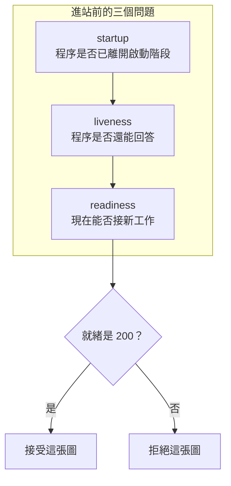

# 16｜健康檢查是綠的，新圖還是被拒

合成 AOI 交接站的健康檢查回 200。操作人員開始送圖。提交介面把圖退回。就緒檢查回的是 503。

兩支探針同時存在。綠燈只覆蓋其中一支。程序已經能回答，門還沒開。

## 先預測

程序剛起來，階段仍是 startup。假健康探針回 200。就緒探針回 503。此刻送出一張新圖，提交結果會是接受還是拒絕？

再想第二步。gate 打開，階段改成 live，就緒改回 200。這時再送圖，提交結果會變嗎？

先寫下來，再對照後面的實測。健康檢查的 200 先留在原位。不要拿它代替就緒。

第三個問題也先分開。liveness 問程序是否還能回答。startup 問啟動階段有沒有過去。readiness 問現在能否接新工作。三個答案可以同時不同。

## 沿着這條路徑

一張圖要進站，先經過三個不同的問題。三個問題各有自己的回覆。

startup 期間，階段還不是 live。假健康已經回 200。就緒回 503。提交看到階段不是 live，把這張圖拒掉。圖沒有進帳。

gate 打開之後，階段改成 live。就緒改回 200。同一張提交路徑這時才接受工作。實驗裡接受的是 A 和 B。

健康探針的程式不讀 gate。它在 startup、live、停止之後都可以回 200。所以單看那一個 200，看不出門開了沒有。

## 原理

這支服務的就緒只有在階段是 live 時回 200，其餘回 503。提交只在階段是 live 時接受工作。startup 期間兩個條件都不成立。

健康探針若永遠回 200，它描述的是「還能回答」。它描述不了「能接圖」。liveness 與 readiness 要各留各的回覆。

《Docker 現場招式》把就緒和「程序已經啟動」分開寫。容器或程序開始執行，只說明程序樹裡有這個程序。這一頁的 gate 是應用自己的門。門沒開，就緒維持 503，提交維持拒絕。

三支探針可以同時被觀察。startup 尚未結束時，假健康已經是 200，就緒仍是 503。用健康的 200 放行新圖，會把還沒打開的門當成可以交接。

503 本身就帶著一個訊息：探針有回應，新工作仍不該進來。連線成功、HTTP 有狀態碼、業務上可以接圖，是三層不同的觀察。這一頁的實驗把中間這一層固定成假健康，用來對照最上面這一層。

## 反例

假健康是這一頁的反例。它在 startup 就回 200，和就緒的 503 同時成立。若放行規則只看健康，early 這張圖會被送進尚未就緒的站。實驗裡的提交拒絕了它。

把「port 聽得到」寫成就緒，也會漏掉 gate。程序可以回答 TCP，同時把新工作拒在門外。503 說明探針有回應，工作仍留在站外。

gate 打開之後，就緒與提交一起放行。這個順序依賴應用把階段改成 live。探針 URL 回 200 的字樣，要對得上它問的是哪一個問題。問錯問題的 200，不能拿來開交接。

把 startup 完成寫成「可以接圖」，也會跳過就緒。程序可以已經離開啟動函式，同時仍把階段留在不接工作的狀態。這支實驗用 gate 把這兩個時刻分開。

## 動手看

程式在 [examples/l09_lifecycle.py](examples/l09_lifecycle.py)。startup 時假健康回 200，ready 回 503，此時 submit 被拒。被拒的工作 id 是 early。它沒有留在帳上。

gate 打開後，階段成為 live。submit 接受 A，也接受 B。就緒在這個階段回 200。

macOS 與 Linux 容器上的 Python 實驗都是 PASS。A、B 之後的停止、drain 與未完成帳在 [下一頁](17-shutdown.md)。

這裡只核對兩件事。未就緒時新工作進不了帳。就緒之後提交才接受。這是合成的階段旗標，不代表現場健康檢查的 URL 已經這樣實作。

假健康在整個實驗裡都回 200。用它單獨做放行，early 會被當成可接。實驗的提交路徑沒有採用那個判準。

| 時刻 | 階段 | 假健康 | 就緒 | 提交 |
|---|---|---|---|---|
| 剛啟動 | startup | 200 | 503 | 拒絕 early |
| gate 打開後 | live | 200 | 200 | 接受 A、B |

表裡的假健康兩列都是 200。能分開的是就緒與提交。startup 列的 503 和拒絕對在一起。live 列的 200 和接受對在一起。

liveness 這支探針若改成會失敗，那是另一個問題：程序還能不能回答。這次故意讓它一直成功，用來製造假健康。反例的重點是它和就緒同時存在、答案卻不同。

操作人員看到健康 200 時，下一步是去讀就緒。就緒仍是 503，新圖留在站外。等 gate 把階段改成 live，再送 A、B。這個順序寫在實驗裡，也寫在上面的表裡。

《Docker 現場招式》的就緒討論可以對照「程序已啟動」和「可以接工作」。這一頁沒有引用該書的實驗結果。數字只來自 L09 這次 Python 實驗。

early 被拒時，帳上還沒有 A、B。gate 打開之後才有這兩筆接受。順序寫死在實驗裡：先看到 503 與拒絕，後看到接受。把兩段對調，假健康的反例就會消失。

## 題目

**Q16.** 健康檢查回 200，就緒檢查回 503。現在可以接新工作嗎？

[返回地圖](00-map.md) · [實驗入口](labs.md) · [題目提示](hints.md) · [題目解答](answers.md)
