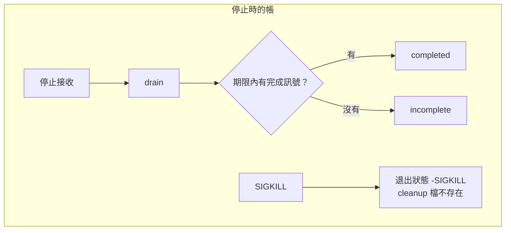

# 17｜停止之後，帳上還有一張沒做完的圖

交接站接到停止。新的合成 AOI 圖不再進來。已經接受的 A 與 slow 還在站內。

停完之後帳上出現 incomplete。有人改去找 cleanup 檔，檔也沒有出現。兩件事要分開記。程序不在了，不等於每一筆已接受的圖都有著落。

## 先預測

停止可以分成四段。先為每一段寫下：新圖還進得來嗎？已經接受的圖最後會落在哪一格？

1. 停止接收。新的 submit 改為拒絕。
2. drain。停止接收後，等到期限。期限內 worker 自己標成完成的留下；其餘已接受的標成未完成。
3. 合作取消。對方自己看旗標，再改自己的狀態。
4. SIGKILL。程序被強制終止。

第四段先別假設 finally 裡的寫檔會留下。這一頁有一次直接觀察。也先別把第四段和第三段寫成同一種停止。旗標要對方配合。SIGKILL 不等那個配合。

## 沿着這條路徑

已接受的工作留在帳上，直到它變成完成或明確未完成。停止接收只關掉新的提交。它不把舊帳塗掉。

第一條帳：A 與 B 的 worker 在 drain 的期限內自己把狀態改成 completed。C 在停止之後才提交，被拒絕，不進帳。最後看得見的是 A completed、B completed。

第二條帳：slow 的 worker 在期限內沒有完成訊號。drain 把它留成 incomplete。晚到的結果也不能再改成 completed。

合作取消走的是旗標。worker 看到旗標才把自己標成 cancelled。那條路徑在 [取消與未知](15-cancellation-unknown.md)。這一頁的 SIGKILL 不經過那個旗標。

## 原理

停止接收從進入 drain 就生效。階段離開 live 之後，submit 回 rejected。C 沒有被記成完成，也沒有被記成未完成。它根本沒被接受。

已接受的工作則要有下一格。completed 只出現在 worker 於期限內寫下完成訊號之後。期限到了仍是 accepted 的，改成 incomplete。完成和未完成都是明確狀態。帳上不該出現「接受過，後來不見了」，也不能靠一份允許名單直接寫成完成。

合作取消仍要對方自己看旗標。旗標設下之後，worker 可能還沒跑到檢查點。那筆工作在它改狀態之前仍算在途。這和 SIGKILL 不同。SIGKILL 不會等迴圈下一次查看。

[SIGKILL 不能被抓住](https://man7.org/linux/man-pages/man7/signal.7.html)。Python 的訊號說明頁沒有把 finally 寫進去。L09 的觀察是：子程序被 SIGKILL 之後，finally 裡寫的 cleanup 檔不存在，退出狀態是 -SIGKILL。

這個觀察用來拒絕「有 cleanup 檔才叫成功」的判準。觀察範圍是這支 Python 子程序。不要把它上升成所有語言的規範。檔沒出現，只說明這次不能靠那個檔宣稱收尾寫過。退出狀態另行說明程序死於 SIGKILL。

《Docker 現場招式》另有容器停止訊號的操作紀錄。那是容器主程序收到的訊號。這一頁的 SIGKILL 是實驗直接對子程序發出的。兩筆記錄不要混用。容器那次停止留在 [容器邊界](19-containers.md)。

## 反例

只檢查「程序已經不在」，會漏掉 incomplete。程序結束了，slow 那張圖仍沒有完成紀錄。帳若把這筆刪掉，對帳會少一張已接受的圖。

只檢查 cleanup 檔，會把這次 SIGKILL 說成沒有停成，或說成已經收尾。檔不存在是這次的觀察。退出狀態 -SIGKILL 已經說明程序是被這個訊號終止的。

成功與否要看每一筆已接受工作是完成還是明確未完成，再加上這個退出狀態。cleanup 檔出現與否，不能單獨當成功判準。

drain 時把尚未做完的工作直接標成 completed，會讓下一站以為圖已經交完。這支程式只在 worker 做完時寫入 completed。期限內沒有那個寫入，就維持 incomplete。

把合作取消和 SIGKILL 寫成同一格，也會誤判。前者的 worker 還能把自己標成 cancelled。後者的 finally 在這次觀察裡沒有寫出檔。

## 動手看

程式在 [examples/l09_lifecycle.py](examples/l09_lifecycle.py)。就緒之前的拒絕在 [上一頁](16-readiness.md)。gate 打開後接受 A、B，並真的啟動 worker。drain 給 0.4 秒。兩筆都在期限內完成。之後 submit C 被拒。帳是 A completed、B completed。測試會核對完成時間沒有晚於期限。

另一條路徑只接受 slow，worker 要睡 5 秒，drain 只等 0.05 秒。slow 成為 incomplete。再過一會兒它也不會被改成 completed。停止之後的 later 被拒。

SIGKILL 那條：子程序印出 READY 之後進入等待。finally 打算寫 cleanup 檔。實驗對該子程序送出 SIGKILL。檔不存在。退出狀態是 -SIGKILL。

macOS 與 Linux 容器上的 Python 實驗都是 PASS。這次沒有斷電，也沒有把清理檔寫進磁碟同步的保證。帳上的 completed 與 incomplete 是這支程式的狀態字串。

兩條 drain 可以對成下面這樣。

| 路徑 | 停止前已接受 | 期限內的完成訊號 | 停止後新提交 | 帳 |
|---|---|---|---|---|
| A、B 都做完 | A、B | 兩筆都有 | C 被拒 | A completed、B completed |
| slow 超過期限 | slow | 沒有 | later 被拒 | slow incomplete |

SIGKILL 那條不在這張表裡。它沒有走 drain。它看的是退出狀態與 cleanup 檔。檔不存在，退出狀態是 -SIGKILL。把「檔不存在」單獨解釋成所有語言的 finally 行為，超出了這次觀察。

已接受的圖在停止後仍要能指出落點。完成、未完成、被合作取消，三格都算明確。從帳上消失，不算明確。C 被拒是因為它沒被接受，所以它不占這三格。

## 題目

**Q17.** 停止之後帳上有一筆 incomplete，cleanup 檔沒有出現。可以把這次停止記成成功嗎？

[返回地圖](00-map.md) · [實驗入口](labs.md) · [題目提示](hints.md) · [題目解答](answers.md)
