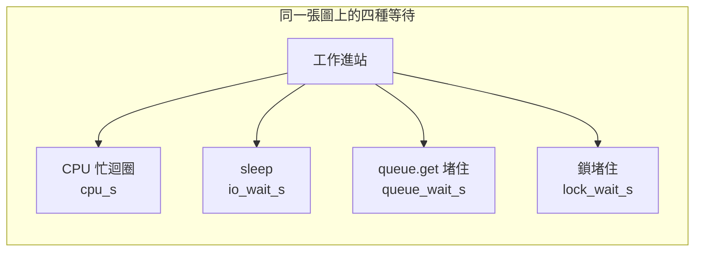

# 18｜交接變慢，紀錄只剩一個總等待

合成 AOI 圖在站裡變慢。操作人員只看到一條總等待時間。CPU 忙、sleep、queue 堵住、鎖堵住，四種情況會把同一條數字拉長。

下一張圖該改計算、改排隊，還是改鎖，從這一條看不出來。先預測哪一欄會動，再看這支程式自己記下的樣本。

## 先預測

下面四段各跑一次。先預測哪一個欄位會升高，其他欄位維持接近零。看完預測再讀樣本。

| 注入 | cpu_s | io_wait_s | queue_wait_s | lock_wait_s |
|---|---|---|---|---|
| CPU 忙迴圈 | ？ | ？ | ？ | ？ |
| sleep | ？ | ？ | ？ | ？ |
| queue.get 堵住 | ？ | ？ | ？ | ？ |
| 鎖堵住 | ？ | ？ | ？ | ？ |

CPU 忙迴圈會吃本程序的 CPU 時間。sleep 會讓牆鐘前進，CPU 時間幾乎不動。queue.get 在沒有項目時停住。鎖被別人持有時，等待者也停住。

若紀錄只留一條總等待，第三列和第四列會變成同一個數字。先寫下你會因此分不出什麼。這一頁的題目就問這個缺口。

這次沒有跨機對時。預測只針對這一支程式裡的欄位。不要用兩台機器的 log 時鐘來猜誰先誰後。

## 沿着這條路徑

一張圖進站之後，等待可以發生在不同的點。每一點把自己的秒數寫進自己的欄位。判讀時只讀該段記下的欄位。

這四段是分開注入的。一次實驗只升高一類。圖把欄位名稱放在一起，方便對照預測。四段產線追蹤要另做。這張圖只對欄位。

CPU 段只寫 `cpu_s`。sleep 段寫 `io_wait_s`，並另記這段的 `cpu_s`。queue 段只寫 `queue_wait_s`。鎖段只寫 `lock_wait_s`。空白欄位維持 0。

分類器讀的就是這四個數字。CPU 明顯高於其他欄，歸 cpu。某一種等待超過門檻且 CPU 仍低，歸到那個等待的名字。四個名字因此能分開。

## 原理

CPU 段用 `time.process_time` 累積約 0.05 秒的本程序 CPU。這個時鐘是 user 加上 system，不含 sleep。迴圈次數隨機器而變。實驗用這段 CPU 時間分類，不用次數當答案。

sleep 段用 `time.perf_counter` 包住一次暫停，寫進 `io_wait_s`。同一段再用 `process_time` 看 CPU。暫停期間 CPU 欄位接近零，等待欄位跟著牆鐘走。

queue 段量的是 `queue.get` 堵住的那段 `perf_counter` 差值。項目晚 0.12 秒才放進 queue。鎖段量的是等到鎖放開的差值。鎖也晚 0.12 秒才放。兩個等待的形狀相近，欄位名稱不同。

四類能分開，是因為判讀用各段自己記下的 `cpu_s`、`io_wait_s`、`queue_wait_s`、`lock_wait_s`。總等待若把這些差值加在一起，queue 和鎖會混在同一條數字裡。

同一張圖還要能把三種紀錄對在一起。log 回答「這件工作發生了什麼」，例如 `AOI-SYN-OBS` 的 cpu 段結束了。metric 回答「這類數字現在是多少」，例如該段的 `stage_s`，之後才能加總或取分位。trace 回答「這張圖的時間花在哪一段」，同一工作編號底下的 cpu、sleep、queue、鎖各有一段秒數。三種紀錄都帶同一個工作編號。沒有這個編號，四條秒數就只是四次互不相干的實驗。

分位數用的原始樣本要留下。L10 把 7 個 `cpu_s` 寫進 `verification/l10-cpu-samples-macos.json` 或 `l10-cpu-samples-linux.json`。nearest-rank 的 0.5 分位必須能用這份清單重算。只印一個中位數、把樣本丟掉，事後就無法核對。

Python 文件沒有定義分位數。L10 自訂 nearest-rank。排序後 `k = ceil(p * n)`，取第 k 個（從 1 數），並報告 n。CPU 樣本 n=7。0.5 分位的 k 是 `ceil(0.5 * 7)`，也就是 4。取排序後第 4 個。實測這個分位約 0.0500 秒。

換一個 n，同一個 0.5 可能落到另一個樣本。報告分位數時把 n 和算法名字一起寫上。這次算法名是 nearest-rank。

這次沒有跨機對時。樣本來自這支程式自己的時鐘差值。不要把跨機時鐘的先後當成因果。兩台機器的 log 時間戳即使看起來差幾毫秒，這次實驗也沒有對過它們。

## 反例

只留一條總等待，queue 堵住約 0.12 秒和鎖堵住約 0.12 秒會寫成同一個形狀。CPU 都低。下一張圖仍慢時，無從決定該加長 queue 還是縮短持鎖時間。

把這次 CPU 的 0.5 分位約 0.0500 秒當成產線解碼時間，也會用錯樣本。這是人造負載。它不能推出產線效能。現場要換真實的圖，重新取樣，重新報告 n。

用兩台機器的牆鐘排序來判斷「先排隊還是先拿鎖」，需要事先對時，而且對時誤差要寫進結論。這次沒有做那件事。單機裡的欄位已經能分開四類。

只報一個分位數、不報 n，也會讓 0.0500 秒失去分母。n=7 的第 4 名，和 n=100 的中段，證據範圍不同。這次必須連 n 一起讀。

## 動手看

程式在 [examples/l10_observe.py](examples/l10_observe.py)。它分別量 CPU 忙迴圈、sleep、queue.get 堵住、鎖堵住。分類結果是四類各歸各位。同一個工作編號 `AOI-SYN-OBS` 的每一段都留下 log、metric、trace。

CPU 樣本 n=7，寫在驗證目錄的 `l10-cpu-samples-*.json`。nearest-rank 的 0.5 分位由這份清單重算。輸出裡看得到工作編號、n、分位秒數、算法名，以及樣本檔名。

macOS 與 Linux 容器上的 Python 實驗都是 PASS。數字是這支程式的受控注入。換成現場的 AOI 圖之後，要重新取樣、重新報告 n。舊的 0.0500 秒留在這次紀錄裡。

預測若和分類不一致，先核對欄位有沒有被加總成一條。加總之後，queue 與鎖共用同一個秒數，欄位名稱就沒有了。

四個原始欄位要一起留下。cpu_s 用來確認這段有沒有在算。io_wait_s、queue_wait_s、lock_wait_s 各自回答一種停住。少一欄，剩下的總秒數只說明「停過」，說明不了停在 queue 還是鎖。

分位數只對 CPU 那 7 個樣本計算。sleep、queue、鎖沒有拿來算 0.5 分位。不要把 0.0500 秒讀成這三種等待的中位。它們的觀察是單次注入約 0.12 秒的堵住，外加分類器讀到的欄位名。

這次樣本都在同一支程序裡。沒有第二台機器的時鐘。跨機因果不在這份 PASS 裡。

## 題目

**Q18.** 記錄裡只剩一條總等待時間，沒有分段。為什麼分不出是 queue 還是鎖？

[返回地圖](00-map.md) · [實驗入口](labs.md) · [題目提示](hints.md) · [題目解答](answers.md)
