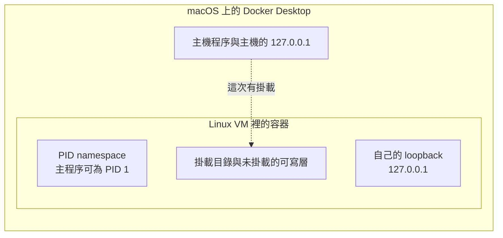

# 19｜容器裡 bind 成功，主機的 localhost 仍是另一邊

合成 AOI 圖的接收程序跑在容器裡。它 bind `127.0.0.1` 成功。主機上的客戶端連自己的 `127.0.0.1` 和那個 port。

操作人員以為圖會進到容器裡的 listener。這次實驗用的是預設 bridge。沒有加 `--network=host`。也沒有把 port 發布到主機。

## 先預測

先畫三條邊界，再猜連線會落在哪一側。

- PID namespace：容器裡看到的 PID 1 是誰的 1。
- mount：寫在掛載目錄的檔，主機看不看得到。寫在容器自己 `/tmp` 的檔，下一個容器看不看得到。
- loopback：容器的 `127.0.0.1` 與主機的 `127.0.0.1` 是否同一個網路 namespace。

這次跑在 macOS 上的 Docker Desktop。容器裡是 Linux VM。VM 裡的觀察不要寫成 macOS 核心的語意。

先寫下你預期的 pid、ppid、hostname，以及 `docker stop` 之後掛載目錄裡會留下什麼字。再對照後面的實測。

## 沿着這條路徑

圖的接收程序是容器的主程序。它的網路、檔案與程序樹都在容器邊界裡面。主機只透過這次掛上去的目錄看見一部分檔。

虛線只表示這次的 bind mount。它不表示主機的 loopback 進得了容器的 listener。

訪客啟動後做四件事。它記下 pid、ppid 與 hostname。它 bind `127.0.0.1` 上的一個由系統指定的 port。它把 `mounted.txt` 寫進掛載目錄，把 `only-inside.txt` 寫進自己的 `/tmp`。它裝上 SIGTERM 處理函式，再停在那裡等訊號。

主機側看得到掛載目錄。主機側的客戶端若只連主機自己的 loopback，走的是圖左邊那一格。

## 原理

[容器有自己的檔案系統、網路與程序樹](https://docs.docker.com/engine/containers/run/)。預設 PID namespace 裡，PID 可以重用，包含 PID 1。容器裡的 PID 1 是這個 namespace 的 1。macOS 上的 init 在這個 namespace 外面。

[docker stop](https://docs.docker.com/reference/cli/docker/container/stop/) 讓主程序先收到 SIGTERM，寬限之後收到 SIGKILL。Linux 容器的預設寬限是 10 秒。PID 1 若沒有自己的處理函式，會忽略預設動作是終止的訊號。這條寫在 [docker run 的 PID 說明](https://docs.docker.com/reference/cli/docker/container/run/)。

這次訪客自己裝了 SIGTERM 處理函式。處理函式把 `sigterm` 寫進掛載目錄的 `stopped.txt`，再以狀態 0 離開。所以這次走的是有處理函式的那一條。寬限 10 秒在這次觀察裡沒有拖到 SIGKILL。

`--network=host` 會拿掉網路隔離。容器的 localhost 與主機程序不是同一個 listener，這句話只在容器仍有自己的 network namespace 時成立。這次保留預設 bridge，容器仍有自己的 network namespace。

未掛載的可寫層會隨容器移除消失。掛載出去的檔留在主機那一側的目錄。`/tmp/only-inside.txt` 沒有掛出來。新的容器讀自己的 `/tmp`，讀不到前一個容器寫下的那份。

《Docker 現場招式》寫過就緒與停止訊號的現場操作。這一頁的證據只來自下面這一次新跑的容器，不沿用其他書的 PASS。就緒的探針差別在 [就緒](16-readiness.md)。直接對子程序送 SIGKILL 的帳在 [停止](17-shutdown.md)。那次沒有經過 `docker stop`。

## 反例

看到 bind 成功，就從主機連 `127.0.0.1` 的同一個 port。預設 bridge 下，主機連的是主機自己的 loopback。容器的 listener 在容器的 network namespace 裡。

這次沒有使用 `--network=host`。上面那句「兩邊的 listener 要分開看」，在這次設定下成立。換上 `--network=host` 之後，網路隔離被拿掉，這句話要重寫。

把容器裡的 PID 1 說成 macOS 核心的 1 號程序，也把邊界畫錯。這次 Engine 跑的是 linuxkit 上的 Linux 容器。PID、hostname、loopback 都是那個環境裡的觀察。

把 `/tmp` 裡的檔當成已經交給主機，會在下一個容器讀不到。那個路徑沒有掛載。相對地，`mounted.txt` 寫在掛載點上，主機能在自己的目錄裡讀到 `from-container`。

沒有處理函式的 PID 1 會忽略預設動作是終止的訊號。這次不能拿來證明那條忽略路徑。訪客有處理函式，`stopped.txt` 裡留下了 `sigterm`。

## 動手看

程式是 [examples/l11_host.py](examples/l11_host.py) 與 [examples/l11_guest.py](examples/l11_guest.py)。只在 macOS 上的 Docker Desktop 跑過。Engine 29.2.0，linux/arm64，kernel 6.12.67-linuxkit。

映像是 `python:3.13-alpine`。本機 image id 是 `sha256:1a63a53928ce53d2b0baf08092a703f4840ac5dfbd61fd48802dbf48e08c801e`。這一行是本機 image id。登錄檔 digest 要另外查，這次沒有把它寫進證據。

訪客先寫掛載檔、裝上 SIGTERM 處理，再把含 `"ready": true` 的 JSON 用同目錄改名發布。主機在看見這份就緒檔之前不讀報告，也不呼叫 `docker stop`。測試會在發布前停 0.7 秒，確認這段時間掛載檔已經在、就緒檔還沒有。報告讀取失敗或檢查失敗時，`finally` 仍對這次的容器執行 `docker rm -f`，不留下這個名字，也不刪掉別的容器。

訪客 Python 3.13.15，GIL 開著。訪客 pid 1、ppid 0。hostname 是容器 id 前綴，和 macOS 主機 hostname 不同。bind `127.0.0.1` 成功。port 由容器裡的系統指定，每次可以不同。

掛載檔 `mounted.txt` 在主機看得到。`docker stop` 之後 `stopped.txt` 的內容是 `sigterm`，退出碼 0。新的容器讀不到前一個容器的 `/tmp/only-inside.txt`。

沒有用 `--network=host`。沒有沿用其他書的 PASS。Linux 容器裡再跑整組實驗時沒有 Docker，L11 記 SKIP。C++ 實驗只在 macOS 上跑過，不在這次容器觀察裡。

主機 hostname 與容器 hostname 不同，只說明這次容器 id 前綴沒有沿用 macOS 那台機器的名字。它不說明 macOS 核心如何配置 loopback。loopback 的隔離發生在 Linux VM 裡的 network namespace。Docker Desktop 把這台 VM 放在 macOS 上跑。

`mounted.txt` 的內容是 `from-container`。主機在掛載目錄讀到同一行。`stopped.txt` 在 `docker stop` 之後出現，內容是 `sigterm`。退出碼 0 對得上處理函式裡的正常離開。

新容器執行 `cat /tmp/only-inside.txt` 沒有成功。前一個容器的該檔留在它自己的可寫層。這次沒有把 `/tmp` 掛到主機。文件說明：未掛載的可寫層會隨容器移除消失。實驗直接看到的是：另一個新容器讀不到那份檔。

port 不寫進通過條件。題目問的是位址落在哪一個 loopback。

## 題目

**Q19.** 容器裡 bind 127.0.0.1 成功，網路用預設 bridge。主機上的客戶端連 127.0.0.1 的那個 port，會進到容器裡的 listener 嗎？

[返回地圖](00-map.md) · [實驗入口](labs.md) · [題目提示](hints.md) · [題目解答](answers.md)
