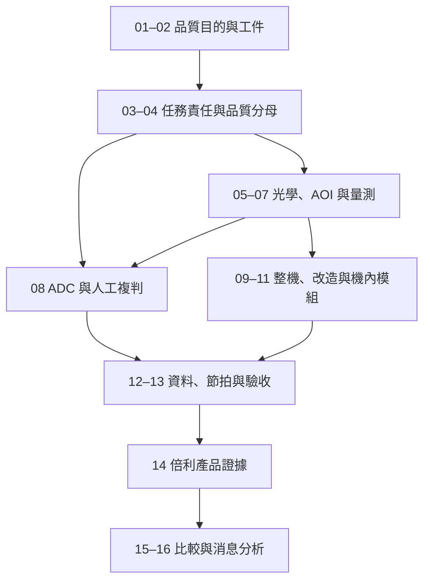

# 全書地圖：從工件走到公司證據

這本書的主線是：製程要控制什麼 → 異常如何形成影像 → 如何檢出、量測與分類 → 如何在產線持續完成 → 倍利公開提供哪一層能力。

**自建閱讀依賴圖。** 箭頭代表理解所需的概念，不是實際製程順序。

| 章 | 核心問題 | 本章帶走的工具 | 主要先備 |
|---|---|---|---|
| [01](01-why-inspection.md) | 製程做完為何還要看？ | 品質回饋與時間損失模型 | 無 |
| [02](02-workpieces-and-stations.md) | 到底在看哪種工件？ | 工件卡與站點圖 | 01 |
| [03](03-detection-metrology-review.md) | 四種任務差在哪？ | 輸入／輸出責任表 | 01–02 |
| [04](04-defects-and-quality.md) | 品質指標分母是誰？ | 混淆矩陣與端到端算例 | 03 |
| [05](05-optics-and-imaging.md) | 缺陷如何形成影像？ | 倍率、取樣、解析與檢出對照 | 02–04 |
| [06](06-aoi-and-recipes.md) | 影像怎麼變候選？ | Recipe 與失效檢查 | 05 |
| [07](07-metrology-and-3d.md) | 怎麼知道量準了？ | 量測術語與 2D／3D 邊界 | 05–06 |
| [08](08-adc-and-human-review.md) | AI 後面還需多少人？ | 分流、工時與漂移模型 | 04、06 |
| [09](09-standalone-inspection.md) | 整機整合哪些責任？ | 工件至結果的完整鏈 | 05–07 |
| [10](10-om-upgrade.md) | 舊機值得改造嗎？ | 原機基線與改造責任 | 09 |
| [11](11-inline-aoi.md) | 機內檢測付出什麼代價？ | 宿主時序與失效隔離 | 06、09 |
| [12](12-data-and-traceability.md) | 結果怎麼找回原工件？ | 座標往返與資料契約 | 08–11 |
| [13](13-throughput-and-acceptance.md) | 哪種速度才有用？ | 有效產能與驗收安排 | 04、09–12 |
| [14](14-v5-product-evidence.md) | 倍利到底交付哪一層？ | 四類產品證據矩陣 | 08–13 |
| [15](15-competition-and-business.md) | 如何比較競爭與商業位置？ | 同任務候選與階段判讀 | 13–14 |
| [16](16-reading-company-news.md) | 消息可以支持多強的結論？ | 六案例與可填寫分析表 | 全書 |

## 卡住時回哪一章？

若讀到數字卻不知道是否可比，先回 04 查分母、05 查指標、07 查量測定義。若產品功能很多卻不知如何選，回 03 拆任務、09–11 找部署位置。若消息看起來很大但缺乏實績，回 14 核版本、15 拆商業階段、16 列更新條件。

本書跨章重複的概念各有分工：04 教品質計數，08 教分類工作如何影響人力，13 才把品質與流程一起算有效產能。不要把其中任何一章的單一算例當成完整工廠模型。
