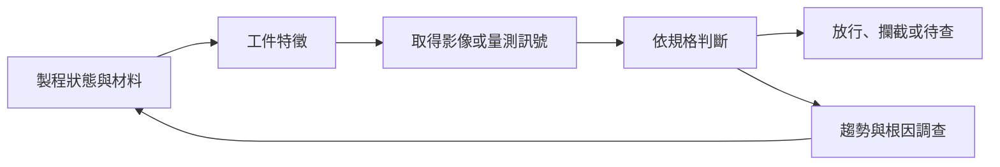

# 01　製程做完了，為什麼還要檢測？

想像一條把許多晶片互連起來的封裝產線。設備已按設定完成金屬製作，為什麼還要多花時間拍照、量尺寸，再決定能否進下一站？因為「執行過配方」與「工件符合要求」是兩件事。材料、位置、表面狀態與設備漂移，都可能讓相同設定得到不同結果。

對沒有半導體背景的讀者，檢測最實用的起點是把它視為一種**取得決策證據的工作**。產線要決定放行、返工、攔截或調整製程；影像只是證據的一種形式。光學設備看得到的訊號也有邊界，不能用一張表面照片保證整個晶片的電性、內部結構與長期可靠度。

## 工件、規格與缺陷

工件是當前被加工或檢查的實體，例如晶圓、載板或已封裝元件。規格則描述在指定方法下什麼結果可以接受。缺陷不是所有「看起來不一樣」的東西：一個亮點可能只是反射差異，也可能是異物；必須依位置、大小、材料與功能風險判定。

例如相鄰金屬導線應互相隔離，若中間多了一段導電材料，可能形成橋接；應連續的線路中間缺了一段，可能形成開路。光學檢查可以找出相應外觀候選，但是否真的導通或斷路，可能仍需電性或其他方法確認。這個區分讓我們不把「外觀異常」直接等同「最終產品失效」。

| 產線問題 | 希望取得的證據 | 可能採取的動作 |
|---|---|---|
| 這件工件可否繼續加工？ | 已知品質條件的檢查結果 | 放行、待查、返工或報廢 |
| 製程是否逐漸偏移？ | 尺寸或缺陷隨時間的趨勢 | 查機台、調整配方、增加抽查 |
| 缺陷可能在哪一站產生？ | 前後站與工件履歷的對照 | 縮小調查範圍、設計確認實驗 |
| 檢測本身可靠嗎？ | 參考件、複測和異常紀錄 | 校正、維護或停止自動判定 |

## 檢測如何改變損失？

以下是**教學假設**。某異常持續影響每分鐘 10 件工件，直到被發現才停止。若發現與反應合計需要 30 分鐘，可能有 300 件受影響；縮到 5 分鐘，可能是 50 件。這個計算假設影響速率固定，而且停機真的能中斷原因；它不是任何設備的效益數字。

這裡的重點是時間，而不只是每張影像看得多細。檢測做得很準，若資料隔天才回到製程端，就可能錯過早期攔截窗口。相反地，把不可靠的訊號即時接到停機邏輯，則可能造成大量不必要中斷。需要一起設計訊號品質、回饋時間與反應規則。

**圖 01-1｜自建品質回饋圖。** 回饋箭頭表示調查後的控制行動；它不表示每個缺陷都能自動找到根因，或設備可自行修改製程。

## 良率與檢測不能直接畫等號

良率必須有清楚的範圍，例如某批進站 1,000 件，其中 950 件在指定測試下合格，該站觀察到的合格比例是 95%。換測試條件、換計數單位，或改成全流程最終良率，數字可能不同。

新增更敏感的檢測後，報表中的缺陷數可能上升。這不必然代表製程變差，也可能是原先沒看見的問題被找出。要比較改善前後，應固定檢測方法，或用共同參考重新判讀；否則測量方法的變動會混進製程趨勢。

檢測本身通常不會修補已經斷掉的線路。它能減少帶病工件繼續消耗加工資源、提供返工機會，並幫助製程端降低未來缺陷。究竟有沒有提高最終良率，需要看實際控制行動與後續結果，不能只因為多了一台設備就推定成功。

## 抽樣與全檢各自留下什麼未知？

抽樣以較少時間觀察部分工件或區域，適合某些趨勢監控，但結果取決於取樣設計。若缺陷集中在晶圓邊緣，卻只拍中心，再多中心樣本也不能代表邊緣。所謂全檢也要問全的是什麼：每片都有進機台、每顆晶粒都有拍到，還是每個必要表面都有足夠靈敏度的訊號？

不能把「100% 工件通過設備」直接寫成「100% 缺陷可檢出」。視野、焦深、遮蔽與缺陷對比仍有邊界。把未涵蓋區域明確標出，比單一覆蓋率更能支持驗收。

## 與倍利的連結

**已確認：** 倍利官網將晶圓檢量測、既有 OM 升級、嵌入式檢測與 AI 平台列為不同服務入口，產品證據見[第 14 章](14-v5-product-evidence.md)。

**推論：** 這四類交付可對應「補一個檢測站」「改善舊站流程」「縮短回饋距離」「處理候選資料」等不同需求。因此理解客戶問題，應先問品質決策卡在哪裡。

**待查：** 特定客戶改善前後的缺陷損失、反應時間和最終良率。公開產品存在，不等於這些效益已被共同測試證明。

## 理解檢查

1. 新增檢測後缺陷數增加，有哪兩種不同解釋？
2. 為何全數進機台不代表全數缺陷能被找到？
3. 把回饋時間從 30 分鐘降到 5 分鐘，何時不能用本章算例估計效益？

??? note "參考推理"
    1. 製程確實變差，或檢測能力／判定方法改變；需共同基準區分。
    2. 成像仍可能有盲區、低對比或焦距問題，且演算法可能漏掉訊號。
    3. 缺陷不是固定速率、發現後無法停住原因，或受影響工件不是當下新增時，都需改模型。

## 來源與下一步

本章因果圖與數字是教學自建；公司定位以[倍利官網](https://www.v5.com.tw/)為來源。光學與計量的正式資料彙整於[來源索引](appendix-sources.md)。下一章先認識[被檢查的工件與站點](02-workpieces-and-stations.md)，讓「缺陷」有實際位置。
