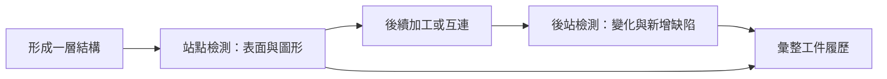

# 02　晶圓、重佈線、凸塊與載具，在檢查什麼？

同樣叫晶圓檢測，裸晶圓的表面異物、重佈線的細線橋接與凸塊的高度差，是不同任務。設備若沒有說清楚材料、表面、尺寸和站點，就很難判斷規格是否對應眼前問題。本章建立一張工件地圖，後面所有產品比較都回來對照這張圖。

先備是[檢測的品質用途](01-why-inspection.md)。這裡的製程順序是概念整理，實際先進封裝的流程會依產品路線而異；不能把同一張圖當成所有工廠的流程卡。

## 先分清楚三個尺度

晶圓是一片承載許多重複區域的圓形工件；晶粒是其上將形成個別晶片的單位；晶粒內又有線路、焊墊等更小特徵。相機畫面可能只包含一小區，機台則需靠運動與定位把許多區域串成整片的結果。

<figure style="max-width: 34rem; margin: 1.5rem auto;">
  
  <figcaption>晶圓與重複晶粒陣列，用來辨識整體工件與局部單位；沒有比例尺，不是倍利客戶工件。Dualmodem Bytton，<a href="https://creativecommons.org/licenses/by-sa/2.0/">CC BY-SA 2.0</a>，未修改。</figcaption>
</figure>

因此「一個缺陷座標」至少隱含三件事：它屬於哪片工件、哪個晶粒或區域，以及該區域內的哪個位置。後續分選若用晶粒地圖，單純的相機像素座標仍不足以直接使用。

載具則負責承載、定位或保護工件。鐵框、承載盤與卡匣不是晶圓本體，卻會影響能不能進機台、邊緣能否拍到、翹曲如何處理以及搬送是否安全。兩台都宣稱支援相同晶圓直徑的設備，也可能因載具不同而不能直接互換。

## 從金屬走線到垂直互連

重佈線層 RDL 可以理解為重新安排電氣連接位置的金屬走線與絕緣層結構。對光學檢測而言，需要看到的可能是線路缺口、意外連接、表面殘留或圖形偏移；對量測而言，問題可能是線寬或兩層圖形的相對位置。

凸塊 bump 提供垂直連接。俯視圖可以觀察位置、缺失與平面形狀，但兩顆俯視輪廓相似的凸塊，高度可能不同。若驗收關注接合時能否同時接觸，就需要適當的高度／共面性資訊，不能由直徑自動推定。

| 工件／特徵 | 可能問題 | 表面影像可提供的線索 | 不能單靠該線索保證 |
|---|---|---|---|
| 晶圓表面 | 異物、刮傷、外觀不均 | 對比、位置、形狀 | 內部或電性完全正常 |
| RDL 線路 | 缺口、橋接、偏移 | 平面圖形與邊界 | 所有深層連接狀況 |
| 凸塊 | 缺失、偏心、尺寸異常 | 是否存在、XY 位置、輪廓 | 高度與接合後可靠度 |
| 晶圓邊緣 | 薄膜邊界、破損或殘留 | 邊界位置與可見異常 | 被夾具遮住區域的狀態 |
| 背面與載具接觸區 | 污染、刮傷 | 可見表面變化 | 搬送後一定不再產生污染 |

表中的「可能」是任務示例，不表示倍利公開承諾涵蓋全部材料與缺陷種類。

## 檢測站放在哪裡，答案就改變

在金屬圖形形成後立即檢測，可以較早發現與該步相關的可見異常；若等到後面才看見，問題可能已被覆蓋，也更難判斷起點。另一方面，每增加一站都會消耗搬送與取像時間，還可能增加工件接觸風險。站點選擇需要平衡資訊價值與流程成本。

**圖 02-1｜自建前後站觀察圖。** 同一位置在前站正常、後站異常，可以縮小調查範圍，但仍需排除兩站靈敏度、照明與取樣差異，才能歸因於中間製程。

工廠內的站點縮寫可能包含特定製程、產品與內部命名。除非原始文件定義清楚，本書不把某個縮寫擴寫成固定的全球通用站點。讀到「涵蓋很多站點」，應索取各站工件、檢測任務與版本清單，而不是只數縮寫個數。

## 一張可用的工件卡

評估檢測前，可以先填：材料與表面狀態、外形與尺寸、載具、正背面、翹曲範圍、最關鍵缺陷、區域覆蓋與製程位置。接著寫出最小可接受結果，例如「指定區域的線路候選需可追到晶粒位置」；這比「要高解析 AOI」更能引導設備選型。

常見失敗是拿展示用平整樣片代表量產全貌。真實材料可能有高度變化、反射差異、殘膠或邊緣區域，讓對焦、定位和背景模型失效。控制方法是在驗收集合裡保留這些變化，並逐類確認，而不是只報一個混在一起的平均值。

## 與倍利的連結

**已確認：** 倍利的通用晶圓檢量測頁提供工件尺寸、表面與搬送相關功能資訊；逐項條件見[第 14 章](14-v5-product-evidence.md)。

**推論：** 工件卡可用來追問通用頁與具名型號的配置關係。例如支援某直徑，不必然表示也支援該客戶的鐵框與翹曲組合。

**待查：** Inline 的具體工件、宿主設備與站點，以及各型號對不同載具的限制。不能用整機的工件條件代替嵌入式模組的條件。

## 理解檢查

1. 為何兩顆俯視直徑相同的凸塊，仍可能有不同接合風險？
2. 前站沒看見、後站看見，能否直接判定缺陷產生於兩站之間？
3. 支援相同晶圓直徑，為何仍要核對載具？

??? note "參考推理"
    1. 高度、形貌與材料狀態可能不同，俯視直徑只描述部分幾何。
    2. 不能；需先排除兩站取樣、成像與檢出能力差異。
    3. 載具影響搬送、夾持、對焦、可見區域與安全限制。

## 來源與下一步

工件範例為教學整理；廠商實際用途需回到[來源索引](appendix-sources.md)的產品文件核對。想先補封裝概念可閱讀書庫的<a href="../../gpm/html/index.html">先進封裝導讀</a>。下一章將同一工件拆成[四種檢測任務](03-detection-metrology-review.md)。
