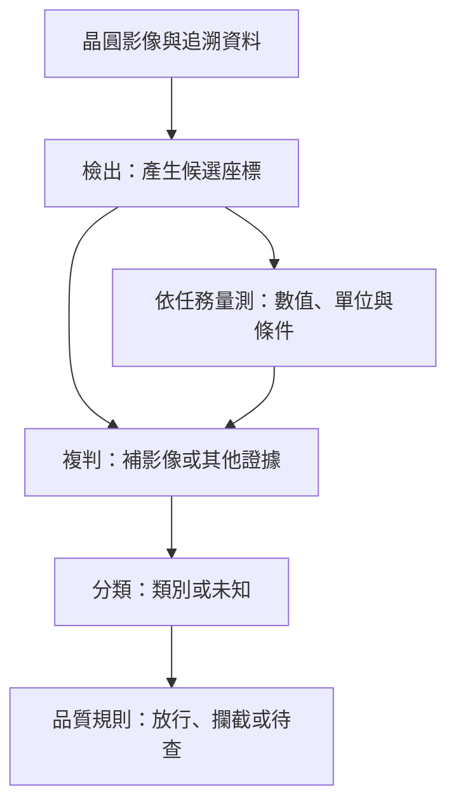

# 03　檢出、量測、複判與分類，各自交付什麼？

一張設備介紹同時寫著「自動檢測、尺寸量測、影像複判、AI 分類」，讀者很容易把它們當成四個近義詞。然而，同一顆凸塊可以被成功找到、尺寸量錯、複判認為可接受，最後又被分類成錯誤原因。四件事的輸入、輸出和失敗方式都不同。先拆清楚，才能讀懂後面各章，也才能理解倍利為何同時提供硬體設備與 AI 平台。

本章先備是[工件與站點](02-workpieces-and-stations.md)。以下晶圓與資料列為**教學自建情境**，不是倍利實機流程或客戶測試結果。

## 同一片晶圓，四個問題

假設晶圓上有許多重複的金屬凸塊，製程要求凸塊直徑落在指定範圍，且相鄰凸塊不能相連。設備拍到一個形狀不尋常的區域。此時至少有四種問題：哪裡異常？直徑是多少？這個異常是否真有品質風險？它應歸在哪一類？

| 任務 | 主要輸入 | 主要輸出 | 完成後仍不知道什麼 |
|---|---|---|---|
| 檢出 detection | 影像、參考或規則 | 候選位置、範圍、分數 | 候選是否真的有害 |
| 量測 metrology | 量測訊號、座標與校正 | 數值、單位、量測條件與不確定度資訊 | 該尺寸偏差由哪道製程造成 |
| 複判 review | 候選、較充分的影像或其他證據 | 確認、排除、保留待查 | 每個確認缺陷的根因 |
| 分類 classification | 影像或特徵、類別定義 | 類別、分數或 unknown | 該類別是否足以決定放行 |

這是本書的工作定義；廠商可能把 review 與分類放在同一套軟體。閱讀型錄時應看具體輸入輸出，不能只按產品名稱劃界。review 也未必全靠人工：它可由更高倍率取像、規則或模型輔助；重點是對候選補證據，而不是再次把同一分數印出來。

## 從影像走到品質決策

第一步，檢測流程先找候選。它可能把當前凸塊與相鄰凸塊或理想圖樣比較，將差異過大的位置列出。這份列表應保留晶圓身分、座標、取像條件與 recipe 版本，否則下一站即使有能力，也可能找錯位置。

第二步，針對需要尺寸判斷的位置量測。以凸塊直徑為例，必須先定義「直徑」：是擬合圓的直徑、最寬距離，還是特定方向兩條邊界之間的距離？同一個不規則凸塊可以有不同結果。量測不是從影像上隨便拉一條線，而是實作一個明確的被測量定義。

第三步，複判候選。反光可能造成看似斷線的暗區；較適合的照明或重新取像可能顯示金屬仍連續。反之，原影像模糊不代表可以放行，而是證據不足。可追溯的複判應記錄決策依據，讓後續人員能區分「已證明良好」與「沒有看清楚」。

第四步，把確認結果分到可操作的類別，例如橋接、缺失、表面異物或未知。類別若只是外觀描述，不能自動當成根因。「黑點」未必都是污染，「刮痕」也未必出自同一搬送站。分類讓資料能彙整，根因分析仍要結合製程履歷和其他量測。

**圖 03-1｜自建任務分工圖。** 這是一種教學順序；實機可能先分類再複判，或平行量測。末端品質規則屬於產線責任，不能從「有分類輸出」推定已允許自動放行。

## 為什麼會各站合格，整體仍然出錯？

假設檢測已找到一處橋接，但輸出的 X、Y 軸定義與複判站相反，下一站便拍到另一顆完好的凸塊。複判員的判斷在當下影像上可能完全正確，整條鏈仍然漏掉真缺陷。這是資料交接失敗，不是把模型準確率再提高一點就會消失的問題。[第 12 章](12-data-and-traceability.md)會用座標往返驗證處理它。

另一種失敗是把候選上的分類成績當成全晶圓檢出成績。如果檢測一開始漏掉缺陷，後端分類器就沒有那張影像。即使分類器對收到的候選全部判對，也無法證明上游沒有漏檢。因此要保存兩種分母：全體真實缺陷，以及實際送入分類器的候選。品質算例見[第 04 章](04-defects-and-quality.md)。

還有一種常見錯誤是用量測穩定性代替正確性。設備每次都量到相近數字，只證明某些條件下變動小；若校正比例錯了，每次都可能穩定地量錯。量測性能要拆成重複性、偏差與不確定度，[第 07 章](07-metrology-and-3d.md)再展開。

## 怎麼驗收這條鏈？

先拿一組已知位置與判定依據的工件，逐站檢查輸出能否對回原物。對檢出，問已知缺陷找到多少；對量測，問數值如何對到參考與單位；對複判，問保留或排除的證據；對分類，問各類混淆及未知比例。最後再檢查品質決策是否忠實使用這些輸出。

每站都應能處理「不知道」。影像遺失、對焦失敗、量測超出有效範圍、模型遇到陌生外觀，都應形成可辨識狀態。若系統把空值默認成良品，表面上的自動化率會提高，卻把未完成的工作藏進放行資料。

## 與倍利的連結

**已確認：** 倍利的[晶圓檢量測產品頁](https://www.v5.com.tw/tw/service/product/5/6)列有檢測、尺寸相關量測及 review；[AI 平台頁](https://www.v5.com.tw/tw/service/product/4/5)描述接收 AOI 影像、模型運作與結果輸出。這支持把取像檢量測與後端資料／分類分成不同能力層。

**推論：** 客戶若主要卡在大量候選等待分類，可以先評估資料與分類層；若缺陷根本沒有形成可用影像，則要回到上游成像與檢測。這是依工作流程的推理，不是倍利對特定客戶的診斷。

**待查：** 各產品之間的實際交接版本、放行權限、異常狀態及共同驗收結果。詳細公司主張集中於[第 14 章](14-v5-product-evidence.md)，避免不同產品互借證據。

## 理解檢查

1. AI 把所有收到的候選都分類正確，為什麼不能宣稱零漏檢？
2. 同一凸塊兩次量測相同，能否證明尺寸正確？
3. 複判找不到原候選時，應把它記為良品還是異常？
4. 分類成「異物」後，還缺什麼才能指定根因？

??? note "參考推理"
    1. 上游可能沒有找到或傳送全部缺陷；分類分母只是收到的候選。
    2. 不能；共同偏差仍可存在，需要參考、校正與條件評估。
    3. 應保留定位／交接異常，重新確認座標和影像，不能直接排除候選。
    4. 需要材料、站點履歷、前後站證據或可驗證的製程實驗，外觀類別不足以指定來源。

## 來源與下一步

公司功能範圍見上述兩份官方產品頁；本章分工表、流程及失敗情境是教學整理。量測術語來源見[來源索引](appendix-sources.md)，本章不宣稱任何實際檢出率。接著用[漏檢與假警報](04-defects-and-quality.md)把任務責任轉成可計算的品質指標。
