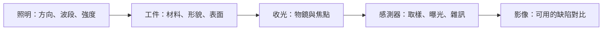

# 05　缺陷如何變成一張可判讀的影像？

假設線路表面有一小片殘留物。它真實存在，不代表相機一定看得見：若殘留物與背景反射接近、所在位置失焦，或訊號被雜訊淹沒，後端模型收到的可能只是一片模糊背景。影像檢測的第一個問題因此是「能否形成足夠穩定的差異」，再來才是演算法如何辨認。

先備：[工件](02-workpieces-and-stations.md)與[品質分母](04-defects-and-quality.md)。本章光路和數字為一般原理與教學假設，不是倍利的機內配置。

## 一條成像鏈有四個環節

光源把光照到工件；工件依材料與表面幾何反射、散射或吸收；物鏡收集部分光並形成像；感測器把光轉成可量化的像素值。任一環節變動，都可能改變同一缺陷的外觀。

**圖 05-1｜自建成像鏈。** 影像是工件與整條成像鏈共同形成的結果；影像變化不能全部歸因於工件變化。

明場與暗場可以從「主要收進哪一類光」理解。某些明場配置利用較直接的反射形成背景；暗場則抑制直接光，讓特定散射訊號突出。實際光路有不同實作，同一種缺陷可能在一種照明清楚、另一種幾乎消失。這不代表哪種照明普遍更好，而是檢測對象不同。

對高反射金屬，增加光量也可能讓亮區飽和，丟失邊界資訊；對弱訊號，曝光太短可能增加相對雜訊。若工件移動，曝光過長又可能產生拖影。因此「拍亮一點」不是可靠的萬用調整。

## 倍率、取樣與解析能力

倍率表示物體到影像的尺度放大，但它本身沒有交代感測器像素、物鏡數值孔徑、波長、像差與對焦。把圖片在螢幕上放大十倍，也不會創造原本沒被記錄的細節。

物方取樣間距可在簡化模型下用「感測器像素間距 / 有效光學倍率」估算。假設像素間距 5 μm，有效倍率 10 倍，物方每像素約 0.5 μm；這只描述取樣，不代表 0.5 μm 的相鄰結構一定可被光學分開，更不是尺寸量測誤差保證。中繼鏡等配置會改變有效倍率，必須按整條光路計算。

繞射受限的理想顯微成像中，解析尺度與波長、數值孔徑有關。常見 Rayleigh 橫向尺度近似為 0.61 × 波長 / NA，這是指定模型與判準下的估計，不能直接替代實際機台檢出規格。真實檢測還受缺陷對比、訊號雜訊比和處理方法影響。[Nikon 的解析度說明](https://www.microscopyu.com/microscopy-basics/resolution)列出公式及限制；[第 07 章](07-metrology-and-3d.md)會說明為何檢出與量測仍需分開驗證。

| 詞彙 | 回答的問題 | 缺少什麼就不能比較 |
|---|---|---|
| 倍率 | 幾何影像放大多少？ | 有效光路、感測器與視野 |
| 物方像素間距 | 每像素對應多大物體距離？ | 校正、位置與倍率配置 |
| 光學解析能力 | 相近細節能否依判準分開？ | 波長、NA、對焦、對比判準 |
| 最小可檢出缺陷 | 某類異常能否被辨識？ | 材料、缺陷、對比、召回與假警報 |
| 量測性能 | 尺寸結果多可信？ | 被測量定義、參考與不確定度 |

## 「看見小點」與「分開兩條線」不同

一個尺寸小於成像模糊尺度的亮點，仍可能讓附近像素強度改變，因而被判定為異常；但這不表示能準確重建它的輪廓。相反地，兩條間距很近的線可能混在一起，難以分開。這說明檢出下限、解析判準與輪廓量測不能只靠一個數字互換。

同樣地，某些邊界擬合方法可以估計小於一個像素的位移；這不是把相機物理像素變小，也不保證亞像素的絕對 accuracy。估計品質依賴光學模型、對比、訊噪比、校正以及實際邊界形狀。

## 視野、對焦與節拍的連動

提高有效倍率通常會縮小固定感測器對應的視野。若要覆蓋同樣面積，就可能需要更多視野、移動、對焦與拼接。假設每個視野的有效覆蓋面積縮為四分之一，在忽略重疊與邊緣的簡化情境下，需要約四倍視野；但總時間不一定剛好四倍，因為搬送與運算可能重疊。

工件有翹曲時，不同位置的焦面也會變化。自動對焦若花更久，節拍會受影響；若跳過對焦，局部靈敏度可能下降。合理驗收應在代表性翹曲、表面與照明條件下同時量品質與速度，不能分別拿最平整樣片的速度、最容易缺陷的檢出率拼成一組規格。

## 成像失敗如何被看見？

應保存可判斷曝光、飽和、焦點、照明均勻性與缺拍的訊息。參考工件或穩定的背景區域可用於追蹤系統變化，但也要防止參考本身污染或老化。只有模型分數下降時才查相機，可能已讓大量不合格影像流入後端。

調整照明後，舊 recipe 或模型可能不再適用，因為背景與缺陷外觀一起改變。應重驗受影響的類別與區域，再恢復原本的自動判定範圍。

## 與倍利的連結

**已確認：** 官方不同資料出現倍率與檢出／解析相關敘述；本書在[第 14 章](14-v5-product-evidence.md)保留各自來源，不把它們換算成統一量測精度。

**推論：** 比較配置時，應同時詢問視野、照明、取樣與測試缺陷。只有倍率最大值不足以判斷哪一個方案較適合量產。

**待查：** 指定型號、倍率與各項檢出數字的共同測試條件，以及工件高度變化下的影像品質。

## 理解檢查

1. 0.5 μm / pixel 能否直接寫成量測精度 0.5 μm？
2. 為何提高光量可能讓影像更難判讀？
3. 看得見小亮點，為何不代表能量準它的輪廓？
4. 升高倍率的驗收為何必須連同節拍？

??? note "參考推理"
    1. 不能；那是取樣尺度，缺少光學、校正與誤差資訊。
    2. 飽和會抹掉強度與邊界差異，反射與曝光也可能不適合。
    3. 異常可藉強度變化被偵知，但輪廓仍可能被光學模糊。
    4. 視野變小可能增加拍攝、移動與對焦次數，品質與產能必須在同配置驗證。

## 來源與下一步

取樣與物方尺度可對照 [Edmund Optics 的解析說明](https://www.edmundoptics.com/knowledge-center/application-notes/imaging/resolution/)，照明取捨見 [Basler 的機器視覺照明](https://www.baslerweb.com/en/learning/illumination/)。版本與適用範圍見[來源索引](appendix-sources.md)；本章數值是自建算例。下一章看[AOI 與 recipe](06-aoi-and-recipes.md)如何把影像差異轉成候選。
