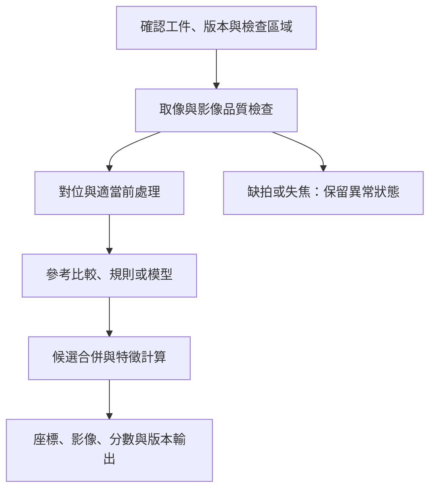

# 06　AOI 如何用 recipe 把影像變成缺陷候選？

拿到清楚的晶圓照片，還不等於知道哪裡有缺陷。產品本來就有許多明暗邊界、重複圖形和允許的變動，系統需要先知道「預期應該長什麼樣」。AOI，也就是自動光學檢測，透過取像、對位、分析與判定把這個比較流程做成可重複作業。

先備是[成像](05-optics-and-imaging.md)。以下為一般檢測流程，不宣稱倍利採用某個未公開演算法。

## Recipe 是可重複工作的條件集合

Recipe 常被譯成配方。它不只是一個「靈敏度」滑桿，還可能包含工件識別、檢查區域、對焦與照明、定位標記、參考圖樣、檢出閾值、排除區與輸出規則。改其中一項，就可能改變結果的意義。

例如同一個差異分數在銅線區可能重要，在非關鍵背景區則可接受。若只用全畫面單一閾值，可能一邊漏掉低對比缺口，一邊產生大量無害背景候選。分區策略能改善針對性，但也會增加設定、維護與漏設風險。

## 一次典型處理循環

首先確認工件與 recipe 對應。接著找定位標記，把影像與預期區域對準；必要時處理亮度不均、影像幾何或其他已知成像效應。再使用參考比較、幾何規則或學習模型找差異，將相近異常整理成候選，最後輸出座標與相關影像。

**圖 06-1｜自建 AOI 資料流程。** 不同產品可採用不同演算法與順序；共同要求是每個輸出仍可追溯到原始工件和條件。

## 選參考，就是選一組假設

與鄰近晶粒比較，利用的是相同設計應相似的假設。若同一缺陷在多個晶粒重複出現，比較可能不敏感；若正常差異本來就大，又可能產生很多假警報。與設計或理想模板比較則需要處理實際成像和設計圖之間的差別，不能假設圖形一定逐像素相同。

規則式方法可以針對線寬、連通性、面積等明確特徵判斷，但也要定義有效材料與成像條件。學習式方法則從資料取得特徵或決策邊界，仍依賴資料代表性。兩者可以組合，不應把「用了 AI」直接解讀成不需要 recipe 或工程維護。

## 四種看似缺陷的流程錯誤

**對位偏移：** 原本正常的所有邊界都對不上參考，候選突然充滿整片。先查位置與幾何對應，往往比放寬閾值合理。把閾值拉高可能暫時減少假警報，卻同時遮住真缺陷。

**照明漂移：** 亮度或色澤改變，使原本合適的比較範圍失效。若前處理為了消除差異而過度正規化，也可能抹掉真正的薄膜或表面異常，必須檢查演算法是否把目標訊號當成背景。

**排除區過大：** 為避免邊緣或接縫的假警報，把區域遮掉，報表變乾淨，但也不再檢查該處。排除區應有工程理由、批准紀錄和面積／位置追蹤，不能只在總候選數上看效果。

**版本混用：** 工件設計改了，機台仍載入舊 recipe；或同名 recipe 在兩台機器上內容不同。控制需要唯一版本識別與設定比對，單靠人員記得檔名不夠。

## Recipe 上線前怎麼確認？

以已知良品與代表性缺陷建立共同集合，先固定成像與參考，再調整判定。保留不同位置、批次與材料變化，分別報告召回、假警報、未檢查區以及處理時間。調參使用的資料與最終驗收集合應分開，避免調到只認得手上的樣本。

正式導入時還要驗證重跑一致性、不同機台差異、錯 recipe 的阻擋，以及失焦／缺圖時的輸出。若修改只是擴大一個遮罩，也應評估被移出的品質責任；變更規模小不代表風險一定小。

## 與倍利的連結

**已確認：** 倍利有光學檢測與嵌入式檢測的公開產品入口，功能範圍見[第 14 章](14-v5-product-evidence.md)。

**推論：** 驗收這些方案時，應索取可重複的設定與測試集合，並將 recipe 維護納入交付。

**待查：** 各產品參考方法、排除區管理、跨機匹配與版本控制實作。本章的流程不是對其專有軟體的反向推定。

## 理解檢查

1. 突然出現整片邊界假警報，為何不應先把閾值提高？
2. 把高假警報區遮掉，如何在報表中保留這個代價？
3. 兩台機器 recipe 名稱相同，還需要比對什麼？

??? note "參考推理"
    1. 可能是對位或成像漂移，調高閾值會掩蓋原因並增加漏檢。
    2. 列出排除區位置、面積、原因與未承擔的檢查任務，不能只報候選減少。
    3. 內容版本、光學與校正、設備設定、適用工件及共同樣本結果。

## 來源與下一步

流程與失敗情境為一般工程教學；已查閱廠商原始技術文件見[來源索引](appendix-sources.md)。接著區分[尺寸量測與 3D](07-metrology-and-3d.md)的驗收邊界。
