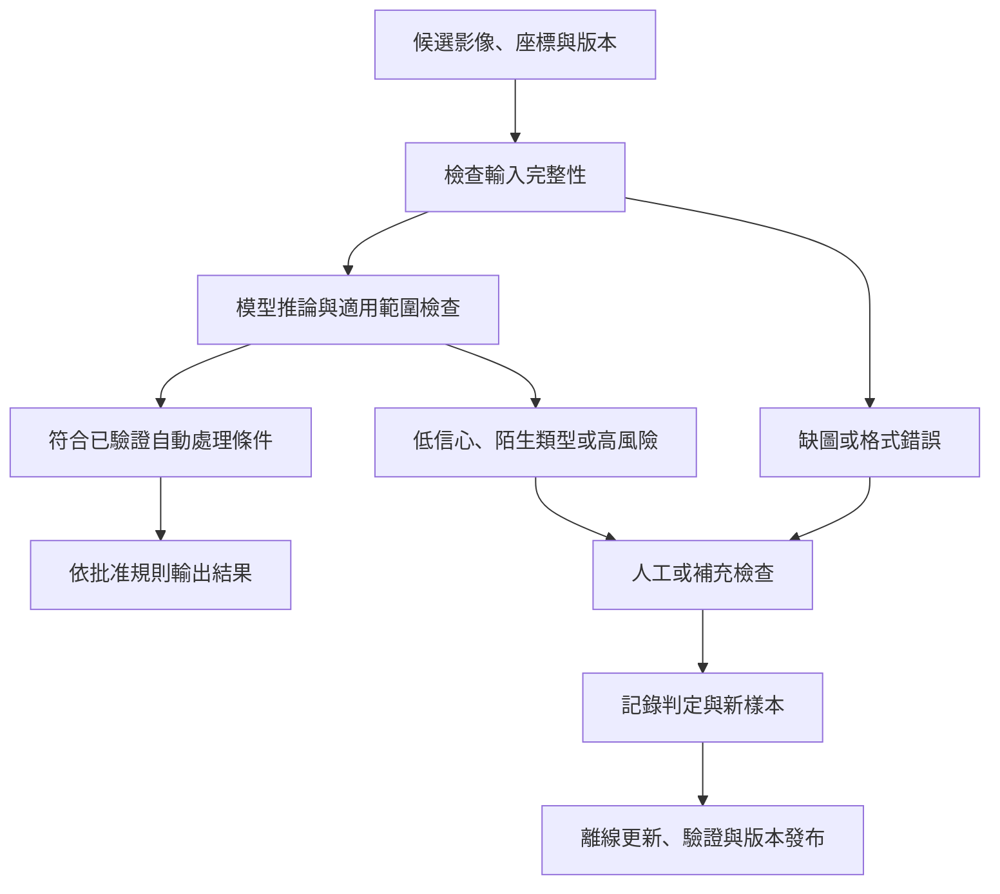

# 08　ADC 如何接手分類，又把哪些工作留給人？

檢測站每小時送來成千上萬張候選影像，工程師逐張開圖、分類與排除，可能成為整條流程的瓶頸。ADC，automatic defect classification，自動缺陷分類，將這部分工作交給規則或模型。它的價值要在「收到哪些候選、做了哪些決策、留下多少人工工作」的脈絡裡評估。

先備是[品質分母](04-defects-and-quality.md)與[AOI 流程](06-aoi-and-recipes.md)。本章聚焦學習式 ADC 的資料生命週期；流程是教學設計，不是倍利公開的專有架構。

## 模型前面先有資料契約

一張訓練影像至少應連到工件、站點、取像條件與標籤版本。若「橋接」有時表示確認的金屬連接，有時只是可疑亮線，模型就會學到混雜的目標。標籤定義應先指出可見條件、排除情況與證據不足時的處理方式。

不必把所有未知都硬塞入既有類別。陌生缺陷、成像失效與模稜兩可情況可以需要不同的待查狀態；是否分開標籤，依操作需求決定。把「未知」當成良品會縮小人工量，卻也把系統不懂的案例藏進放行集合。

## 從離線驗證到線上分流

首先建立標註與品質檢查流程，再按批次、時間或工件群組切分訓練、調整與測試集合。離線評估確認各類混淆和失敗案例後，可以先讓模型在線上產生結果，但保留原決策流程，觀察真實輸入、延遲與資料完整性。通過約定的品質條件後，再逐步賦予適當的自動處理範圍。

**圖 08-1｜自建 ADC 分流圖。** 低信心分流是一種可採設計；不能由這張圖推定倍利已實作每個功能，也不能推定模型可直接控制產品放行。

## 信心分數不是出廠保證

分類器輸出 0.99，可能只是模型內部的分數或特定條件下的機率估計。若沒有校準與測試，不能讀成「這張有 99% 機率判對」。[Guo 等人的研究](https://proceedings.mlr.press/v70/guo17a.html)討論了神經網路的信心校準問題，但不是倍利模型的測試。即使在舊資料校準良好，遇到新照明、新材料或新缺陷，可信程度仍可能改變。

閾值可以依類別與風險設定。低風險的常見外觀與會造成重大漏放的缺陷，不一定應共用同一個自動排除門檻。評估要同時看品質與自動處理覆蓋率：只自動處理最容易的少數影像，可能品質很好但節省有限；擴大覆蓋則需確認新增區域的風險。

## 人力節省要把工作算完整

**教學假設：** 每日 10,000 個候選，原本每個平均判讀 6 秒，純判讀工時是 60,000 秒，約 16.67 小時。導入後有 70% 不需逐張人工判讀，剩餘 3,000 個若仍平均 6 秒，判讀工時降為 5 小時。

但若每日新增 1 小時抽查、1 小時處理資料或模型維護，這個範圍內總工時為 7 小時，節省為 (16.67 − 7) / 16.67，約 58%。此例假設導入前後的其他共同工作相同，且不納入比較；58% 只針對所列工作範圍。實際剩下的難例也不一定仍只需 6 秒，批次工作不一定平均分布。不能把 70% 自動處理率直接當成 70% 全部人力節省。

若導入後候選總量變大或班次縮短，也應保持可比較的工作量。最好同時報每千候選工時、每日總工時、等待時間，以及同一驗收集合的漏放與誤殺結果。

## 漂移：舊答案為何漸漸不適用？

新產品圖形、製程材料、光源老化、相機維修與 recipe 更新，都可能改變輸入分布。缺陷本身的比例也會變。模型沒有改版，不代表服務條件仍一樣。

監測可包含輸入完整性、類別分布、分數分布、未知與人工轉送比例，以及持續抽查的真實判定結果。分數分布沒變也不能保證品質沒變，因此要保留取得標籤與調查異常的途徑。發現問題時應能縮小自動處理範圍、回到人工流程或回滾版本。

自動更新模型還涉及誰批准、哪些資料可用、如何重驗和如何重現歷史結果。不能只因為累積更多影像，就假設下一版一定更好；新資料可能包含錯標或來自不同任務。

## 與倍利的連結

**已確認：** 官方 AI 平台描述 AOI 資料接入與模型訓練、部署和結果管理等能力，詳細主張集中於[第 14 章](14-v5-product-evidence.md)。

**推論：** 這讓它可被放在既有取像設備之後評估，重點包含資料整合與持續運作，而不只是一個離線分類模型。

**待查：** 低信心分流、信心校準、漂移監測、回滾、放行權限與人力效益分母的實際配置。本章列的是應追問項目，並未替產品補寫未公開功能。

## 理解檢查

1. 70% 候選自動處理，為何可能只節省約 58% 工時？
2. 分數 0.99 還缺什麼，才能作為自動排除的依據？
3. 上線後模型檔沒改，為何仍需品質監測？
4. 新增訓練影像，何時可能讓模型變差？

??? note "參考推理"
    1. 抽查、維護和難例仍花時間，兩個比例的工作範圍不同。
    2. 明確的分數語義、校準、代表性測試、風險規則及適用範圍。
    3. 工件、照明、缺陷比例或流程可能改變。
    4. 錯標、任務混合、樣本偏差或更新未通過共同測試時。

## 來源與下一步

監測面向可對照 [Google 的模型生產化文件](https://developers.google.com/machine-learning/managing-ml-projects/production)，資料與閾值概念見 [TensorFlow 不平衡分類教學](https://www.tensorflow.org/tutorials/structured_data/imbalanced_data)。引用範圍見[來源索引](appendix-sources.md)；工時算例是教學自建。下一章把鏡頭從軟體拉回[獨立檢測整機](09-standalone-inspection.md)。
