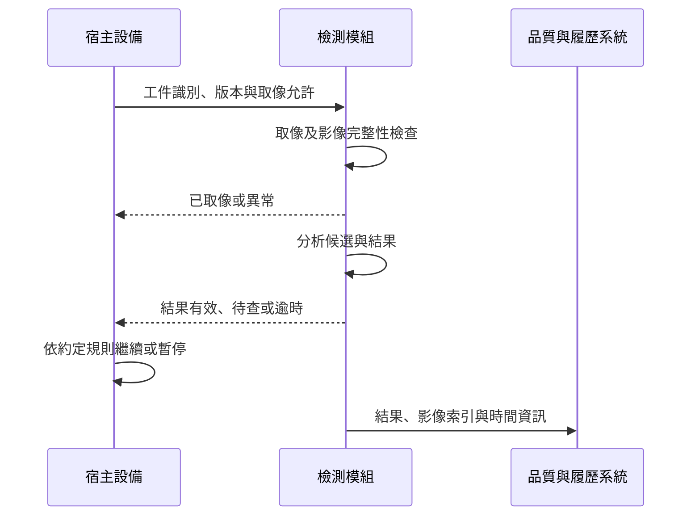

# 11　把 AOI 放進製程設備，難題改變在哪裡？

獨立檢測站可以讓工件停下來、調整姿態，再慢慢取得需要的影像。嵌入式檢測要分享宿主設備的空間、時序與環境，檢測動作可能只有一個很短的窗口。它的吸引力是更靠近製程，但代價是必須與宿主共同完成一個可靠循環。

先備：[AOI](06-aoi-and-recipes.md)與[整機](09-standalone-inspection.md)。本書這裡的 Inline 指嵌入製程設備的情境；其他廠商也可能用 inline 指產線內的獨立站，閱讀時要先核對部署位置。

## 誰決定何時可以拍照？

宿主知道工件何時到位、機構是否停止、當前製程狀態以及是否允許動作。檢測模組知道曝光、影像與判定是否完成。兩邊需要一套明確的交接，不能只靠大致相同的等待時間。

**圖 11-1｜自建時序示例。** 取像與分析是否可重疊、宿主何時必須等待，需由實際製程風險決定；此圖不代表倍利公開接口或自動放行邏輯。

## 加入檢測後，節拍怎麼算？

**教學假設：** 原循環 10 秒，其中有一個本來就存在的 2 秒等待窗口。若檢測必須串行使用額外 3 秒，循環成為 13 秒；理想每小時循環數從 360 變成約 277，下降約 23.1%。這個比例不是 3 / 10，而是產能從 360 到 3600 / 13 的變化。

如果 3 秒作業中有 2 秒能可靠地放進原等待窗口，新增時間才可能降為 1 秒，循環變 11 秒。但這要求窗口確實可用、工件姿態合適、照明不干擾製程，而且結果能在決策期限前準備好。不能只看到 CPU 可平行運算，就把所有檢測時間視為零。

長尾延遲也很重要。平均 1 秒的分析，若偶爾要 8 秒，而宿主每次最多等 2 秒，便會反覆逾時。驗收需看延遲分布、最忙負載與逾時後處理，不能只看平均。

## 機內環境會改變影像條件

振動、空間遮擋、污染、溫度和可安裝角度，可能讓實驗室光路不適用。保護窗若累積殘留物，背景會逐漸改變；清潔與維護是否需要停整台宿主，則影響可用率。

取像位置也可能只看見部分面向。若關鍵缺陷位在被夾持或朝下的位置，嵌入式模組不能因為「就在製程裡」而自動看見。必要時仍需搭配其他站點，品質地圖應標明每個位置由誰負責。

## 失效隔離要先定義

當模組失去回應，宿主應停止、保留工件、轉人工或切換到其他受控路徑，要依製程風險與批准流程決定。繼續運行不能把未檢查工件記成正常檢查完成；全部停機也可能造成其他製程損失。選項要在導入前寫成可測試的狀態，而不是等故障時臨時猜。

責任切分至少包含觸發、工件身分、照明、機構、分析、結果有效性、復歸與維護。若宿主版本更新改變到位時序，檢測模組也可能需要重驗；反過來，模型增加運算量也可能破壞宿主等待條件。

## 與倍利的連結

**已確認：** 倍利公開嵌入式檢測產品入口，定位為搭載製程設備的檢測方案；具體來源見[第 14 章](14-v5-product-evidence.md)。

**推論：** 它的評估重點應包含宿主整合與時序責任，不能直接用獨立晶圓整機的規格補齊。

**待查：** 公開資料尚不足以固定宿主、工件、接口、節拍與量產案例。本章所有具體時序與數字均為假設，不能當成產品實績。

## 理解檢查

1. 模型分析可平行，為何檢測仍可能增加宿主節拍？
2. 為何平均延遲不夠驗收？
3. 模組故障後繼續生產，資料至少必須保留什麼？

??? note "參考推理"
    1. 取像、姿態、光學窗口或決策等待仍可能在關鍵路徑。
    2. 逾時由長尾與最忙負載決定，少數慢例就可能影響循環。
    3. 受影響工件、未檢查／待查狀態、起訖時間、批准處置與補檢需求。

## 來源與下一步

部署定位以官方產品頁為準，見[來源索引](appendix-sources.md)；時序圖與算例為自建。下一章沿著資料走到[座標與追溯](12-data-and-traceability.md)。
