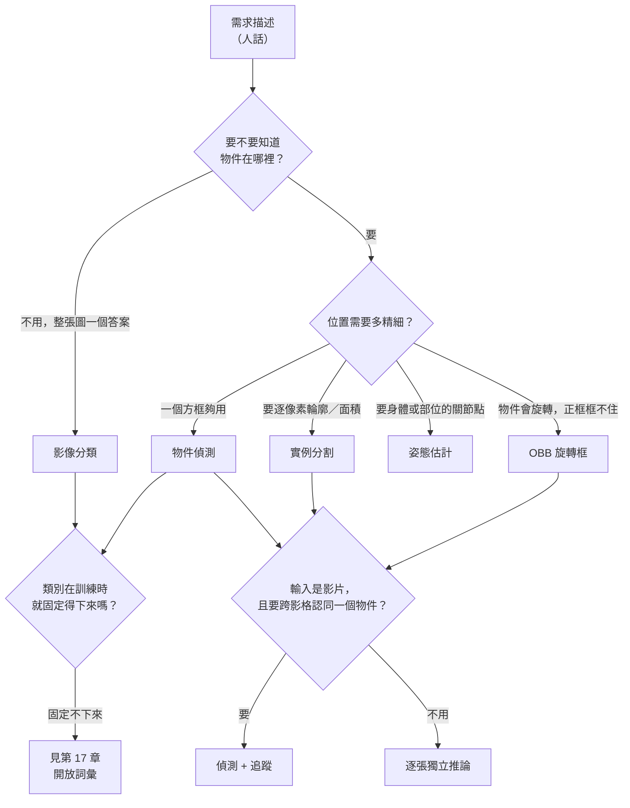

# 01 任務地圖：這個問題適合用 YOLO 嗎？

**查核日期：2026-09-08。**本章所有「來源明述」的引用皆以此日為準；Ultralytics 文件為動態頁面，發布日期不明。

## 這一章要解決什麼

你手上有一個需求：「幫我數一下產線上有幾片晶圓」「監控畫面有人闖入要告警」「判斷這張照片是不是不良品」。在打開終端機安裝任何套件之前，要先回答三個問題：

1. 這個需求對應到哪一種電腦視覺任務？輸入是什麼、輸出是什麼？
2. 這個任務的驗收條件怎麼寫才算數？
3. 模型輸出到手之後，離「系統可以上線」還差多少？

這三個問題答錯，後面的資料收集、標註、訓練全部會做白工。本章不寫任何模型原理，只做需求到任務的對應。

## 章內頁面

| 頁面 | 回答的問題 |
|---|---|
| [任務的輸入輸出契約](task-io.md) | 分類、偵測、實例分割、姿態、OBB、追蹤各自吃什麼、吐什麼？ |
| [從需求到驗收條件](requirements-and-acceptance.md) | 「準確一點」不是驗收條件。怎麼寫成可以判定通過或失敗的句子？ |
| [模型能力不等於系統功能](model-vs-system.md) | 模型會畫框，不代表系統會「計數」或「告警」。中間缺的那一段是什麼？ |

## 決策流程

上圖的最後一支：如果你連「要偵測哪些類別」都無法在訓練前列完（例如使用者會臨時輸入新名詞），那不是本書 01–16 章的路線，請直接看 [../17/index.md](../17/index.md)。

## 先備與後續

- 先備：無。本章是全書起點。
- 讀完接 [../02/index.md](../02/index.md)（把任務跑起來），驗收條件裡的數字定義接 [../06/index.md](../06/index.md)。

## 來源導讀

| 來源 | 已讀範圍 | 解決什麼問題 | 讀哪段 | 限制 |
|---|---|---|---|---|
| [Ultralytics Tasks](https://docs.ultralytics.com/tasks/)（動態頁，發布日不明；查核 2026-09-08） | 頁面主體：七種任務的名稱與一句話定義 | 確認框架官方承認哪些任務、各自的輸出型態 | 開頭的任務清單與各任務的輸出描述 | 只說「支援」，不說各任務在你的資料上能達到什麼水準；效能數字均為供應者自報 |
| [Ultralytics Predict Mode](https://docs.ultralytics.com/modes/predict/)（動態頁，發布日不明；查核 2026-09-08） | 支援輸入來源表、推論參數、`Results` 物件屬性 | 確認每種任務對應到 `Results` 的哪個欄位 | 「Results Object Structure」一節 | 屬性名稱會隨版本變動，實際以你安裝的版本為準 |

**未實測聲明**：本章不含任何在本機執行的模型輸出。所有輸出型態描述來自上述文件的敘述，不是實跑結果。
