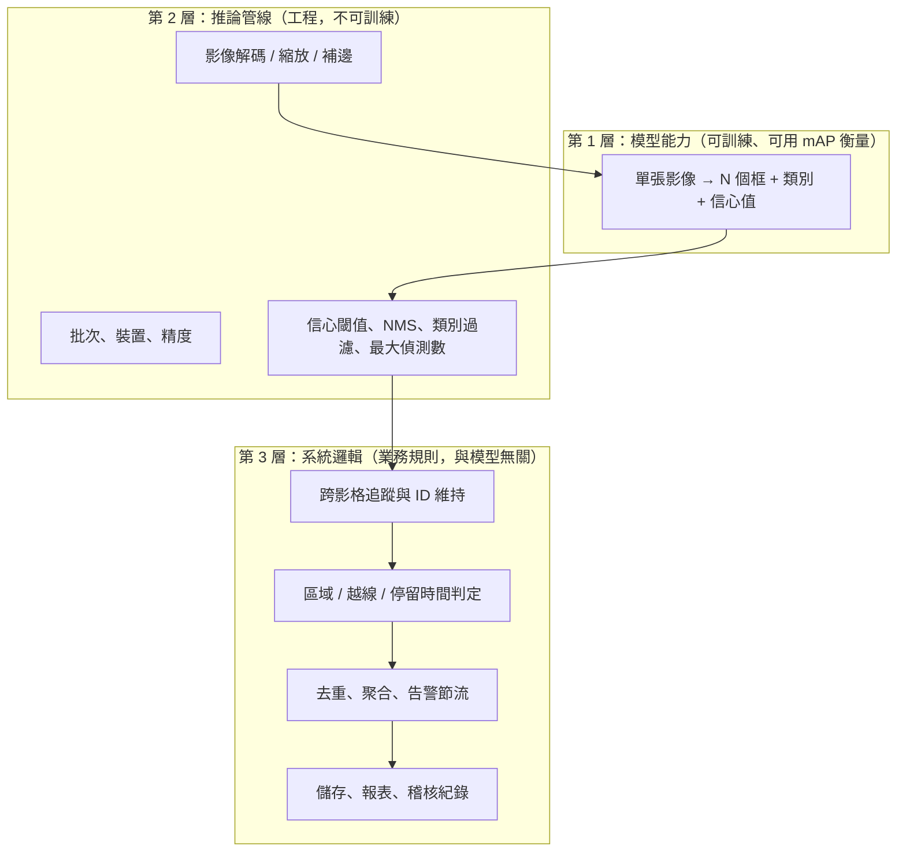

# 模型能力不等於系統功能

## 情境

你跑完第一次推論，畫面上的人都被框起來了，信心值 0.9 以上。你截圖傳給主管，說「模型好了」。

主管問：「那超商幾點人最多？」

模型答不出來。模型只回答了「這一張影像上有哪些框」。從「有哪些框」到「幾點人最多」，中間隔著解碼、追蹤、去重、時間聚合、儲存與報表——每一段都可能出錯，而且都不在模型裡。

這一頁要建立的判斷力是：**看到一個需求，能立刻分出哪一段是模型、哪一段是系統。**

## 概念：三層責任

**第 1 層**是模型。它的能力用 [../06/index.md](../06/index.md) 的指標衡量，改善方法在 [../14/index.md](../14/index.md)。

**第 2 層**是推論管線。這一層不需要訓練，但錯了照樣讓結果全歪——例如補邊後忘記把座標轉回原圖（見 [../03/index.md](../03/index.md)），或是 `max_det` 上限截掉了密集場景的一半物件（**來源明述**：預設 `max_det=300`）。

**第 3 層**是系統邏輯。這一層完全是你寫的普通程式碼：if、計數器、時間窗。它沒有 mAP，只有你自己定的規則正不正確。

**多數上線失敗發生在第 2、3 層，但多數人只在第 1 層投入時間。**

## 具體例子：四個需求的責任歸屬

| 需求 | 第 1 層（模型） | 第 2 層（管線） | 第 3 層（系統邏輯） |
|---|---|---|---|
| 「今天進來幾個人」 | 偵測 person | conf 閾值 | 追蹤 + 越線方向判定 + 每個 ID 只計一次 |
| 「有人在禁區停留超過 30 秒告警」 | 偵測 person | conf 閾值 | 追蹤 + 多邊形內判定 + 連續影格計時 + 告警節流 |
| 「這批零件的不良率」 | 偵測 defect | 影像來源同步 | 每個零件對應哪些框（分組）+ 比例計算 |
| 「車牌是多少」 | 偵測車牌框 | 裁切、透視校正 | OCR（**另一個模型**）+ 格式校驗 + 資料庫比對 |

最後一列值得注意：偵測模型負責找到車牌**在哪**，完全不負責車牌**是什麼字**。字元辨識是另一個獨立的模型與另一組驗收條件。需求說「車牌辨識」時，這是兩個專案。

## 具體步驟：拿到需求時的三個提問

1. **「輸出的每一筆，對應到什麼實體？」**
   模型輸出對應「這一影格的一個框」。需求若對應「一個人一整天的行為」，中間就必然需要追蹤與聚合。

2. **「同一個東西被看到兩次，會發生什麼事？」**
   如果會被算兩次，就需要去重機制（追蹤 ID、時間窗、空間 IoU 去重）。這是第 3 層。

3. **「模型完全正確的情況下，需求就滿足了嗎？」**
   假設模型 100% 正確（每個框都完美），需求還做不到的部分，就是第 2、3 層的工作量。這一題會逼出所有被忽略的工程。

## 常見故障與決策限制

**故障 1：以為提升 mAP 能解決計數誤差。** 計數誤差主要來自 ID 切換與越線邏輯，不是框準不準。把時間投在換更大的模型上，通常不會改善計數。

**故障 2：告警沒有節流。** 一個人在鏡頭前站 10 秒 = 300 影格 = 300 個框。沒有節流就是 300 封告警信。這與模型品質無關。

**故障 3：把追蹤當成模型能力。** 追蹤是套在偵測結果上的演算法，換 tracker 或改參數，ID 品質就會變，但模型完全沒動。因此「追蹤準確率」不能寫進模型的驗收條件，要另立一條，見 [../16/index.md](../16/index.md)。

**故障 4：`max_det` 與 `classes` 過濾被忽略。** 推論參數會直接裁掉輸出。密集場景（演唱會人群、電路板元件）遇到 `max_det` 上限時，症狀是「模型好像有上限」，實際上是管線設定。

**限制：第 3 層沒有現成的 mAP。** 系統邏輯的正確性只能靠你自己設計的端到端測試——例如取十段已知答案的影片，比對系統輸出的計數與人工計數。這份端到端測試要和模型測試集分開建立與維護。

## 來源導讀

| 來源 | 已讀範圍 | 讀哪段 | 限制 |
|---|---|---|---|
| [Ultralytics Predict Mode](https://docs.ultralytics.com/modes/predict/)（動態頁，發布日不明；查核 2026-09-08） | 推論參數（含 `conf`、`iou`、`max_det=300`、`classes`、`stream`）、`Results` 屬性、`boxes.id` 在追蹤時可用 | 「Key Inference Arguments」、「Boxes Properties」 | 文件只描述參數行為，不涉及系統設計；預設值可能隨版本改變 |
| [Ultralytics Track Mode](https://docs.ultralytics.com/modes/track/)（動態頁，發布日不明；查核 2026-09-08） | 本輪僅讀入口概述，未逐段細讀 | 追蹤器選項與 ID 語意 | **本書記為部分已讀**；追蹤細節請以 [../16/index.md](../16/index.md) 為準，該章需再讀原始追蹤論文 |

本頁的三層責任模型與三個提問為**工程建議**，是本書提出的分析框架，無官方來源。

**未實測聲明**：本頁無任何本機執行結果。
