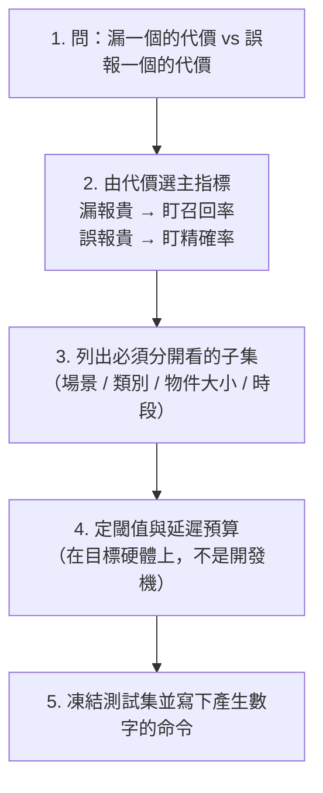

# 從需求到驗收條件

## 情境

客戶說：「我要一個準一點的模型。」

三個月後你交出一個 mAP50-95 = 0.62 的模型。客戶說：「還是會漏掉最重要的那種瑕疵。」你沒有辦法反駁，因為當初沒有人定義過「重要」跟「準」。

這一頁講怎麼把一句人話，變成一組**可以判定通過或失敗**的句子。這件事必須在收資料之前做完，因為驗收條件會直接決定你要收哪些資料、標哪些類別。

## 概念：驗收條件的六個欄位

一條合格的驗收條件必須同時指定：

1. **在哪個資料集上**：一份凍結的測試集，且這份測試集在訓練與調參過程中從未被看過（見 [../04/index.md](../04/index.md)）。
2. **哪個指標**：召回率？精確率？mAP？漏檢數？計數誤差？（定義見 [../06/index.md](../06/index.md)）
3. **在什麼閾值下**：同一個模型，conf=0.25 與 conf=0.5 的召回率可能不同。
4. **切分到什麼粒度**：整體達標但「夜間場景」全掛，多半不算通過。
5. **數字門檻**：一個具體的數。
6. **延遲與資源上限**：準確度沒有上限地換算算力是沒有意義的。

少任何一欄，這條件都可以被事後重新解釋。

## 具體例子：把一句話改寫三次

**第 0 版（客戶原話）**
> 系統要能可靠偵測入侵者。

**第 1 版（加了指標，還不夠）**
> 系統偵測人的 mAP50 要大於 0.8。

問題：mAP 是把所有信心閾值掃過一遍的綜合分數，無法由 mAP 推出指定部署閾值下的召回率。而且沒說在哪個資料集上。

**第 2 版（可驗收）**
> 在 2026-08 凍結的測試集 `intrusion-test-v3`（1,204 張，含日間 700 / 夜間 504，來自 6 支未參與訓練的相機）上：
>
> - 以 conf=0.35、傳統 greedy NMS 的 iou=0.7 推論，評估採同類別一對一匹配且 IoU≥0.5，類別 `person` 的**召回率 ≥ 0.95**，且**夜間子集召回率 ≥ 0.90**。
> - 每張圖平均誤報數 ≤ 0.1（即 1,204 張圖總誤報 ≤ 120）。
> - 在目標硬體（Jetson Orin Nano，FP16，1920×1080 輸入）上，端到端 P95 延遲 ≤ 120 ms。
> - 此為假想評估流程的規格；本書不提供 eval.py，不可直接執行。`--weights` 應為權重檔案路徑，SHA256 另記。

第 2 版可以被判定為通過或失敗，也可以被下一個接手的人重現。這是**工程建議**的寫法範本，不是任何官方文件規定的格式。

## 具體步驟：五步寫出驗收條件

**第 1 步是全部的關鍵。** 兩個問題就能問出來：

- 「漏掉一個會發生什麼事？」——安全告警漏掉一次可能是事故；電商商品標籤漏掉一次只是少一個推薦。
- 「誤報一個會發生什麼事？」——保全每晚被叫醒二十次，系統三天內就會被關掉。

代價不對稱，指標就不對稱。**不要預設一定要用 mAP**，mAP 適合比較模型好壞，不一定適合當上線門檻。

**第 3 步的子集清單，就是你之後的資料收集清單。** 如果你寫下「夜間子集召回率 ≥ 0.90」，那你就必須去收夜間資料。這個順序不能顛倒——先寫驗收條件，再照著條件收資料，見 [../04/index.md](../04/index.md)。

## 常見故障與決策限制

**故障 1：拿驗證集當驗收依據。** 驗證集在調參過程中被看過幾十次，數字已經被你的選擇過度擬合了。驗收必須用一份完全隔離的測試集。

**故障 2：只看整體平均。** 一個 12 類的偵測任務，整體 mAP 0.75 可能是 11 個常見類別 0.82、最關鍵的稀有類別 0.05 平均出來的。整體指標會掩蓋掉最重要的失敗。

**故障 3：把評估閾值當部署閾值。** mAP 的計算會掃過所有信心值，但上線只用一個閾值。這兩件事要分開定，見 [../06/index.md](../06/index.md)。

**故障 4：延遲在開發機量。** 開發用的桌上型 GPU 與現場的邊緣裝置差距可能是一個數量級，且現場還有解碼、前處理、後處理與網路的成本。延遲條件必須綁定硬體型號、精度與輸入解析度。

**限制：驗收條件只在測試集的分布內有效。** 測試集裡沒有雨天，任何數字都不能宣稱雨天可用。這不是模型的缺陷，是評估範圍的邊界，寫驗收報告時必須明講。

## 來源導讀

| 來源 | 已讀範圍 | 讀哪段 | 限制 |
|---|---|---|---|
| [scikit-learn 常見陷阱：資料洩漏](https://scikit-learn.org/stable/common_pitfalls.html#data-leakage)（查核 2026-09-08，頁面對應 stable 版文件，發布日不明） | 資料洩漏定義、「never call fit on the test data」原則、特徵選擇洩漏範例 | 「Data leakage」定義段 | 例子是表格資料與 scikit-learn API；本書把原則移植到影像資料切分，屬**工程建議**的類比，非原文明述 |
| [Ultralytics Predict Mode](https://docs.ultralytics.com/modes/predict/)（動態頁，發布日不明；查核 2026-09-08） | 推論參數預設值：`conf=0.25`、`iou=0.7`、`imgsz=640` | 「Key Inference Arguments」 | 預設值隨版本可能改變；驗收條件要寫死自己用的值，不要依賴預設 |

本頁的驗收條件寫法、五步流程、代價不對稱的判斷法皆為**工程建議**，來自實務慣例，無單一權威來源可引。指標的精確定義不在本頁，見 [../06/index.md](../06/index.md)。

**未實測聲明**：第 2 版範例中的所有數字（1,204 張、0.95、120 ms 等）是**虛構的格式示範**，不是任何實測結果。
