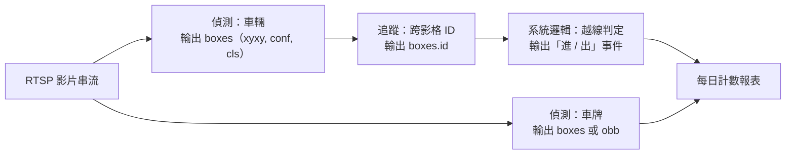

# 任務的輸入輸出契約

## 情境

你被指派一個需求：「停車場出入口，統計每天進出幾台車，並記錄車牌位置。」

如果你直接開始收資料，很可能收完才發現：計數需要追蹤（不然同一台車停在畫面裡三十秒會被算三十次），車牌位置需要偵測（不是分類），而「車牌是斜的」可能需要旋轉框。三個不同的任務，三種不同的標註格式，三份不同的驗收條件。

先把任務的**輸入輸出契約**寫清楚，是避免重做的最便宜手段。

## 概念：契約由三件事構成

一個任務的契約 =（輸入是什麼）+（每個樣本產出幾筆、每筆長什麼樣）+（標註要提供什麼）。

以下表格中，「輸出欄位」一欄的名稱來自 Ultralytics `Results` 物件的屬性（**來源明述**，見本頁末來源導讀）。

| 任務 | 輸入 | 模型輸出（每張圖） | `Results` 欄位 | 標註需要提供 |
|---|---|---|---|---|
| 影像分類 | 一張圖 | 整張圖一組類別機率 | `probs` | 每張圖一個類別（通常用資料夾名） |
| 物件偵測 | 一張圖 | N 個方框，每個帶信心值與類別 | `boxes` | 每個物件一個軸對齊方框 + 類別 |
| 實例分割 | 一張圖 | N 個實例，每個帶方框 + 逐像素遮罩 | `masks`（+`boxes`） | 每個物件一條多邊形輪廓 + 類別 |
| 姿態估計 | 一張圖 | N 個實例，每個帶一組關節點 | `keypoints`（+`boxes`） | 每個物件的關節點座標 + 可見性 |
| OBB 旋轉框 | 一張圖 | N 個帶角度的方框 | `obb` | 每個物件一個旋轉框 |
| 追蹤 | **影片／串流** | 每影格的偵測結果 + 跨影格 ID | `boxes.id` | 偵測標註 +（評估時）跨影格身分標註 |

三個常被忽略的細節：

**N 是 0 也是合法輸出。** 一張沒有任何目標的圖，偵測模型會回傳空的 `boxes`。你的下游程式必須能處理長度為 0 的結果，這是最常見的第一個 crash。

**追蹤的輸入是影片，不是圖片。** 追蹤沒辦法在單張圖上定義——沒有前一影格，就沒有「同一個」的概念。`boxes.id` 只有在追蹤模式下才會有值（**來源明述**：`id` 屬性在 `is_track` 為 True 時可用）。

**分割與姿態的輸出「包含」偵測框。** 這代表你不必為了同時要框和輪廓而跑兩個模型；但反過來，一個純偵測的權重不會憑空長出 `masks`。任務是在訓練時決定的。

## 具體例子：把停車場需求拆開

原始需求：「統計每天進出幾台車，並記錄車牌位置。」

拆成三個契約：

- **契約 1（車輛偵測）**：輸入 1920×1080 影格，輸出 0..N 個 `class=car` 的方框。標註：每台可見車一個框。
- **契約 2（追蹤）**：輸入連續影格，輸出每個框一個穩定的 `id`。注意：追蹤品質不是偵測模型的屬性，換 tracker 就會變（見 [../16/index.md](../16/index.md)）。
- **契約 3（車牌）**：如果車牌在畫面中常常是斜的，軸對齊框會框進大量背景；此時 OBB 的輸出契約才是對的。這是**工程建議**，不是來源明述——要不要用 OBB，取決於你資料裡車牌的實際傾斜分布，收完前三百張圖才知道。

而「進 / 出」這個字眼，在上圖裡完全不是模型輸出，是 D 那一格的系統邏輯。這點見 [模型能力不等於系統功能](model-vs-system.md)。

## 常見故障與決策限制

**故障 1：用分類做偵測。** 「判斷畫面有沒有人」看起來像分類，但如果之後要加「人在哪個區域」，分類的標註（一張圖一個標籤）完全無法升級成偵測，要全部重標。**工程建議**：若未來一年內可能需要位置資訊，一開始就標框；框可以退化成分類標籤，反之不行。

**故障 2：用偵測做計數。** 偵測輸出的 N 是「這一影格有幾個」，不是「總共來過幾個」。沒有追蹤與越線邏輯，把每影格的 N 加總會得到一個荒謬的大數字。

**故障 3：用實例分割做面積量測而沒有比例尺。** 遮罩給的是像素數，不是平方公分。像素轉實體單位需要相機標定，那是模型以外的工程。

**限制 1：一個權重通常只服務一個任務。** 模型總覽頁列出的多任務是指「這個模型家族有對應的變體」，不代表同一個權重檔同時吐出框、遮罩與關節點。實務上你會看到 `-seg`、`-pose`、`-obb` 之類的檔名後綴來區分。**注意**：檔名後綴與權重任務對應，請直接查 [YOLO11 模型表](https://docs.ultralytics.com/models/yolo11/)列出的 `yolo11n-seg.pt`、`yolo11n-pose.pt`、`yolo11n-obb.pt`、`yolo11n-cls.pt` 這組實際檔名（**來源明述**）。

**限制 2：類別必須在訓練前列完。** 標準偵測模型的輸出維度在訓練時就固定了。需求若是「使用者輸入任意名詞就要找得到」，屬於開放詞彙，見 [../17/index.md](../17/index.md)。

## 來源導讀

| 來源 | 已讀範圍 | 讀哪段 | 限制 |
|---|---|---|---|
| [Ultralytics Tasks](https://docs.ultralytics.com/tasks/)（動態頁，發布日不明；查核 2026-09-08） | 七種任務清單：偵測、實例分割、語意分割、深度估計、分類、姿態、OBB，各一句定義 | 任務清單與「Task Outputs」段 | Tasks 頁用來對照各任務輸出；權重與任務對應請看 [YOLO11 模型表](https://docs.ultralytics.com/models/yolo11/) |
| [Ultralytics Predict Mode](https://docs.ultralytics.com/modes/predict/)（動態頁，發布日不明；查核 2026-09-08） | 輸入來源表（圖片／影片／目錄／glob／RTSP／webcam）、`Results` 屬性清單、`Boxes` 屬性清單 | 「Results Object Structure」與「Boxes Properties」 | 屬性名稱隨版本變動；`id` 僅在追蹤時存在 |
| [Ultralytics YOLO11](https://docs.ultralytics.com/models/yolo11/)（動態頁；頁面自述 YOLO11 於 2024-09-10 釋出；查核 2026-09-08） | 模型變體檔名清單 | 變體表格 | 檔名清單屬該版本，其他版本需各自查核 |

**未實測聲明**：本頁沒有任何本機執行結果，全部輸出型態描述來自文件敘述。
