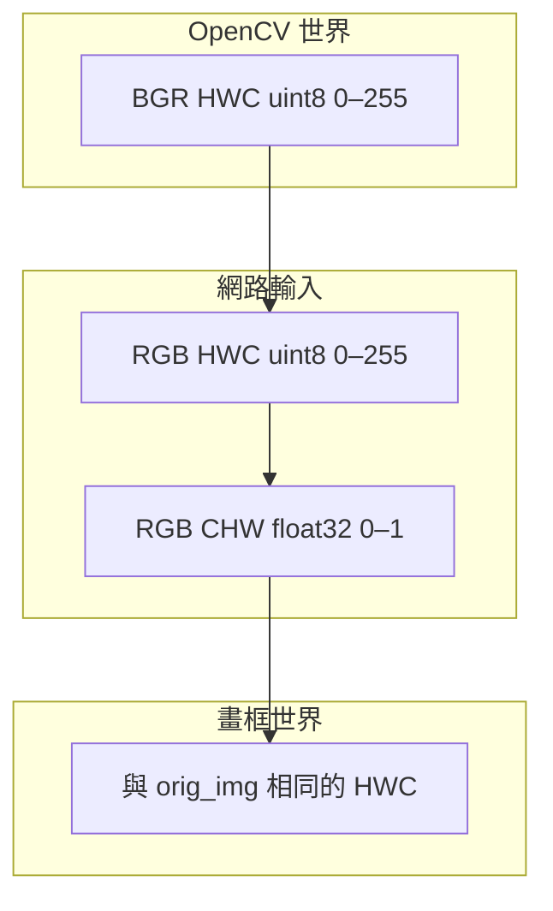

# 影像張量契約：RGB／BGR、HWC／CHW、dtype 與數值範圍

YOLO 工程裡，框座標出錯有一半其實不是幾何公式寫錯，而是「這份 ndarray 到底是誰」沒有寫死。同一塊記憶體若被解釋成 BGR 卻當 RGB 正規化，或把 HWC 當成 CHW 送進卷積，模型輸出看起來仍像框，只是對的是另一個顏色世界，或被轉置的空間。本章只收像素張量契約：通道順序、記憶體佈局、dtype、數值範圍。幾何上的 letterbox 與框往返見 [letterbox.md](letterbox.md)。

## 情境：產線上並存的四種入口

同一個推論服務裡，下面四條入口經常同時存在，而且各自「看起來都合理」：

1. OpenCV `imread`／`VideoCapture`：BGR、HWC、`uint8`、範圍 0–255。工業相機與監控取流幾乎都落在這裡。
2. PIL 或多數 torchvision 讀圖：RGB、HWC、`uint8`。若 Ultralytics 入口吃到 `PIL.Image`，通道已經與 OpenCV 相反。
3. 網路真正吃進去的張量：RGB、CHW、`float32`，常見路徑會除以 255 落到 0–1。
4. 畫框與存檔：必須回到與 `orig_img` 相同的通道與 HWC。否則紅藍對調會被值班人員說成「模型偏色」。

契約若不放在模組邊界，每一層都會「順便轉一次」。偶數次轉換白天場景幾乎看不出來，奇數次轉換會讓紅燈與藍色警示燈對調。這類故障不會丟 exception，線上最難查。

工程決策因此很窄：**整條管線只允許一個地方改通道、一個地方改佈局、一個地方改 dtype／範圍。** 其餘層只准檢查、不准轉換。

## 原理：四軸必須同時成立

把一張圖拆成四個獨立軸。缺任何一軸，後續的 `x1,y1,x2,y2` 都沒有定義。

**顏色軸（RGB 對 BGR）。** OpenCV 的通道 0 是藍。Ultralytics 的常見 Python 路徑在送進網路前會把 OpenCV 影像轉成 RGB。服務層若先轉 RGB、套件內部再轉一次，通道會被轉回 BGR。決策是選定唯一的「套件入口格式」，其餘路徑禁止再轉。以 numpy 餵 `predict` 時，應以你鎖定套件的文件為準來假設 BGR 或 RGB，不要憑記憶跨大版本複製部落格。本章不綁定發行版本號，也不給任何精度數字。

**佈局軸（HWC 對 CHW）。** 攝影機與 OpenCV 是 `(H, W, C)`。PyTorch 模組吃 `(C, H, W)`，batch 再疊成 `(N, C, H, W)`。`(3, 640, 640)` 與 `(640, 640, 3)` 元素個數相同，錯看成對方時往往不會立刻爆掉，只會讓「高」被當成通道，或讓框的 y 對到錯誤維度。檢查契約時要印 `shape` 以及「通道維度下標」，不要只印 `nbytes`。

**dtype 軸。** `uint8` 不能直接當線性空間做完所有前處理還期望與 float 路徑一致。更致命的是：`uint8` 減法會 underflow；NumPy 上對 `uint8` 做 `/ 255` 若沒升型，會變成整數除法，整張圖變 0。正規化必須在 `float32`（或你匯出時文件寫明的 dtype）上做。

**範圍軸。** 合法範圍通常是 0–255 或 0–1，二者不可混用。少數 ONNX／TensorRT 路徑會再減 ImageNet mean、除 std，那已經超出 YOLO 預設的「除以 255」。匯出與推論必須共用同一份前處理；不要在引擎側再除一次 255。範圍錯時，偵測不是完全沒框，而是置信度整體崩潰，或只剩高對比物體。

四軸可以畫成一條只允許單向走的狀態機：



## 工程決策：轉換只放在邊界

1. **相機適配層**負責 BGR／RGB。模型層禁止再猜通道。
2. **幾何層**（[letterbox.md](letterbox.md)）只接受已對齊顏色的 HWC，輸出網路尺寸的 HWC，以及 `(scale, pad_left, pad_top)` 三元組。幾何層不准做 `/255`。
3. **推論層**只做 HWC→CHW、轉 `float32`、除以 255。推論層不准改寬高。
4. **後處理層**使用官方 `Results.xyxy`（已是原圖座標），畫在 `orig_img` 上。不要把 CHW 張量 `transpose` 回 HWC 之後，還用 640×640 的畫布去疊原圖框。

若你不用 Ultralytics、自管 ONNX Runtime，把上述第 2、3 步收成一份 `preprocess()`，幾何用 [self_check.py](self_check.py) 鎖死。顏色用純紅圖當探針：BGR 應為 `(0, 0, 255)`，轉 RGB 後 `(255, 0, 0)`；CHW 上 `tensor[0]` 的均值應接近 1、`tensor[1]` 與 `tensor[2]` 接近 0。探針失敗就停，不要上線。

## 命令與數值例子

以下命令用來對照該讀哪些欄位。

```bash
# 檢查 OpenCV 讀圖契約
# python -c "import cv2; im=cv2.imread('frame.jpg'); print(im.shape, im.dtype, im.min(), im.max())"
# 閱讀方式：shape 應為 (H, W, 3)、dtype uint8、範圍落在 0–255
```

```python
# 示意「先升型再除」；勿把結果當成實測
# x = im.astype("float32") / 255.0
# chw = x.transpose(2, 0, 1)  # HWC -> CHW
```

對 1920×1080×3 的 `uint8`，HWC 元素數為 `1920 × 1080 × 3 = 6,220,800`。改成 CHW 後元素數不變。letterbox 到 640×640 之後變成 `640 × 640 × 3 = 1,228,800`。元素數變化只來自幾何，不來自通道。若你看到 `shape=(3, 1920, 1080)` 被當成 HWC 去 pad，佈局軸已經壞了，後面任何框公式都無意義。

對照檢查：通道維度的長度必須是 3（或你的模型文件寫明的 C）。`640` 出現在第 0 軸還是第 1 軸，決定這是 CHW 還是 HWC，沒有第三種「差不多」。

## 故障排查

| 症狀 | 先查哪一軸 | 動作 |
| --- | --- | --- |
| 紅藍對調、黃綠互變 | 顏色 | 數轉換次數；打純紅探針 |
| 能跑但框像轉置、寬高比荒謬 | 佈局 | 印 `shape`，確認 `C==3` 的下標 |
| 輸入全黑、置信度歸零 | dtype／範圍 | 是否對 `uint8` 做了整數 `/255`；是否重複除 255 |
| 只有極亮物體被偵到 | 範圍 | 是否誤加 ImageNet mean／std |
| 畫框整體偏移、數字卻「像對的」 | 不是本章 | 轉 [letterbox.md](letterbox.md)，查二次還原與 rect pad |

排查時不要先調 `conf`。閾值只改變「畫多少框」，修不了通道與佈局。也不要先換更大的權重：權重不負責把 BGR 解釋成 RGB。

## 限制

- 本契約不涵蓋 Bayer、YUV、NV12。那些必須在相機適配層就轉成 BGR 或 RGB，禁止讓 YOLO 前處理猜 raw。
- 灰度 `shape=(H, W)` 缺少通道維。複製成 3 通道時要 stack 同一平面三次，不要把某一空間維當成通道湊數。
- 官方套件內部實作可能隨發行變更。鎖定你所用套件的 [LetterBox 參考頁](https://docs.ultralytics.com/reference/data/augment/) 與 [Results 參考頁](https://docs.ultralytics.com/reference/engine/results/)，不要複製網路上 `cv2.dnn.blobFromImage` 的 swapRB／scalefactor 組合當權威。
- 本章不給 mAP、FPS、也不宣稱「BGR 一定會掉幾點」。那是實驗結果，不是契約。

## 官方來源導讀

1. 打開 [ultralytics.data.augment](https://docs.ultralytics.com/reference/data/augment/)，定位 `LetterBox`。它處理的是 resize 與 pad，**不是** RGB／BGR 的權威定義。先讀 `new_shape`、`auto`、`scale_fill`、`scaleup`、`center`、`stride`。不要把 augment 頁當成顏色契約。
2. 打開 [engine.results.Results](https://docs.ultralytics.com/reference/engine/results/)，讀 `orig_img`、`orig_shape`、`boxes`。`orig_img` 才是你要畫框的那張圖；張量契約的終點是「和它一致」。
3. 兩份文件都沒有要求你對 `xyxy` 再做一次通道轉換。通道錯是前處理問題，不是 Results API 問題。

下一步：用同一張 1920×1080 圖把幾何鎖死，見 [letterbox.md](letterbox.md)。檢查腳本見 [self_check.py](self_check.py)。
