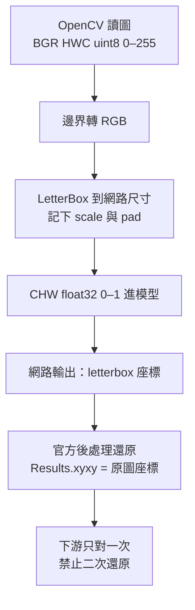

# 第 03 章：影像座標契約

偵測框上的每一個數字，只有在「這張圖是哪一種張量、現在落在哪一層幾何」被寫死之後才有意義。本章把 Ultralytics YOLO 的影像管線拆成兩份可檢查的契約：像素張量長什麼樣子，以及 letterbox 如何把原圖座標與網路輸入座標對起來。

顏色轉錯會讓人去調閾值；padding 用錯會讓框永遠偏一截。兩者都不是模型權重的問題。先鎖契約，再談後處理。

## 本章頁面

- [影像張量契約：RGB／BGR、HWC／CHW、dtype 與數值範圍](image-contract.md)
- [Letterbox 與框座標往返](letterbox.md)
- 可執行檢查：[self_check.py](self_check.py)（標準庫 `assert`，不依賴 Ultralytics、不讀權重）

## 決策總圖

## 本章硬數字（平方輸入、等分 pad）

| 項目 | 值 |
| --- | --- |
| 原圖寬×高 | 1920×1080 |
| 網路輸入 | 640×640 |
| scale | `min(640/1920, 640/1080) = 1/3` |
| 等比縮放後 | 640×360 |
| padding | 左右 0、上／下各 140 |
| 範例框原圖 `xyxy` | `(300, 150, 900, 750)` |
| 對應 letterbox `xyxy` | `(100, 190, 300, 390)` |

`rect` 或 `LetterBox(auto=True)` 走最小 padding 時，高邊對齊 stride 後**不是**上下各 140，不能套用上表。細節見 [letterbox.md](letterbox.md)。

## 官方來源

- [ultralytics.data.augment（LetterBox）](https://docs.ultralytics.com/reference/data/augment/)
- [ultralytics.engine.results（Results.xyxy）](https://docs.ultralytics.com/reference/engine/results/)
