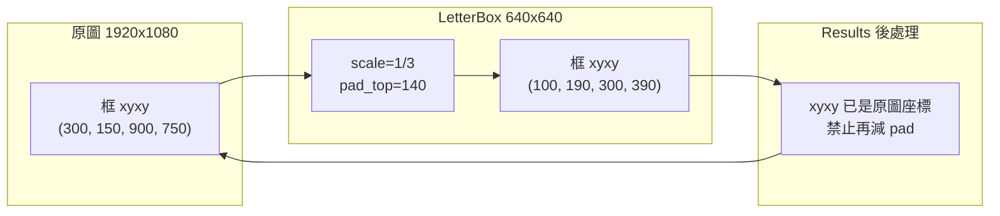

# Letterbox 與框座標往返

Letterbox 做兩件事：等比縮放，再在短邊補常數邊框，讓輸入變成網路要的方形（或 stride 對齊的矩形）。框的 `xyxy` 必須跟這兩步一起走，回來也必須只走一次。本章用 1920×1080 → 640×640 的硬數字把公式寫死，並說明為何 `Results.xyxy` 已經是原圖座標、不可二次還原。張量的顏色與 dtype 見 [image-contract.md](image-contract.md)。

## 情境：同一個框、三種錯誤還原

產線上最常見的三種錯法：

1. **當成直接拉伸。** 把 1920×1080 硬縮成 640×640，x 與 y 用不同比例。框在畫面上「瘦了」或「胖了」。
2. **當成 center-crop。** 只裁中間 1080×1080 再縮到 640，圖外圍物體的框會消失或被夾到邊界。
3. **對 `Results.xyxy` 再做一次反 letterbox。** 官方後處理已經還原到原圖。再減 pad、再除 scale，框會飛出畫面。

這三種錯都可能讓你以為要調 NMS 或換模型。先把幾何印出來。

## 原理：scale 取 min，pad 補在短邊

原圖寬 `W0=1920`、高 `H0=1080`，目標邊長 `S=640`（對應 `new_shape=(640, 640)` 的平方輸入）。

```text
scale = min(S / W0, S / H0)
      = min(640/1920, 640/1080)
      = min(1/3, 16/27)
      = 1/3
```

必須取 `min` 而不是 `max`。取 `min` 保證縮放後兩邊都不超過 `S`，不足處用 pad 補——這是 letterbox。取 `max` 會讓長邊超出 `S`，變成需要裁切，那是 crop，框會丟邊。`scale_fill=True` 則是各向異性拉伸，x、y 各用 `S/W0` 與 `S/H0`，本章不採用。

等比縮放後：

```text
W1 = 1920 × 1/3 = 640
H1 = 1080 × 1/3 = 360
```

再補到 640×640：

```text
pad_x_total = 640 - 640 = 0   → pad_left = pad_right = 0
pad_y_total = 640 - 360 = 280 → pad_top = pad_bottom = 140
```

`center=True` 時上下各半。Ultralytics 實作常用 `int(round(dh - 0.1))` 與 `int(round(dh + 0.1))` 把奇數 pad 拆成相差 1 像素的兩側；本例 `140` 為偶數對切，左右皆 0、上下皆 140，與 [self_check.py](self_check.py) 一致。

原圖 `xyxy` → letterbox：

```text
x' = x * scale + pad_left
y' = y * scale + pad_top
```

反向：

```text
x = (x' - pad_left) / scale
y = (y' - pad_top) / scale
```

範例框原圖 `(300, 150, 900, 750)`：

```text
x1' = 300 × 1/3 + 0   = 100
y1' = 150 × 1/3 + 140 = 50 + 140 = 190
x2' = 900 × 1/3 + 0   = 300
y2' = 750 × 1/3 + 140 = 250 + 140 = 390
```

letterbox 座標 `(100, 190, 300, 390)` 走反向得回 `(300, 150, 900, 750)`。150、750、300、900 都能被 3 整除，本例是 bit 級往返，不是近似。



## 工程決策：誰負責還原

若走 Ultralytics `predict`／`val`，**還原已經做完**。`Results.boxes.xyxy` 對應 `orig_shape`，單位是原圖像素。你要做的事只有：用這組數字在 `orig_img` 上畫框、寫檔、做追蹤。不要再減 140、不要再乘 3。

若自管 ONNX／TensorRT，你必須自己保存 letterbox 當下的 `(scale, pad_left, pad_top)`，在解碼後對框做一次反向，再 clip 到 `[0, W0] × [0, H0]`。這份三元組要跟「真正餵進網路的那張圖」同源。用目標尺寸反推 pad、卻在 `auto=True` 路徑上推，會推錯。

**`rect` 最小 padding 可能不同。** 官方 `LetterBox` 在 `auto=True` 時會把 pad 收到 stride 的餘數（常見 `stride=32`），目的是減少無資訊邊、讓 batch 裡各圖的邊長接近。對本例：

```text
dw, dh = 0, 280
auto: dw = 0 mod 32 = 0
      dh = 280 mod 32 = 24
```

網路輸入高變成 `360 + 24 = 384`，不是 640。`pad_top` 約為 12，不是 140。scale 仍是 `1/3`，但 pad 已變。若你仍用上下 140 做還原，letterbox 空間會差 `140 - 12 = 128` 像素，乘回原圖是 `128 / (1/3) ≈ 384` 像素的垂直偏移。這就是「最小 padding 可能不同」的工程含義：**同一個 scale 不是同一份契約，pad 必須從實際前處理讀出來，不能寫死 140。**

平方推論（`auto=False`、固定 640×640）才適用本章表上的 140。訓練或推論開了 `rect`，以實際 tensor 的 `H, W` 回推 pad，或直接讀套件回傳的 `ratio_pad`。

## 命令與數值例子

```bash
# 示意呼叫，不代表本手冊執行過、也不綁定權重檔名或成績
# yolo predict source=frame_1920x1080.jpg imgsz=640
```

閱讀官方 `Results` 時應核對：

- `orig_shape` 為 `(1080, 1920)`（高、寬）。
- `boxes.xyxy` 若偵到與手冊相同的物體，應接近原圖像素，而不是 100–390 那種 letterbox 數字。
- `boxes.xyxyn` 是相對 `orig_shape` 的正規化，不是相對 640。

二次還原會變成什麼（用本例硬算，不是實測模型輸出）：

假設你誤把已經還原的 `(300, 150, 900, 750)` 當成 letterbox 座標再走反向：

```text
x1 = (300 - 0) / (1/3) = 900
y1 = (150 - 140) / (1/3) = 30
x2 = (900 - 0) / (1/3) = 2700
y2 = (750 - 140) / (1/3) = 1830
```

框變成 `(900, 30, 2700, 1830)`，寬高都超出 1920×1080。這是二次還原的簽名，不是 NMS 失敗。

對照：若錯誤地用拉伸公式 `sx=640/1920=1/3`、`sy=640/1080≈0.5926`：

```text
y1' = 150 × 640/1080 ≈ 88.89   （letterbox 正確值是 190）
```

差的是一整段 pad，用肉眼就能從「框整體往上飄」判斷你走了拉伸而不是 letterbox。

空框：沒有偵測時前向、反向都應回空序列，不能因為 `scale` 去除法就去索引 `boxes[0]`。非法尺寸（寬、高、目標邊長 ≤ 0）應直接拒絕，不要靠 `min` 算出 `inf`。這些由 [self_check.py](self_check.py) 鎖住。

## 故障排查

| 症狀 | 可能原因 | 動作 |
| --- | --- | --- |
| 框整體上移或下移約百像素、左右還對 | pad_top 用錯（140 vs rect 的約 12） | 印實際輸入 tensor 的 H；確認有沒有 `auto`／`rect` |
| 框像被拉高或壓扁 | 走了 `scale_fill` 或獨立 `sx,sy` | 改回 `scale=min(...)` |
| 框飛出原圖、座標上千甚至兩千 | 對 `Results.xyxy` 二次還原 | 還原次數改成 0；直接畫 |
| 四周物體消失、中間還在 | 實際做了 center-crop | 檢查是否 `scale` 取了 `max` |
| 空結果時崩潰 | 空框未短路 | 先判斷長度再映射 |
| 偶發 `inf`／負寬高 | 非法 size 或 `scale=0` | 拒絕非正尺寸 |

畫框前把 `xyxy` 與 `orig_shape` 印在同一行。若 `x2 > orig_width * 1.1`，先查二次還原，再查模型。

## 限制

- [self_check.py](self_check.py) 只覆蓋平方輸入、等分 pad、無 stride 取餘。它**不是** Ultralytics `LetterBox` 的完整再實作。`auto`、`scaleup=False`、`center=False`、奇數 pad 拆分，都不在該腳本裡。
- `int(round(shape * scale))` 在其他解析度會與純分數 `1/3` 出現 1 像素差。本例 1920、1080、640 整除，差為 0。換 1920×1088 這類尺寸時要以實際 `round` 為準。
- 官方 `scale_boxes` 還會 clip 到原圖邊界。往返在貼邊框上可能不是代數恆等，這是後處理限制，不是公式寫錯。
- 本章不給版本號與精度表。以 [LetterBox 參考頁](https://docs.ultralytics.com/reference/data/augment/) 與 [Results 參考頁](https://docs.ultralytics.com/reference/engine/results/) 為準。

## 官方來源導讀

1. [ultralytics.data.augment](https://docs.ultralytics.com/reference/data/augment/)：讀 `LetterBox` 的 `new_shape`、`auto`、`scale_fill`、`scaleup`、`center`、`stride`。`auto=True` 就是「最小 padding、對齊 stride」；`scale_fill=True` 會放棄等比。把這兩個開關當成產線設定項，不要只抄 640。
2. [ultralytics.engine.results](https://docs.ultralytics.com/reference/engine/results/)：讀 `Results` 的 `orig_img`、`orig_shape`、`boxes`。`xyxy`、`xywh` 是原圖像素；`xyxyn`、`xywhn` 相對 `orig_shape`。文件若描述 boxes 已映射回原始影像，下游就不要再映射。
3. 兩份參考頁都沒有叫你把 `xyxy` 再減一次 pad。二次還原是整合錯誤，不是 API 漏了一步。

回到本章目錄：[index.md](index.md)。張量契約：[image-contract.md](image-contract.md)。
