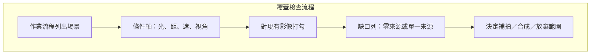

# 場景覆蓋、負樣本、長尾與類別契約

資料設計的第一個工程決策不是「再標 2000 張」，而是：現場會出現的條件，目前這批圖有沒有對得上；對得上的條件裡，正樣本與負樣本比例會不會把模型推向亂報或漏報；類別名字在標註、yaml、產品與後處理是否為同一份契約。覆蓋表答「有沒有見過這種情況」，契約答「看見之後該叫什麼、不該叫什麼」。兩者分開寫，補資料才有優先序。

本章假設偵測任務（框 + 類別）。語意分割或多標籤分類的覆蓋邏輯類似，但契約欄位不同，不要直接套用同一份 yaml。

## 情境：現場條件與訓練資料對不上

常見失敗不是「圖太少」，而是圖很多、條件很窄。例如倉庫盤點模型在日間 LED 下 val 看起來穩定，上線後黃昏逆光、堆高機陰影、塑料膜反光全部變成漏檢；或是示範影片只拍空曠走道，上線後走道被棧板堵住，模型把遮擋後的局部當新物體。此時再加同一時段、同一機位的影格，覆蓋分數幾乎不變，只是把洩漏風險變大（見 [切分、洩漏與版本凍結](split-and-version.md)）。

工程上應先列「任務會發生的情況」，再對現有檔案做對照，而不是先開標註軟體。情況清單來自作業流程，不是來自現成公開資料集的類別表。公開資料集可以當預訓練起點，不能當你的覆蓋證明。

## 場景覆蓋表：把「夠不夠」變成可檢查列

建議最小欄位：場景、視角、光照、距離／尺度、遮擋、天氣或室內狀態、載體（固定槍機／手持／車載）、是否含目標。每一列對應「現場可能發生的一組條件」，不是對應一張圖。一張圖可以打勾多列，但一列若完全沒有獨立來源（不同 camera 或不同日期），該列視為未覆蓋。



實務閾值（經驗規則，不是官方數字）：每一個「會影響產品承諾」的列，至少要有兩個獨立 group（例如兩台 camera 或兩個工作日）。只有單一影片連拍 300 張，對覆蓋表只算一個 group。長尾類別另外加「最少獨立出現次數」欄，避免 80 張都來自同一人、同一件衣服。

放棄範圍也要寫死。若夜間無補光不在交付範圍，覆蓋表應標「非目標」，避免後續把夜間誤報當資料缺口。範圍寫清楚，負樣本策略才不會無限膨脹。

## 負樣本：沒有目標的圖不是浪費

YOLO 類模型在背景複雜時，假陽性往往來自「從未看過的背景紋理」。只餵正樣本，模型傾向在任何高對比區域找框。負樣本的工程定義是：影像中依契約不應輸出任何目標框，或僅允許忽略區，且這些圖來自真實會部署的背景。

負樣本來源應按場景列，而不是隨機從網路抓無物件圖。倉庫任務的負樣本是空走道、只有棧板沒有目標 SKU、反光地面、人員穿越但契約規定不偵測人員。若契約偵測人員，那張就不是負樣本。

建議在 manifest 為每張圖標 `has_target: true|false`。訓練配置是否對負樣本加權，取決於你用的訓練程式是否支援空標註檔；多數偵測訓練流程允許空 `txt`（沒有任何一行框）。train 清單引用的是影像。Ultralytics 偵測任務對無物件影像可使用空 txt，或沒有對應 txt；空 txt 建議只作為標註審計，並非載入硬需求。檢查負樣本影像與標籤是否符合資料契約：

```bash
# 確認負樣本有對應空標註且被清單引用
# 例：images/neg_aisle_001.jpg 對應 labels/neg_aisle_001.txt（檔案存在、大小為 0）
find data/labels -name '*.txt' -size 0 | wc -l
```

負樣本比例沒有通用最佳值。若現場假陽性代價高（誤報觸發停線），負樣本應覆蓋高風險背景，而不是追求某個百分比。若漏報代價高，先補困難正樣本與遮擋，再談加負樣本。用 val 上的混淆模式決定下一輪補哪一類，不要兩邊同時大比例改。

## 長尾：次數、獨立性、損失與產品承諾要分開

長尾有三種不同問題，不可混成「這類太少」一句話：

1. **計數長尾**：某類框的總數遠低於多數類。這影響梯度，但不自動表示現場少見。
2. **來源長尾**：計數看起來夠，但 90% 來自同一 session。切分後 train 很肥、val 幾乎沒有，或相反。這是覆蓋與切分問題。
3. **產品長尾**：現場很少見，但一旦漏了代價極高（例如特定危險物）。這時不該用「自然頻率」決定要不要納入類別。

處理順序：先確認該類是否留在契約內。若留下，覆蓋表要求獨立 group，而不是只要求總框數。合併外觀極度相似、作業上不需要分開的類，比用損失權重硬拉更穩。損失權重、複製過採樣、複製時的幾何限制（同一影片不要把相鄰影格全複製進 train）都是第二層手段。

一個可執行的盤點方式：依 `class_id` 統計框數，同時統計「含該類的獨立 group 數」。只看框數會被連拍灌水。group 定義必須與切分用的 group 同一套，否則覆蓋表與切分表會互相說謊。

## 類別契約：名稱、id、空類、忽略、變更流程

類別契約是資料集的 API。建議最小欄位：

| 欄位 | 作用 |
|------|------|
| `class_id` | 從 0 連續編號，與標註檔第一欄一致 |
| `name` | 穩定英數 slug，yaml、資料夾、後處理共用 |
| `display_name` | 給人看的中文，不進模型 |
| `include_in_train` | 是否參與損失 |
| `ignore_policy` | 難例、遮擋過重、目標過小時標忽略還是刪框 |
| `negative_ok` | 該場景允許全空圖 |

`name` 一經發佈不要改字面。要改就發新資料版本，舊實驗仍指向舊契約。`class_id` 插入中間類別會讓舊標註檔全部錯位；新增類只能 append 在最後，或全量重寫標註並升版本。這是工程決策，不是風格問題。

空類政策要寫明：完全沒有目標的圖，是合法負樣本，還是標註遺漏。兩者在 QA 抽檢時處理完全相反。忽略區（例如螢幕、鏡面反射裡的目標）若訓練程式不支援 ignore 類，實務上常刪框並在契約寫「此區域不作為假陰性考核」。不要讓標註員各自發明。

契約與 Ultralytics 風格 `data.yaml` 的對齊方式（欄位名稱以你實際訓練程式為準，下列為結構示例，未綁定版本）：

```yaml
# data.yaml 結構示例（未實跑、不聲明套件版本）
path: /data/warehouse_det/v0.3.0
train: manifests/train.txt
val: manifests/val.txt
test: manifests/test.txt
names:
  0: pallet_slot
  1: forklift
  2: safety_vest
```

`names` 的 id 必須與標註行第一欄一致。抽檢指令概念如下（未實跑）：

```bash
# 找出標註檔中 class_id 超出契約範圍的列
awk 'NF && ($1+0 < 0 || $1+0 > 2) {print FILENAME":"$0}' data/labels/*.txt
```

## 原理如何服務決策

偵測模型近似在學「條件 → 框」的對應。訓練分布沒有的條件，權重不會憑空穩健。負樣本降低「任何顯眼區域都是目標」的先驗。長尾若只補同一來源，模型學到的是該來源的紋理，不是該類的不變性。類別契約則是把人類決策編成標註與評估都能執行的規則；契約不穩，mAP 的分子分母每週都在變，無法比較實驗。

因此：覆蓋表決定補拍清單；負樣本清單決定假陽性預算；長尾的獨立 group 數決定要不要合併類別；契約變更必須升資料版本。數字指標放在切分固定之後再看，見 [切分、洩漏與版本凍結](split-and-version.md)。

## 故障排查

- **某類 val 上極高、現場全漏**：先查該類是否只出現在單一 camera 或單一影片。覆蓋表會顯示「有圖、無獨立來源」。
- **背景亂框、目標還行**：負樣本未覆蓋該背景，或契約把裝飾物／反光當成可忽略卻沒寫進 QA。補該場景空圖，而不是降 conf 了事。
- **兩個類互相搶框**：顯示名不同但外觀重疊，或標註員沒有「重疊時優先誰」的規則。改契約與標註指引，不要先改 NMS 閾值。
- **空 txt 很多但假陽性沒降**：train 清單沒引用這些檔，或增廣把空圖裁成正樣本區域以外的無效切片。檢查 loader 是否真的讀到空標註。
- **補了夜間圖反而日間掉點**：夜間與日間若共用過強增廣，或夜間樣本全進 train、日間全進 val，這是切分與增廣問題，不是「夜間不該要」。

## 限制

- 覆蓋表不能證明泛化，只能證明「訓練前你知道缺什麼」。獨立 group 很少時，表會過於樂觀。
- 合成資料可補光照與隨機背景，很難補真實髒污、鏡頭眩光與作業動線；合成必須在契約中標來源，且 val／test 以真實為準。
- 類別合併不可逆地影響歷史實驗對比，必須升版本。
- 本章不給「每類最少 N 張」的通用數字；N 取決於物體尺度變化與產品代價，需用你的 val 錯誤模式迭代。

## 官方來源導讀

切分與洩漏的正式討論在 scikit-learn，不在 YOLO 教程。讀 [Common pitfalls：data leakage](https://scikit-learn.org/stable/common_pitfalls.html#data-leakage) 時，把文件中的「同一病人的多次量測」對應成「同一影片的相鄰影格／同一 camera 的連拍」。讀 [Group cross-validation](https://scikit-learn.org/stable/modules/cross_validation.html#group-cv) 時，重點是：評估單位若是 group，切分單位就必須是 group；不必在專案中引入 scikit-learn，但切分邏輯要符合同一約束。具體實作與 manifest 見 [切分、洩漏與版本凍結](split-and-version.md)。
