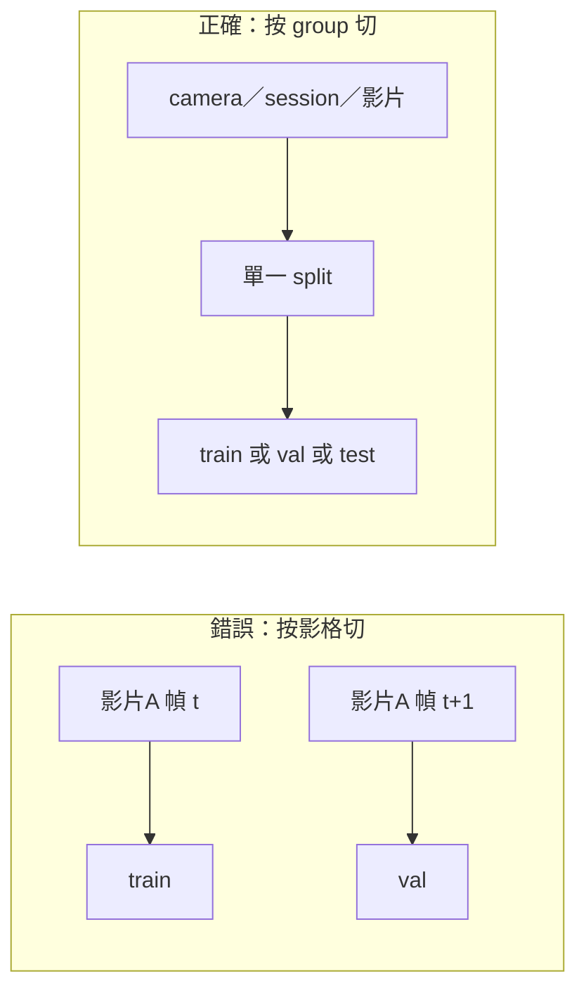

# 切分、洩漏與版本凍結

覆蓋表告訴你資料「有沒有條件」，切分告訴你評估「算不算數」。YOLO 專案最常見的資料錯誤，是把同一段影片的相鄰影格拆進 train 與 val：像素幾乎相同，val 變成認圖測驗。本頁把切分單位定在 group（camera、session、影片、時間窗），用標準庫做可重現的指派，避開 Python 內建不穩定的 `hash()`，並把結果寫進 manifest 與版本凍結。原理對齊 scikit-learn 的 data leakage 與 Group CV，實作不依賴該套件。

與 [場景覆蓋與類別契約](coverage.md) 的銜接：覆蓋用的獨立來源，必須與本頁 group 鍵相同。否則覆蓋表說「兩個 camera 都有夜間」，切分卻按檔名隨機，夜間仍可能全部進 train。

## 情境：相鄰影格把 val 變成記誦

固定槍機 25 FPS 擷取，目標在畫面裡連續出現 8 秒，約 200 張高度相關的圖。若按檔名 shuffle 後 8:1:1 切，train 與 val 都會有這 8 秒裡的幀。模型只要記住「這個地面紋理旁邊有框」，val 就給分。上線換成隔壁走道或隔週的地面磨損，分數崩掉。這與 scikit-learn 所稱 leakage 同類：評估樣本與訓練樣本不是獨立抽取，而是同一產生過程的近鄰。

因此切分的原子單位不是圖，是 group。一張圖屬於恰好一個 group；一個 group 的所有圖必須落在同一個 split。



## Group 怎麼選：camera、session、time、影片

選擇 group 的原則：若兩張圖共享會在現場一起出現的相關性，它們就應同組。

| 鍵 | 適用 | 不夠的時候 |
|----|------|------------|
| `video_id` | 抽幀於影片 | 多支影片其實同一機位同一天，仍可能洩漏背景 |
| `camera_id` | 固定多槍機 | 同一 camera 跨很多天，可能過度保守，train 缺該機位 |
| `session_id` | 一次巡檢、一次車次、一次上工 | 通常是偵測專案的預設 |
| `time_bin` | 連續錄影無自然場次 | 用固定時長（例如 10 分鐘）切窗，窗邊界仍可能相關，窗要夠長或丟掉邊界幀 |

可疊加：`group_id = camera_id + "#" + session_id`。不要用檔名裡的遞增序號當 group，那只是幀號。

GroupShuffleSplit 的原理（不必 import）：先列出唯一 group，在 **group 層** 洗牌或分桶，再把 group 映射回樣本。樣本層的 `train_test_split` 不管 group，正是洩漏來源。官方說明見 [Group cross-validation](https://scikit-learn.org/stable/modules/cross_validation.html#group-cv) 與 [data leakage](https://scikit-learn.org/stable/common_pitfalls.html#data-leakage)。交叉驗證時每個 fold 同樣保持「某 group 只出現在 train 或只出現在 val」。本手冊預設是一次固定的 train/val/test，不是 k-fold；若樣本的 group 數很少（例如只有 3 支相機），k-fold 會讓每個 fold 的 val 條件差很大，應改為留一 camera，或承認你沒有穩定 val。

## train / val / test 用途（寫進實驗紀律）

- **train**：學習權重、增廣、sampler、class 權重都只看這裡。可含困難例與重採樣。不可用 test 回放進 train。
- **val**：調增廣強度、早停、選 conf／NMS、比較架構。可多次看。val 一被拿來「改標註直到分數變好」，它就開始腐蝕，需記錄。
- **test**：版本發佈前的一次（或很少次數）對外數字。類別契約、切分、後處理鎖住之後才跑。不可用 test 做早停。

比例不是魔法。先保證每個 split 都有關鍵場景的獨立 group，再談 8:1:1。若全部只有 6 個 session，可能 train 4、val 1、test 1，而不是強行按圖數 80%。圖數極不均衡時，以 group 數為準，並在報告裡寫各 split 的框數，避免誤讀。

時間切分（舊資料 train、最新一週 test）適合概念漂移監測，但 val 仍需與 train 同時段的獨立 group，否則早停看的是另一個世界。不要把「最新資料」同時當 val 又當 test。

## 用雜湊找重複：能做什麼、不能做什麼

檔案 md5／sha256 只能抓「位元組完全相同」的拷貝。這對清掉重複下載有用，對相鄰影格無用——差 1 位元組雜湊就完全不同。感知雜湊（aHash／pHash 等）能抓近重複，但閾值依賴解析度與壓縮，且同一目標轉 30 度可能判成不同圖。感知雜湊通過不代表可以跨 split；group 規則仍是第一約束。

找完全重複的概念命令（未實跑）：

```bash
# 列出內容完全相同的檔
find images -type f -print0 | xargs -0 shasum -a 256 | sort | uniq -d -w 64
```

限制：改過 exif、重新編碼、裁 1 像素都抓不到。不要用「雜湊沒重複」當作切分安全證明。

## 禁止用內建 `hash()` 做切分

CPython 對 `str` 的 `hash()` 預設每行程式啟動加鹽（`PYTHONHASHSEED` 隨機），同一 `group_id` 在兩次執行會進不同桶，manifest 無法重現。切分必須用穩定摘要（如 SHA-256）或顯式 rng seed 的洗牌。下面用標準庫按 group 分桶，**不使用** `hash()`，並用 `assert` 自查：同 group 永不跨 split、同輸入永遠同結果、桶界對應 80/10/10。

```python
"""stable_group_split.py — 標準庫按 group 切分，可直接 python 執行。"""
from __future__ import annotations

import hashlib
from collections import defaultdict

TRAIN_END = 80  # [0, 80) train
VAL_END = 90    # [80, 90) val；[90, 100) test
N_BUCKETS = 100


def stable_bucket(group_id: str, n_buckets: int = N_BUCKETS) -> int:
    if not group_id:
        raise ValueError("group_id 不可為空")
    digest = hashlib.sha256(group_id.encode("utf-8")).hexdigest()
    return int(digest[:16], 16) % n_buckets


def assign_split(group_id: str) -> str:
    b = stable_bucket(group_id)
    if b < TRAIN_END:
        return "train"
    if b < VAL_END:
        return "val"
    return "test"


def split_records(rows: list[tuple[str, str]]) -> dict[str, str]:
    """rows: (image_id, group_id) -> {image_id: split}"""
    out: dict[str, str] = {}
    for image_id, group_id in rows:
        out[image_id] = assign_split(group_id)
    return out


def _self_check() -> None:
    g = "camera_07#session_20260301_am"
    assert assign_split(g) == assign_split(g)
    assert stable_bucket(g) == stable_bucket(g)
    assert assign_split(g) in {"train", "val", "test"}

    # 內建 hash() 不保證跨行程穩定；此模組不得呼叫它做分桶。
    assert "hash" not in stable_bucket.__code__.co_names
    assert "hash" not in assign_split.__code__.co_names

    rows = [
        ("frame_0001", "camA#s1"),
        ("frame_0002", "camA#s1"),
        ("frame_0003", "camB#s1"),
        ("frame_0004", "camB#s2"),
    ]
    mapping = split_records(rows)
    by_group: dict[str, set[str]] = defaultdict(set)
    for image_id, group_id in rows:
        by_group[group_id].add(mapping[image_id])
    for group_id, splits in by_group.items():
        assert len(splits) == 1, f"group {group_id} 跨 split: {splits}"

    # 桶界：人工構造已知摘要過於脆，改測區間完備。
    seen = {assign_split(f"group_{i}") for i in range(500)}
    assert seen <= {"train", "val", "test"}
    assert "train" in seen  # 500 個 group 下應至少落到 train


_self_check()

if __name__ == "__main__":
    demo = [("img_%03d" % i, "cam_%d#day_%d" % (i % 5, i % 3)) for i in range(20)]
    m = split_records(demo)
    for k in sorted(m):
        print(k, m[k])
```

執行 `python stable_group_split.py` 時，`_self_check()` 失敗會直接例外，通過才印 demo。80/10/10 是對 **group 雜湊桶** 的期望，不是對圖數的保證。group 很少時，實際比例會偏掉，這時改成：對 group 列表 `random.Random(seed).shuffle` 後按計數切開，seed 寫進版本說明。洗牌法在 group 數小時比雜湊分桶可控。

```python
import random


def split_groups(group_ids: list[str], seed: int = 20260308) -> dict[str, str]:
    uniq = sorted(set(group_ids))  # 排序後再洗，避免 set 迭代順序干擾
    rng = random.Random(seed)
    rng.shuffle(uniq)
    n = len(uniq)
    n_train = int(n * 0.8)
    n_val = int(n * 0.1)
    assign = {}
    for i, g in enumerate(uniq):
        if i < n_train:
            assign[g] = "train"
        elif i < n_train + n_val:
            assign[g] = "val"
        else:
            assign[g] = "test"
    if n >= 3:
        # 至少各一組：把尾端三個強制分到三個 split（group 極少時的保底）
        assign[uniq[-3]] = "train"
        assign[uniq[-2]] = "val"
        assign[uniq[-1]] = "test"
    assert set(assign.values()) <= {"train", "val", "test"}
    return assign


_g = ["a", "b", "c", "d"]
_a1 = split_groups(_g, seed=1)
_a2 = split_groups(_g, seed=1)
assert _a1 == _a2
assert len({_a1[x] for x in _g}) >= 1
```

強制尾端各一組會破壞嚴格比例，只適用 group 極少、必須三個 split 都有人的情況；寫進版本說明，避免被當成通用演算法。

## 資料 manifest 範例

每列一張圖，切分結果與契約版本寫在同一檔，訓練清單從這裡生成，不要在資料夾搬移實體檔來代表 split（搬檔難以 diff、難以回溯）。

```csv
image_id,rel_path,group_id,split,has_target,label_rel,sha256,contract_version,dataset_version
frame_0001,images/camA/frame_0001.jpg,camA#s1,train,true,labels/camA/frame_0001.txt,e3b0c44298fc...,cls-v2,ds-v0.3.0
frame_0002,images/camA/frame_0002.jpg,camA#s1,train,false,labels/camA/frame_0002.txt,be411d73cb8a...,cls-v2,ds-v0.3.0
frame_0099,images/camB/frame_0099.jpg,camB#s2,val,true,labels/camB/frame_0099.txt,9d4e1e23bd5b...,cls-v2,ds-v0.3.0
```

生成三個清單（未實跑示例）：

```bash
# 未實跑
awk -F, 'NR>1 && $4=="train" {print $2}' manifest.csv > manifests/train.txt
awk -F, 'NR>1 && $4=="val"   {print $2}' manifest.csv > manifests/val.txt
awk -F, 'NR>1 && $4=="test"  {print $2}' manifest.csv > manifests/test.txt
```

`sha256` 用來偵測檔案被默默覆寫；它不是近重複偵測。`contract_version` 對應 [類別契約](coverage.md) 的凍結點。改任何標註、刪圖、改 group 鍵、改切分 seed，都要升 `dataset_version`。

## 版本凍結

凍結的最小集合：

1. 影像與標註的不可變目錄或物件儲存前綴（例如 `ds-v0.3.0/`），禁止在該前綴上 inplace 改檔。
2. `manifest.csv` 與三個 split 清單的雜湊。
3. 類別契約檔（names、ignore 政策）。
4. 切分程式與 seed／分桶常數。
5. 訓練時指向的 `data.yaml` 副本，裡面寫死 `path` 到該版本前綴。

實驗紀錄只寫 `dataset_version` + 契約版本 + 切分 seed，不寫「當時的 data/ 資料夾」。修正錯標應分支為 `ds-v0.3.1`，並註明相對 v0.3.0 的 diff 範圍（哪些 `image_id` 的標註變了）。若修正發生在 test 上，對外數字必須重跑並標記「test 標註已修」，不可與舊 test 分數橫向並排裝成進步。

## 故障排查

- **val 異常高、換一天就垮**：抽 val 與 train 的 `group_id` 做交集，非空就是洩漏。相鄰影格常因 group 設成檔名而產生。
- **重跑切分，train 清單不一樣**：程式用了 `hash()` 或 `set` 無排序洗牌。改用 SHA-256 或 `sorted` + `Random(seed)`。
- **test 框數近乎為零**：雜湊分桶在 group 很少時發生。改洗牌保底或合併 split 策略，並在報告寫實際 group 數。
- **md5 沒重複但視覺一樣**：預期行為。用 group／時間窗，不要期待內容雜湊。
- **搬檔到 train/ 後 git 巨大、無法回溯**：改回 manifest 指向，實體只存一份。
- **早停很穩、test 很差**：val 與 test 條件不同，或 val 被反覆調參耗盡。鎖 val 協議，test 保持一次。

## 限制

- Group 切分不能創造不存在的獨立性：全公司只有一台相機，你沒有 camera-level 泛化證據。
- 80/10/10 對 group 桶是期望值，對稀有類可能讓某類只出現在 train。稀有類要在切分後做交叉表，必要時把含該類的 group 手動指定並記錄例外。
- 本頁程式示範穩定性與不洩漏，不示範分層抽樣（同時保類別比例與 group）。分層加 group 是額外約束，group 少時往往無解，應減類或減 split 數量。
- 未引入 scikit-learn，行為等價於「在 group 層分割」；若你改用 `GroupShuffleSplit`，仍須固定 `random_state` 並把 group 陣列與 manifest 一併凍結。本章不聲明該套件版本，亦未實跑。

## 官方來源導讀

1. [scikit-learn Common pitfalls — Data leakage](https://scikit-learn.org/stable/common_pitfalls.html#data-leakage)：把 leakage 定義成訓練時用到不該在預測時出現的資訊，以及評估樣本與訓練樣本不獨立。將文件中的重複列、同一實體的多次觀測，對應到同一 `video_id` 的相鄰幀、同一 `camera_id` 的連拍、預處理時 fit 了 val。讀完應用你的 manifest 做一次 group 交集檢查，而不是只記住名詞。
2. [scikit-learn Cross-validation — Group CV](https://scikit-learn.org/stable/modules/cross_validation.html#group-cv)：說明為何 `GroupKFold`／`GroupShuffleSplit` 存在——樣本可交換的假設在群組資料上不成立。你不需要為了 YOLO 專案安裝並呼叫這些類；需要的是同一條規則：split 在 group 上發生，group 內樣本同進退。若日後做 k-fold 選超參，fold 也必須是 group-aware，否則 val 選出的 conf 只對洩漏有效。

章入口：[第 04 章](index.md)。跨章：[第 03 章](../03/index.md)、[第 05 章](../05/index.md)。
