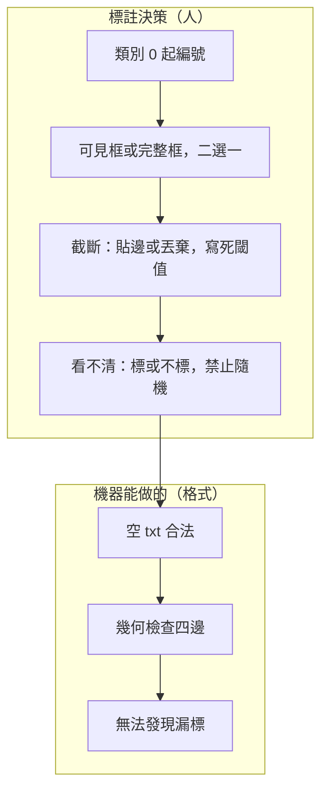

# 標註政策：遮擋、截斷、漏標與空標籤

格式檢查只能證明「這一列數字合法」，不能證明「這一張圖該有的目標都標了」。YOLO detection 把沒有框的區域當背景；漏標等於把正樣本寫成負樣本。因此標註政策必須在畫第一個框之前寫成可執行規則，而不是事後用肉眼感覺「差不多」。本頁只服務工程決策：同一張圖、同一類別，兩名標註員必須能得到同一組框，訓練時才不會把標註風格當成物體特徵。

上一層章節入口見 [index.md](index.md)。格式、目錄與檢查腳本見 [format-and-check.md](format-and-check.md)。類別編號從 `0` 開始，與官方偵測資料頁一致。

## 情境：同一張工地照片，三種標法會訓練出三種模型

假設影像是 1920×1080，畫面裡有一頂安全帽被鋼樑擋住約一半、一個穿反光背心的人被切在右緣只剩肩膀、遠處還有一頂幾乎看不清的帽。若沒有政策，常見三種做法會同時出現在同一份資料裡：

1. 只框「現在看得到的像素」。被擋的帽只框露出的半圓；被切到畫面外的人不標，因為「不完整」；遠處置之不理。
2. 框「完整物體的想像外接矩形」。被擋的帽把鋼樑後面也框進去；被切邊的人把畫面外的身體用框「補」到邊界；遠處置一個幾乎是雜訊的小框。
3. 看見就標、看不清就跳過，同一人前後兩天標準不同。

對 YOLO 來說，這三種不是風格差異，而是監督訊號定義不同。訓練時匹配正樣本靠的是框與預測的重疊，不是標註員心裡的故事。政策必須選一種，寫進標註指南，並用抽查而不是用 [`label_check.py`](label_check.py) 來執行——該腳本明確不宣稱能發現語意漏標。

## 原理如何變成決策：損失把沒框的地方當「不該預測」

偵測訓練會在特徵圖上產生大量候選；與任一 GT 框夠重疊的當正樣本，其餘當負樣本（背景）。若圖上有一頂帽但沒有對應列，模型預測那頂帽會被當成誤報來懲罰。這不是「資料稍微髒」，而是標籤與任務定義相反。因此：

- **漏標優先級最高**：寧可暫時不把這張圖放進 train，也不要讓它帶著缺失的 GT 進 loader。
- **空標籤合法**：若政策判定圖上沒有任一目標類別，對應的 `.txt` 應存在且為空（或只有空白行）。空檔告訴訓練程式「這張是背景圖」，與「忘記標」在檔案系統上必須可區分。後者通常是缺檔，不是空檔；缺檔要在配對檢查裡當事故，空檔依官方慣例是合法負樣本。
- **框的語意必須穩定**：遮擋與截斷決定框是「可見像素的外接矩形」還是「完整物體的外接矩形」。兩種都能訓練，但不能混用。混用時，同一類別的寬高比與中心點分佈會出現雙峰，模型會學到標註員的猶豫。



## 類別從 0：先鎖表，再允許任何人開標

YOLO 列的第一個欄位是整數 class id，從 `0` 起算，對應 `data.yaml` 的 `names`。工程上要先凍結一張表，例如兩類：`0: helmet`、`1: vest`。禁止在標註中途插入新類到中間導致後續 id 全部位移。新增類別只能追加到最大 id 之後，並同步改 `--classes` 與 yaml。

決策規則：

- 標註軟體匯出若從 1 起算，必須在進訓練前進位映射，否則整類錯位。`label_check.py` 在 `--classes 2` 時會拒絕 `2`，但不會知道你其實想標 `1`。
- 不要用「未命名」「other」「object」當垃圾桶類，除非推論時真的要偵測它。垃圾桶類會吃掉大量框，並讓主類的漏標更難被抽查看到。
- 一列只允許一個 class。重疊的帽與人是兩個框、兩列，不是一個「帽+人」類。

## 遮擋政策：選可見框，並寫清「擋多少還要標」

工業場景建議預設 **可見像素的軸對齊外接矩形（visible AABB）**，原因不是它比較「正確」，而是它可複核：第二名標註員不必猜測鋼樑後面的帽沿在哪裡。完整物體框（amodal）只有在下游真的需要「物體中心／計數／被擋仍要報」時才值得，而且要用額外欄位或獨立專案，不要跟可見框混在同一個 `labels/`。

可見框的執行規則（寫進指南的版本，不是口頭）：

1. 目標類別的可見像素多於事先訂的最小面積才標。例如帽的最短邊至少 8 像素，或面積至少 16×16。低於閾值視為不可穩定回歸，不標，並在抽查表記「過小不標」，避免被當成漏標事故。
2. 遮擋超過 80% 且剩餘可見部分已無法辨認類別，不標。剩餘部分仍可穩定辨認為 helmet，則框住剩餘可見像素，不要把遮擋物框進去。
3. 重疊的兩個同框物體（兩頂帽前後）各標各的框，允許 IoU 很高。不要合併成一個大框，否則寬高比會變成「兩頂帽的聯集」。
4. 禁止用點或極細長條「意思一下」。`w` 或 `h` 接近 0 的框對正規化座標是合法數字的邊緣，對學習沒有用。政策層直接禁止；檢查腳本另外拒絕負寬高，不把「太小」當成它的職責。

數值例子（可見框，未實跑、不依賴任何模型輸出）。影像 1920×1080。帽的可見像素大致落在左上 (200, 120)、右下 (360, 260)。則像素寬 160、高 140，中心 (280, 190)。正規化：

- `xc = 280 / 1920 = 0.1458333333`
- `yc = 190 / 1080 = 0.1759259259`
- `w = 160 / 1920 = 0.0833333333`
- `h = 140 / 1080 = 0.1296296296`

寫成一列（class 從 0）：`0 0.1458333 0.1759259 0.0833333 0.1296296`。若改用 amodal，標註員把被擋的左側再往外估 80 像素，`w` 會變成 240/1920=0.125，中心也會左移。同一張圖兩種政策的 GT 已經不同；檢查器兩邊都會判定「格式合法」。這就是為什麼政策必須先於檢查。

## 截斷政策：畫面外不要發明像素，但也不要默默丟棄

截斷指物體與影像邊界相交。可見框政策下，框必須停在影像內：正規化後四邊都應落在 `[0, 1]` 內（實務容差見檢查頁的 `1e-6`）。禁止為了「框到頭」把 `x_min` 標成負值再希望訓練程式幫你 clip。有的匯出工具會寫出中心仍在 `[0, 1]`、寬高卻讓四邊越界的列；那是格式錯誤，不是風格。

執行規則：

- 物體與邊界相交，框取畫面內可見部分的 AABB，讓 `xc ± w/2`、`yc ± h/2` 落在影像內。
- 可見部分小於「過小不標」閾值，這張圖對該物體不標。若該圖因此沒有任何目標，寫空標籤，不要刪掉影像——空標籤背景圖對壓假陽仍然有用。
- 不要因為「人不完整」就整人不標：若背心類別的可見部分已超過閾值，仍應標 vest。完整／不完整不是類別定義，除非你另外開了 `person_truncated` 這種類，通常不該開。

截斷的反例（中心看起來正常、四邊已經越界）：`1 0.05 0.50 0.20 0.10`。`xc=0.05` 在 `[0, 1]`，但 `x_min = 0.05 - 0.10 = -0.05`。這不是「有一點出界沒關係」，而是標註座標系已經離開影像。檢查必須看四邊，不能只檢查中心範圍。詳見 [format-and-check.md](format-and-check.md)。

## 漏標政策：當事故處理，不當「以後再補」

漏標分成三種，處理不同：

1. **檔案漏標**：影像存在、同 stem 的 txt 不存在。這不應被解釋成空標籤。配對流程要失敗或至少列出；本頁的檢查腳本不負責配影像，避免把「沒檢查影像」說成「沒有漏標」。
2. **列漏標**：txt 存在且非空，但圖上還有政策要求必須標的目標。這是語意錯誤。抽查方法是按類別分層抽 N 張，用原圖疊框，計算「應標未標」。不要用 loss 或 mAP 當漏標探測器——指標下降有一百個原因。
3. **政策性不標**：過小、不可辨識、非目標類。必須在指南裡有例子圖，抽查時把這類判成通過，否則標註員會為了不被罵而把雜訊框進去。

漏標的代價不對稱：多標一個錯誤類別，至少還是一個明確的正樣本（雖然是錯的）；少標一個真目標，等於教模型「這裡是背景」。因此複核順序是漏標 → 錯類 → 框鬆緊，而不是先糾結框是不是漂亮。

## 空標籤合法：背景圖要明示，不要靠缺檔

官方偵測資料慣例是每張訓練影像對應同名標籤檔。沒有物體時檔案可以是空的。工程上建議：

- train/val 清單裡出現的每張圖都有 `labels/.../<stem>.txt`。
- 背景圖的 txt 長度為 0，或只有空行。`label_check.py` 視其為通過。
- 不要用「沒有 labels 子目錄裡的檔案」當背景，那與漏檔無法區分，也讓相對路徑的 yaml 更難除錯。

背景圖比例是另一個決策：全是正樣本時，假陽會偏多；背景過多則正樣本被稀釋。本頁不規定比例，只規定表示法必須是空標籤而不是缺檔。

## 故障排查（標註現場）

| 現象 | 先查政策還是先查格式 | 處理 |
| --- | --- | --- |
| 兩人標同一張 IoU 很低 | 政策 | 是可見框還是 amodal 混用；截斷是否貼邊 |
| 驗證集假陽很多、訓練卻很順 | 漏標 | 抽 train 疊框，找應標未標；不要先調置信度 |
| 某類 recall 接近 0 | 類別 id | 是否從 1 起算、yaml names 是否錯位 |
| 邊界物體框「飛出畫面」 | 格式 | 四邊越界；回頭修匯出而不是 clip 了事 |
| 很多 0 byte txt | 可能正確 | 確認這些圖真的無目標；抽樣，不要整批刪 |
| 想靠檢查腳本找漏標 | 限制 | 做不到；排程人工抽查 |

抽查命令不代替看圖。下面只示範「如何列出空標籤數量」的形狀，**未實跑**：

```bash
# 統計空標籤（0 byte 或只有空白）。不能證明沒有語意漏標。
find /abs/path/to/dataset/labels/train -name '*.txt' -size 0
```

## 限制

- 政策文件無法被 `label_check.py` 執行。遮擋百分比、最小像素、可辨識程度都是人的判斷。
- 本頁不提供「最佳遮擋閾值」或任何 mAP 數字；那些依賴資料域，捏造成績沒有工程價值。
- 可見框訓練出的模型，推論框會貼近可見部分；若產品 UI 需要完整人體框，那是另一個標註定義，不要指望同一份 GT 兩用。
- 跨章的增強（翻轉、馬賽克）會改變截斷出現的頻率，但不改變本頁的標註定義。增強後的框若越界，應在訓練管線 clip，那是訓練期行為，不應回頭把原始標籤寫成越界。

## 官方來源導讀

請直接讀 [Detect dataset | Ultralytics Docs](https://docs.ultralytics.com/datasets/detect/)，把下列事實對回本頁決策，不要憑記憶改格式：

- 偵測標籤是每圖一個 txt，列格式為 class 與正規化中心、寬、高。
- 類別索引從 0 開始。
- 資料 yaml 描述 train/val 與 names。
- 沒有物體的影像仍可有對應標籤檔（空檔）。

官方頁不替你決定遮擋與截斷；那是任務定義。讀完官方格式後，回到本頁把「可見框／amodal」「過小不標」「空檔=背景」三條寫進你的專案 README，再進入 [format-and-check.md](format-and-check.md) 把數字存對、檢查跑過。
