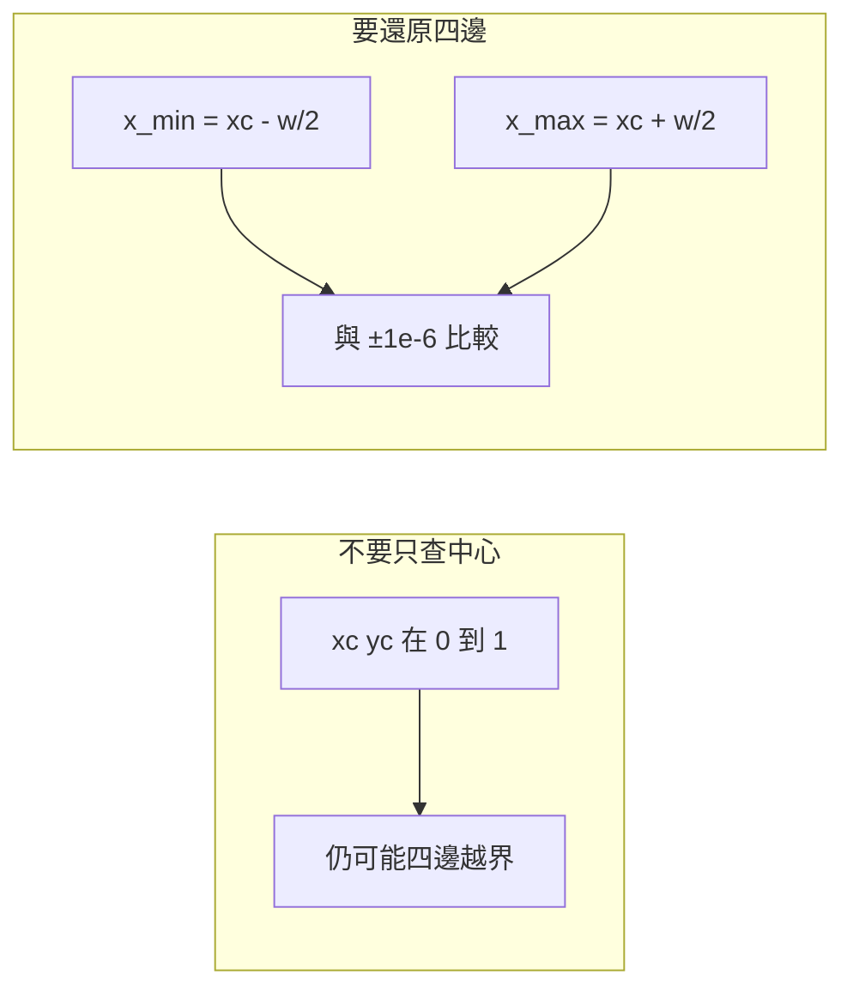

# YOLO 格式、目錄樹、data.yaml 與檢查腳本

本頁把 [annotation-policy.md](annotation-policy.md) 已經凍結的框，落成 Ultralytics 偵測格式、可重現的目錄、以及一份只做幾何／格式檢查的標準庫腳本。來源是 [Detect dataset](https://docs.ultralytics.com/datasets/detect/)。模型訓練指令僅示範呼叫形狀並標明 **未實跑**，不捏造套件版本或指標成績。章入口：[index.md](index.md)。

## 情境：相對路徑讓同一份 yaml 在兩台機器各讀各的

常見失敗不是框畫錯，而是 `data.yaml` 寫了 `path: datasets/site` 或更糟的 `train: ./images/train`，然後在 IDE、cron、notebook 各用不同 cwd 啟動。Ultralytics 會相對 yaml 或 cwd 去拼路徑，文件讀起來像「相對即可」，實務上這是路徑推測。工程決策：**`path` 寫絕對路徑**，`train`／`val` 只寫相對於該絕對根的子路徑，影像與標籤用平行樹，避免再推測「標籤在影像旁邊還是在 labels/」。

第二個失敗是只檢查 `0 ≤ xc, yc, w, h ≤ 1`。中心在畫面內、寬高為正，框仍可伸出畫面。檢查必須還原四邊。容差 `1e-6` 用來吸收浮點四捨五入，不是用來放行明顯越界。

## 一列的定義：`class xc yc w h`（正規化）

每一行五個欄位、空白分隔、UTF-8 文字：

| 欄位 | 意義 | 約束 |
| --- | --- | --- |
| `class` | 類別整數 | 從 0 到 `nc-1`，必須是整數 token，拒絕 `1.0`、`1e0` |
| `xc` | 框中心 x / 影像寬 | 有限實數；最終以四邊是否在影像內為準 |
| `yc` | 框中心 y / 影像高 | 同上 |
| `w` | 框寬 / 影像寬 | 禁止負值；`NaN`/`Inf` 拒絕 |
| `h` | 框高 / 影像高 | 同上 |

座標原點在影像左上，x 向右、y 向下。正規化以影像寬高為 1，與像素解析度無關：同一框在 1920×1080 與縮放後的 640×640 應是同一列數字（若標註發生在原圖）。

由像素框還原正規化（先算中心與寬高，再除）：

- `xc = ((x_min + x_max) / 2) / W`
- `yc = ((y_min + y_max) / 2) / H`
- `w = (x_max - x_min) / W`
- `h = (y_max - y_min) / H`

反推四邊（檢查用，也是越界定義）：

- `x_min = xc - w/2`，`x_max = xc + w/2`
- `y_min = yc - h/2`，`y_max = yc + h/2`

合法當且僅當四邊滿足 `-1e-6 ≤ x_min`、`y_min` 且 `x_max`、`y_max ≤ 1 + 1e-6`。只要求 `0 ≤ xc ≤ 1` 不夠。

### 數值例子（手算，未接模型）

影像 `W=1920`、`H=1080`。像素框 `x_min=100`、`y_min=200`、`x_max=500`、`y_max=800`（寬 400、高 600，中心 300, 500），class `0`：

- `xc = 300/1920 = 0.15625`
- `yc = 500/1080 ≈ 0.46296296296`
- `w = 400/1920 ≈ 0.20833333333`
- `h = 600/1080 ≈ 0.55555555556`

列：`0 0.1562500 0.4629630 0.2083333 0.5555556`。四邊回到正規化是 `x_min=0.0520833`、`x_max=0.2604167`、`y_min=0.1851852`、`y_max=0.7407407`，全部在 `[0,1]` 內。

越界反例（中心合法、左邊出界）：`0 0.05 0.50 0.20 0.10` → `x_min=-0.05`。負寬反例：`0 0.5 0.5 -0.1 0.2`。非整數 class：`0.0 0.5 0.5 0.1 0.1`。`NaN`：`0 0.5 nan 0.1 0.1`。`Inf`：`0 0.5 0.5 inf 0.1`。空檔：0 byte，合法。這些都是 [`label_check.py`](label_check.py) 自測要覆蓋的。



## 影像／標籤平行樹與相對 train/val

官方偵測頁使用影像與標籤分開、train/val 對稱的樹。stem 必須一一對應：`images/train/a.jpg` 對 `labels/train/a.txt`。相對路徑只出現在 yaml 的 `train`／`val` 鍵，相對於絕對 `path`，不再相對 cwd。

```text
/abs/data/site-det/
  images/train/   a.jpg  b.jpg
  images/val/     c.jpg
  labels/train/   a.txt  b.txt   # b.txt 可為空
  labels/val/     c.txt
  data.yaml
```

決策：

- **不要**把 txt 放在 jpg 旁邊然後靠工具「自動找」。平行樹讓檢查器可以只掃 `labels/`，也讓你用空 txt 表達背景圖。
- **不要** train 用絕對路徑、val 用相對路徑。兩種分裂的寫法會在複製資料集時只壞一半。
- val 必須是獨立目錄，不要 `train: images/train` 再指望隨機切。切分應發生在產生這棵樹之前。
- 標籤副檔名用 `.txt`。檢查器對目錄做 `*.txt` 遞迴；檢查器只掃描 `.txt`，不會檢查 markdown；筆記請放在 `labels/` 以外，以免與標籤檔混在一起。

## `data.yaml`：明確絕對 path，拒絕路徑推測

```yaml
# 範例：path 必須是資料集根的絕對路徑，不要寫 datasets/site 或 ~
path: /abs/data/site-det
train: images/train
val: images/val
names:
  0: helmet
  1: vest
```

- `path` 用絕對路徑（Linux/macOS 以 `/` 開頭；不要依賴 shell 展開後的相對殘留）。
- `train`／`val` 是相對於 `path` 的影像目錄。標籤目錄由慣例對到 `labels/train`、`labels/val`，不要在 yaml 裡再發明第三種相對關係。
- `names` 的鍵從 `0` 起連續。`--classes` 必須等於 names 數量。出現跳號時，檢查器不會懂你的故事，只會把越界 id 當錯。
- 不要只寫 `nc: 2` 卻省略 names，除非你接受推論輸出是數字。工程上 names 與標註指南同一張表。

對 yaml 的健全性本腳本不做：它不讀 yaml、不開影像、不核對 stem。這是刻意限制，避免把「沒配對影像」宣傳成「標籤已完整」。

示範訓練呼叫（**未實跑**，無版本、無成績）：

```bash
# 未實跑
yolo detect train data=/abs/data/site-det/data.yaml model=yolo11n.pt
```

## `label_check.py`：能擋什麼、不能擋什麼

腳本與本頁同章：[label_check.py](label_check.py)。只使用 Python 標準庫。位置參數接受檔案或目錄（目錄遞迴 `*.txt`）。`--classes` 為整數類別數。`--self-test` 寫入暫存合法／非法例並斷言退出語意。

檢查項目：

1. 非整數 class（含 `1.0`、空缺、多餘欄位導致解析失敗）。
2. `NaN`／`Inf`（任一幾何欄）。
3. 負寬或負高。
4. 越界：還原四邊，容差 `1e-6`。
5. class 不在 `[0, classes)`。

通過：合法列、合法空標籤（含僅空白行）、自測全部通過 → `exit 0`。任一檔任一列失敗 → 訊息寫到 stderr，`exit 1`。

**不宣稱能發現語意漏標。** 圖上有帽但 txt 為空，腳本視為合法背景。錯類但 id 仍在範圍內，視為合法。框太鬆但四邊在畫面內，視為合法。那些回到標註政策與人工抽查。

```bash
# 自測（不需資料集）
python label_check.py --classes 2 --self-test

# 檢查目錄或檔案
python label_check.py --classes 2 /abs/data/site-det/labels/train
python label_check.py --classes 2 /abs/data/site-det/labels/train/a.txt /abs/data/site-det/labels/val
```

自測覆蓋：正常五欄列、空標籤、非整數 class（含 Unicode 數字）、NaN／Inf、非正寬高、四邊越界、空目錄、缺路徑。缺任何一項就不要改 exit 碼來「讓 CI 綠」。

## 故障排查

| 症狀 | 原因 | 動作 |
| --- | --- | --- |
| `exit 1` 且提到四邊 | 匯出用了像素或 amodal 超出畫面 | 用原圖像素重算；截斷應貼邊而非出界 |
| class 被判非整數 | 標註工具寫了 `0.0` | 匯出改整數；不要在檢查器放寬成 `int(float)` |
| 相對 train 找不到圖 | yaml `path` 不是絕對、cwd 不同 | 改絕對 `path`；用 `ls` 拼出的完整路徑核對 |
| 空 txt 很多且 recall 低 | 可能漏標被當成背景 | 腳本不會報錯；按 [annotation-policy.md](annotation-policy.md) 抽查 |
| 目錄掃到非標籤 txt | 遞迴掃描 `*.txt` | 不要把說明檔放進 labels |
| 只查了 xc 自己寫的腳本全過、訓練卻 clip 框 | 中心檢查不足 | 改用本頁四邊定義 |

除錯時先對單一檔跑檢查器，再對目錄。不要一開始就把失敗檔刪掉：越界往往是批次匯出 bug，刪檔會掩蓋。

## 限制

- 不開影像，故不驗證寬高像素、損壞 jpg、stem 是否配對。
- 不容忍每行 6 欄（例如多了 conf）。偵測 GT 就是 5 欄。
- 檢查器要求寬與高皆嚴格大於 0；寬或高為 0（面積為 0）一律拒絕，即使該框四邊仍落在畫面內。
- 容差 `1e-6` 不是「允許 1 像素越界」。1 像素在 1920 寬約 `5e-4`，遠大於容差，仍應被拒。
- 官方頁若更新 yaml 鍵名，以該頁為準，不要用本頁範例對抗文件。

## 官方來源導讀

打開 [https://docs.ultralytics.com/datasets/detect/](https://docs.ultralytics.com/datasets/detect/) 時依這個順序核對，避免只截一張範例 yaml：

1. **標籤列**：確認是 detection 的 `class x_center y_center width height`，且為正規化，不是 segmentation 的多邊形、不是 OBB 的旋轉框。
2. **目錄圖**：images 與 labels 的 train/val 對稱，檔名 stem 相同。
3. **yaml**：`path`、`train`、`val`、`names`。把 `path` 換成你機器上的絕對路徑；不要複製文件裡的相對示範就當生產設定。
4. **空標籤**：文件將無物體影像視為可用資料。回到你的樹，確認是空 txt 而不是缺檔。
5. **不要**從該頁推論出遮擋規則或任何精度數字；格式頁不管任務定義。

核對完即可把 [`label_check.py`](label_check.py) 接進資料匯入 CI。檢查通過只表示「這些數字是合法 YOLO 列」，下一步仍是抽查漏標，而不是直接相信可以開訓。
