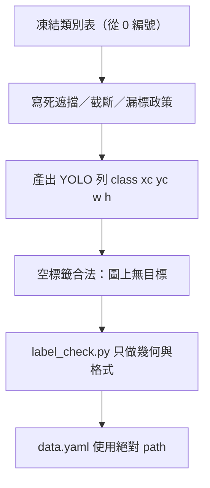

# 第 05 章：標註政策、YOLO 格式與標籤檢查

本章處理一件訓練前就必須凍結的工程決策：偵測框怎麼標、標完怎麼存、以及機器能自動擋下哪些壞標。YOLO detection 的一列是正規化的 `class xc yc w h`；目錄樹把影像與標籤分開；`data.yaml` 必須寫死絕對路徑，避免「看起來相對、實際依當前工作目錄推測」。空標籤檔合法，代表這張圖沒有任何目標。幾何與格式錯誤可以用 [`label_check.py`](label_check.py) 擋下；語意漏標不能靠它發現。

## 讀本章之前要先定的決策

標註不是「把看得見的東西都框起來」這麼一句話。遮擋要標可見部分還是完整物體、截斷到畫面外要不要硬補、漏標要當背景還是當事故——這三件事會直接改寫損失裡正負樣本的定義。政策不定，後面的格式檢查再嚴也只是在檢查一份不一致的資料。

本章假設你已經有影像清單與類別表。類別編號從 `0` 起算，與 Ultralytics 偵測資料格式一致。跨章的訓練與增強設定不在這裡展開，見 [../04/index.md](../04/index.md) 與 [../06/index.md](../06/index.md)。

## 本章頁面

| 頁面 | 要解決的工程問題 |
| --- | --- |
| [標註政策：遮擋、截斷、漏標與空標籤](annotation-policy.md) | 人怎麼標才跟損失函數同一套定義 |
| [YOLO 格式、目錄樹、data.yaml 與檢查腳本](format-and-check.md) | 機器怎麼存、怎麼驗、驗不到什麼 |
| [`label_check.py`](label_check.py) | 標準庫檢查器：非整數 class、NaN/Inf、負寬高、四邊越界 |

## 官方來源

格式與目錄約定以 [Ultralytics Detect Dataset](https://docs.ultralytics.com/datasets/detect/) 為準。本章數值例子與命令列皆為說明用，標了「未實跑」的指令沒有在本環境執行，也不捏造版本號或指標成績。
