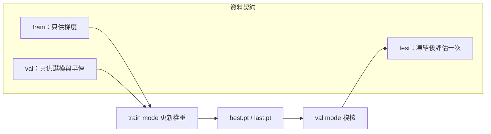

# Baseline 訓練：健檢、smoke、命令與停止條件

[回章首](index.md) · [下一頁：Checkpoint 與實驗紀錄](checkpoints-and-records.md)

## 情境：你現在缺的是對照組，不是冠軍

專案第一次訓練經常同時塞進「換更大模型、開強增強、拉長 epoch、邊看 test mAP 微調」。結果無法回答一個工程問題：**這份資料、這個設定、這個預訓練起點，本身能不能學？** Baseline 的任務是把變因鎖死：模型固定為 `yolo11n.pt` 微調、資料分割固定、超參寫死、只用驗證集做停止與選權重。`yolo11n.pt` 是 Ultralytics YOLO11 系列的 nano 預訓練權重，適合當管線探針；它不是最新競賽冠軍，後續若換更大權重或不同系列，必須另開實驗、不可覆蓋這條線。

CPU 可跑，但只證明「程式能走到存檔」，不證明「這個 batch／imgsz 在正式機上合理」。把 CPU 上的 `batch=2、workers=0、epochs=3` 當成效能基準，會讓你在 GPU 上誤判吞吐與 OOM 邊界。

## 原理：train 更新、val 選模、test 封存

官方 [Train mode](https://docs.ultralytics.com/modes/train/) 的核心契約是：優化器只看訓練集；每個 epoch（或設定的間隔）在驗證集上算指標，用以寫入 `best.pt` 與早停。官方 [Val mode](https://docs.ultralytics.com/modes/val/) 則是**固定權重**的獨立評估，不應在調參迴圈裡反覆對 `test` 呼叫。

工程決策由此直接導出：

1. **YAML 裡的 `train`／`val`／`test` 三條路徑必須互斥。** 調參期間只準看 `val`。`test` 只在 baseline 宣告凍結後評估一次，成績寫進紀錄就封存；不可因為 test 不好就回頭改 mosaic、lr 或 epoch 再測同一份 test。
2. **驗證集是「選模預算」，不是無限觀察窗。** 每個超參組合都會消耗一次 val 資訊。Baseline 階段禁止網格式狂掃；先一條預設線跑完，再在後續章節做有紀錄的單變因實驗。
3. **少 epoch smoke 的通過條件是「資料與計算圖沒有靜默失敗」，不是「mAP 達標」。** Loss 能下降、每個 batch 有標籤、checkpoint 能寫出，才允許進入正式 epoch。



## 資料健檢（正式 train 之前必做）

在呼叫 `YOLO.train` 之前，先用同一份 `data.yaml` 把下列項目變成**可勾選的紀錄**，而不是口頭「應該沒問題」：

- **路徑**：`path`、`train`、`val`、`test` 解析後的絕對路徑存在；影像副檔名與標籤 `.txt` 一一對應。缺標籤的圖在 detect 任務常被當成負樣本或直接跳過，行為取決於版本與設定，不可假設「沒標籤就好」。
- **類別數**：`nc` 與 `names` 長度一致，且與標註 id 範圍一致。id 超出 `nc-1` 會在訓練中爆掉或靜默錯類。
- **空標籤與極小框**：統計「零物件影像比例」「框寬高小於 1 pixel 的數量」。Zero labels 不一定是 bug（背景圖可存在），但若 **整個 loader 都讀到 0 個 label**，多半是標籤目錄指錯、YOLO txt 與影像 stem 不一致、或分割檔列出了未標註集合。
- **分割洩漏**：用檔名集合做交集。`train ∩ val`、`train ∩ test`、`val ∩ test` 必須為空。同一張圖因符號連結或複製而出現在兩側，等於把答案洩給 val。
- **快取與清單**：若使用 cache，確認 cache 檔對應**當前**資料，而不是舊標註的快取。改標註後未刪 cache，會訓練過期框。

健檢通過的定義建議寫死：路徑可解析、三集合無交集、抽樣 N 張可視化框正確、loader 第一個 epoch 的標籤計數大於 0。未通過就禁止加 epoch。

## 少 epoch smoke（建議 1～3 epoch）

Smoke 的目的是用最小成本暴露：錯誤裝置、錯誤 workers、OOM、資料為空、以及「訓練看似在跑但梯度沒吃到標籤」。數值例子（**未實跑，僅作數量級說明**）：若正式打算 `epochs=100、batch=16、imgsz=640`，smoke 可先 `epochs=2、batch=4、imgsz=640`，確認 `results.csv` 有寫入、`weights/` 出現 `last.pt`。不要在 smoke 階段解讀 mAP 高低，更不要因此改模型規格。

CPU smoke 可再降：`device=cpu`、`workers=0`、`batch=2`。這只驗證匯入與資料管線。同一組超參換 GPU 後，batch 與 workers 必須重估，不可沿用 CPU 的「能跑」當正式設定。

## 明確命令：CLI 與 Python（未實跑）

以下命令取自官方 Train 文件的呼叫形狀，路徑請換成你的 `data.yaml`。**本手冊未實跑這些命令，不提供版本號、不提供 mAP／loss 成績。**

CLI（官方文件常見形狀）：

```bash
# 未實跑。yolo11n.pt 為預訓練起點，非冠軍保證。
yolo detect train data=path/to/data.yaml model=yolo11n.pt epochs=100 imgsz=640 batch=16 device=0 project=runs/detect name=baseline_yolo11n
```

少 epoch smoke：

```bash
# 未實跑。只驗證管線，不根據指標改架構。
yolo detect train data=path/to/data.yaml model=yolo11n.pt epochs=2 imgsz=640 batch=4 device=0 name=smoke_yolo11n
```

CPU 管線驗證（非效能保證）：

```bash
# 未實跑。workers=0 可避開部分多進程問題；不代表正式吞吐。
yolo detect train data=path/to/data.yaml model=yolo11n.pt epochs=1 imgsz=640 batch=2 device=cpu workers=0 name=smoke_cpu
```

等價 Python（官方 Train 文件的 `YOLO.train` 形狀）：

```python
# 未實跑。seed 有助對齊，但不保證完全重現。
from ultralytics import YOLO

model = YOLO("yolo11n.pt")
model.train(
    data="path/to/data.yaml",
    epochs=100,
    imgsz=640,
    batch=16,
    device=0,
    seed=0,
    project="runs/detect",
    name="baseline_yolo11n",
    exist_ok=False,
    pretrained=True,
)
```

驗證（固定權重，調參期只對 **val 分割**；**未實跑**）：

```bash
# 未實跑。model 指向本次 run 的 best.pt；data 必須與訓練同一份 YAML。
yolo detect val model=runs/detect/baseline_yolo11n/weights/best.pt data=path/to/data.yaml split=val
```

```python
# 未實跑。split 預設行為請以當前官方 Val 文件為準，呼叫時顯式寫出以免誤打到 test。
from ultralytics import YOLO
YOLO("runs/detect/baseline_yolo11n/weights/best.pt").val(data="path/to/data.yaml", split="val")
```

`test` 分割的 val／predict **不在調參迴圈內**。Baseline 凍結後才允許：

```bash
# 未實跑。只評估一次，結果寫入實驗紀錄後不再為了刷這條數字而改超參。
yolo detect val model=runs/detect/baseline_yolo11n/weights/best.pt data=path/to/data.yaml split=test
```

關鍵參數請在命令或 Python 呼叫中**寫死並存檔**，不要依賴「終端機預設值」。至少鎖定：`model`、`data`、`epochs`、`imgsz`、`batch`、`device`、`workers`、`seed`、`project`、`name`、`patience`（若使用早停）、`cache`、`pretrained`。官方 Train 頁列出的完整參數表會隨套件演進，紀錄時應保存**實際印出的 args**（見 [Checkpoint 與實驗紀錄](checkpoints-and-records.md)），而不是事後憑記憶補。

## 停止條件（寫進實驗說明，不要靠感覺）

建議同時設定**硬上限**與**早停**，並在紀錄中寫明觸發的是哪一條：

- **硬上限**：`epochs` 到達即停。例如計畫 100 epoch，就不要在 40 epoch 因「看起來還行」手動殺程又說這是完整 baseline。手動中斷必須標記為不完整 run。
- **patience 早停**：驗證指標連續 N 個 epoch 無提升則停。N 要大到跨過學習率排程的前期震盪；過小會在 warmup 後誤殺。具體預設值以你安裝的套件印出為準，**此處不捏造預設數字**。
- **資源中止**：OOM、磁碟滿、NaN loss。這三種都不是「模型收斂」，實驗狀態應標 `failed`，並留下最後一個完整 checkpoint（通常是 `last.pt`）與 traceback。
- **資料中止**：出現整 epoch `zero labels`、類別數不匹配、或 val 集合為空。應立刻停，而不是降 batch 硬跑完。
- **成本中止**：預先寫下可接受的 GPU 小時或牆鐘時間。超過則停並記錄「成本耗盡」，避免無紀錄地通宵重跑。

選模一律以 **val** 指標為準來決定哪個權重叫 best；test 數字不得進入停止判斷。

## 故障排查

### OOM（CUDA out of memory / 系統記憶體爆）

決策順序：先減 `batch`，再減 `imgsz`，再關記憶體密集增強，最後才換更小模型。不要一開始就把 `yolo11n` 換成更小以外的「隨便砍網路」。`workers` 過高會讓**主機 RAM**在資料預取階段先爆，症狀有時不像 CUDA OOM。CPU 訓練把 `batch` 開成 GPU 同款，常直接把機器拖死。

可嘗試（**未實跑**）：`batch=8` → `4` → `2`；`imgsz=640` → `512`；`cache=False`；`workers=2` 或 `0`。每一次只改一個變因，並在 run 名稱標記，例如 `baseline_yolo11n_b4`。

### Zero labels

日誌若出現標籤計數為零、或 loss 中分類／框分項異常地不更新，先不要調學習率。檢查：標籤是否為 YOLO 格式（class x_c y_c w h，正規化 0～1）；影像與 txt 是否同 stem；`data.yaml` 的 `train` 是否指到影像清單而標籤在預期的平行 `labels/` 目錄；是否誤用分割標註或絕對像素框。抽一張用官方文件建議的視覺化方式確認框落在物體上。若只有部分影像為空，記錄比例；若 loader 全域為零，run 作廢。

### 多進程問題

`workers>0` 在 macOS／Windows 上常碰到 DataLoader 的 spawn／fork 問題：重複匯入、卡死在第一個 epoch、或子行程靜默退出。工程上 smoke 先 `workers=0` 證明單進程可跑，再逐步加 workers 並觀察 CPU 與 RAM。Docker 或 CI 裡也優先 `workers=0` 換穩定性。不要把多進程錯誤解讀成「YOLO 權重壞了」。

其他常見靜默失敗：`device` 寫錯導致其實在 CPU 上爬；`exist_ok=True` 覆蓋舊 run 使紀錄混亂。

## 限制

- `yolo11n.pt` 微調不代表該任務的上限，也不是論文 SOTA。
- CPU 可完成 smoke 與短訓練，不能外推 GPU 訓練時間、最終指標或可上線的延遲。
- `seed` 加上確定性旗標仍可能因 cuDNN、非確定性原子操作、資料增強與多進程而無法位元級重現（詳見下頁）。
- 官方參數預設值隨套件改變；以當次 run 印出的 args 與 [Train](https://docs.ultralytics.com/modes/train/)、[Val](https://docs.ultralytics.com/modes/val/) 頁面為準，不要複製過期部落格的「最佳超參」。
- 本頁所有命令與數值例子均**未實跑**，不含任何捏造的 mAP、FPS 或套件版本。

## 官方來源導讀

- [Train mode](https://docs.ultralytics.com/modes/train/)：讀「用法」裡的 CLI／Python 最小例子，再讀參數表中與 `data`、`epochs`、`imgsz`、`batch`、`device`、`workers`、`resume`、`patience`、`pretrained`、`project`／`name` 相關的條目。重點是：**train 會在驗證集上追蹤表現並寫 checkpoint**，不是只掃訓練 loss。
- [Val mode](https://docs.ultralytics.com/modes/val/)：讀 `split` 與 `model` 的含義。Val 是評估已有權重；把它當訓練內環、或對 test 反覆呼叫，會破壞本章的資料契約。

讀完這兩頁後，應能獨立寫出一條不碰 test 的 baseline 命令，並知道 OOM／zero labels／workers 該先查資料與資源，而不是先換冠軍模型。
