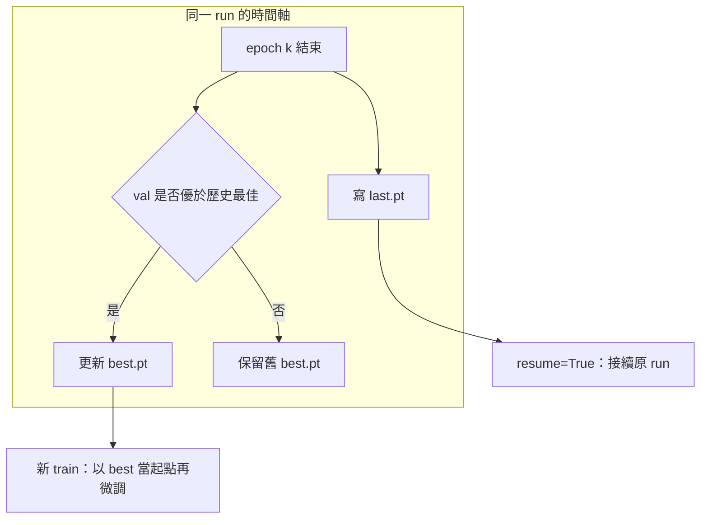

# Checkpoint 與實驗紀錄：best／last、resume 與雜湊

[回章首](index.md) · [上一頁：Baseline 訓練](baseline.md)

## 情境：權重檔不是戰利品，是可審計的狀態

Baseline 跑完後，目錄裡通常會有 `weights/best.pt` 與 `weights/last.pt`，以及 `args.yaml`、`results.csv` 一類產物（實際檔名以當次套件為準）。若沒有約定這些檔案的**用途**與**如何接續**，下一次訓練會出現三種災難：把未收斂的 `last.pt` 當上線模型；在已結束的 run 上誤 `resume` 把計數器接錯；或從 `best.pt` 再開一輪卻以為自己只是「繼續同一個實驗」，導致學習率排程、epoch 編號與早停狀態全部錯位。

本頁把 checkpoint 決策與實驗紀錄綁在一起：沒有雜湊與完整參數的權重，不能當 baseline 交付。

## 原理：兩個檔、兩種時間軸

訓練過程同時維護兩條時間軸：

- **優化時間軸**：每個 epoch 結束（或中斷前）的優化器可接續狀態，對應通常所稱的 `last.pt`。它回答「現在訓練停在哪裡」，不一定是驗證集上最好的點。
- **選模時間軸**：到目前為止，**驗證集**上表現最好的權重，對應通常所稱的 `best.pt`。它回答「若現在必須交模型，交哪一份」。

官方 [Train mode](https://docs.ultralytics.com/modes/train/) 以驗證表現驅動 best 的更新；[Val mode](https://docs.ultralytics.com/modes/val/) 則用你指定的那一份 `.pt` 做凍結評估。因此：上線與跨章比較用 `best.pt`；只有在「同一條 run 還沒跑完、要從斷點續跑」時才優先考慮帶完整訓練狀態的 `last.pt`（是否含優化器狀態以該檔實際內容與官方 `resume` 說明為準，**不要假設所有 `.pt` 都能無損 resume**）。



## best 與 last 的用途（寫進交付清單）

| 檔案 | 用來做 | 不要用來做 |
| --- | --- | --- |
| `best.pt` | 交給 val／後續章節的比較、凍結後的一次 test 評估、作為「新一輪微調」的預訓練起點 | 假設它含有可接續的優化器與 epoch 計數；用它 `resume` 同一條未完成曲線（除非你已核對官方行為與檔案內容） |
| `last.pt` | 中斷後 `resume` 原 run、診斷「最後一個 epoch 發生了什麼」 | 直接當最佳模型上線；在 val 已明顯過擬合時仍把它當交付 |

若 `best.pt` 與 `last.pt` 是同一個 epoch，代表最佳點落在訓練結束當下，仍要在紀錄裡寫明「best epoch = last epoch」，以便判斷是否應該加長訓練或其實該早停。

## resume 原 run，與以 best 做「新微調」的區別

這是最容易混的決策，必須在實驗名稱上就分開。

**A. `resume` 原 run：同一條曲線接下去。** 適用於程序被殺、OOM 修好、磁碟滿清掉之後，你要的是**同一個 `project/name`、同一組超參、同一個剩餘 epoch 計數**。官方 Train 文件提供 `resume=True`（CLI 與 Python 皆有對應形狀）。語意是恢復該 run 的訓練狀態，而不是「拿一個權重重新開始」。

```bash
# 未實跑。指向該次 run 可 resume 的 checkpoint（常見為 last.pt）。
# 實際應恢復哪些欄位以官方 Train 的 resume 說明為準。
yolo detect train resume=True model=runs/detect/baseline_yolo11n/weights/last.pt
```

```python
# 未實跑。
from ultralytics import YOLO
YOLO("runs/detect/baseline_yolo11n/weights/last.pt").train(resume=True)
```

resume 時不要順便改 `epochs`、`imgsz`、`batch`、資料 YAML，除非你把這次標成「不純 resume」並視為新實驗。改資料卻 resume，等於在舊優化器動量上餵新分佈。

**B. 以 `best.pt` 開新微調：新的 run、新的排程、新的 epoch 從零計。** 適用於 baseline 已停止（早停或達上限），你決定「從目前最好的權重再降學習率多練一截」或換資料增強。這**不是** resume，必須新的 `name`，例如 `baseline_yolo11n_ft2`，並把 `model=` 設成 `best.pt`。

```bash
# 未實跑。這是新實驗，不是接續原 run。
yolo detect train data=path/to/data.yaml model=runs/detect/baseline_yolo11n/weights/best.pt epochs=50 imgsz=640 batch=16 name=baseline_yolo11n_frombest
```

```python
# 未實跑。pretrained 起點已是你的 best，仍須完整記錄所有參數。
from ultralytics import YOLO
YOLO("runs/detect/baseline_yolo11n/weights/best.pt").train(
    data="path/to/data.yaml",
    epochs=50,
    imgsz=640,
    batch=16,
    name="baseline_yolo11n_frombest",
    resume=False,
)
```

決策規則：官方文件明述可恢復 epoch、optimizer 與 learning-rate scheduler，且僅限相容的 checkpoint 與版本；不保證全部內部 state，也不保證 bitwise 無縫接續 → `resume` 原 run；只要權重當新的預訓練起點 → 新 `name` + `resume=False`。兩者產物的雜湊、參數與成本必須分開存，禁止覆寫原 baseline 目錄（`exist_ok=False`）。

## seed 不保證完全重現

設定 `seed=0`（或任一固定值）是**最低限度的對齊手段**，能減少資料順序與部分初始化的漂移，讓兩次 run 比較時不至於完全不可讀。它**不保證**位元級重現。常見來源包括：GPU 非確定性運算、cuDNN benchmark、多 workers 的取樣順序、增強管線的隨機源、不同硬體的浮點累加、以及套件次版本改預設增強。

工程後果：

- 比較超參時，要求「同一 commit、同一資料雜湊、同一參數檔、同一 seed」，但仍把指標差異小於你紀錄的重複跑波動視為噪音，而不是新發現。
- 需要法律或論文級重現時，額外鎖定 CUDA／驅動／CPU 執行緒數，並在同一台機器重複跑；即使如此，文件中也不應宣稱「完全可重現」，除非你實際做了重複實驗（本章**未實跑**，故不給重複誤差數字）。
- 不可用「我設了 seed」當藉口省略資料雜湊與 `pip freeze`。

## 實驗紀錄：沒寫下來就不算 baseline

每一條訓練線（含失敗的 smoke）建一份紀錄，建議至少包含下列欄位。工具可用純 Markdown 表格或你現有的實驗表，但欄位不可缺。

### 1. 環境：`pip freeze`

在**啟動訓練的同一個 interpreter** 執行 `pip freeze`（或 `uv pip freeze`），把完整輸出存成 `env-freeze.txt` 與 run 目錄一起封存。只寫「裝了 ultralytics」不夠：底層的 PyTorch、NumPy、OpenCV、CUDA 輪子都會改數值。升級套件後必須新開 run，不可在 freeze 不同的環境裡 `resume`。

### 2. 資料雜湊

對會影響標籤的檔案做雜湊，而不是只雜湊 `data.yaml` 路徑字串。最低限度：

- `data.yaml` 的雜湊
- 訓練／驗證／測試清單檔的雜湊（若使用 txt 清單）
- 標籤目錄的彙總雜湊（例如對所有 `.txt` 排序後一併 hash；或保存檔案數、位元組數與抽樣雜湊）

改一張標註卻沿用舊 run 名稱，等於偽造對照組。Cache 檔若存在，記錄 cache 路徑與生成時間，避免過期 cache。

### 3. 權重雜湊

對實際載入的起點權重（例如 `yolo11n.pt`）與產出的 `best.pt`／`last.pt` 分別做檔案雜湊（如 SHA256）。下載的預訓練檔若來源鏡像不同，檔名相同不代表內容相同。後續章節若宣稱「從第 07 章 baseline 接著做」，必須對得上 `best.pt` 的雜湊。

### 4. 完整參數

保存訓練一開始印出的完整 args（常見為 run 目錄中的 `args.yaml` 或日誌開頭），不要只抄你在命令列「記得有打」的四個參數。遺漏 `mosaic`、`close_mosaic`、`lr0`、`optimizer`、`amp`、`rect` 會讓別人無法重跑。CLI 與 Python 混用時，以**實際生效**的那份 args 為準。

### 5. 錯誤案例

失敗也要建檔。至少記錄：時間、完整 traceback 或關鍵日誌、當時 `batch`／`imgsz`／`workers`／`device`、資料是否已通過健檢、是否 OOM、是否 zero labels、是否多進程卡死、是否誤用 test 分割。同一錯誤第二次出現時，應能靠這份紀錄直接對上處理方式，而不是再猜。

### 6. 成本

寫牆鐘時間、裝置類型（CPU 或哪一類 GPU，不需捏造型號效能）、epoch 數、是否早停、以及粗略的人時（含健檢與排錯）。CPU smoke 的小時數不可拿來預估 GPU 正式訓練。成本是停止條件的一部分：預算用盡應標明，而不是默默換機重跑卻沿用同一 `name`。

範例紀錄骨架（數字僅示意欄位，**非實跑結果**）：

```text
run: baseline_yolo11n
model_start: yolo11n.pt
start_weight_sha256: <填實際雜湊，未計算則留空並標記未算>
best_pt_sha256: <填實際雜湊>
last_pt_sha256: <填實際雜湊>
data_yaml_sha256: <填實際雜湊>
pip_freeze: env-freeze.txt
command: <完整 CLI 或 Python 呼叫>
args_file: runs/detect/baseline_yolo11n/args.yaml
split_policy: 調參只看 val；test 未用於停止或選模
seed: 0（不保證完全重現）
stop_reason: <epochs 達上限 | patience | OOM | zero labels | 成本耗盡 | 手動中斷>
errors: <無 | 連到 error-notes.md>
cost: <牆鐘、裝置、人時>
```

空著雜湊比填假雜湊好；**禁止捏造版本號與指標成績**。

## 故障排查（checkpoint 與紀錄特有）

- **resume 立刻結束或 epoch 計數怪異：** 確認指向的是該 run 的 `last.pt`，且沒有用新 `data` 或新 `epochs` 混在同一條 resume 命令。若 baseline 已正常結束，應改走「從 best 新微調」。
- **best 比 last 舊很多、val 曲線已掉：** 交付用 best；若要診斷過擬合，把 last 的 val 與 train 曲線一併保存，不要把 last 覆蓋成 best。
- **目錄被 `exist_ok=True` 覆寫：** 視為紀錄污染。權重雜湊對不上 freeze 時，整條 baseline 作廢，重跑並改名。
- **只保存了 pt、沒有 args：** 該權重不得進入跨章比較。補不到參數就只能當無法審計的探索檔。

## 限制

- 不同 Ultralytics 版本寫入 checkpoint 的鍵可能不同；跨大版本 resume 可能失敗。升級後應新開微調，而不是強行 resume。本手冊不給具體版本號。
- 雜湊只能證明檔案位元相同，不能證明標註語意正確——健檢與抽樣可視化仍不可省。
- `seed`、freeze、雜湊齊全仍可能因硬體而無法重現；紀錄的目標是**可審計與可比較**，不是魔術般的完全重現。
- 本頁命令**未實跑**。

## 官方來源導讀

- [Train](https://docs.ultralytics.com/modes/train/)：精讀 `resume`、`project`、`name`、`exist_ok`、`pretrained`、`patience`、checkpoint 相關說明，對照「接續同一 run」與「換模型檔重新 `train`」在文件中的不同例子。
- [Val](https://docs.ultralytics.com/modes/val/)：確認評估時 `model=` 應指向你要交付的那份權重（通常是 `best.pt`），且 `split` 在調參期為 `val`。Val 不會幫你更新 best／last；選模是 train 期間的工作，val 是事後複核。

完成紀錄封存後，第 07 章的 baseline 才算結束；之後任何改動都必須新 `name`，並在 [第 07 章目錄](index.md) 的決策順序上從「凍結的對照組」往前加一個變因。
