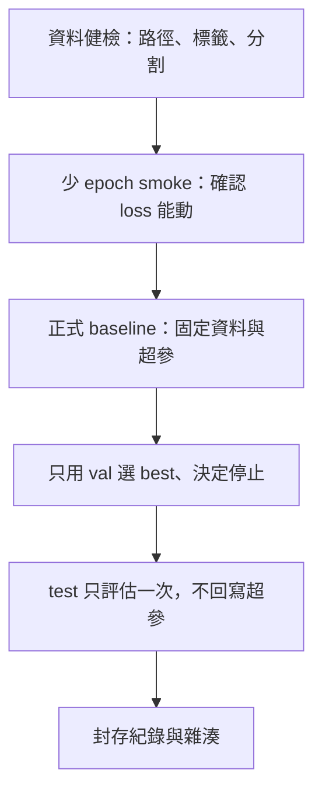

# 第 07 章：Baseline 訓練

本章處理的不是「把預訓練權重丟進去跑到收斂」，而是把**可比較、可復現、可停止**的第一條訓練線立起來。官方把訓練與驗證拆成兩個 mode：[`train`](https://docs.ultralytics.com/modes/train/) 負責在 `train` 集合上更新權重並在 `val` 上選 checkpoint；[`val`](https://docs.ultralytics.com/modes/val/) 負責用固定權重做獨立評估。兩者都讀同一份資料設定，但職責不同——混用會讓你以為模型變強，其實只是把測試集看穿了。

## 這條 baseline 是什麼、不是什麼

`yolo11n.pt` 預訓練微調是工程上合理的**起點**：權重小、CPU 也能勉強跑通流程、對資料與管線錯誤極敏感。它**不是**最新冠軍、也不是你任務上的最終架構。把 nano 微調當競賽答案，會讓後續章節的模型放大、資料擴充、超參搜尋全部失去對照組。

Baseline 的交付物是一組**可被後人重跑的紀錄**，不是一張漂亮的曲線：

- 通過資料健檢與少 epoch smoke 的證據
- 一條只用 `train`／`val` 決策、從未用 `test` 調參的訓練線
- `best.pt`／`last.pt` 的用途說明與是否 `resume` 的紀錄
- 環境、資料雜湊、權重雜湊、完整參數、錯誤案例與成本

## 決策順序（先擋錯，再談準）

順序不可倒。沒有健檢就上長訓練，最常見的結局是跑了數小時才發現 `zero labels`、路徑指到空目錄、或 `train`／`val` 互相污染。CPU 可以跑通 smoke，但**不是效能保證**：batch、workers、增強與影像尺寸在 CPU 上的時間成本與 GPU 不可比，不能用 CPU 曲線外推正式 SLA。

## 本章頁面

| 頁面 | 決策問題 |
| --- | --- |
| [Baseline 訓練：健檢、smoke、CLI／Python 與停止條件](baseline.md) | 第一次 `train` 該用什麼命令、何時停、哪些故障先排 |
| [Checkpoint 與實驗紀錄：best／last、resume 與雜湊](checkpoints-and-records.md) | 權重怎麼接續、什麼必須寫進實驗紀錄才算 baseline |

資料切分見 [第 04 章](../04/index.md)，標註格式見 [第 05 章](../05/index.md)，評估見 [第 06 章](../06/index.md)；環境與套件鎖定見 [第 02 章](../02/index.md)。本章命令皆標示**未實跑**，不捏造版本號或指標成績。
