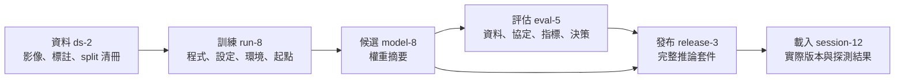

# 生命週期追溯：從發布版本找回資料與訓練

現場回報「昨天更新後漏檢變多」，你找得到 `best.pt`，卻不知道那份模型用了哪次修標、哪組前處理，以及哪份評估報告。檔名相同不能回答這些問題。

資料凍結沿用 [第 04 章](../04/split-and-version.md)，訓練紀錄沿用 [checkpoint 頁](checkpoints-and-records.md)。本頁只補上它們之間的關係。以下 ID 與數字均為合成例，沒有模型成績宣稱。

## 先區分產物與產生它的工作

**產物**是保存下來的資料、模型、設定或報告；**執行**是使用輸入並產生輸出的那次工作。TensorFlow 的 [ML Metadata](https://www.tensorflow.org/tfx/guide/mlmd) 以 Artifact、Execution 與 Event 記錄這種關係並追溯上下游。本書借用這個區分，使用檔案清冊與明確 ID 即可開始，不要求安裝 TFX。

若有匯出／量化，在候選與評估間另記一筆執行及其輸出；發布所引用的評估必須覆蓋實際部署產物與設定。原始 `.pt` 的評估不能直接當作量化引擎的合格證明，沿用 [輸出一致性](../20/output-consistency.md) 與完整資料集評估。

## 最小紀錄表

| 紀錄 | 必須能找回的內容 |
|---|---|
| `dataset_version` | 影像與標註清冊及內容摘要、split 指派、group 規則、類別契約 |
| `run_id` | 資料版本、起點權重、實際設定、程式 commit 或封存摘要、環境、seed、停止原因 |
| `artifact_id` | 產生它的 run／匯出執行、位置、大小、完整內容摘要、格式 |
| `evaluation_id` | 實際模型摘要、評估資料與協定、前後處理、原始指標、門檻版本、通過／拒絕理由 |
| `release_id` | 要一起載入的模型、類別、前後處理與執行環境；上述清冊摘要與合格評估引用 |
| `activation_id` | 本次切換的前版、目標版、結果、服務啟動身分與實際載入摘要 |

ID 用來查找；摘要用來核對內容。兩者都需保存。相同資料可以訓練多個模型；相同模型可以有多份評估；同一發布版本可以先上線、回滾後再上線。最後一種情況保留 `release_id`，另建 `activation_id`，不要覆寫舊切換紀錄。

固定清冊的編碼與序列化方式，摘要以實際保存的位元組計算。修改內容就建立新版本；不能保留 ID 卻偷偷改指向。若程式尚未提交，另存 patch 或原始碼快照及摘要，單寫目前 HEAD 會漏掉實際執行的修改。

## 一次資料更新怎麼走

已發布 `release-2` 來自 `ds-1 → run-4 → model-4 → eval-3`。

今天修正十張標註，建立 `ds-2`，保留修正清單。即使影像位元組完全相同，標註內容改了，資料版本仍不同。以 `model-4` 為起點建立 `run-8`，記錄父模型；產出 `model-8` 後用預先凍結的協定完成 `eval-5`。

- 評估拒絕：保存 `model-8` 與拒絕理由，現行仍是 `release-2`。
- 評估通過：建立完整 `release-3`，依 [載入一致性](../22/release-consistency.md) 切換並取得回報。
- 之後回滾：新增切換紀錄，目標指回完整 `release-2`；`release-3` 與它的評估證據仍保留。

這樣從線上一筆輸出上的 `release_id` 與 `session_id`，就能反查當時載入的套件，再追到訓練資料。只有 Git commit 無法找回未納入 Git 的影像與權重；只有權重雜湊也無法找回設定與評估。

## 發布入口檢查的是關係

發布入口至少檢查：引用存在、摘要相符、評估完整、評估對象與候選一致、協定與門檻是核准版本、決策為通過。缺欄位、NaN／Infinity、未覆蓋必要類別或只有手寫 `passed=true`，均不能當合格證據。

雜湊能指出內容變了，不能證明資料來源可信或有人核准發布。以上假設紀錄由受控工作流程產生；若接受外部提交，需另做來源授權與格式驗證。記錄中的資料位置也應避免攜帶帳密與私人影像內容。

## 練習與判準

給你同一個權重檔，部署 conf 從 0.25 改成 0.5：哪些紀錄須變？再給你同一發布版本重新上線：哪些紀錄可沿用？

### 核對答案

改 conf 會改變完整推論套件，建立新設定與發布版本，並取得涵蓋新設定的評估證據；不用因此重訓權重。同一完整版本重新上線，可沿用不可變套件與仍適用的評估，但須新建切換與服務工作階段，重新取得載入及健康證據。若現場資料或環境已變，需另外重驗。

來源查核：2026-09-28，ML Metadata 的資料模型與 lineage 查詢用途；本頁欄位、ID 與發布規則為教學設計。接著讀 [持久化任務](persistent-tasks.md)，確認紀錄在中斷後仍能使用。
