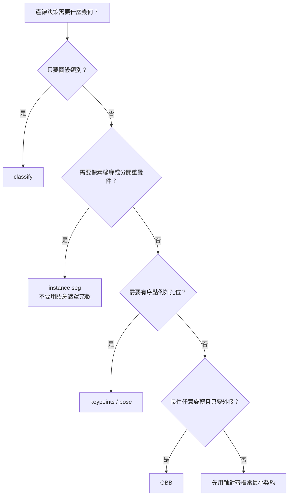

# 超越框：分類、實例分割、關鍵點與旋轉框該怎麼選

[四任務操作與 Results 取用](usage.md)

日期：2026-09-08。權重 git commit 未知。不引用未讀論文，不描述未執行的訓練。工廠流程為合成示例。標「設計判斷」或「推論」的句子不是公開文件原文。

## 先選契約，再選模型

檢測框只回答「哪裡有一個軸對齊矩形」。分類、實例分割、關鍵點、旋轉框（OBB）各自保證另一種輸出。選錯任務時，標註預算會花在錯誤幾何上，線上後處理也會解錯張量。輸入、輸出與失敗語義應寫成契約，細節見 [任務契約](task-contracts.md)。

（設計判斷）「比較準」不是選任務的標準。標準是：產線決策需要的最小幾何是什麼，以及你願意為這個幾何付多少標註與延遲。

## 公開任務表：權重不能混用

根據 Ultralytics Tasks 公開頁（<https://docs.ultralytics.com/tasks/>，2026-09-08），當前框架列出 detect、instance segment、semantic segment、depth、classify、pose、OBB。不同任務使用不同權重，並非一個模型同時保證全部輸出。語意遮罩給每個像素一個類別，**不辨識實例**：重疊的同類物件會連成同一塊標籤。

YOLO26 公開頁（<https://docs.ultralytics.com/models/yolo26/>，同日）列出權重後綴 `-seg`、`-sem`、`-depth`、`-cls`、`-pose`、`-obb`，並說明各任務支援 train、val、predict、export。後綴就是契約名。把 detect 權重載進分割後處理，不是功能降級，是輸出對不上。

（推論）部署清單應把權重檔名後綴與後處理函數鎖在同一版說明裡；只鎖一張 mAP 表不夠。

## 四種契約、標註增量與指標

相對「已經在標軸對齊框」這個基線：

**分類（classify）。** 契約：整張圖一個（或一組）類別。不保證位置、數量、姿態。標註增量最低，通常是目錄名或圖級標籤。指標用 top-1 與每類 recall。失敗：一張圖兩個類別共存時，圖級答案無法指出哪顆是混料。

**實例分割（instance segmentation）。** 契約：每個實例一份像素遮罩。不保證關鍵點序，也不定義旋轉角。標註增量高，要畫多邊形或刷像素；毛邊與半透明邊緣最貴。指標用 mask mAP、mask IoU。失敗：用語意分割代替實例，重疊件無法計數；用框 mAP 當驗收，遮罩破洞仍可能過關。

**關鍵點（pose / keypoints）。** 契約：有序點座標，通常加可見性。不保證輪廓，也不給穩定外接矩形。標註增量隨點數與遮擋規則上升：每點要約定名稱、順序、不可見時是否仍標。指標用 OKS 或 PCK。失敗：點序對調，或遮擋點仍強迫回歸，夾爪座標會落到空氣中。

**旋轉框（OBB）。** 契約：帶角度的外接矩形（四角，或中心寬高加 θ）。不保證像素級缺陷形狀。標註增量中等，比軸對齊框多一個角參數。指標必須用旋轉 IoU 的 mAP。失敗：θ 的 0°/180° 週期讓損失振盪；用軸對齊 IoU 驗收，會把「框很大但角全錯」算成高分。

（設計判斷）成本排序大致是：classify ≪ 框 < OBB < keypoints（視點數）≤ instance seg。這是相對量級，不是工時報價。

## 合成示例：輸送帶上的長條金屬片

場景（合成，非某廠紀錄）：長條金屬片可能正放或斜放，允許輕微重疊；邊緣可能有毛刺；兩端各有一個定位孔，夾爪要對孔。照明穩定、相機俯視。

1. 問題若是「這張圖有沒有混入別種料」：分類足夠。驗收切片必須包含邊角混料與一圖兩料；後者若經常發生，契約應升到檢測或分割。
2. 問題若是「數顆並給抓取粗位」、且零件接近方形：軸對齊框通常夠。長條件旋轉約 45° 時，軸對齊框面積會遠大於真實佔用，NMS 可能把兩件合成一件。這時契約應改 OBB。
3. 問題若是「真空吸盤要避開毛刺與重疊區」：需要實例遮罩。語意遮罩會把兩片黏成一塊，吸盤會當單件。重疊可數、遮罩與金屬輪廓的 IoU，必須寫進驗收，不能只看框。
4. 問題若是「夾爪對兩個孔」：關鍵點。事先鎖定點序（上游孔、下游孔）與可見性碼：被另一片擋住時標不可見，推論端禁止把低可見性點送進運動規劃。驗收要有對調與遮擋兩組案例。
5. 不要把 3 與 4 塞進同一個權重。公開任務表是分權重的。（設計判斷）產線應串兩次推論：先用實例遮罩過濾可抓件，再對單件或 ROI 跑孔點。

## 部署失敗模式與驗收

常見失敗不是「模型不夠大」，而是契約錯配：權重後綴與後處理不一致（例如 `-cls` 當檢測解碼）；語意輸出拿去數件或做單件抓取；OBB 的 θ 單位（度或弧度）與導出圖不一致；關鍵點沒有可見性閘門，運動控制照單全收；用軸對齊評估腳本去驗 OBB 或 mask。

把驗收寫成可拒絕的句子：分類在「一圖兩料」切片 recall 低於門檻則改檢測；實例分割在重疊對上仍須能數出件數；關鍵點標為不可見時不得進入夾爪指令；OBB 主指標為旋轉 IoU mAP，軸對齊 mAP 只當對照。門檻由產線風險自訂，本文不給假精度。

## 操作步驟（通用）

1. 用一句話寫死輸出型別：圖級類別、像素實例、有序點、或旋轉框。對不上就還在用框的契約。
2. 按公開後綴選權重。假設「一個模型全輸出」與公開說明相反。
3. 先標最小契約的驗證集，專門收集最怕的失敗切片，再決定是否加碼標註。
4. export 之後用同一後處理複驗，確認張量布局未改。

## 來源與邊界

- Tasks：<https://docs.ultralytics.com/tasks/>（2026-09-08）
- YOLO26：<https://docs.ultralytics.com/models/yolo26/>（2026-09-08，commit 未知）

未讀論文全文；未跑 train / val / predict。合成示例只說明契約如何升級，不是現場數據。
