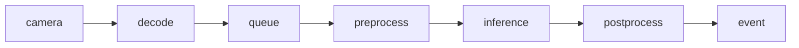

# 吞吐、延遲、新鮮度：佇列會把「即時」吃掉

上一頁把模型從「能跑」推進到「能測」：[TensorRT 計時邊界](../21/index.md)。這一頁只回答一件事：**攝影機 30 fps、推論 20 fps 時，系統到底慢在哪、舊在哪、該不該等 batch。**

Ultralytics 官方文件寫得很直：`stream_buffer=False` 會丟掉舊幀以維持即時；`stream=True` 是 **generator、為了記憶體**，不是延遲 SLA。TensorRT 最佳實務則要求：**計時邊界必須包住你宣稱的那段工作**，不要把 queue 等待算進 kernel、也不要把後處理漏算。

本頁所有數字都是 **假設算式**，不是你機器上的量測。量測環境依 [02 環境準備](../02/index.md) 建立，並保留套件版本。

## 三個不可互換的量

| 量 | 問的是 | 單位直覺 |
|---|---|---|
| 吞吐 throughput | 單位時間完成幾張 | fps、img/s |
| 延遲 latency | 一張從入到出要多久 | ms |
| 新鮮度 freshness | 出結果時，畫面離「現在」多遠 | 幀齡、秒 |

吞吐高可以來自大 batch；延遲與新鮮度卻可能更差，因為 **batch 在等齊**。佇列滿了還繼續塞，延遲單調變差，新鮮度崩掉。

假設生產者 30 fps、消費者穩定 20 fps、佇列無限：

```
淨堆積 = 30 − 20 = 10 幀/秒
t 秒後佇列深度 ≈ 10t
最舊幀等待 ≈ 10t / 20 = 0.5t 秒
```

`t = 2` 時，最舊幀大約已經等了 **1 秒**——畫面還在 30 fps 進，事件卻是一秒前的世界。有界佇列 + 丟舊幀，是把「延遲爆炸」換成「漏檢」，不是免費加速。

## 關鍵路徑上誰在重疊



端到端延遲 ≈ 無法重疊的那段。decode 與 inference 若在不同執行緒／串流，**可以部分重疊**；`queue` 裡的等待 **不能** 跟 inference 抵消——它就是新鮮度的債。batch 等待發生在 `queue`→`preprocess` 之前：為了湊 `batch=N`，前 N−1 張被故意關進等候室。

## 官方行為對照（不要發明語意）

Predict 模式（見 [Ultralytics Predict](https://docs.ultralytics.com/modes/predict/)）：

- `stream=True`：逐結果 yield，降低一次載入全部結果的記憶體；**不保證** 更低延遲。
- `stream_buffer=False`：**丟掉舊幀**，偏向即時／新鮮度，不是更高吞吐。

TensorRT（見 [Performance Best Practices](https://docs.nvidia.com/deeplearning/tensorrt/latest/performance/best-practices.html)）：

- 用 CUDA event / 官方建議的計時包住 **inference 本體**。
- 端到端另開一條計時：`decode`→`queue` 等待→`preprocess`→`inference`→`postprocess`→`event`。兩條數字不准混報。

## 專案驗收（獨立 YOLO venv）

```bash
source .venv/bin/activate
python -c "import ultralytics, torch; print(ultralytics.__version__, torch.cuda.is_available())"
```

預期：印出版本與裝置可用性 `True`／`False`。

最小對照：同一支 `yolo predict`，只改 `stream` / `stream_buffer`，觀察記憶體與是否追上鏡頭，**不要**把 generator 當成延遲保證。

```python
from ultralytics import YOLO

model = YOLO("yolo11n.pt")  # 換成你專案權重
# stream=True：generator，省記憶體
for r in model.predict(source=0, stream=True, stream_buffer=False, verbose=False):
    _ = r.boxes  # 即時路徑：舊幀可被丟掉
    break
```

輸入：本機攝影機 `source=0`（或專案 RTSP URL）。\
輸出：迴圈能取得 `Results`；長跑時 RSS 不隨「累積所有幀的結果物件」線性爆炸。若鏡頭標稱 30 fps 而推論跟不上，`stream_buffer=False` 應讓 **最新幀** 優先，而不是佇列深度無限長。

## 診斷：慢、舊、還是在等 batch

1. **推論計時很短、端到端很長** → 債在 `queue` 或 `postprocess`/`event`，去量佇列深度與幀時間戳差（新鮮度），不要加 batch。
2. **GPU 利用率低、延遲卻高** → 疑 batch 等待或 decode 餵不飽；把 `batch` 設 1 對照。
3. **記憶體漲、延遲沒變** → 你可能關掉了 `stream`，在累積 `Results` 列表；這是官方說的記憶體問題，不是 TensorRT kernel。
4. **計時對不上 TensorRT log** → 計時邊界包錯了：host 同步、`queue.get`、NMS 被算進「推論」。

假設定量（僅供心算，禁止寫進報告當實測）：30 fps 進、20 fps 出、batch=4 且必須湊滿才推論，則平均 batch 等待約 `(0+1+2+3)/4` 幀間隔；幀間隔 1/30 s 時約 **50 ms 量級的「等齊」**，這段加在關鍵路徑上，與 kernel 無關。

下一頁繼續拆：要把新鮮度當 SLA，佇列策略與計時邊界必須分開報——模型快，不等於事件新。
