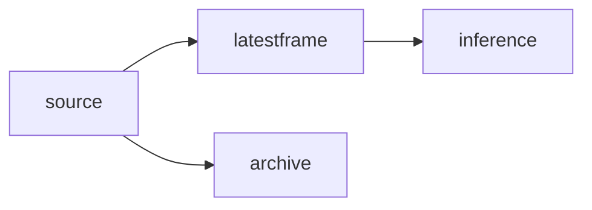

# 即時最新幀佇列與離線全量稽核

即時鏡頭推理與事後稽核是兩條不該混用的契約。前者要的是**永遠只吃最新畫面**；後者要的是**可驗證、可重放的完整紀錄**。Ultralytics Predict 的 `stream_buffer` 只描述推論迴圈怎麼對待來源緩衝，**不是**應用層記憶體上限，也**不是**無損封存。

官方文件（[Predict 模式](https://docs.ultralytics.com/modes/predict/)）的語意可以這樣讀：`stream_buffer=False` 時，舊幀可以被跳過，推論對齊「現在」而非「佇列裡最早那張」。`stream_buffer=True` 會讓來源端較傾向把畫面留下來給後續 `predict` 消費。這**不保證** lossless，也**不保證**你的行程記憶體有界：解碼器、相機驅動、OpenCV 內部佇列、作業系統緩衝都可能在你的 Python 物件之外再堆一層。可靠封存必須走**獨立錄製器**，並用獨立程序驗證完整度（影格數、時長、斷檔），而不是假設「模型看過的就是檔案裡有的」。

`vid_stride` 會按固定間隔抽幀。對短暫事件（閃過的車牌、幾幀的跌倒）與需要連續 ID 的 tracker，這是直接傷害：事件可能整段落在被跳過的間隔裡，軌跡也會因為觀測不連續而斷 ID。即時路徑若要降載，優先用「只留最新一幀」而不是「每隔 N 幀吃一張」。

## 產消速率差：堆積從哪裡來

假設來源穩定產出 30 fps、推論穩定吃 20 fps（假設數字，用來算堆積，不是現場實測）。淨堆積為每秒 10 幀。若佇列無界，十秒後積 100 幀；延遲會接近「佇列深度 ÷ 消費速率」。最新幀策略把深度釘在 1，延遲上界變成「一幀的推論時間 + 取幀開銷」，而不是隨 backlog 線性成長。

時鐘不要混用。佇列裡的單調計數（虛擬 tick、`time.monotonic()`）適合量「從進佇列到被推論」的邊界延遲；相機 PTS／牆鐘適合對齊錄影與稽核。兩者不同源，相減沒有保證意義。新鮮度門檻應可調；例如 200 ms：超過就丟、打點、不要硬推論過期畫面。

## 虛擬時間模擬：`deque(maxlen=1)`

下面是**純標準庫、決定性、虛擬時間**的模擬，不是真實相機。不需要執行緒：一個迴圈裡依 tick 決定「產」或「消」。生產者寫入 index `0..29`；每三個 tick 消費一次。全程 `len(q) <= 1`；結束時最新應為 `29`；丟棄與處理清單分開列出。

```python
from collections import deque

q: deque[int] = deque(maxlen=1)
processed: list[int] = []
dropped: list[int] = []
last_seen: int | None = None

TICKS = 30  # produce indices 0..29
CONSUME_EVERY = 3

for t in range(TICKS):
    incoming = t
    if q:
        dropped.append(q[0])
    q.append(incoming)
    assert len(q) <= 1

    if (t + 1) % CONSUME_EVERY == 0 and q:
        frame = q.pop()
        processed.append(frame)
        last_seen = frame
        assert len(q) <= 1

# leftover latest frame after last produce
if q:
    last_seen = q[-1]
    processed.append(q.pop())

assert len(q) <= 1
assert last_seen == 29
print("processed", processed)
print("dropped", dropped)
print("final_latest", last_seen)
```

解讀：`maxlen=1` 讓新幀覆蓋舊幀，被覆蓋者計入 `dropped`。消費只在虛擬時間的第三拍發生，所以多數畫面從未進推論。這就是即時契約：**正確答案是最新，不是最完整**。若要完整，不要走這條佇列。

## 真實執行緒（與模擬分開）

真實相機執行緒要有明確所有權：誰 `open`、誰 `read`、誰 `stop`。停止路徑應 `join` 並設 timeout；超時要記錄，不要默默洩漏執行緒。`VideoCapture` 必須 `release()`。上游（驅動、解碼、`stream_buffer=True`）仍可能在你的 `maxlen=1` 之外緩衝；應用層有界 ≠ 整條管線有界。新鮮度（例如 200 ms）應做成設定，而不是寫死在推論函式裡。

離線稽核另開一支：**獨立 recorder** 寫入檔案或串流儲存，再用校驗（影格計數、雜湊、時長）證明沒有默默丟幀。即時分支與封存分支只在「來源」分叉，不要讓推論佇列兼當錄影緩衝。



營運上，即時路徑的 SLI 是新鮮度與丟幀率；稽核路徑的 SLI 是完整度與可重放。兩者的告警、容量與保留政策不同，細節見 [stream-ingestion.md](stream-ingestion.md) 與 [operations.md](operations.md)。

**契約對照**：即時＝有界最新幀、可丟、延遲有上界；離線＝獨立錄製、驗證完整、不把 `stream_buffer` 或 `vid_stride` 當成封存保證。相機與解碼器隨時可能丟幀；沒有驗證的「看起來連續」不是稽核。
