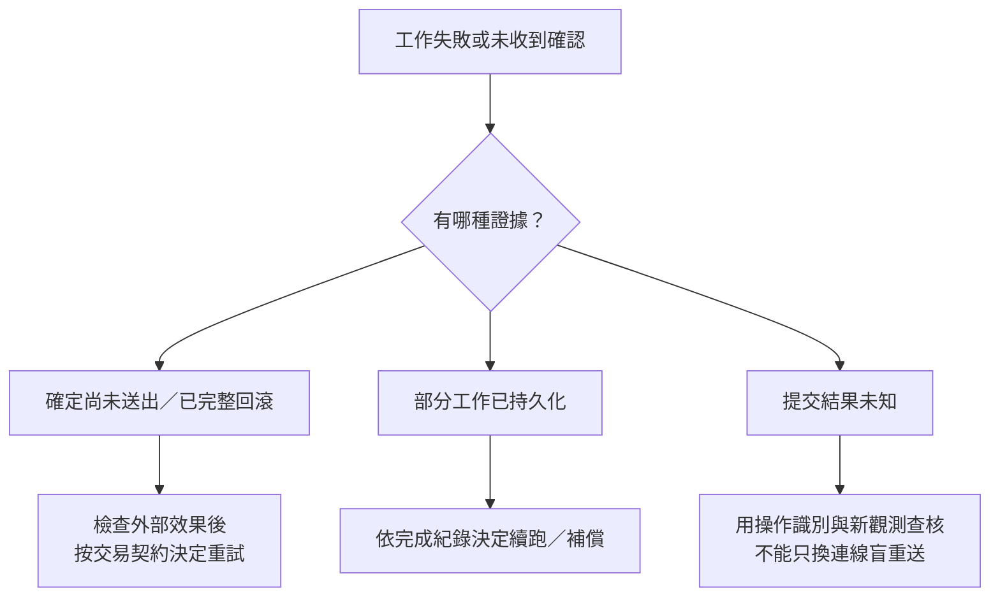

# C++ 接上 SQL 之後：那些有點土，卻能解決問題的工程技巧

副標：從接手陌生專案，到能重跑、敢改動、會判讀的一次工作。

狀態：2026-09-22，第一版 17 章正文、可執行範例與 MkDocs 網站已建立。先前研究保存於 [data/cpp-sql-field-tricks](../../data/cpp-sql-field-tricks/README.md)。下列章卡保留研究階段的設計；實際完成範圍、回修與待補以第 11 節及[出版驗證](../../docs/cpp-sql-field-tricks/appendix-validation.md)為準。不改參考專案。

## 1. 這本書真正要教什麼

你看得懂 C++，也會按 build、下 breakpoint，但接手一套會讀寫 SQL 的程式時，不知道從哪裡開始：GUI 要點很多次、設備不在手邊、重跑會改資料、SQL 工具看起來都正常、失敗後又不確定能不能按第二次。

本書教的是老手在這些時刻會做的小動作：先固定一筆工作，確認跑的是哪個檔案；把輸入存下來，讓同一核心不用整套系統就能跑；暫時攔住寫庫與通知；把結果拆成「讀到了什麼、算出了什麼、真的寫了什麼」；最後才決定留一支腳本、收掉開關，或補交付檢查。

不是 C++ 語法大全、SQL 入門課、ORM 選型指南、DBA 效能百科，也不是重構 legacy 專案的架構宣言。好的土招可以一直簡單，只要知道適用條件、維護代價和不能證明的事。

### 與參考專案的距離

`D:/Siguard/gpmdl-core` 只用來看見常見結構：多種入口、一條 C++ 工作流程、SQL 讀取與逐筆寫回、外部通知。書裡不使用它的私有名稱、資料、模型、設備、協定、目錄布局或憑證。不要求讀者擁有 GPU、工業設備或該 repo。[唯讀觀察範圍](../../data/cpp-sql-field-tricks/local-context.md)另存。

貫穿範例另造一個一般性的「工作清單處理器」：讀取一筆工作和可選文字檔 → 依規則算結果 → 寫結果 → 通知接收端。批次匯入、報表、排程、設備資料處理等專案都能對應，但不聲稱所有專案都應採相同架構。

## 2. 讀者先備與在操作當下補的背景

先備：能讀函式與 class、理解指標／容器、用基本 build/debug/test；不假定熟悉 ODBC、交易或查詢計畫。SQL 只需認得 SELECT／UPDATE／WHERE 的大意，不要求先讀完一本資料庫書。

| 在哪裡第一次需要 | 先用哪個例子補背景 | 再給的概念名稱／類比界線 |
|---|---|---|
| 改 code 卻沒改行為 | 兩份同名 exe、不同啟動工作目錄 | build artifact／有效設定；source 不是執行中產物 |
| 想繞過 GUI | 兩個入口呼叫同一函式 | 輸入邊界；不是複製一份核心當假測試 |
| 怕重跑改資料 | 讀前 reset、寫回、通知分別標記 | 副作用；一個 SQL transaction 不是整個應用的 undo |
| C++ 接到資料列 | 一格 NULL 和空字串、長度超限 | 資料契約／轉型；不是把所有值塞進 string 就結束 |
| bind 後改值 | 驅動稍後才讀同一塊記憶體 | 借用與生命週期；bind 不等於複製 |
| 一列更新卡住 | A 握住資料，B 等 A 放手 | session／交易／鎖；DB 鎖不等於程序內 mutex 的作用域 |
| 同 SQL 兩邊速度不同 | 參數型別、設定、取列數不同 | 執行上下文／計畫；像 build flags 的類比只說明條件會改行為，不暗示優化器等同編譯器 |
| timeout 後再按一次 | 客戶端沒收到完成，但結果可能已存在 | 未知結果／冪等；重試不是重放任意外部操作 |

背景放在第一次影響下一個動作的位置。不得在章首補一頁術語，之後仍跳進整段 80 行程式。

## 3. 具體實驗載體與可移植界線

### 主線選擇

- 第一個可執行版本以 Windows x64、C++17、ODBC、隔離的 SQL Server 測試庫落地；用一個小 CLI target，保留讀者原有 build 工具，不要求先遷移整個專案到 CMake。
- 此選擇是教學落點，不是因參考專案而把書定義成產品專書，也不是宣稱 SQL Server 比其他引擎好。實作採既有 MSVC／ODBC Driver 17 與固定 digest 的 Docker SQL Server 2017；精確版本見出版驗證，不將舊引擎選擇當新專案建議。
- 合成 `Jobs` 資料至少含穩定 `job_id`、輸入值、可空文字、目前狀態；每次實驗有獨立 run 目錄。並行實驗再加入明確版本欄位，重試實驗再加入 operation ID，避免第一章一次塞滿架構。
- 輸入、計算、持久化、通知分成可定位函式；先用少量函式與具名 struct，不把抽象層數當學習成果。
- 小型 `uv` 腳本先只處理檔案；存 Python 需求、dependencies，必要時保留 script lock。連資料庫的 Python 套件與原生 driver 需求另外說明，不讓 uv 變成隱藏環境魔法。

### 三層實驗，不用假 DB 驗真鎖

| 層次 | 操作範圍 | 可以支持的判斷 | 不能外推 |
|---|---|---|---|
| A：無 DB 重播 | 具名 fixture → 同一 C++ 核心 → 結果／意圖檔 | 固定輸入下的核心與比對流程 | ODBC 轉換、SQL 正確性、鎖與交易 |
| B：一條真 DB 連線 | 合成 seed、實際讀取與受控寫回 | API 契約、資料映射、同連線交易邊界 | 多 writer 行為或網路故障下保證 |
| C：兩連線／故障點 | 明確 barrier、有限等待、通知替身 | 指定時序下的阻塞、衝突與恢復 | 生產負載、所有時序或跨 DB 普遍保證 |

PostgreSQL／SQLite／MySQL 以短對照框指出不可照搬的地方；不為每章硬做四套 SQL。API、隔離、錯誤碼、identifier quoting、pooling 都要標引擎與 driver 範圍。若讀者用 ADO／QtSql／SOCI，先對應「在哪個邊界看什麼」，不能把 ODBC 程式原封貼上。

### 實驗安全底線

只使用自造 fixture、專屬測試庫與受限帳號。第一次執行前印出目標身分，但隱去秘密；不把真實資料庫備份自動帶到開發機。不以 production、共用測試庫或未知 schema 做 reset、鎖等待與故障注入。所有阻塞有時間上限與清理方案；不提供廣域清庫命令當捷徑。

## 4. 兩條閱讀路線

### 第一次讀：沿著接手流程

01 確認正在跑什麼 → 02 只跑一筆 → 03 攔住副作用 → 04 保存基準 → 05–06 看清讀取邊界 → 10 核對寫入 → 11 試跑與復原 → 12–13 等待與計時 → 15 故障後下一步 → 16 比對小工具 → 17 保留與交付。

07 在讀不到結果時插入；08 在 bind／生命週期問題時插入；09 在動態 SQL 時插入；14 在工具與程式行為不一致時插入。這不是必須從頭解鎖的課程，每章提供最小 fixture 與前提連結即可獨立操作。

### 已經卡住：依症狀查招

| 現場症狀 | 先讀 | 看完後應能做的下一步 |
|---|---|---|
| 改了沒變／搬機器就不同 | 01、17 | 核對 exe、DLL、設定與實際 mode |
| 每輪要等設備／點很多 GUI | 02–04 | 做出共享核心的單筆重播 |
| 只剩 false／成功但字少了 | 05–06 | 保存完整診斷及欄位指標 |
| SQL 工具有列，程式零列 | 07 | 保留成功／失敗小案例，追 result 序列 |
| bind 的值和執行結果不同 | 08 | 核對 storage 與 execute 時點 |
| 一遇引號或新表就壞 | 09 | 分清值與識別字的處理 |
| 說寫好了，實際沒變／改錯列 | 10 | 用完整主鍵與後置條件驗證 |
| 測完資料回不去／有通知發出去 | 03、11 | 找第一個效果與 rollback 邊界 |
| 偶爾卡住／加 timeout 沒用 | 12–14 | 分辨等鎖、取列與核心計算 |
| 半批成功，能不能再按一次 | 15 | 區分已回滾、部分完成、未知結果 |
| 每次靠眼睛比較，開關容易忘 | 16–17 | 留可重跑 diff 與產物核對流程 |

## 5. 五部十七章：每章的操作與判斷

下列為研究階段章卡，不表示所有候選變體都已驗完；實作狀態見第 11 節。`現有操作` 指可以用 debugger／DB 工具觀察；`新增程式` 指本書新增，絕不是套件內建；`重建` 指變動會進入 C++ 產物。D＝診斷、W＝日常開發、S＝滿足特定條件才可交付的簡化方案。

來源索引：[P01–P14](../../data/cpp-sql-field-tricks/primary-source-checks.md)、[ZH／EN／O](../../data/cpp-sql-field-tricks/field-reports.md)、[L01–L06](../../data/cpp-sql-field-tricks/local-context.md)。來源支持的機制與本書新設計分開，不以本地註解充作產線證據。

### 第一部：先拿回一次工作的控制權

#### 01｜你改的那份 code，真的有跑到嗎？

- 卡點／先動這裡：同一修改有時有效、有時無效。先查執行中產物與有效設定，比開始改 SQL 更便宜。
- 操作與觀察：保留兩份不同 build；預測舊捷徑的 banner → 從程序內印 exe 路徑、build ID、mode／設定來源 → 改用完整路徑啟動新檔 → 對照。DLL 路徑在真的涉及動態載入時才加。
- 判讀／下一步：身分不符先修啟動方式；相符才往資料走。hash 相同不證明 DB 目標或環境相同。
- 概念／代價／收尾：產物、程序與設定生效時機；多一行啟動資訊可長留，hash 清單要跟交付包一起更新，不記秘密。
- 標記／來源／圖：W；新增程式＋重建，平台 API 限 Windows；P01、L01。路徑／標記對照表即可。
- 變化題：exe 相同但工作目錄不同，下一個要核對什麼？判準另頁：設定解析位置與實際載入檔案，而非重新改核心。

#### 02｜不用等設備，先讓一筆工作跑完

- 卡點／先動這裡：每次重跑都卡在 GUI／訊息來源。找一筆工作真正開始處，不必先重寫整個入口層。
- 操作與觀察：隔離效果後保存基準 → 新增單筆 CLI 入口 → 帶同一具名請求進原核心 → 在相同 breakpoint 比較輸入與結果；只省掉外層等待。
- 判讀／下一步：結果不同先查入口的預設值／前處理；相同只支持核心路徑，不支持協定解析與常駐生命週期。
- 概念／代價／收尾：輸入邊界與共用核心；新增入口可能漂移。常用就留一支薄入口，不用先做 plugin 系統。
- 標記／來源／圖：D/W；新增程式＋重建；L01、L02，實驗為編輯設計。必要 flowchart 顯示兩入口匯入同一核心。
- 變化題：CLI 正常、常駐模式失敗，該先換 DB 還是比入口值？判準：保留常駐上下文，查最先不同的邊界。

#### 03｜加一個 test_mode，但別把真正要查的邏輯也跳過

- 卡點／先動這裡：只想看計算卻怕動到資料。把固定輸入與阻止外部效果分開控制。
- 操作與觀察：圈出所有 reset／寫入／通知 → 固定合成輸入 → 共用核心 → preview 只留本地意圖 → 重建後核對 mode banner → 比 DB 前後值和通知替身計數。
- 判讀／下一步：preview 結果穩定不證明真 DB 轉換正確；出現外部變動就追第一個效果，不先補一層無效 rollback。
- 概念／代價／收尾：可控制的位置與副作用；手動硬編碼可以用於一次調查，但修改後的建置、啟動與交付包都要可核對。常用才做明確設定介面。
- 標記／來源／圖：D/W；新增程式＋重建；L02、P01、P07–P08。入口與輸出分支圖，詳見[分段設計](demo-chapter-design.md)。
- 變化題與判準：放在示範設計的獨立折疊區；不靠複製命令通關。

#### 04｜把 SQL 讀出的那一小包值存起來

- 卡點／先動這裡：資料一直變，問題明天就消失。先固定「核心實際吃到的值」，不先備份整個庫。
- 操作與觀察：合成一筆正常與一筆邊界資料 → 保存具名欄位、NULL、型別契約、排序／主鍵、schema 版本及規則設定 → 從檔案重播同一核心 → 比 Result 與意圖。
- 判讀／下一步：檔案也失敗就查核心；只有讀庫路徑不同就查轉換。此存檔點在轉換之後，可能已包含錯誤值，另留 SQL 端型別與讀取指標作對照。
- 概念／代價／收尾：fixture、中間產物、可重跑基準；合成資料可能不足，真資料匯出另需授權與去識別。常用壞例可留下，不要求變成資料平台。
- 標記／來源／圖：D/W；新增匯出與重播＋重建；P03、P13、L03–L04。需要「轉換前／後」小圖，不把檔案畫成完整 DB 替身。
- 變化題：重播通過能否刪掉 DB 測試？判準：不能，未覆蓋的邊界必須指出。

### 第二部：讓 C++ 和 SQL 之間的差異現形

#### 05｜先別只回 false，把那幾筆診斷印出來

- 卡點／先動這裡：上層只知道失敗，不知道是哪個 handle／階段。最小增加觀測，不先換整套 logging framework。
- 操作與觀察：故意查不存在欄位 → 立即收完整診斷 → 再用會產生資訊回傳的小案例 → 對照原布林輸出；先保存訊息再清理。
- 判讀／下一步：按 connect／execute／fetch 階段縮小，不能只靠「有 SQLSTATE」決定重試；診斷被覆寫需調整擷取時點。
- 概念／代價／收尾：錯誤契約、觀測窗口；輸出會含敏感值或干擾時序，常留的是遮罩後摘要與開關。
- 標記／來源／圖：D/W；新增程式＋重建；P02。短輸出對照，不需 Mermaid。
- 變化題：最後一筆清理錯誤蓋過原始錯誤，先改什麼？判準：分別保留原始與 cleanup 狀態，不吞掉其一。

#### 06｜挑一筆最討厭的資料，看看它怎麼變成 C++ 值

- 卡點／先動這裡：多數正常，少數缺字或變成零。特意造 NULL、空字串、超長、非 ASCII、整數邊界，不用先跑整批。
- 操作與觀察：固定明確 SELECT 欄位 → 記回傳碼、indicator、長度與 C 型別 → 每輪只改一欄 → 比 DB 值和 `JobRow`；再以兩種 SELECT 投影順序測位置依賴。
- 判讀／下一步：未完整取值不能當成功；NULL 要有顯式策略，不能和業務哨兵值混同。正式編碼與寬字 API 必須按 driver 核對，不只把 buffer 加大。
- 概念／代價／收尾：資料契約與轉換邊界；可保存小壞例集，完整金額／時區專題暫緩。沒有直接事故證據的部分明示合成實驗。
- 標記／來源／圖：D/W；新增程式＋重建；P03、L03–L04。值／indicator／結果對照表。
- 變化題：換大 buffer 後正常，足夠交付嗎？判準：需檢查長度上限、截斷處理與其他型別，不靠一筆通過。

#### 07｜SQL 工具有兩列，程式卻說零列：縮到一個 batch

- 卡點／先動這裡：懷疑 driver 不支援複雜 SQL。保留成功與失敗各一條最小命令，比整包升級更能回答問題。
- 操作與觀察：以 EN-1 為靈感，自造單列 batch → 比直接 SELECT 與 INSERT＋SELECT → 列出每個 result 的序號、欄數、列數、診斷 → 最後才對照完整讀取迴圈／NOCOUNT。
- 判讀／下一步：先驗證結果序列假說；不把 issue closed 當本機修復證據。縮小時若把 batch 換成單 SELECT，可能已刪掉觸發條件。
- 概念／代價／收尾：最小重現不是最短字串，而是保留失敗條件；result 序列是協定狀態。留 repro 與版本紀錄，wrapper 修改另驗回歸。
- 標記／來源／圖：D；現有查詢操作＋新增觀測／重建；EN-1、O4。需要小型 result 序列圖；精確行為待實測。
- 變化題：加 NOCOUNT 後好了，能否永久忽略多重結果？判準：仍需符合實際 batch 契約，別把 workaround 當完整原因。

#### 08｜bind 時明明正確，執行時為什麼變了？

- 卡點／先動這裡：查 SQL 文字沒問題，參數卻漂移。先讓值與 indicator 活在同一個穩定作用域到執行結束。
- 操作與觀察：安全地 bind 一個存活中的整數 → execute 前改值 → 觀察被使用的值 → 再加入明確快照對照。閱讀原程式的容器搬移／臨時字串，不故意解參考失效記憶體求效果。
- 判讀／下一步：區分 bind 時和 execute 時；若 storage 穩定仍錯，再查 C／SQL 型別與長度，不先指責資料庫。
- 概念／代價／收尾：借用、ownership、deferred read；少量複製可能合理，不必立刻寫通用 binder。保留生命週期契約與小測試。
- 標記／來源／圖：D/W；新增程式＋重建；P05。必要 bind → 改值 → execute 時間圖。
- 變化題：函式回傳後才 execute，review 最先看哪個物件？判準：bound buffer 與 indicator 的擁有者及存活範圍。

#### 09｜先用幾個固定表名，別急著造萬用 SQL

- 卡點／先動這裡：一個引號或新名字就壞，通用拼接越改越大。對有限需求用允許清單映射，值另外參數化。
- 操作與觀察：先給兩個合法操作代號 → 對應固定目標 → 合成含引號的值 → 加未知代號與過長名稱反例 → 看哪些應在執行前拒絕。
- 判讀／下一步：名稱的 quoting、目標授權、值綁定分開；內網不替代驗證。真的需要任意 schema 時才擴大設計。
- 概念／代價／收尾：犧牲通用性換可檢查範圍；每新增目標需改表，是有界且可能可交付的成本，不強迫抽象化。
- 標記／來源／圖：W/S；新增程式＋重建；P06、L05。映射表即可，SQL Server quoting 不泛化其他引擎。
- 變化題：合法且 quote 完的表名是否一定允許更新？判準：語法正確不等於業務授權。

### 第三部：敢寫回，也知道怎麼收回

#### 10｜它說成功，不代表真的改到那一列

- 卡點／先動這裡：沒報錯但資料沒變。先查命中與後置條件，不用重跑整批求偶然成功。
- 操作與觀察：一列 seed → 正確 key／不存在 key／相同值三組 → 記 affected rows 可用性 → 以完整 key 讀回 → 讓讀者比較意圖和實際結果。
- 判讀／下一步：查錯庫、錯 key、舊值／版本條件；若有其他 writer，讀回不是本次寫入的獨占證據，需要版本或操作標記。
- 概念／代價／收尾：API 完成 vs 業務完成；多一次驗證有成本，可按重要性保留。不同 driver row count 不強行統一成相同值。
- 標記／來源／圖：D/W；現有操作＋新增程式／重建；P04、L05。意圖／命中／最終值表。
- 變化題：count 不可得但最終值正確，能說本次一定成功嗎？判準：辨識並行者與原本相同值的可能。

#### 11｜想試寫再反悔？先確認 rollback 管得到哪裡

- 卡點／先動這裡：測完撤不回。從一列、同一 connection 和明確交易開始，不拿整批加一行 rollback 賭結果。
- 操作與觀察：每輪重建 seed → 比 autocommit／manual-commit 下的試寫與結束 → 原連線讀自身變更 → rollback 後獨立連線核對。可見性與阻塞細節另記隔離設定。
- 判讀／下一步：SQL 值恢復不代表檔案或通知恢復；先查實際 transaction scope。外部效果用替身，本地報告保留作證據。
- 概念／代價／收尾：原子性有作用域；交易會占資源，長時間停 debugger 只在獨占實驗庫。一次調查可留下紀錄，不必全部平台化。
- 標記／來源／圖：D/W；新增 C++ 交易控制＋重建；P07、P13、L02。需要 transaction 範圍與外部效果圖。
- 變化題：rollback 後 sequence／identity 是否必須無跳號？判準：不能拿號碼連續性當通用 rollback 判準，查目標引擎契約。

#### 12｜故意讓它等一下，找出誰把資料握住了

- 卡點／先動這裡：偶發卡住，平常追不到。用兩個測試連線把先後順序固定，不靠睡幾秒碰運氣。
- 操作與觀察：A 更新合成列且未結束 → 明確訊號後 B 更新同列 → 有界等待 → 釋放 A → 看 B 行為；下一輪把慢計算放到短寫入交易前。
- 判讀／下一步：證明指定時序的等待，不宣稱所有卡頓都是鎖；移出計算後要重新驗舊值／版本，避免用過時輸入覆寫。
- 概念／代價／收尾：交易持有時間與並行衝突；barrier 是實驗同步，不是正式修復。實驗後結束兩端交易、確認無遺留等待。
- 標記／來源／圖：D；現有兩 session 操作＋新增控制／重建；P09、ZH-2。必要雙連線 sequenceDiagram。
- 變化題：關多執行緒後正常，能說修好了嗎？判準：只定位並行條件，可能是業務允許的串行方案，也可能只藏住錯誤，需說前提與吞吐代價。

### 第四部：別把所有時間和失敗都怪給 SQL

#### 13｜慢的可能不是查詢，是你拿到資料之後做的事

- 卡點／先動這裡：只有總耗時，先想加索引。分段計時和只讀不算對照比換系統便宜。
- 操作與觀察：固定資料 → 分 connect／execute／fetch／轉換／核心／write／commit／notify → 每輪只替換一段為固定結果或本地輸出 → 核對時間與輸出量；bulk／小批次只作後續候選。
- 判讀／下一步：execute 返回不是所有資料已傳完；關逐列輸出要保留結果量核對。重複量測、交錯基準與變體，冷暖條件分開記。
- 概念／代價／收尾：觀測邊界、等待 vs 計算、測量干擾；用 steady_clock 算經過時間。替身不能拿來宣稱正式性能。
- 標記／來源／圖：D/W；新增計時／替身＋重建；P11、EN-2。時間表即可，必要時才畫階段條。
- 變化題：關寫庫快十倍，下一步一定是批次更新嗎？判準：先拆建連／等待／執行／提交和失敗語意，不跳結論。

#### 14｜把 SQL 貼到工具很快，為什麼程式還在等？

- 卡點／先動這裡：已認定是 C++ 太慢。先把兩邊對照條件列出，不立刻清 cache 或改全域設定。
- 操作與觀察：保存同一參數值與型別／長度、DB／schema、session 設定、交易、driver、完整取列數 → 工具忠實重播 → 一次對齊一個差異 → 同時看計畫和客戶端分段時間。
- 判讀／下一步：文字相同不是實驗條件相同；沒有改善也有價值，可排除已控制條件。pooling／MARS 是已確認存在時的選讀支線，不宣稱每個 C++ 專案都有。
- 概念／代價／收尾：執行上下文與對照實驗；取得計畫／server events 需額外權限，不夠就先收 client 證據請 DBA 協作。恢復 session 實驗設定。
- 標記／來源／圖：D；現有工具＋可能新增觀測／重建；ZH-1、EN-2、P10、P12、O3、O5。條件差異表比大圖有用。
- 變化題：工具只顯示第一頁，程式取完全部，這是公平比較嗎？判準：先統一消耗範圍。

#### 15｜跑到一半失敗了，先別再按一次

- 卡點／先動這裡：半批結果已存在，不知能否重跑。先辨認結果狀態，而不是先加 retry loop。
- 操作與觀察：自造單筆／小批次，依序在送出前、已確認回滾後、部分已提交後、提交結果未交到上層時失敗 → 記 operation ID／結果 key → 查持久化狀態與通知替身 → 依狀態選重算、續跑或人工查核。
- 判讀／下一步：本機丟棄成功回應只是故障模型，不等同真網路 commit 斷線；不能從 timeout 單獨斷定未寫。資料庫唯一約束下的操作紀錄、結果寫入與提交需在同一交易才能支撐本實驗的去重判準。
- 概念／代價／收尾：未知結果、重試單位、冪等；資料庫去重不涵蓋外部通知。一次修復可保留人工對帳，有持續可靠通知需求才延伸 outbox，不在本章硬建平台。
- 標記／來源／圖：D/S；新增故障點／操作紀錄＋重建、測試 schema 變更；P08、P13、ZH-2、EN-3。必要分支圖如下。
- 變化題：寫庫只一次，但通知兩次，operation ID 是否已經「解決重試」？判準：區分 DB 保證和外部接收端契約。

看的是「目前有什麼證據」，不是看到某個 error string 就永遠走固定路徑。圖只規劃決策順序，不是跨 DB 通用重試函式。

### 第五部：把省工的方法留下，把交付的狀態說清楚

#### 16｜不用做平台，一支 uv script 就能幫你比兩次結果

- 卡點／先動這裡：每次人工看結果，順序變了就滿頁 diff。先寫純檔案工具，減少環境與寫庫風險。
- 操作與觀察：輸入 `before.jsonl`、`after.jsonl` 與欄位契約 → 依穩定 key 比對 → 分新增／缺失／值改變／重複 key → 輸出 `diff.json`、摘要和失敗 exit code。故意造 NULL、缺欄、重複 key 與僅順序不同反例。
- 判讀／下一步：不能以 dict 覆蓋重複 key 偽造一致；排除時間戳等欄位需明列理由，排序只適用結果語義不依賴順序的情況。
- 概念／代價／收尾：可重跑工具與比較契約；metadata／lock 的取得與維護有成本，標準庫夠用就不加套件。常用留下腳本＋小樣本＋說明即可。
- 標記／來源／圖：W；新增 Python 工具，不需重建 C++，若要產出結構化結果需前章改動；P14、P03。輸入／輸出範例表，不需圖。
- 變化題：兩份數量一樣能說一致嗎？判準：需比較 key 集合、重複與值，且明示 normalization。

#### 17｜土招可以留下，但交出去的是哪一種模式？

- 卡點／先動這裡：開發很好用，交付卻漏了開關。先把每個技巧的用途與產物狀態列清楚，不以一律刪掉處理。
- 操作與觀察：分類一次性診斷、常用工具、有界正式方案 → 手動關 source 開關並重建候選包 → 從乾淨交付目錄啟動該檔 → 核對 mode／輸入來源／DB 目標 → 在隔離環境驗真正寫回與通知，再比包內 hash／設定。
- 判讀／下一步：source 已關不代表候選包已關；banner 正確也需行為驗證。不把重建後再次更改的包沿用舊驗證結果。
- 概念／代價／收尾：交付產物與功能契約；有限映射可交付，常用 replay 可留下但限制啟用範圍。是否加入 CI 由重複頻率與風險決定。
- 標記／來源／圖：W/S；現有操作＋需要模式輸出／重建；P01、P07、P14 及全書新設計。保留／撤回／交付核對表。
- 變化題：exe hash 沒變，設定檔卻換了，舊驗收還完整有效嗎？判準：交付單位含設定與依賴，不只 exe。

## 6. 每章寫作節奏與圖示取捨

每章按「保留基準 → 先預測 → 只改一個條件 → 立即看結果 → 解釋能／不能證明的事 → 恢復或下一步」前進。長指令／程式分成有目的的小段；交代目前 shell、檔案／函式位置、是否重建以及出錯先查哪裡。

每章附變化題，核對判準與題目分開放；正文不把本 plan 的答案緊接在題目後。操作和觀察需相互對應，不接受「跑完無錯」當所有章的驗收。

圖只用在關係或時間順序需要它的章：02 入口、03 模式、04 存檔點、07 結果序列、08 借用時間、11 交易邊界、12 雙連線、15 未知結果。可合併重複圖，不按章節配額。01／06／10／14／16／17 優先短表；IDE 位置如必要才另取真實截圖。所有 Mermaid 名稱與範例一致，特殊字元 label 加引號，換行用 ` `。

## 7. 共用實驗紀錄與驗收

每次保存：問題與預測、binary／設定身分、編譯器／driver／DB 版本、隔離設定、fixture／schema 版本、唯一改動、API 階段與診斷、DB 前後值、通知計數、結果判讀、清理狀態與下一步。SQL 值與連線秘密分開處理，不把 log 當無限制資料匯出。

正式寫正文前，至少驗過：

- 兩入口到同一核心；preview 的外部 DB／通知效果確實被隔離。
- NULL／截斷等非理想資料沒有默默變成成功值。
- 多重結果的觀測可對照到實際 driver 行為，並分清歷史 issue 與新教案。
- 零列命中、已回滾、部分提交、未知結果有不同紀錄和下一步。
- 兩連線實驗有時間界線且清理完畢，不留未結交易。
- 結果比對不吞掉重複 key，不靠減少工作量假裝加速。
- 手動開關後驗的是實際交付包；所有假輸入、縮小資料量與注入延遲明示狀態。

未達成就保留為設計，不捏造範例輸出。實驗不必全部變成 CI；先有一份能讓下一個人重跑的紀錄。

## 8. 建議撰寫順序與本輪不做的事

1. 先做最小載體，再寫 01–03；以[第 03 章分段設計](demo-chapter-design.md)試讀，確認背景真能接住每一步。
2. 寫 04、06、10、16：形成「存下來、看清楚、核對寫入、比較兩輪」的小閉環。
3. 寫 05、07、08、09：補 C++／SQL 接縫的精確觀察與有限簡化方案。
4. 寫 11–15：有可靠基準後才進交易、等待、效能與恢復；精確版本與權限先驗證。
5. 寫 17，回頭核對每章的保留／撤回與交付說法是否互相矛盾。

延伸題與拒用配方見[研究收斂](../../data/cpp-sql-field-tricks/research-synthesis.md)。原規劃階段不寫正文；使用者後續授權 mkdocs-create 實作，並明示可用 Docker。據此建立獨立合成庫，未改私有專案、未匯出資料、未安裝新 driver，也未實作通用框架。

## 9. 來源對應與可獨立攜帶的核心書目

完整逐筆欄位在 data 研究檔；該目錄被 Git 忽略，交接完整研究時需一起攜帶。本節保留公開核心網址，不要求未取得私有專案的讀者回頭查私有原始碼。

| 來源 | 用於 | 證據界線 |
|---|---|---|
| [GetModuleFileNameW](https://learn.microsoft.com/en-us/windows/win32/api/libloaderapi/nf-libloaderapi-getmodulefilenamew) | 01、17 | API 能力，不替交付流程背書 |
| [SQLGetDiagRec](https://learn.microsoft.com/en-us/sql/odbc/reference/syntax/sqlgetdiagrec-function?view=sql-server-ver17)、[SQLGetData](https://learn.microsoft.com/en-us/sql/odbc/reference/syntax/sqlgetdata-function?view=sql-server-ver17) | 04–06 | 官方資料契約；本書案例待實作 |
| [nanodbc #247](https://github.com/nanodbc/nanodbc/issues/247)、[Multiple Results](https://learn.microsoft.com/en-us/sql/odbc/reference/develop-app/multiple-results?view=sql-server-ver17) | 07 | issue 根因／修補未核實，文件支持可測假說 |
| [SQLBindParameter](https://learn.microsoft.com/en-us/sql/odbc/reference/syntax/sqlbindparameter-function?view=sql-server-ver17)、[QUOTENAME](https://learn.microsoft.com/en-us/sql/t-sql/functions/quotename-transact-sql?view=sql-server-ver17) | 08–09 | API／引擎限定 |
| [SQLRowCount](https://learn.microsoft.com/en-us/sql/odbc/reference/syntax/sqlrowcount-function?view=sql-server-ver17)、[Committing and Rolling Back](https://learn.microsoft.com/en-us/sql/odbc/reference/develop-app/committing-and-rolling-back-transactions?view=sql-server-ver17) | 10–11、03 | 不將成功回傳等同業務成果 |
| [Locking guide](https://learn.microsoft.com/en-us/sql/relational-databases/sql-server-transaction-locking-and-row-versioning-guide?view=sql-server-ver17)、[steady_clock](https://learn.microsoft.com/en-us/cpp/standard-library/steady-clock-struct?view=msvc-170) | 12–13 | 只引用已讀小節，實驗另造 |
| [京東雲 MySQL 排查](https://www.cnblogs.com/Jcloud/p/16646031.html)、[Sommarskog](https://www.sommarskog.se/query-plan-mysteries.html) | 14 | 團隊／作者自身經驗；不能搬效能倍率 |
| [MSSQL123 連線池案例](https://www.cnblogs.com/wy123/p/6110349.html)、[Anže SQLite 案例](https://blog.pecar.me/django-sqlite-dblock/) | 12、14–15 | 跨語言及引擎移植尚未驗證 |
| [SQLEndTran](https://learn.microsoft.com/en-us/sql/odbc/reference/syntax/sqlendtran-function?view=sql-server-ver17)、[PostgreSQL 18 isolation](https://www.postgresql.org/docs/18/transaction-iso.html)、[SQLite isolation](https://www.sqlite.org/isolation.html) | 15、11 | 不能產生一套無條件跨 DB 重試表 |
| [uv Running scripts](https://docs.astral.sh/uv/guides/scripts/) | 16–17 | 依賴與執行機制；比對器由本書設計 |

## 10. 尚未親自重現的案例

本書合成案例的實測見第 11 節；來源作者的事故仍未親自重現。中文兩篇只核對可讀文字，圖中細節未逐張驗讀；nanodbc issue 的關聯修補未查實；MARS 與 SQLite 的作者數據不是我們的成果；非 C++ 案例移植到 C++ 均待驗。私有專案只做前輪有限唯讀觀察，沒有確認其執行結果。

本版不是完整 driver／生產情境驗證。下一輪若擴充，優先做真 DB note 匯出與任意長字串 reader，或在明確授權下做真正提交回應遺失；不以整本書已可閱讀取代這些缺口。

## 11. mkdocs-create 第一版實作與回修

### 書籍綁定與驗收

- 正文：`docs/cpp-sql-field-tricks/`；config：`configs/cpp-sql-field-tricks.yml`。
- 成品：`book/cpp-sql-field-tricks/html/index.html`；入口沿用 `js/books-data.js`，不另建書目。
- 共用資源依 `sync-assets.sh` 同步；沿用 `overrides/main.html` 的回書庫頁尾。
- 驗收：16 個 unittest、MSVC warnings-as-errors、隔離 ODBC cases、strict build、相對連結／搜尋公開範圍與 9 張 Chrome Mermaid。重跑命令在本目錄 `test_*.py`、`run-db-cases.ps1`、`verify-book.py`、`verify-render.ps1`；Windows 本機路徑的 harness 是製作紀錄，不作跨機器工具承諾。
- 圖片規格與正文版本見 [image-review.md](image-review.md)。只用 Mermaid，無外部 raster 圖片授權需求。

### 章節作用、先備與完成範圍

所有章節均有正文與獨立判斷題；章 ID 保留原規劃，檔名如下。来源映射沿用第 5、9 節。狀態「流程」不是實測效果宣稱。

| ID／檔名 | 先備 → 交給下一章的理解 | 本版驗收／未擴充項目 | 圖 |
|---|---|---|---|
| 01 artifact | build 基本操作 → source／產物／程序不同 | 開關 on/off 對照；未做 DLL 部署矩陣 | 不需 |
| 02 one-job | 01 → 薄入口與共享核心 | 三入口實測；未建 GUI | F02 |
| 03 test-mode | 01–02 → 輸入與效果分開 | 已試寫；preview-only 無 DB／網路 adapter；非正式流程拆分完成 | F03 |
| 04 snapshot | 02–03 → 保存點決定證據範圍 | snapshot round-trip＋NULL 真 DB 基準；任意 note 匯出待補 | F04 |
| 05 diagnostics | 04 → 觀測窗口與 handle | 缺欄與成功資訊；W 診斷轉 UTF-8 | 不需 |
| 06 data-contract | 05 → 值／NULL／截斷分開 | 小 buffer、64-bit、單字元；非通用 reader | 不需 |
| 07 results | 05–06 → result sequence | INSERT＋SELECT 實測；NOCOUNT/output parameter 矩陣待補 | F07 |
| 08 bind | 05、C++ storage → 延後讀取 | 活物件改值實測；不造 UB | F08 |
| 09 fixed-sql | 08 → 有限需求可用有限映射 | 設計流程與短片段；未加入獨立 target | 不需 |
| 10 write-result | 05–06 → API 不等於業務完成 | 1/0/1 斷言＋獨立讀回回滾值；保留真 miss | 不需 |
| 11 rollback | 03、10 → 交易有範圍 | autocommit/manual 對照；無正式通知 | F11 |
| 12 lock-wait | 11 → 控制先後以定位等待 | 兩 connection、1222 與時間斷言；無正式負載矩陣 | F12 |
| 13 timing | 04、12 → 量測邊界與工作量 | baseline/delay/baseline；只量三段、非效能承諾 | 不需 |
| 14 tool-context | 06、13 → 對齊執行上下文 | 查核流程；未重現遠端 MARS／plan 修復 | 不需 |
| 15 retry | 10–12 → 以結果證據選動作 | 獨立 job 15、同交易操作紀錄、順序重入；真斷線與並行待補 | F15 |
| 16 uv-diff | 04 → 比較契約與可交接工具 | 9 tests＋CLI／uv；不驗業務 schema、不遮罩敏感欄位 | 不需 |
| 17 delivery | 01、03、16 → 驗候選包而非只看source | 教學 binary on/off；非正式服務交付驗收 | 不需 |

### 批次紀錄與架構回修

1. 先完成 field_lab 與第 03 章試寫：第一次成果只需 C++；不要求先讓不安全的 lab-write 跑起來。共有同一 `job_core.h`，無通知 adapter 的能力限制在正文明說。
2. 完成 01–06／16 的控制與重播閉環。fixture 改用有版本的小型 key=value 格式，JSONL 用於結果；避免為第一個成果添加 C++ JSON 函式庫。完整多行文字匯出不冒稱已支持。
3. Docker 授權後才建隔離庫。完成 07–08／10–13／15 的真 DB 小案例；實測發現 SQL_NO_DATA 特例，修正通用 checker 的過度推論。
4. 09／14 保留可用的設計／診斷流程，不捏造測試結果。17 完成保留／撤回分流；不讓關 test_mode 誤指為正式寫入能力。
5. Luna/max 來源核對與限定檔案審閱。審閱後補 rows 的 count／復原斷言、lock 的1222／時間斷言、retry 專用資料列與結果查核；diff 則保留通用比較契約並新增反例測試及敏感資料提醒。
6. 出版實際渲染抓到 code wrapper 干擾；新書用 div formatter 和局部白底樣式，未順手修改其他書。以 Chrome 真正渲染所有圖，不把HTML容器當完成。

### 尚待的延伸與下一步

初版於 `8c660ac` 提交；推送未完成。既有其他 dirty worktree 保留。原本把下一步放在擴充真 DB 匯出，但讀者回饋優先指出敘述難懂，因此先進行下節的可讀性回修，不以新增功能掩蓋教學問題。

## 12. 可讀性回修：先教會怎麼改，再交整理好的工具

需求與驗收另存 [readability-revision.md](readability-revision.md)。章 ID 與主要 SQL 範例維持不變，改的是帶讀順序、操作拆分與推理密度。

- 新增 `00-workday.md`：用「工作 1 有計算結果卻未保存」認識表、記憶體值、核心與寫回位置；新增一張只畫這條路的圖。
- 第 01 章讓 source-only、重建、新舊 exe 對照各自成一步，不只叫讀者看 banner。
- 第 02–03 章新增 `first_job.cpp`：鍵盤輸入→固定值→手動 bool，實際替換幾行；理解之後才換既有 CLI／fixture 工具。兩支程式同名 test_mode 的不同語意明說。
- 第 04 章拆保存、原樣重播、單欄變化、版本拒絕；說清目前 snapshot 寫在 core 成功之後，不是已實作崩潰前擷取器。
- 第 05–17 章在第一次用到新概念時補背景，SQL 案例按函式小片段帶讀，不再把一次 runner 的 PASS 當成整章教學。
- 交接續修完成 05–10 與 14–17 的逐步帶讀；09 明確維持未加入 CLI 的設計練習，15 維持提交後捨棄應用回應的合成模型。12–13 再校正清理與計時的驗證範圍：timing 沒有數值斷言，lock 的清理 UPDATE 後沒有獨立 NULL 讀回。
- `test_first_job.py` 從正文抽取真正要替換的片段編譯，新增 8 tests；舊 16 tests 保留。公開 build 增加 `first` 選項，不增加資料庫功能。
- 出版驗證改為 24 閱讀頁／10 圖；全部既有未驗範圍繼續保留，不冒充本次又跑了一輪 DB。
- 續修後公開三 target 建置、24 tests、strict build、出版結構／連結與 Chrome 全部 10 圖均重新通過；細節記於回修需求檔與出版驗證頁。

本輪不新增 issue tracker 或外部服務設定，也不推送。後續的首要驗收是讀者能否跟著第 02–03 章說出「改了哪裡、沒改哪裡、看哪個結果」，而非立即擴充更複雜案例。
