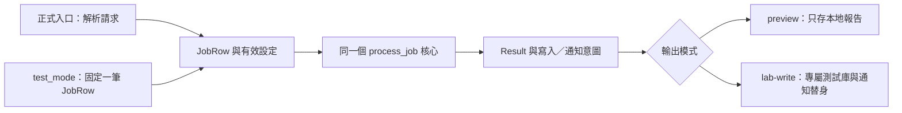

# 示範章分段設計：加一個 test_mode，但別把真正要查的邏輯也跳過

狀態：2026-09-22，原教案設計保留如下；[第一版正文](../../docs/cpp-sql-field-tricks/03-test-mode.md)與 field_lab 已完成。實作先收斂為 preview-only target，沒有假裝拆完正式 DB／通知流程；真 DB baseline 另由 sql_lab 進相同核心。原設計中的完整 lab-write／通知替身仍屬延伸。對應 [book plan](book-plan.md) 第 03／11 節。test_mode 的位置、名稱、輸出契約均由本書新增，不是 ODBC 或任何既有專案內建功能。

## 本章只回答一個問題

「我只是想查一筆資料為什麼算錯，能不能不用每次開 GUI、等訊息，又怕碰到寫庫和通知？」

讀者在第 01 章已確認實際 binary，第 02 章已能用單筆入口呼叫同一核心。本章先用合成的 `JobRow`，得到可重複的計算與意圖輸出。SQL 值的讀取正確性留到後章，不假裝一次解決。

## 用一張圖指出改動的地方

讀圖重點：替換的是入口和外部效果，不是另外抄一份簡化核心。這只是教學切片；若舊程式在核心內直接寫庫，不能照圖宣稱已隔離，必須先定位並攔住那個實際呼叫。預覽仍會寫本地報告，不能稱為完全無副作用。

## 必要的小型範例契約

- `JobRow`：`job_id`、`input_value`、可空的 `note`；均為自造資料。
- `process_job`：接收已具名的值與規則設定，回傳 `Result`。這一小段不連 DB；先不用 repository framework 或整套 DI 容器。
- 開關第一版可以是原始碼中的 `constexpr bool test_mode = true`；變更後須重建實際 target。不要把這個示意當可直接編譯的完整程式。
- 測試入口固定一筆輸入；效果開關另外明示 `preview`。一個含糊的 `test_mode` 不應同時偷偷決定輸入、寫庫、通知、吞錯和 timeout。
- 範例必須列出所有可能效果：讀前 reset、UPDATE、INSERT、檔案寫入、通知、觸發器／stored procedure 的額外動作。不能只註解最後一行 UPDATE。
- `preview` 路徑不建立可寫 DB 連線；有需要讀 SQL 的後續實驗改用受限帳號。通知端只使用替身。這是實驗結構，不靠開發者記住「這次別按錯」。
- 啟動輸出：exe 路徑、build ID、mode、fixture ID、輸出位置；不印連線秘密。開關真正值從執行中的程式輸出，不看編輯器猜測。

## 操作與觀察逐段設計

| 段落／目前位置 | 讀者先預測 | 最小動作 | 立即看什麼 | 解讀與下一步 |
|---|---|---|---|---|
| 0：還未執行 | 這個入口會不會先 reset？ | 沿一筆請求列出讀寫與通知位置；圈出第一個外部效果 | 實際呼叫位置，而非函式名稱 | 找不到效果邊界先停在唯讀追蹤；不要先跑看看 |
| 1：專屬實驗目錄 | 基準對一筆資料應產生什麼？ | 建立合成 seed 和通知替身，跑一次已隔離的 lab 基準 | 原始值、Result、DB 前後值、通知次數 | 基準本身不明就先核對輸入，不開始改 mode |
| 2：入口處 | 換入口後核心能否到同一 breakpoint？ | 固定一筆 `JobRow`，仍進相同 `process_job` | breakpoint、job_id、有效規則設定 | 沒到就先查 routing；不要另寫假核心求通過 |
| 3：第一次外部效果之前 | preview 應有結果，但無 DB／通知效果 | 接上本地意圖輸出，隔離所有寫入與通知路徑 | 報告、測試庫前後值、替身呼叫數 | DB 不變只是必要條件；查漏掉的 reset／SP／其他 connection |
| 4：建置與啟動 | 只改 source，不重建會變嗎？ | 保留舊檔作對照，再重建指定 target 並用完整路徑啟動新檔 | mode banner、build ID、實際 exe 路徑 | banner 不對先回第 01 章，不懷疑 if 失靈 |
| 5：同一 fixture | 兩次結果應在哪些欄位相同？ | 同一 binary／fixture 跑兩次；按 job_id 比較核心欄位 | Result、意圖內容、明確排除的時間戳 | 差異表示還有時鐘、亂數或隱藏狀態；一次固定一項 |
| 6：只改一個條件 | 某一輸入改動應影響哪個分支？ | 改單筆值到門檻另一側，不改 mode 與輸出端 | 分支與 Result 是否一起改變 | 有變才表示經過真核心；不以「沒有 crash」作驗收 |
| 7：回到真 DB 邊界 | fixture 成功能證明讀庫轉換正確嗎？ | 使用同一合成 seed 在測試庫讀回 `JobRow`，與 fixture 比較 | NULL、型別、欄位值、列數 | 不同先到第 06 章查 mapping；不直接說 DB 壞了 |
| 8：決定留下什麼 | 下次調查還需要固定入口嗎？ | 保留入口與 fixture，或撤回一次性分支；依第 16 章核對候選產物 | 候選 binary 的 mode、效果、輸入來源 | 程式能跑不等於可交付，需確認外部寫入和通知沒有被意外禁用 |

正文每段只放足以完成該動作的短片段。預期輸出要標「教案預期」，正式撰寫時改用實測輸出；不在規劃階段捏造終端紀錄。第 0 段只需短安全檢查，第 1 段就給讀者看得見的小成果。

## 說理不能省略的四條因果

1. GUI／設備輸入難重跑，所以固定的是入口；若把核心一起換掉，就無法檢查原問題。
2. 一次工作的效果不只最後 UPDATE，所以隔離點要在第一個外部寫入之前；資料庫 rollback 也不是通知的橡皮擦。
3. `constexpr` 被編進產物，所以 source 的值不等於正在跑的值；banner 與檔案身分把這條缺口補上。
4. 相同 fixture 的計算一致，只支持這條核心路徑穩定；不支持 SQL 轉換、並行、效能或正式通知已正確。

## 反例與代價

- 在核心入口直接 `return success`：省時間但什麼都沒驗到。
- 只把最後 UPDATE 關掉：前面的 reset 仍可能改資料。
- 用 rollback 包整個工作卻照常發通知：DB 恢復不代表外部接收端忘了通知。
- 為了方便每次改五個獨立全域旗標：無法解釋到底控制了什麼；先用明確模式表，尚無重複需求時不用建立大型設定系統。
- fixture 會過期，固定輸入會掩蓋讀取問題；保留少量真 DB 對照，不用把所有 case 都變成整合測試。

## 判斷題與分開核對

題目：`preview` 的 Result 兩次一致、UPDATE 計數為零，但測試庫的部分欄位還是變了。你下一步會改 transaction，還是查哪個位置？請指出一個能推翻你猜測的觀察。

核對判準

先核對所有外部效果與實際連線／目標身分，尤其讀前 reset、stored procedure、另一條 connection 或其他 writer；不先假設「加 rollback」能包住它。若在獨占的合成庫、確認該 binary 且所有寫入出口都有記錄仍沒找到，才擴大觀察範圍。答案需提出可以定位第一個變更時間的前後快照／紀錄，而不是只喊副作用這個術語。

## 寫作前驗收門檻

需要實作最小 C++ 範例並逐段跑過，證明兩入口共用核心、preview 不觸發 DB 或通知寫入、反例可在隔離庫安全出現、手動切換與重建產物可核對。沒有這些紀錄只能保留為教案設計，不能寫成「照做必得下列結果」。
