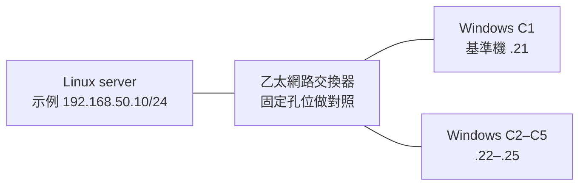

# 五台機台也用得上的 Linux 現場招式 — Book Plan

建立：2026-09-22｜slug：`linux-lan-field-tricks`｜狀態：17 頁可閱讀初稿與 MkDocs 建置完成；實機與瀏覽器視覺驗收待補。

## 定位與書味

**副標：Windows 接 Linux，先動一小處，把問題縮到能看見。**

服務對象是會操作 Windows、會 SSH 和基本 shell，卻缺少現場排錯經驗的機台整合、軟體開發與維運人員。主場景為一台 Linux server、約五台 Windows client，以乙太網路交換器連接；兩機直連是縮小問題的可選工具，不假設 Linux 有五張網卡。讀者要處理的是「線插了卻不通」「只有一台壞」「能連但傳很慢」「隔幾分鐘才掉」「管理入口打不開」。

本書的成就不是背熟命令，而是能說：「我只改了這一項，結果從 A 變 B，所以先查這一段；其他部分還沒有證明。」允許固定 IP、臨時服務、手動換線、假輸入、單次入口覆寫和一條隧道；把省下的工時與新增的人工、狀態、效能成本一起寫清楚。

不以 Linux 安裝、OSI 七層、Samba 全設定或企業網管平台構成章序。必要概念在第一次小成果後補。五台規模是教學約束，不是「小網路不需要可靠性」的理由。

## 本輪研究如何形成章節

先完成 [現場紀錄](../../data/linux-lan-field-tricks/field-research.md)、[官方機制](../../data/linux-lan-field-tricks/official-mechanisms.md)、[補充查證](../../data/linux-lan-field-tricks/supplemental-mechanisms.md)，再做 [招式篩選](../../data/linux-lan-field-tricks/selection.md)。

選出 11 章：T01–T11 每招只占一章；bind 與 TCP 探測合併，pcap、checksum 與日誌合併；硬體調參與未確認 DHCP 根因不獨立成章。第 08 章有團隊事故證據，但對純交換器 LAN 的適用性較低，標進階選讀；其餘構成主線。來源重複不算獨立佐證，未取得正文的 L 系列不支持正式結論。

證據標記：**F** 原作者現場觀察，**M** 文件支持的功能或機制，**H** 本書設計但未執行的實驗。O/P 是資料卡編號；它們沒有暗示本次實測。研究索引：[README](../../data/linux-lan-field-tricks/README.md)。

## 教學環境與第一個成果

教學基線暫選 Ubuntu 24.04 LTS server、Windows 11 client；這是待重現的編輯選擇，不聲稱目前最新或唯一可用。實際使用的 edition、build、kernel、NIC／driver、Python、curl、OpenSSH、iperf2 版本須在實驗批次鎖定。Windows 10 僅作舊機台案例，不把 Windows 11 政策直接套上去。

這組位址僅供教學，使用前先確認與公司 LAN、VPN、Wi-Fi 沒有重疊；不任意覆寫現場 IP。獨立測試 LAN 不提供 gateway／DNS 也可做 IP 互通，但前提是相容 prefix、同 L2 與正確直連路由（O08）。雙網卡的管理路徑要另外辨識。先抄下原配址、DHCP 狀態、介面、路由、綁定、既有規則，實驗完依原值還原。

開卷「先拿到一個檔」預計 10–15 分鐘（編輯估計，未計下載安裝）：用既有 Linux Python，在新建、無敏感資料與 symlink 的測試目錄只放 `probe.txt`；綁指定 LAN IP 的 8080。Windows 以 `curl.exe --noproxy "*" http://192.168.50.10:8080/probe.txt` 取回固定內容。失敗便沿 01→02 分支；成功就立即停服務，再說明路由、埠、監聽的必要概念。這不是完整正文，也不是要現在操作使用者機台。

操作標記統一為：

- **現有功能可直接操作**：可需安裝現成工具，不等於 OS 預裝。
- **需要新增程式**：明確列出自訂 fixture、endpoint 或蒐集器，不能冒充內建功能。
- **需要重新訓練或建置**：本書不涉及模型訓練；主線無需編譯核心／驅動，特定廠商 client 若改輸入入口才另列重建。
- **僅適用特定版本／環境**：每章依下表及章卡交代，不把滾動文件版本當讀者已安裝版本。

## 章節架構與來源對應

| 部 | 章與預定檔名 | 現場問題／小動作 | 來源 | 操作與限制 |
|---|---|---|---|---|
| 一、先把入口固定 | 01 五台先留一台：把線、孔、位址釘住 `01-one-client` | 故障跟人、線還是位置走？ | O08、F06 | 現有；有實體操作條件 |
| 一 | 02 ping 通卻進不去：敲埠，再看它聽哪裡 `02-port-and-bind` | server 只聽 localhost？ | O02、O04、P01 | 現有；NetTCPIP＋Linux iproute2 |
| 一 | 03 名字先別修：只改這一次的目的地 `03-one-request` | 名稱、proxy、TCP 誰先失敗？ | F03、O01 | 現有；HTTPS 需可信名稱與憑證 |
| 二、拿掉真的，先看假的 | 04 把整個服務換成一個小檔案 `04-tiny-server` | 網路之外是哪一段沒好？ | P01、O02 | 現有；Python 3.7+ 基本選項 |
| 二 | 05 現場先錄下來，回辦公室才慢慢看 `05-save-the-scene` | 誰先結束連線，封包真的壞了嗎？ | F01、F02、F04、O06、O07 | 現有；tcpdump／Wireshark，擷取權限 |
| 二 | 06 不再重點十次：保存那一次輸入 `06-replay-input` | 是否只有某份 payload 出錯？ | P08、O03 | curl 現有；自訂接收器需要新增程式 |
| 三、讓失敗有形狀 | 07 先不搬檔案：上傳、下載分開測 `07-two-directions` | 慢的是方向、協定還是五台競爭？ | F06、O05、P09 | 現有；雙端 iperf2 固定 build |
| 三 | 08 小的通，大的卡：找出尺寸門檻 `08-size-threshold` | 是否存在 MTU／封包尺寸線索？ | F05、O08、P10 | 現有；進階選讀，IPv4 命令不套 IPv6 |
| 三 | 09 故意慢半秒：讓 timeout 跳出來 `09-make-it-slow` | client 遇慢路徑會做什麼？ | P03、P08 | 現有；Linux netem、獨立測試介面 |
| 四、五台規模的補位 | 10 localhost 才能看？先拉一條隧道 `10-local-tunnel` | 少動 server 也能維護？ | P02、P01 | 現有；OpenSSH 與允許的 forwarding |
| 四 | 11 只有一台開不了共享：先比帳號與版本 `11-one-client-smb` | TCP 已通，為何 SMB 還拒絕？ | P04、P05、O03 | 現有；Windows edition／policy、Samba 版本特定 |

## 每章問題與最小實驗

以下皆為 **H，尚未執行**。正常、故障、撤回後三個狀態都要保存。篇幅先以每章一個可收尾實驗為限；不是列滿工具。

### 01｜五台先留一台

- **卡點／原成本**：五台都不穩，重設全部機器無法歸因。先把 C1、線 A、孔 1、server 固定；記 IP／prefix／MAC 與實際介面。
- **小招／實驗**：C1 取固定檔→只換 C2→換回 C1；若仍不明，只換線再重做。每次記成功、耗時及 link 速率。Linux `ip route get 192.168.50.21` 配合 Windows TCP 探測確認路徑。
- **前提／原理／代價**：同 L2、配址不衝突、server 不变；用人工串行排除交互變因，暫時少用四台。
- **解讀／反例**：問題跟 C2 走只能縮小到 C2 及其設定；交換器 port policy、DHCP／MAC 綁定也可能影响换机。不能直接判壞網卡。
- **撤回／正式化**：復原線、孔、IP profile，核對五台；只有反覆換機才正式維護一張配址與孔位表。

### 02｜ping 通卻進不去

- **卡點／原成本**：把能 ping 當應用健康，或一直重啟服務。
- **小招／實驗**：測試 HTTP 先只綁 `127.0.0.1:8080`；server 本機成功，Windows `Test-NetConnection 192.168.50.10 -Port 8080` 記結果。`ss -lntp 'sport = :8080'` 看位址；只改成 server LAN IP 再測。
- **前提／原理／代價**：8080 可用、測試路徑允許；區分 socket 監聽範圍與 TCP 可達性。LAN 綁定增加可連線範圍，不能等同只允許五台。
- **解讀／反例**：若改 bind 仍失敗，去查封包／規則；若 TCP 通但 HTTP 失敗，往協定／應用走。UDP 不用此測試裁決。
- **撤回／正式化**：停測試程序、還原綁定及精確測試規則；真正需要 LAN 服務才修改該服務已存在的設定。

### 03｜名字先別修

- **卡點／原成本**：改 hosts、清各種快取後更不知道原因。
- **小招／實驗**：固定同一 URL。A 正常 curl；B 僅加 `--noproxy "*"`；C 保留 B 再加 `--resolve machine.example:443:192.168.50.10`。server 必須事先有該測試名稱與可信憑證；沒有則先用 HTTP 做 DNS 對照，HTTPS 另補。
- **前提／原理／代價**：直連在允許範圍內；單次覆寫解析，保留名稱語意。跳過實際 DNS／proxy，失去原路徑覆蓋。
- **解讀／反例**：B 與 C 差異才可指向解析入口；A 與 C 同改兩因不能歸因。憑證錯誤不能用 `-k` 蓋掉；curl 成功仍未測瀏覽器的 DoH／proxy。
- **撤回／正式化**：拿掉參數；回原 client 測試，查明哪個 DNS／proxy 設定有錯才正式修。

### 04｜把服務換成小檔案

- **卡點／原成本**：設備、資料庫、服務同時牽涉，等人啟動整套。
- **小招／實驗**：同 Linux 另開空閒 8080，`python3 -m http.server 8080 --bind 192.168.50.10 --directory ./probe`；Windows 取 `probe.txt`。正式服務另測原埠；不要接管正式服務埠。
- **前提／原理／代價**：測試目錄存在且無 symlink；以已知回應取代應用。它沒有正式服務的 auth／TLS／負載特性，僅供短時診斷。
- **解讀／反例**：8080 成功只證明該路徑，不證明 445／正式埠放行；權限、DB、應用仍可能壞。Python 內建檔案服務不提供自訂 POST 接收器。
- **撤回／正式化**：Ctrl-C、刪測試目錄、撤臨時規則；需長期分發時才改成正式有權限與生命週期管理的服務。

### 05｜現場先錄下來

- **卡點／原成本**：偶發後只剩「剛才不通」，反覆叫人操作。
- **小招／實驗**：依实际介面、client IP、8080 篩選，tcpdump 存 pcap；同步記 server 日誌。正常請求一次，中途取消一次，再停擷取；到 Windows Wireshark 用單一 TCP conversation 比對。具體限時／檔案輪替命令在撰寫前補查手冊，不先聲稱本次驗證過。
- **前提／原理／代價**：權限、擷取點、時間基準明確；只留假資料小流量。兩端時間未對齊時用序號、方向與事件對應，不能單靠絕對時間判責。
- **解讀／反例**：看到 FIN/RST 方向不等於證明誰的程式有 bug；未擷取可能是 filter 或 capture drop。發送端 bad checksum 先對端比較，`-K` 只改顯示。
- **撤回／正式化**：停擷取並按保留期限刪測試資料；反覆無法重現才補有上限的循環擷取。pcap 離線讀取與 TCP／應用重播分開命名。

### 06｜保存那一次輸入

- **卡點／原成本**：每次在 GUI 點十步，輸入卻不完全相同。
- **小招／實驗**：從可匯出的測試請求留下 UTF-8 `payload.json`（無 BOM）、method、Content-Type、必要 headers、預期狀態；`curl.exe --data-binary @payload.json -H "Content-Type: application/json" http://192.168.50.10:8081/test`。`/test` 是**預計提供的測試接口，不是任何產品內建**。
- **前提／原理／代價**：只能用無副作用接口或可重設測試資料；沒有接口就需要新增最小接收器。保存 body 固定輸入，仍需維護 token、session、timestamp 與編碼。
- **解讀／反例**：相同 body 兩次再改一欄位；保存回應及 server 收到的 byte 數／雜湊。單次 curl 通不涵蓋 GUI 邏輯、連線池、真實設備 timing；不重播正式機台控制動作。
- **撤回／正式化**：停接收器、刪測試狀態與憑證；相同 bug 再出現才把去識別 payload 納回歸資料。新增接收器時另留最小成功／拒絕錯誤輸入檢查。

### 07｜上傳、下載分開測

- **卡點／原成本**：檔案慢就調 Samba，但真正瓶頸未知。
- **小招／實驗**：雙端固定 iperf2 build，Linux `iperf -s -p 5001`；Windows `iperf.exe -c 192.168.50.10 -p 5001 -t 10`，另跑加 `--reverse` 的命令。先核 --help 支援，Windows 不抄短 `-R`。正反各三次，再做五台逐台與同時測試。
- **前提／原理／代價**：同版本工具、測試埠許可；拿掉儲存、SMB、認證的成本，但吃頻寬與 CPU。純工具結果不能代替實際檔案驗證。
- **解讀／反例**：保存接收端吞吐、CPU、link speed、方向與每台結果；看中位數與範圍，不訂虛構達標數字。網路基線好、檔案慢，只能把調查轉向應用／儲存等其他層，不能斷言磁碟壞。
- **撤回／正式化**：停 server／測試規則；定期驗收才保存命令與基線。Windows iperf3 僅放旁註，五條 stream 不代替五台機器。

### 08｜找出尺寸門檻（進階選讀）

- **卡點／原成本**：小請求好、大傳輸卡，沒有可重複邊界。
- **小招／實驗**：Windows IPv4 `ping /f /l 1200 192.168.50.10`，逐步到 1400、1472；Linux 對照 `ping -c 4 -M do -s 1200 192.168.50.21`，同時留封包。旗標已依 P10 查證，仍須核對現場版本，並非已測命令；IPv4 無 options 時 payload 加 28 才是 IP 大小。
- **前提／原理／代價**：ICMP 允許、固定路徑；純 1500 LAN 可能全通，是有效反例。造 PMTU 黑洞另需隔離 router，不在主線強行加入。
- **解讀／反例**：門檻只给線索；ICMP 限速／丟棄不等於 TCP MTU 故障。正式案例必須加入大 HTTP 流量、重傳與 MTU 回報證據；不把 timeout 直接解讀成 MTU。
- **撤回／正式化**：本章基本探測不改設定；進階若暫改路徑 MTU，先記原值並還原、重建連線複查。只有診斷已確認、上游暫不能修時才留下有到期日的 workaround。

### 09｜故意慢半秒

- **卡點／原成本**：偶發 timeout 只能等；重試到底幾次看不見。
- **小招／實驗**：獨立測試介面、確認沒有自訂 root qdisc 後，`tc qdisc add dev LAB_IF root netem delay 500ms`；先 baseline，再 100、500 ms（後續用 change）測同一請求，記 client timeout、實際 server 請求數與重試間隔。
- **前提／原理／代價**：`LAB_IF` 必須換成查明的測試介面；有本機 console，管理流量不用該介面。延遲使時序可見，也可能累積佇列；不是精確真實網路模型。
- **解讀／反例**：只加 server egress，不能說雙向各慢 500 ms；若 client 沒超時，不代表永不超時。若重試造成重复操作，測試端點須可辨 request ID，不能以正式動作演示。
- **撤回／正式化**：只刪本章新增的 qdisc，確認 baseline 回來；遇原有自訂 qdisc 不覆寫，改建隔離環境。反覆版本驗收才升成故障注入測試；不變成正式限速方案。

### 10｜先拉一條隧道

- **卡點／原成本**：管理頁只聽 localhost，改暴露範圍要動 server。
- **小招／實驗**：Linux loopback 的測試 HTTP；Windows `ssh -N -L 127.0.0.1:18080:127.0.0.1:8080 user@192.168.50.10`，再請求本機 18080。記錄直接 LAN 路徑、隧道、關隧道後三種結果。
- **前提／原理／代價**：OpenSSH 已裝、forwarding 被允許且指紋已核對；遠端 127.0.0.1 指 Linux，左側指 Windows。多一條人工 session，server 看到的來源不同。
- **解讀／反例**：隧道可用只代表替代路徑；來源 IP 授權、callback URL、redirect、HTTPS 名稱都可能失效，不假裝適用任意協定。
- **撤回／正式化**：Ctrl-C，確認 18080 消失；常用時才做具名 SSH 設定，不部署全網 VPN 只為一次管理頁。

### 11｜先比帳號與版本

- **卡點／原成本**：C1 能開共享，C2 不行，把 Linux 權限改全開仍不清楚。
- **小招／實驗**：先用 O02 確認 445，再固定 server 名稱、測試共享、具名帳號、單一測試檔；比較 C1/C2 的 Windows edition/build、實際 SMB client signing 設定與連線目的地。使用已隔離、可重設的測試登入，不清掉所有使用者 session。
- **前提／原理／代價**：Samba 測試共享及檔案系統權限都正確；沒有既有環境時，撰寫前另查 testparm／帳號建立文件，不填假通用命令。管理帳號成本換來明確身份。
- **解讀／反例**：445 通不能證明 SMB 登入；IP 與名稱連線可能改變驗證方式，不能當純 DNS A/B。不同 edition 預設與群組原則均可不同，錯碼不足以單独裁決。
- **撤回／正式化**：移除測試共享、測試帳號及其 session，還原測試設定；正式修正具體相容性，不一律關 signing 或開 guest。五台共同需要時才維護一份最小版本／帳號政策矩陣。

## 寫作節奏與附錄

每章固定：**現場症狀 → 小招式 → 必要原理 → 親手實驗 → 結果解讀 → 失效反例 → 收尾與撤回**。開頭先給一個能看到的差異，不先上長篇風險條列；涉及改設定的那一步旁邊立即附撤回。終章也要回原應用驗證，不能只交替代工具的成功畫面。

每次命令標「Windows PowerShell／Linux shell／GUI」，說明必要權限；自訂 endpoint／feature flag 加醒目標記。只節錄必要輸出，讓讀者先判断，再给解釋。示意輸出標「預期示意」，實測輸出附環境與日期，不能混放。

預定三份薄附錄：

1. **五台對照表**：client、IP／prefix、MAC、線標、孔位、edition/build、應用版本、目的 IP/port；依需求保留欄位，不做資產管理系統。
2. **一張實驗紀錄**：時間、唯一改動、輸入、A/B/A 結果、能證明／不能證明、原值、撤回結果。性能另記三次分布與 CPU。
3. **來源與版本索引**：沿用 F/O/P；解釋作者觀察、文件機制與 H 實驗的差別。

## 建議撰寫順序與驗收

| 批次 | 順序／交付 | 完成條件 |
|---|---|---|
| B0 本輪 | 研究卡→取捨→本 plan | 已完成；來源範圍與未讀資料有標示 |
| B1 下輪 | 04→02→01，小成果最先實測 | 一台 Windows＋Linux 正常／故障／撤回三態，有實際輸出與工具版本 |
| B2 | 03→10→05 | 固定入口、隧道、離線讀取可重現；不把 DNS 與 proxy 同改後歸因 |
| B3 | 07→11 | Windows iperf2 build、實際 Samba 配置核查；有兩台差異，再補約五台並行 |
| B4 | 06→09 | 最小 payload fixture、測試 endpoint 與延遲對照；新增程式另有一個可執行驗證 |
| B5 | 08 最後 | 依 P10 補隔離路由／PMTU 實驗；若無適用證據保留選讀或移附錄，不湊章 |
| B6 | 導讀、附錄、術語／撤回複核 | 跨章實驗不互相污染，每章先小成果再必要概念 |

未來正式出版才依 CLAUDE.md 建 `docs/linux-lan-field-tricks/`、MkDocs config 與書庫卡；本輪沒有建立正文或發布網站。

## 尚未親自重現與證據缺口

**本輪沒有執行任何 Windows–Linux 網路實驗，也沒有連入使用者機台。11 章全部仍是待實測設計。** 已完成的是網路資料閱讀、第一手機制查證與文件整理；不是效能或修復驗證。

F01–F06 的觀察屬來源作者，本輪未拿到完整 pcap／環境重跑；F06 原 issue 未確認根因。03 的可信 TLS 測試名稱、06 的安全重播 endpoint、07 的 Windows iperf2 binary、08 的隔離 PMTU 實驗、09 的隔離介面、11 的 Samba 測試共享需在各批次補足。未知真實 Linux distro、Windows build、機台協定（HTTP／SMB／自訂 TCP／UDP）、是否離線及能否停機；本 plan 因此以可替換教學環境先成立，不暗示適用全部現場。

研究筆記在 `data/`，依 repo 既有規則被 Git 忽略，**已存本機但不會隨一般 git add 納入**；不自行更改忽略規則。要交接或備份時需包含資料目錄。計畫在 `plan/`，可正常追蹤。

## 成書階段（2026-09-22，使用者授權開始正文）

沿用 11 章架構，出版路徑 `docs/linux-lan-field-tricks/`、config `configs/linux-lan-field-tricks.yml`、產物 `book/linux-lan-field-tricks/html/`。驗收拆為正文／命令靜態審查、本機可執行的 fixture 檢查、MkDocs 建置與瀏覽器渲染、Windows–Linux 實機重現四層；前三層不能替代第四層。原 B1–B5 的實機驗收仍保留為待補，不阻塞清楚標示未重現的可閱讀初稿。

試寫章：04。已完整閱讀本章必要 Python CLI / security 段落與 curl 對應選項，採七段節奏；加入獨立 mktemp 目錄、明確 IP 前提、成功／停服務／恢復三態、避免誤刪的逐檔撤回。讀者首次理解 bind、埠及 proxy 都連到各自章節。靜態教學審閱通過；實機尚未通過。

全書依賴：導讀先定義 server/client、LAN IP、shell 與證據標記；04 提供共同 probe；01 固定路徑；02 分 TCP 與應用；03 固定名稱入口；05 保存觀測；06 固定輸入；07 比較方向與競爭；08 尺寸選讀；09 依 04 的 probe 做延遲；10 依 02 的 loopback 做替代入口；11 依 02 分離 SMB 驗證。07 與 08 分工為吞吐／大小門檻，05 與 06 分工為保存觀測／重送應用輸入。

## 本次成書交付與階段結算

使用者於本輪指定 mkdocs-create 並允許 Luna／max subagent 處理小任務。主 agent 完成 04 試寫與全書整合，Luna／max 分別補查 tcpdump／SMB、撰寫 01／02／10、撰寫 07／08，並做命令靜態審查。沒有把多人筆記當成多份獨立案例證據。

B1–B6 的正文均已成稿；實機門檻沒有達成，保留在驗證附錄，不標為全流程出版驗收完成。B2 補出有上限擷取；B3 的 SMB 明確以既有共享為前提，不擅自建完整 Samba；B4 提供 stdlib 接收器與可執行本機檢查，第 09 章另加 Linux-only netns 入口；B5 不造事故、保留尺寸探測選讀。架構依然 11 章，沒有為湊數增加工具目錄。

| ID | 實際路徑（docs/linux-lan-field-tricks/ 下） | 作用／依賴 | 正文與靜態審查 | 圖片 | 下一步 |
|---|---|---|---|---|---|
| 導讀 | README.md | 讀者起點、術語、證據狀態，導向 04 | 已完成 | 不需圖 | 現場讀者試走 |
| 地圖 | 00-map.md | 拓撲與按症狀分流 | 已完成 | 2 張 Mermaid，待視覺驗收 | 瀏覽器預覽 |
| 01 | 01-one-client.md | 固定機器／線／孔，依 04 基準 | 已完成 | 不需圖 | 換機三態 |
| 02 | 02-port-and-bind.md | bind 與 TCP 分界 | 已完成 | 不需圖 | loopback/LAN 三態 |
| 03 | 03-one-request.md | DNS 與 proxy 分開，依 04 | 已完成 | 不需圖 | 真實名稱與可信 TLS |
| 04 | 04-tiny-server.md | 全書共同小成果 | 試寫及全書回修完成 | 不需圖 | 第一優先實機 |
| 05 | 05-save-the-scene.md | 保存觀測，依 04 | 已完成；補 snaplen 界線 | 不需圖 | 真實 pcap／drop 統計 |
| 06 | 06-replay-input.md | 固定輸入，與 05 分工 | 已完成；自訂程式本機檢查通過 | 不需圖 | Windows curl→Linux |
| 07 | 07-two-directions.md | 單台方向→五台競爭 | 已完成 | 不需圖 | 發行檔與吞吐實測 |
| 08 | 08-size-threshold.md | 尺寸線索，選讀 | 已完成 | 不需圖 | ICMP 與 TCP 對照 |
| 09 | 09-make-it-slow.md | 時序顯形，依 04 | 已完成；獨立介面與隔離 netns 分開 | 不需圖 | Linux netns／netem 實測 |
| 10 | 10-local-tunnel.md | 替代入口，依 02 | 已完成 | 不需圖 | SSH policy 三態 |
| 11 | 11-one-client-smb.md | 身份與協商分開，依 02 | 已完成；縮小清理範圍 | 不需圖 | 既有測試共享實測 |
| 附錄 | appendix-records.md／appendix-sources.md／appendix-validation.md／99-image-credits.md | 空白表、證據、缺口與圖表出處 | 已完成 | 來源表已記 | 隨驗證結果更新 |

### 圖片任務

I01／I02 均在 `00-map.md`：I01 要呈現一台 Linux 經交換器到五台 client，不能暗示位址已配置或交換器具路由能力；I02 要呈現 TCP／HTTP 分支與返回原應用，不能暗示單一測試能裁決根因。以 Mermaid 製作，文字 caption 與替代導覽表已完成；圖碼／正文一致性已審，實際渲染因權限阻擋仍待驗。正文版本 SHA-256 與檢查細節見 [validation.md](validation.md)。其他章不需要裝飾圖，不增加圖量配額。

### 出版環境與未結事項

已建立 `configs/linux-lan-field-tricks.yml`，沿用 Material、共用字型／CSS／Mermaid 與 footer override。書庫唯一入口仍是 `js/books-data.js`，新增一張卡，連至 `book/linux-lan-field-tricks/html/index.html`。17 頁正文、三個下載範例；研究資料及本計畫不公開到 docs_dir。

已完成 strict build、一般頁面資源／內部連結／出版範圍、18 HTML（含 404）唯一回書庫連結檢查。原生瀏覽器預覽回報 Computer Use permissions are not granted，browser connector 也不可用，故桌面／手機版面與兩張 Mermaid 圖仍未視覺驗收。Material 原生 404 的根絕對 URL 在子路徑部署需另行處理，已列驗證限制；未動其他書的共用模板。

下一批優先序：人工預覽 00-map／04／06 → 一台 Windows＋Linux 的 04／02／01 → 才擴到其他章與五台並行。除第 06 章本機 loopback 程式檢查，所有網路案例仍未親自重現。
