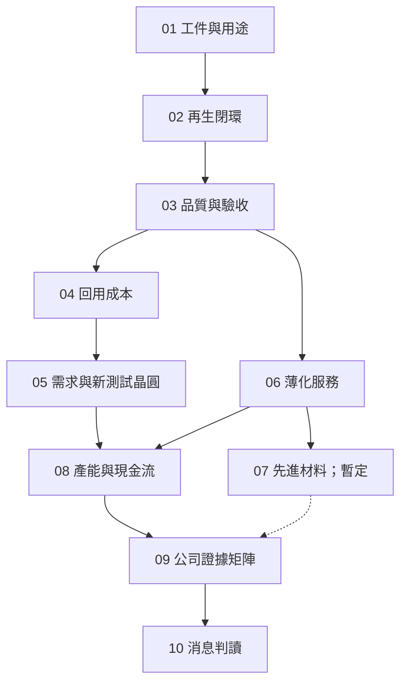

# 從晶圓再生與薄化看懂昇陽 — 成書計畫

建立日／初查日：2026-09-14。續寫日：2026-09-14。狀態：**16 頁正文與出版整合完成；驗收詳見第 10 節**。

本次依使用者「先做 plan」要求，只建立計畫。依前文半導體書系脈絡，將「昇陽」解讀為**昇陽國際半導體股份有限公司（8028，Phoenix Silicon International，PSI）**。若後續更改公司目標，需重做來源綁定。

slug：`psi`。計畫路徑：`plan/psi/psi-book-plan.md`。

預定出版綁定：`docs/psi/` → `configs/psi.yml` → `book/psi/html/`；本輪不建立這些目錄、config 或書庫卡片。一般公司主題書，不建立課程逐字稿 tracker。

依據：專案 `CLAUDE.md`；book plugin 的 `mkdocs-create.md`、`iteration.md`、`evidence.md`。規劃完成不表示章節技術來源已完整讀取。

## 1. 讀者、目標與全書主線

讀者已知道晶圓、晶粒與封裝體的差別，可能讀過均豪或矽格書，但不熟悉製程監控晶圓、再生加工與薄化代工。開篇用短圖補足必要先備，不要求先讀完整本均豪書。

讀完能將昇陽的公司消息拆成：**處理哪一種工件 → 客戶要恢復或改變什麼性質 → 如何量測合格 → 每片合格交付成本 → 產能與收入如何形成 → 公開證據到哪裡**。

全書以兩條工件路線串起來：再生路線追蹤「監控使用、送回加工、驗收、再次使用」；薄化路線追蹤「已有元件的晶圓、背面加工、支撐與檢測、交付」。兩者最後匯入同一張公司服務證據矩陣。新材料另列拓展方向，以免把各種用途混成同一條產線。

具體學習成果：

- 區分 product wafer、test／monitor wafer、dummy wafer、reclaimed wafer；其中用途與加工歷史是不同分類軸。
- 說明為什麼再生不只是洗乾淨，以及剩餘厚度、污染與用途如何共同決定能否回用。
- 比較「每次加工費」與「每次合格使用的總成本」，能重算一個含回貨良率的簡化模型。
- 分辨晶圓再生、功率元件薄化、測試晶圓製造及先進材料的交付物與驗收條件。
- 讀擴產與 AI 題材時，能指出缺少哪一段需求、驗證、出貨或財務證據。

範圍以製程服務與公司理解為主；股價估值、目標價、完整半導體製程百科不列入本書。

## 2. 已有書籍與去重邊界

| 既有位置 | 已有內容 | 本書新增角度 |
|---|---|---|
| [均豪 12](../../docs/gpm/12-grinding-thinning.md) | 背磨、CMP、拋光、工件種類與量測指標 | 從接受加工的服務商看進料履歷、加工配方、回貨驗收、報廢與單片經濟性 |
| [均豪 11](../../docs/gpm/11-defect-aoi-metrology.md)、[13](../../docs/gpm/13-wet-process.md) | 檢測與濕製程通則 | 聚焦再生表面的微粒、金屬殘留、厚度預算及量測條件；共通原理交叉引用 |
| [均豪 14](../../docs/gpm/14-yield-capacity-capex.md) | 瓶頸、稼動率、OEE 與擴產通則 | 聚焦再生服務的重工、回貨良率、晶圓尺寸／等效片數與廠區爬坡 |
| [均豪 15](../../docs/gpm/15-gpm-product-map.md)、[16](../../docs/gpm/16-reading-news.md) | 昇陽設備採購與均豪關係的證據界線 | 從昇陽買方與服務商角度重查，股權、設備採購、供應關係分欄；沿用原書未具名的限制 |
| [矽格 01](../../docs/sigurd/01-test-in-the-flow.md)、[03](../../docs/sigurd/03-test-cell.md) | CP／FT 與電測接觸 | 明確區分「供製程監控的測試晶圓」與「對晶片做電性測試」 |
| CoWoS／均豪先進封裝章節 | 封裝結構、TSV、薄化與載具背景 | 只補昇陽交付物的工件位置與商業角色，不重寫平台總論 |

既有書是教學銜接入口，不作公司事實或工程規格的一手證據。尤其不把均豪書的市場推論直接複製成昇陽的已確認訂單。

## 3. 章節地圖

以下是研究與寫作任務，不表示公司已通過每項能力或量產驗證。檔名為預定 `docs/psi/` 下的穩定路徑。

| ID／檔名 | 核心問題與章節作用 | 先備 | 要建立的理解／交給下一章的輸出 | 來源映射 | 視覺需求 |
|---|---|---|---|---|---|
| 01 `01-wafer-roles.md` | 工廠裡每一片晶圓都拿來做晶片嗎？建立工件分類 | 無；章內補晶圓／元件概念 | 把用途與新片／再生歷史拆開；定義監控、擋片等用語並指出廠別差異 | C1；T1 待取得 | 用途 × 加工歷史分類圖；必要 |
| 02 `02-reclaim-loop.md` | 一片用過的晶圓如何回到可用狀態？建立閉環 | 01 | 進料分類、去除薄膜／表層、表面重建、清洗、量測與回貨；拒收／報廢出口 | C1；T1、T2 待取得 | 使用→再生→驗收→回用流程，標厚度消耗；必要 |
| 03 `03-quality-and-qualification.md` | 表面看起來乾淨，為何還可能不能回廠？建立合格判準 | 02 | 厚度／TTV、形貌、顆粒、金屬污染及用途相容性；量測數字必須帶方法與條件 | C1、I1 品質段；T2、T3 待取得 | 缺陷→量測→判定→後果矩陣；必要 |
| 04 `04-reuse-economics.md` | 再生幾次才划算，何時應該換新？把品質轉成成本；**試寫章** | 01–03 | 首購、每次加工、運輸、驗收、失敗風險與可用次數；單片費不等於合格使用成本 | C1；T1；自建可重算模型 | 多輪厚度預算與累積成本圖；必要 |
| 05 `05-demand-and-new-test-wafers.md` | 先進製程需求如何變成再生服務量？新測試晶圓扮演什麼角色？ | 01、04 | 產品投片、監控頻次、回用次數、外包比例與服務單價分開；新增新片與循環回用的關係 | C1、I1；A1 待精讀；T1 | 需求因子圖與新片補充／循環流量圖；必要 |
| 06 `06-thinning-services.md` | 再生與薄化都移除材料，客戶買的結果有何不同？ | 02、03；均豪 12 短摘要 | 元件晶圓的保護、一般／Taiko 薄化、背金與測試界線；功率元件需求與損傷風險 | C2、I1；T4 待取得 | 再生 vs 元件薄化剖面、支撐與加工面；必要 |
| 07 `07-advanced-materials.md` | 散熱、填充與翹曲控制，如何成為另一種交付物？ | 03、06；章內補封裝位置 | 按材料、形狀、用途與驗證階段拆解；材料物性不直接等於模組性能 | I1 AMS 段；A1、T5 待精讀／取得 | 載具、填充物、功能材料位置圖；**來源充分才定稿** |
| 08 `08-capacity-and-cashflow.md` | 新廠與自動化如何轉成合格出貨與現金流？ | 03–06 | 名目／可用／認證產能、回貨良率、瓶頸、折舊、營運資金與資本支出；ESG 成本另帶邊界 | I1；A1、F1、E1 待精讀／取得 | 擴產階段圖＋產能／良率敏感度算例；必要 |
| 09 `09-psi-evidence-map.md` | 哪些服務、廠區與成長主張已有足夠證據？ | 01–08 | 工程能力、公司陳述、客戶驗證、量產與收入分欄；設備供應商與客戶角色分開 | C0–C3、I1、A1、F1、N1 | 公司服務證據矩陣；必要表格，不另加裝飾圖 |
| 10 `10-reading-news.md` | 一則消息究竟能證明到哪一步？完成全書應用 | 09 | 對再生需求、薄化需求、材料研發、擴產、設備交易案例列事實／推論／未知／翻案條件 | 上述來源＋N1 原始事件 | 事件時間線與證據階梯；視案例需要 |

07 為拓展章，若技術／客戶驗證資訊不足，縮成「公司公開拓展方向與待查」；不以來源稀薄的篇幅硬湊技術章。08 的核心計算不依賴 07 的商業成功，09 的該列可維持未證實。

### 概念依賴與閱讀路線

完整路線：01→10。再生主線：01→02→03→04→05→08→09→10。薄化／材料讀者先讀 01–03，再讀 06–09。快速讀公司可由 01→09→10 進入，但 09 必須提供回讀技術章的連結，不假定讀者已掌握所有細節。

## 4. 初始來源與閱讀證據

所有查閱日為 2026-09-14。下列狀態區分「已讀網頁」「PDF 初查」「只定位入口」；未完整精讀的文件不宣稱已完成章節研究。官網頁面未標示發布日期時不以查閱日代替發布日。

| ID | 來源／定位 | 本次讀取狀態 | 可支持的範圍與後續工作 |
|---|---|---|---|
| C0 | [昇陽官網](https://www.psi.com.tw/) | 首頁文字已讀；未標發布日 | 核對公司與主要事業定位；首頁的排名與領先語句仍屬自述 |
| C1 | [晶圓加工](https://www.psi.com.tw/wafer.asp) | 網頁文字已讀；未標發布日 | 再生服務與全新測試晶圓為不同交付，頁面列有尺寸及用途；尚無完整客戶允收規格 |
| C2 | [晶圓薄化](https://www.psi.com.tw/wafer2.asp?set=a) | 網頁文字已讀；未標發布日 | 薄化、鍍膜／蝕刻與 CP 的公開服務邊界；不能推成特定客戶訂單 |
| C3 | [主要股東](https://www.psi.com.tw/stockholder.asp) | 表格文字已讀；資料日 2026-03-23 | 均豪列示持股 5.02%；持股本身不證明設備交易對手或控制關係 |
| I0 | [法人說明會索引](https://www.psi.com.tw/share_news2.asp) | 網頁文字已讀 | 本次頁面可見至 2026-06-04，該場沿用 5/25 簡報；不可據此斷言不存在更晚公告 |
| I1 | [2026Q2 法說簡報，2026-05-25 版](https://www.psi.com.tw/company/2026年第二季法人說明會_20260525_中文版.pdf) | 32 頁 PDF 文字初查；非逐頁圖表驗收 | 規劃 03、05–09 的來源入口。印刷頁 10–16 再生／品質／產能，18–21 薄化，23–24 材料，26–27 財務；圖表軸、基期、口徑與預測需逐頁核對 |
| A1 | [114 年度年報](https://www.psi.com.tw/company/114年度股東會年報.pdf)；[官方發布入口](https://www.psi.com.tw/share_info.asp?y=2026) | 102 頁 PDF 已開啟，僅核對封面、刊印日及目錄；未全文精讀 | 2025 年度，刊印日 2026-03-31。優先讀印刷頁 62–78 業務／市場，89–96 財務／風險；PDF 頁序與印刷頁不同須另記 |
| F1 | [財務報表索引](https://www.psi.com.tw/report.asp) | 索引已讀，未讀報表原檔 | 本次頁面可見 2026Q1 與 FY2025 個別報告；續寫前至 MOPS 查有無更新，不能把索引可見範圍當完整揭露範圍 |
| E1 | [永續資料入口](https://www.psi.com.tw/sitemap.asp) | 網站地圖已讀；其所連 111 年度報告抓取逾時 | 需取得適用年度報告與方法附件。水、能耗、碳排與回收率不可在方法缺失時寫成比較結論 |
| N1 | MOPS 設備取得、資本支出與公司原始事件 | 待取得 | 均豪書所提 2025-08-05 設備事件僅作查證線索，不當本次已讀公告 |

I1 中的需求、產能、市占與未來產品組合圖先標為公司／引用機構估計。規劃階段不轉錄其預測數字為事實，也不以 PDF 的自動擷取標題取代封面公司與文件版本。

### 技術來源待辦（尚未取得，不是已完成書目）

| ID | 要找的一手資料 | 需要回答的問題 | 支援章節 |
|---|---|---|---|
| T1 | 晶圓材料廠、再生服務商的用途定義與製程文件 | monitor／dummy／test 的用語與用途；哪些條件下能再生、為何要補新片 | 01、02、04、05 |
| T2 | 清洗／去膜／CMP 原廠應用資料或研究論文 | 來料薄膜、污染與表面移除的關係；不同流程不能拼成必經的單一路線 | 02、03 |
| T3 | KLA 等量測原廠、公開標準說明與量測研究 | 顆粒檢出門檻、掃描範圍、金屬污染量測、TTV／bow／warp 的區別 | 03 |
| T4 | DISCO 等原廠 Taiko／背磨文件、功率元件原廠資料 | 薄化與電性、機械風險的成立條件；保護／支撐與後續加工 | 06 |
| T5 | 材料原廠或可取得的封裝／熱機械論文 | 載具、填充物與散熱元件的功能差異；界面熱阻、CTE 與翹曲的系統條件 | 07 |

書寫前至少取得能補足公司自述的技術來源。需付費的標準無全文時只列可查到的範圍，不冒稱符合標準。

## 5. 優先待查與不能跨越的推論

| ID | 問題 | 對章節／判斷的影響 | 查核方式 |
|---|---|---|---|
| Q01 | 來料所有權、送回原客戶或銷售模式如何區分？ | 02、04、09：代工收入與材料銷售不能混算 | 年報業務與收入認列附註；未揭露則分情境 |
| Q02 | 不同用途、尺寸、膜種的允收規格與拒收條件是什麼？ | 02、03：不能給通用再生次數／污染上限 | 原廠技術文件、公開規格；客戶規格缺失明示 |
| Q03 | 「再生使用量」是片數、處理次數、比率還是某個基準指數？ | 05：禁止直接乘產品投片推出收入 | I1 原圖與原始引用方法，必要時維持未定義 |
| Q04 | 再生尺寸產能、實際出貨與 12 吋等效片數如何換算？ | 08：避免把不同分母當成同一產能 | 法說、年報、各期財報，找換算方法與業務涵蓋範圍 |
| Q05 | 新廠名稱、站點配置、設備到位與客戶認證進度？ | 08、09：規劃不等於可計費產能 | 年報、公司公告、後續營運揭露按日期對照 |
| Q06 | 薄化服務的元件／材質組合與量產階段？ | 06、09：應用需求不等於昇陽出貨 | C2 與最新正式揭露；未具名客戶維持未具名 |
| Q07 | 先進材料的樣品、驗證、出貨、收入到哪一階段？ | 07、09：章節深度由證據決定 | I1、年報及後續原始公告；用途圖不能當訂單 |
| Q08 | 均豪的股東、設備供應商兩種角色分別有何證據？ | 09、10：股權與交易分開 | 持股資料、雙方公告、關係人交易附註；不能自行補交易對手 |
| Q09 | 再生與新片的成本／碳排比較用了什麼邊界？ | 04、08：不能直接宣稱百分比節省 | 按合格使用次數、運輸、能耗、良率、功能等同性核對 |
| Q10 | 公司排名、市占的市場定義與資料來源？ | 09：尺寸、產能／營收、地區、年度可能不同 | 原始研究或方法；只有公司簡報則標公司自述 |
| Q11 | 各事業營收、毛利及資本投入是否有分開揭露？ | 08、09：公司總毛利不能歸因於某單一新產品 | 最新財報附註與年報；無分部數字不倒推出假精確值 |

## 6. 試寫章與算例規格

先試寫 04「再生幾次才划算」，以驗證本書能從物理限制走到商業理解。前置輸入為 01–03 的術語、流程與可用判準筆記；先補齊這些研究再試寫，不在沒有厚度／品質限制的情況下直接套成本公式。

教學模型包含：新片取得成本、每輪移除量與可用厚度、每輪回貨合格機率、加工與運輸費、合格使用次數。可先用明示假設的有限輪次事件樹，再比較較高加工費但較高回貨良率的方案。

必須做的核對：

- 把「一片晶圓的循環次數」與「客戶每月送出的加工片次」分開。
- 分母使用模型所定義的預期合格使用次數；首購、每輪是否發生的費用與報廢機率逐筆對帳，避免生存者偏差。
- 厚度預算只作上限之一，污染、用途變更或破片可使提前報廢；不能用厚度除法保證可回用次數。
- 公開資料沒有真實加工費與回貨率時，全部標教學假設，不冒充昇陽實績。
- 環境效益另算，不能從成本降低直接推出碳排降低。

通過條件：讀者能換一組假設重算、說明方案翻轉的原因，並指出哪些變數目前沒有公開數據。未通過時回修 01–04，再展開正文。

## 7. 寫作、證據矩陣與圖片規格

沿用書系的八段格式：開場問題、結構／工件、輸入／操作／輸出、缺陷與失敗、量測與控制、公司連結、3–5 題推理檢查、來源與待查。成本與公司章可調整形式，但保留完整推理鏈。

公司矩陣每列記：法人主體、交付物、尺寸／材質、用途與站點、公開性能及條件、客戶是否具名、研發／驗證／出貨／量產狀態、來源與原文位置、發布／資料／查閱日期、證據等級、未知事項。

來源明述、教學整理與作者推論分開。獲獎證明該獎項，不自動證明所有產品線；設備採購證明投入，不自動證明客戶認證；預測與已發生值分開。PSI 與均豪的資料互相補充時，不因方向吻合就升級為雙方具名交易。

圖片先服務工件辨識、表面變化與可重算模型。正文穩定後再建立逐圖 ID、正文 hash、插入點、來源與授權、驗收結果；不得以一般工廠照片冒充昇陽現場。必要圖未完成時章節保持未結。規格明確的圖片搜尋與簡單資料整理可依使用者偏好交給 Luna max；本輪規劃由主 agent 完成，未啟動圖片製作。

## 8. 批次與進度

| 批次 | 交付 | 完成條件 | 狀態 |
|---|---|---|---|
| P0 | 本計畫、初始來源與去重邊界 | 有目標、章節作用、依賴、來源狀態、待查與路徑 | **本輪完成** |
| B0 | `research/` 查證筆記、來源索引草稿、01–03 概念筆記、09 矩陣草稿 | 精讀 A1／I1 適用段落、找最新財報；取得 T1–T4 關鍵來源，未解決項具體化 | 未開始 |
| B1 | 04 試寫章與重算程式 | 通過第 6 節條件；回修 01–05 架構與術語 | 未開始 |
| B2 | 01–03、05 正文 | 監控用途→再生→品質→成本／需求連續且無重複 | 未開始 |
| B3 | 06–08 正文 | 薄化與再生責任分開；07 依來源決定深度；產能算例口徑一致 | 未開始 |
| B4 | 09、10 正文 | 至少三個完整事件案例；每個有反證／改判條件 | 未開始 |
| B5 | 必要圖片、導讀、地圖、附錄與出版整合 | 圖文驗收、nav、回書庫、資源、建置及瀏覽器預覽通過 | 未開始 |

章節進度：01–06、08–10 架構已規劃；07 架構暫定。所有章節正文、圖片、正文驗收均未開始。下一步為 B0，不從 plan 直接宣稱完成研究或出版。

## 9. 預定檔案與最終驗收

預定共 16 頁：`README.md`、`00-map.md`、10 章、`appendix-sources.md`、`appendix-glossary.md`、`appendix-open-questions.md`、`99-image-credits.md`。工作研究、算例腳本與圖片驗收紀錄留在 `plan/psi/`，不放入 `docs_dir`。

正文與內容驗收：

- 每章都有書庫既有內容未充分回答的問題，首次定義與先備連結可追蹤。
- 試寫與算例可重算；數字、單位、時間與法人／事業範圍一致。
- 再生 wafer、全新 test wafer、電性 CP、封裝 dummy die 不混用。
- 公司核心事業與新方向逐列標示證據階段；未具名客戶與供應商不補名字。
- 必要圖已驗收；公開資料不足的問題留在附錄，不用推測填空。

未來出版驗收：沿用現有 Material 與書庫入口，啟用來源錨點所需 `attr_list`；同步共用資源後執行 `uv run mkdocs build -f configs/psi.yml`。另外檢查本地與跨書連結、來源錨點、圖片解碼、Mermaid 實際渲染、桌機／手機排版及回書庫頁尾。書目只登記到 `js/books-data.js`。

本輪只寫計畫，因此不執行 MkDocs 建置，也不新增可閱讀書籍入口。

## 10. 本次 mkdocs-create 執行與驗收（2026-09-14）

前述「本輪只規劃」「未開始」及批次表是前次規劃時的歷史快照。本次使用者已要求依本計畫寫書，故進入 B0–B5；當前狀態以下表為準。

| 批次 | 本次結果 | 狀態 |
|---|---|---|
| B0 | Luna max 分別取得技術、公司研究；T1–T4 補齊，T5 補熱傳條件；A1/I1 適用段落、TWSE 半年度資料與 N1 鏡錄已讀 | 完成；MOPS 原件及客戶非公開規格維持缺口 |
| B1 | 04 試寫與 reuse_model.py；獨立事件樹對帳，q=0、q=1、R=0 邊界；品質溢價翻轉算例 | 通過 |
| B2 | 01–03、05 正文、推理題、一手技術來源與圖表 | 完成 |
| B3 | 06–08；07 收斂為具體公開材料方向與驗證問題，08 有月度產能敏感度 | 完成 |
| B4 | 09 服務矩陣，10 四個事件／文件案例，各含事實、推論、未知與改判條件 | 完成 |
| B5 | 16 頁 nav、導讀／附錄、書庫卡片、共享資源、圖表版本與驗收 | 結果見 validation.md |

出版綁定：`docs/psi/` → `configs/psi.yml` → `book/psi/html/`。書庫只修改 `js/books-data.js`；沒有更換共用主題或修改其他書的內容。

### 本次查證修正

- 財務更新至 TWSE 年度 115、季別 2 的上半年累計；不把 Q2 標籤當成第二季單季。
- 材料明確列 Si Dummy Die／Filler、SiC Carrier、Al₂O₃ 基座；公司方案及開發方向不升級成量產。
- 設備事件找到可追溯公告鏡錄，具名均豪、5.51 億元及公告非關係人分類；MOPS 原始公告直讀受安全驗證阻擋，正文明示來源等級。
- 官網列出的 Si、SiC、GaN 尺寸與服務項目不當成逐客戶量產證據。
- I1 原圖本機轉出，主編目視核對印刷頁 23、24、27。財務表的其他期別符號／四捨五入差異不拿來自行外推。

### 可重現檔案

- `research/technical-sources.md`、`company-sources.md`、`materials-sources.md`：一手與鏡錄範圍分開。
- `reuse_model.py`、`research/model-results.md`：教學模型與結果。
- `validate_content.py`、`content-validation.json`：16 頁本地連結、資源與來源錨點。
- `browser_acceptance.py`、`browser-validation.json`：最終桌機／手機、Mermaid 與截圖；首輪 validate_browser.py 留作診斷紀錄。
- `image-manifest.json`：逐頁正文 SHA-256、Mermaid ID、插入點與來源方式。
- 暫存原始 PDF、API 快照及截圖放在 `data/psi/`，不納入 MkDocs 內容目錄。

### 尚未解決的研究問題

MOPS 原件、完整最新財報附註與現金流逐項查核、客戶允收與認證、業務細項毛利、新材料客戶與出貨、等效片數算法、完整環境比較方法，仍保留為研究缺口。正文以可證實範圍收斂；沒有為填滿章節而猜測這些數字。

## 11. 補圖更新

2026-09-14 依使用者指定 mkdocs-update 工作流補上 Commons 實物照片與原創剖面 SVG；任務與教學規格見 [補圖任務](psi-image-tasks.md)，新驗收另記 image-update-validation.json。
