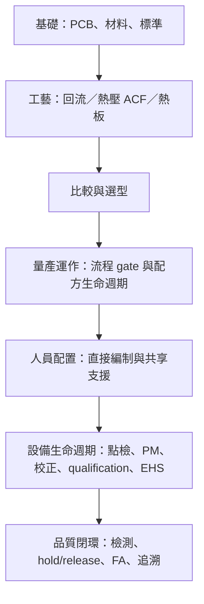

# SMT Bonding 架構與機台人員配置研究

- 研究日期：2026-09-02
- 研究範圍：SMT 熱風回流、熱壓／ACF、熱板／PCB 預熱返修
- 證據原則：設備商、材料商、標準組織與製造商官方職缺優先；104、智聯招聘、LinkedIn 等職業／工程師社交平台只用來核對現場職稱與分工，不推算固定人數。

## 結論摘要

1. 現有書已涵蓋「設備原理 → 製程參數 → 缺陷／檢測 → 材料」，但還不是完整的量產架構；缺少 NPI／配方核准、首件與換線、正常生產監控、異常 hold/release、PM 後 qualification、追溯、EHS，以及各角色的交付物與交接點。這可由現有 [SMT Bonding 導讀](../../../docs/smt-bonding/README.md) 與 [Semi Jobs 職務地圖](../../../docs/semi-jobs/00-map.md) 的差異直接看出。
2. 不宜寫「一台機固定配幾人」。公開職缺通常列工作內容或徵才名額，沒有同時公開機台數、班別、產品組合、稼動率與自動化程度；即使 ASMPT 公開某客戶把單線人員由 5 降為 3，也明示成效來自特定物料管理與軟體導入，不能外推成所有 SMT 線的標準編制。[ASMPT WORKS 案例](https://smt.asmpt.com/en/products/software-solutions/)
3. 書中應明確分成兩層：**單機／產線直接編制**是每班必須貼近設備、直接完成操作與判定的人；**共享支援角色**則按多台機、多條線或全廠服務量配置，通常不常駐每台機。這與 Semi Jobs 已使用的 PE、EE、QA、FA、MFG／CIM 分工一致：[製程工程師](../../../docs/semi-jobs/06-process-overview.md)、[設備工程師](../../../docs/semi-jobs/10-equipment.md)、[QA](../../../docs/semi-jobs/12-qa.md)、[智慧製造](../../../docs/semi-jobs/18-smart-manufacturing.md)。
4. 最小可用的人力模型是「尖峰勞動分鐘 ÷ 可用勞動分鐘」加上安全／技能覆蓋下限，而不是套固定比例。自動化設備可讓一名操作員巡管多台，但只在換線、補料、告警、抽檢與走動的尖峰工作不重疊時成立；FUJI 官方也把自動換線、物料搬送與自動回饋描述為降低操作員負荷，而不是取消所有人員。[FUJI 少人化方案](https://smt.fuji.co.jp/en/fsf2-nxtra_nxtrpm/)

## 一、現有書的結構缺口

### 1.1 現況盤點

現有章節的長處是概念順序清楚：PCB／SMT 基礎、回流與 profile、熱壓與 ACF、熱板、三工藝比較、缺陷／AOI、材料與資源。缺口不是再補更多設備原理，而是補上「如何把設備變成受控製程」。

| 現有內容 | 已回答 | 尚未回答 | 建議補法 |
|---|---|---|---|
| 回流爐與爐溫曲線 | 怎麼加熱、怎麼量 profile | 誰建 recipe、誰核准、何時重跑 profile、超規誰停線 | 新增「量產控制與交接」頁；回流頁只放角色摘要 |
| Hot bar／ACF | 溫度、壓力、時間與接合流程 | ACF lot／回溫／out-time、對位、刀頭壽命、首件與電測如何交接 | 同一控制頁放共通 gate；ACF 頁補特有控制點 |
| 熱板 | 適用少量打樣／維修與操作限制 | 誰可操作、能否離人、排煙、校驗、返修放行 | 定位為「受控返修工作站」，不要寫成縮小版量產線 |
| AOI／缺陷 | 各工具能看見什麼 | 誰 disposition、誰 hold/release、何時升級 X-ray／截面／FA | 新增 RACI／異常升級圖 |
| 材料 | 錫膏與 ACF datasheet | 冷鏈、回溫、累積室溫壽命與批號追溯的 owner | 材料頁新增 material control 小節 |

上述缺口也可用官方職務內容驗證：Jabil 的 SMT Manufacturing Engineer 同時擁有製程開發、reflow profile、NPI、RCA／DOE、標準符合與操作員訓練，說明這些是量產架構的一部分，不只是設備原理。[Jabil Manufacturing Engineer II](https://careers.jabil.com/jobs.html?jobitem=j2444754-il-united-states-of-america-manufacturing-engineer-ii--1st-shift)

### 1.2 建議的新書架構

保留現有頁面，不重寫成職務百科；只新增四個共通頁，並在三種工藝頁各放一張小型角色卡。



建議新增：

1. `07b-production-control.md`：NPI → recipe／治具驗證 → 首件 → 量產 → 換線 → 異常 hold → release；交付物含 profile report、setup sheet、control plan、首件紀錄與變更紀錄。Jabil 官方職缺要求 NPI、process flow、validation、CAPA 與人員訓練；Spectrum Control 的職缺也要求 work instructions、qualification、SPC 與跨 Production／Quality 協作。[Jabil](https://careers.jabil.com/jobs.html?jobitem=j2444754-il-united-states-of-america-manufacturing-engineer-ii--1st-shift)、[Spectrum Control（LinkedIn 公司職缺頁）](https://www.linkedin.com/jobs/view/process-engineer-smt-at-spectrum-control-4427374809)
2. `07c-machine-staffing.md`：採本文的直接／共享配置矩陣與估算工作表，不給虛假的「每台固定人數」。
3. `08c-equipment-lifecycle.md`：操作員日點檢、技術員 PM／校正、工程師 PM 後 qualification、OEM escalation、備品與 EHS。Heller 把 flux management、冷卻區清潔與 PM 停機列為爐體設計重點；其 Cpk 系統也區分設備監控、產品動態 profile 與板級追溯。[Heller MK7 brochure](https://hellerindustries.com/wp-content/uploads/2025/05/HELLER-MK7-Reflow-Oven-Brochure_EN_20240508_compressed.pdf)、[Heller Cpk](https://hellerindustries.com/cpk/)
4. `08d-quality-release.md`：AOI／電測／X-ray／FA 的 disposition 與升級條件；避免把「檢出」誤寫成「品質放行」。IPC 將 J-STD-001 的適用角色明列為操作員、技術員與主管，也另把 process engineer、QA supervisor、training manager 列為標準／品質責任角色。[IPC J-STD-001 for Operators](https://www.ipc.org/media/4341/download)、[IPC J-STD-001 Endorsement](https://www.ipc.org/ipc-j-std-001-endorsement-program)

每個既有工藝頁只需補同樣四行，避免重複：`直接操作`、`製程 owner`、`設備 owner`、`品質 release owner`，並連回新增共通頁。

## 二、人員分類原則

### 2.1 單機／產線直接編制

定義：該班若沒有這些**功能**，設備或產線就不能安全、合規地運轉。角色名稱可合併，但責任不能消失。

| 功能 | 典型職稱 | 每班核心交付物 | 是否一定一機一人 |
|---|---|---|---|
| 操作與基本點檢 | Operator、SMT 技術員、Bonding Operator、Rework Technician | 正確工單／recipe、開機點檢、上下載、巡檢、異常停機與紀錄 | 否；自動線可巡管多機，手動熱板則需受訓者控制工作站 |
| 換線／調機與第一線排障 | Senior Operator、Line Technician、調機技術員 | 換線確認、治具／料站核對、首件支援、minor stop recovery | 視換線頻率與尖峰負荷，可與操作員合併 |
| 班別協調與 escalation | Line Lead、Shift Leader、組長 | 人力／WIP 調度、hold、叫修、跨站協調、交班 | 通常按區域／線群共享，不是每機一名 |
| 線邊檢查與 disposition | AOI Operator、Inspector、Quality Technician | 判讀檢測結果、隔離疑品、依權限放行或升級 | 自動檢測不代表無人；是否專職取決於誤報、抽驗與客戶要求 |

繁中職缺把技術員工作列成 SMT 設備操作、換線、備料上料、基本參數、巡檢、日常保養與異常回報；這支持「操作／技術員是整條線功能，不是只守回流爐」。[104「SMT／迴焊爐」職缺結果](https://www.104.com.tw/jobs/search/?keyword=%E8%BF%B4%E7%84%8A%E7%88%90&order=15)

日文製造商的官方招募頁同樣把基板實裝機 operator 工作列為品質檢查、材料確認／交換與機種切換，另列設備／計測器保全、基板解析修理、品質與材料管理，顯示現場功能可以同部門但仍需分清 ownership。[オーエムテック採用情報](https://omtec-ltd.jp/recruit/)

中國大陸官方政府彙整的企業職缺則把 SMT 工程師、操作／技術員、組長分開：工程師負責參數、設備點檢校正、MES 與指導；技術員處理設備操作與換線；組長負責排班、人力物料與線體指標。該頁雖列徵才名額，但未列線數，不可換算每線比例。[深圳鹽田區政府招聘資訊](https://www.yantian.gov.cn/cn/zwgk/zdlyxxgk/jycy/zpxx/content/post_12760709.html)

### 2.2 共享支援角色

定義：需要服務這台機，但通常以多台機、多條線、產品族或全廠 pool 配置；不可因「非每機常駐」就從組織圖刪掉。

| 角色 | 擁有的決策／交付物 | 何時必須介入 | 主要依據 |
|---|---|---|---|
| 製程／製造工程師（PE／ME） | process window、recipe baseline、profile、DOE、NPI、變更與 PM 後製程確認 | 新產品、換材料／治具、profile 漂移、批量缺陷、重大變更 | [Jabil 官方職缺](https://careers.jabil.com/jobs.html?jobitem=j2444754-il-united-states-of-america-manufacturing-engineer-ii--1st-shift)、[KIC profiling 說明](https://kicthermal.com/article-paper/416-measuring-the-accuracy-of-the-kic-mvp-3/) |
| 設備／維護工程師（EE） | PM、校正、備品、故障修復、設備狀態與維修紀錄 | 安全 alarm、硬體異常、溫控／壓力／傳動偏差、PM、install／upgrade | [Semi Jobs 設備工程](../../../docs/semi-jobs/10-equipment.md)、[Heller MK7](https://hellerindustries.com/smt-solder-reflow/) |
| 品質工程師／QA | control plan、抽樣與 acceptance、nonconformance、hold/release、audit／CAPA | 首件／變更、超規、客訴、重工或偏離核准條件 | [Semi Jobs QA](../../../docs/semi-jobs/12-qa.md)、[IPC 認證角色](https://www.ipc.org/ipc-certifications) |
| 失效分析／可靠度／實驗室 | X-ray、截面、材料／界面證據與失效機制 | AOI／電測不足以判因、重複性缺陷、可靠度失效 | [Semi Jobs FA](../../../docs/semi-jobs/14-failure-analysis.md) |
| 材料／倉儲／線邊物流 | lot、FIFO／FEFO、冷藏／回溫、out-time、錫膏／ACF 批號追溯 | 領退料、換批、超出保存條件或有效期 | 3M ACF 明定 frozen storage、回溫防結露與累積室溫壽命；條件依料號，不可全書固定成單一溫度。[3M ACF 5363 datasheet](https://multimedia.3m.com/mws/media/407590O/3mtm-anisotropic-conductive-film-5363.pdf)、[Dexerials FAQ](https://www.dexerials.jp/en/products/faq/index.html) |
| IE／生管／MFG／MES | 排程、WIP、line balance、工單／recipe routing、追溯 | 產能規劃、插單、換線、瓶頸與交期異常 | [Semi Jobs 智慧製造](../../../docs/semi-jobs/18-smart-manufacturing.md) |
| EHS／廠務 | 排煙、電力、壓縮空氣、氮氣、消防、熱表面與能源隔離規範 | 裝機、危害變更、排煙失效、維修與事故 | PACE 要求受訓人員、通風／排煙、熱表面防護與不可無人看守。[PACE PH100 manual](https://paceworldwide.com/sites/default/files/2021-01/PH100-Operations-Manual.pdf) |
| OEM FSE／應用工程師 | install、進階診斷、韌體／升級、sample test、原廠訓練 | 內部 EE／PE 無法排除、重大 upgrade 或新應用 | AMADA 提供 feasibility／application consulting；Avio 提供實機 sample test 與選型支援。[AMADA hot-bar desktop](https://www.amadaweldtech.eu/products/hot-bar/hot-bar-desktop-series/heat-staking-desktop-systems)、[日本 Avio pulse heat](https://www.avio.co.jp/products/assem/principle/phu/) |

## 三、三類機台的建議配置

### 3.1 SMT 熱風回流爐：以「整條 SMT 線」配置，不以爐體孤立配置

回流爐處在印刷／SPI、貼片、回流、AOI 的連續線中；FUJI 官方也用這四類設備定義 SMT line。因此正常自動量產時，**不預設每台回流爐專屬一名操作員**，而是把它放進線體 operator／technician 的工作量模型。[FUJI SMT line 定義](https://www.fuji.co.jp/data/uploads/AR2022_E.pdf)

**每班直接功能**

| 功能 | 現場工作 | 配置觸發條件 |
|---|---|---|
| SMT line operator／技術員 | 工單與 recipe 核對、板流監視、基本日點檢、alarm response、換線／補料協作、紀錄 | 依整線尖峰勞動分鐘；自動板流穩定時可巡管多設備 |
| Senior technician／line lead | 首件協調、換線、minor stop、hold 與叫修、交班 | 多線共享與否由同時換線數、距離和 response SLA 決定 |
| AOI／quality technician | AOI call disposition、疑品隔離、抽樣與升級 | AOI 誤報、產品等級、節拍與品質系統決定；不可只因 AOI 自動化便刪除判定責任 |

**共享支援**

- SMT PE／ME 擁有 solder paste process window、熱電偶位置、golden/profile board、爐溫曲線、DOE 與量產 release。KIC 官方資料明確把「工程師定 process window、技術員找 oven recipe、量產後定期驗證」分成不同工作。[KIC profiling](https://kicthermal.com/article-paper/416-measuring-the-accuracy-of-the-kic-mvp-3/)
- EE／maintenance 擁有傳送、加熱／冷卻、風機、氮氣／氧濃度相關硬體、清潔、PM、校正與復機；PE 在修復後確認 profile／製程資格。Heller 的設備資料將 cooling PM、flux 管理與設備 Cpk／out-of-spec notification 分開描述，支持硬體健康與產品製程兩層 owner。[Heller SMT reflow](https://hellerindustries.com/smt-solder-reflow/)、[Heller Cpk](https://hellerindustries.com/cpk/)
- QE／QA 擁有 acceptance、nonconformance 與 release；IE／MES 擁有排程、工單、recipe routing 和追溯；EHS／facilities 支援排煙、氮氣與能源安全。這些角色可服務多線，但要有班別聯絡與回應標準。[Semi Jobs 合作圖](../../../docs/semi-jobs/20-collaboration.md)

**不該寫進書的固定說法**

- 「一爐一人」：自動連線時通常不成立；應看整線人工負荷。
- 「一人可顧 N 條線」：只有在實測 changeover、補料、告警與走動後才可決定。ASMPT 的 5→3 是特定客戶案例，不是標準。[ASMPT](https://smt.asmpt.com/en/products/software-solutions/)
- 「自動監控可取代工程師」：Heller 可自動警報與追溯，FUJI 可自動回饋與換線，但仍保留 operator workload、maintenance 與工程 owner。[Heller Cpk](https://hellerindustries.com/cpk/)、[FUJI](https://smt.fuji.co.jp/en/fsf2-nxtra_nxtrpm/)

### 3.2 熱壓／ACF：配置由 manual、semi-auto、full-auto 三級決定

AMADA 的桌上型設備同時提供 semi-automatic／automatic 系統，且採 two-hand start；大橋製作所則同時提供手動桌上機到全自動量產線，將 ACF 貼附、alignment 與 main bonding 做成不同單元。因此不能把「熱壓機」視為單一自動化等級。[AMADA](https://www.amadaweldtech.eu/products/hot-bar/hot-bar-desktop-series/heat-staking-desktop-systems)、[大橋製作所 ACF 裝置](https://ohashi-engineering.co.jp/acf/)

| 自動化型態 | 每班直接功能 | 可共享但不可缺的支援 | 人數估算關鍵 |
|---|---|---|---|
| 手動桌上／治具式 | 受訓 bonding operator：清潔、ACF 貼附、work loading、光學對位、雙手啟動、卸料與外觀初判 | ACF／bonding PE、EE／校正、QE、材料冷鏈、電測／FA | 對位與裝卸人工秒數、加壓週期是否能安全離機、首件／抽驗負荷 |
| 半自動 | Operator／technician：上下載、物料與治具、recipe 核對、alignment 確認、alarm recovery；必要時 quality technician 做電測／外觀 disposition | PE、EE／automation、QE、materials、OEM | 一人同時照管台數要用尖峰告警＋上下料時間驗證 |
| 全自動量產線 | Line operator／technician：供料、線體監控、換型與異常；inspection／test disposition 依線體設計 | PE、equipment／automation、QE、materials、IE／MES、FA、OEM | upstream/downstream balance、補料頻率、換型、誤報、minor stop 與走動距離 |

**ACF 特有的 ownership**

- PE 擁有實際 bond-line 的溫度／壓力／時間與 alignment process window，不能只抄 controller setpoint。Avio 把 pulse heat 定義為先加壓、通電升溫、保持加壓與加熱；3M ACF 則要求在 heat／pressure 下完成主接合並在冷卻期間維持壓力，顯示 recipe 是材料、設備與治具共同結果。[Avio](https://www.avio.co.jp/products/assem/principle/phu/)、[3M ACF 5363](https://multimedia.3m.com/mws/media/407590O/3mtm-anisotropic-conductive-film-5363.pdf)
- 材料管理擁有 lot、低溫保存、密封回溫防結露與累積室溫時間；條件依 ACF 料號。Dexerials 官方甚至指出熱固型需要低溫保存，但不同型號使用期限不同，因此現有書不應把所有 ACF 寫成同一個 `-10°C` 規則。[Dexerials FAQ](https://www.dexerials.jp/en/products/faq/index.html)
- EE／technician 擁有 thermode、加壓頭、熱電偶／溫控、平行度、治具與 vision／motion；QE 擁有對位、外觀、電性與剝離／可靠度的 acceptance。大橋全自動設備明列 ACF attach、alignment 與 main bonding 是不同單元，提醒書中要分站寫控制點。[大橋製作所](https://ohashi-engineering.co.jp/acf/)
- AOI 不能代替電測。設備商可把 vision-assisted motion、inspection 與 process monitoring 整合進系統，但接合後是否導通仍是另一個品質證據。[AMADA 公司／能力說明](https://amadaweldtech.com/about-amada-weld-tech/)

### 3.3 熱板／PCB preheater：定位成受控返修站

熱板最合理的直接角色是**受訓返修技術員**，不是一般量產 operator。PACE 官方手冊要求只由 trained personnel 使用、熱循環中不可無人看守、需熱防護與排煙，維修則由公司指定的 qualified personnel 執行。[PACE PH100](https://paceworldwide.com/sites/default/files/2021-01/PH100-Operations-Manual.pdf)、[PACE HS100](https://paceworldwide.com/sites/default/files/2021-08/HS100.pdf)

**每個啟用中的工作站**

- Rework technician：依核准返修程序夾持 PCB、布置 thermocouple、操作、監視、冷卻、清潔與紀錄。HAKKO 的 closed-loop 模式要求 K-type thermocouple 固定在 PCB；PACE 也建議用 thermocouple 驗證板溫。[HAKKO FR-1012 bulletin](https://hakkousa.com/amfile/file/download/file/1071/product/9410/)、[PACE HS100](https://paceworldwide.com/sites/default/files/2021-08/HS100.pdf)
- 同一人能否同時處理另一站，不看「加熱器正在自動控溫」就判定，而要看不可離人規範、熱表面、取放時點與排煙；在沒有 time study 與風險評估前，不應把一人重複配置到兩個同時加熱的手動站。[PACE PH100](https://paceworldwide.com/sites/default/files/2021-01/PH100-Operations-Manual.pdf)

**共享支援**

- Rework／process engineer 核准板種、返修 profile、允許次數與 acceptance；quality inspector／QE 做返修後外觀、電性與必要的 X-ray／FA；EHS 管排煙、熱表面與可燃物；qualified maintenance／OEM 維修校正。IPC J-STD-001 endorsement 涵蓋 SMT、machine/reflow、ESD、安全與驗證，IPC-7711/7721 則應作為返修程序入口。[IPC J-STD-001 Endorsement](https://www.ipc.org/ipc-j-std-001-endorsement-program)、[IPC certifications](https://www.ipc.org/ipc-certifications)

**書中應更正的定位**

現有 `06-hot-plate.md` 把熱板描述為「打樣、維修」是合理方向，但人員章應補一句：熱板不是用低設備成本換掉 PE、QE 與 EHS，而是把自動線原本內建的控制與 interlock 轉成人員程序；使用者必須受訓，工作站不得無人看守，且須有排煙與溫度驗證。[PACE PH100](https://paceworldwide.com/sites/default/files/2021-01/PH100-Operations-Manual.pdf)

## 四、不杜撰固定人數的配置模型

### 4.1 先算工作，不先算職稱

選一個能看見尖峰的 planning window（例如換線窗口；長度由現場自訂），逐項量測該窗口的人工分鐘：

```text
D_peak = 固定看守／安全工作
       + 上下載與補料
       + 換線／清潔／首件
       + 例行檢查與紀錄
       + 可預期 minor-stop recovery
       + 站間走動與交接

N_direct = max(
  N_safety_min,
  N_skill_coverage_min,
  ceil(D_peak / (window_minutes × local_loading_limit))
)
```

- `N_safety_min`：來自手冊、風險評估、不可無人看守或雙手啟動等限制；不是網路平均值。熱板可由 PACE 的 trained／unattended 要求建立，hot-bar 桌上機則要把 two-hand start 與人工對位納入工作內容。[PACE](https://paceworldwide.com/sites/default/files/2021-01/PH100-Operations-Manual.pdf)、[AMADA](https://www.amadaweldtech.eu/products/hot-bar/hot-bar-desktop-series/heat-staking-desktop-systems)
- `N_skill_coverage_min`：每班至少要有人具備當班需要的授權技能；同一人可同時覆蓋 operator、換線與 basic inspection，但須通過訓練且工作量不衝突。IPC 明確把 operator、technician、supervisor 都列為 J-STD-001 操作課程適用角色。[IPC operator FAQ](https://www.ipc.org/electronics-assembly-operators-faqs)
- `local_loading_limit`：由休息、教育訓練、走動、變異與應急餘量決定，應由工廠自行核准，不在書裡硬編百分比。
- 應以尖峰窗口而非整班平均計算；平均 0.7 人仍可能在同時換線／告警時需要 2 人。這是工業工程上的建模建議，不是引用網路人數。

### 4.2 共享角色的算法

對每個共享角色分開估算，不把 PE、EE、QE 混成一個「工程師」：

```text
D_shared,role = 排定工作（PM、profile、首件、audit）
              + 事件率 × 平均處理時間
              + 跨線走動／交接

N_shared,role = max(
  班別／on-call 覆蓋下限,
  ceil(D_shared,role / 可用工時)
)
```

另做 response-time 驗證：若一名 EE 的平均工時足夠，但無法在瓶頸線 alarm 的允許時間內到場，就仍需增加當班覆蓋或 OEM on-site／on-call。Semi Jobs 的設備章也把 uptime、PM、qualification、vendor escalation 與 on-call 視為不同但相連的責任。[Semi Jobs 設備工程](../../../docs/semi-jobs/10-equipment.md)

### 4.3 建議附在書裡的最小工作表

| 輸入 | 回流 SMT 線 | 熱壓／ACF | 熱板返修 |
|---|---|---|---|
| 每班活躍線／機／工作站 |  |  |  |
| 自動化級別與可離機週期 |  |  |  |
| 上下載／補料人工秒 |  |  |  |
| 每班換線次數與人工分鐘 |  |  |  |
| 首件／抽驗／紀錄分鐘 |  |  |  |
| minor stop 次數與處理分鐘 |  |  |  |
| 走動／交接分鐘 |  |  |  |
| 不可無人／雙人／技能限制 |  |  |  |
| 需要的 response SLA |  |  |  |
| 算出的直接人數／班 |  |  |  |
| PE／EE／QE／材料／EHS 共享覆蓋 |  |  |  |

### 4.4 可引用但不可泛化的案例

| 案例 | 能證明什麼 | 不能證明什麼 |
|---|---|---|
| ASMPT：某客戶導入 WORKS 後，單線人員由 5 降到 3 | 物料流、setup verification 與軟體可實際改變直接人力 | 所有 SMT 線都應配 3 人 |
| FUJI：自動 feeder maintenance 把每 feeder 人工時間由 11 分降為 2 分 | 自動化應以「被移除的人工分鐘」進模型 | 可刪除 maintenance owner |
| Panasonic Dixon：17 條線、每線約 10 台 mounter，並用 AGV、省換線時間與原廠駐廠支援 | 線數、設備數、人數不是線性關係；OEM 支援也是資源 | 可從設備數直接推 operator 或 engineer 人數 |

來源：[ASMPT](https://smt.asmpt.com/en/products/software-solutions/)、[FUJI feeder maintenance](https://smt.fuji.co.jp/en/product/automaticfeeder)、[Panasonic Dixon case](https://connect.panasonic.com/en/products-services_fa/solutions/case-studies/dixon-padget)

## 五、多語與職業平台交叉查核

| 語言／平台 | 來源 | 對角色配置的有效訊息 | 使用限制 |
|---|---|---|---|
| 繁體中文／104 | [104 SMT／迴焊爐職缺](https://www.104.com.tw/jobs/search/?keyword=%E8%BF%B4%E7%84%8A%E7%88%90&order=15) | 常見現場詞為操機、技術員、助理工程師；工作跨操作、換線、日保養、基本排障與報表 | 聚合頁會更新，只佐證職稱與任務，不取人數比例 |
| 簡體中文／企業官網 | [廈門亞鍀電子招募](https://cn.actec.com.cn/job.aspx) | 工藝工程師負責 NPI／文件／異常；設備工程師負責 AOI／回流／印刷設備參數、故障與 PM | 單一公司可合併職責，不代表普遍組織圖 |
| 簡體中文／政府彙整 | [深圳鹽田政府招聘資訊](https://www.yantian.gov.cn/cn/zwgk/zdlyxxgk/jycy/zpxx/content/post_12760709.html) | 區分 SMT 工程師、技術員與生產組長，並列 MES、點檢校正、換線與班組管理 | 徵才名額沒有設備／線數分母 |
| 簡體中文／智聯招聘 | [SMT 工藝工程師](https://www.zhaopin.com/jobdetail/CCL1422560800J40835369316.htm)、[SMT 設備工程師](https://www.zhaopin.com/jobdetail/CC550674080J40929602702.htm) | 現場把 PE 的 NPI／參數／缺陷／文件，與 EE 的 PM／校正／故障／備件分開描述 | 平台職缺作語彙佐證，內容可能下架 |
| 英文／製造商官方 careers | [Jabil](https://careers.jabil.com/jobs.html?jobitem=j2444754-il-united-states-of-america-manufacturing-engineer-ii--1st-shift) | SMT ME 擁有 printing、placement、reflow、inspection、NPI、RCA／DOE 與 operator training | 代表該職缺的 ownership，不給 staffing ratio |
| 日文／製造商官網 | [オーエムテック](https://omtec-ltd.jp/recruit/) | operator／管理負責品質、材料、機種切換；另有保全、解析修理、品質與材料管理 | 小型企業可能一人多能，不能照搬職稱邊界 |
| 日文／設備商官方 | [日本 Avio](https://www.avio.co.jp/products/assem/principle/phu/)、[大橋製作所](https://ohashi-engineering.co.jp/acf/) | pulse heat 的加壓／加熱流程；ACF 線可由桌上手動到貼附、對位、主壓著全自動 | 說明設備與人工介面，不直接提供工廠人數 |
| 工程師社交平台／LinkedIn | [SMT Process Engineer 個人經歷](https://ro.linkedin.com/in/andrei-dobos-iulian/ro)、[Jabil SMT PE 職缺](https://www.linkedin.com/jobs/view/smt-process-engineer-iv-at-jabil-4414766032) | 現場語彙反覆出現 reflow profiling、equipment troubleshooting、NPI、文件、備品與跨團隊 | 個人自述／平台頁只作交叉佐證，不作規範或人數依據 |

## 六、寫作時應避免的錯誤

1. **不要把職稱當 headcount 單位。** 小廠可能由一名 SMT engineer 同時做 PE／EE；大廠可能拆成 process、equipment、quality 與 line technician。書中應先寫功能與決策權，再列常見職稱。繁中、簡中、英文與日文職缺都顯示名稱邊界不一致。[104](https://www.104.com.tw/jobs/search/?keyword=%E8%BF%B4%E7%84%8A%E7%88%90&order=15)、[Jabil](https://careers.jabil.com/jobs.html?jobitem=j2444754-il-united-states-of-america-manufacturing-engineer-ii--1st-shift)、[オーエムテック](https://omtec-ltd.jp/recruit/)
2. **不要把設備 setpoint 當產品實際溫度。** 回流要看裝有熱電偶的產品 profile；ACF 要看 bond-line／材料條件；熱板要用 PCB 上 thermocouple 驗證。[KIC](https://kicthermal.com/article-paper/416-measuring-the-accuracy-of-the-kic-mvp-3/)、[3M ACF](https://multimedia.3m.com/mws/media/407590O/3mtm-anisotropic-conductive-film-5363.pdf)、[HAKKO](https://hakkousa.com/amfile/file/download/file/1071/product/9410/)
3. **不要把 AOI 檢出寫成 QA 放行。** AOI／vision 產生檢測結果，disposition、隔離、release 與 CAPA 仍需品質權限；ACF 外觀／對位也不能替代電性證據。[IPC J-STD-001 Endorsement](https://www.ipc.org/ipc-j-std-001-endorsement-program)、[Semi Jobs QA](../../../docs/semi-jobs/12-qa.md)
4. **不要把自動化寫成零人。** FUJI 的目標是減少 operator tethering，實際功能仍包含 scheduling、換線、物料、告警與 maintenance；Panasonic 案例也仍保留 operators、technical team 與 OEM support。[FUJI](https://smt.fuji.co.jp/en/fsf2-nxtra_nxtrpm/)、[Panasonic Dixon](https://connect.panasonic.com/en/products-services_fa/solutions/case-studies/dixon-padget)
5. **不要把 ACF 保存條件通用化。** 3M 5363 與 Dexerials smart-card ACF 的保存條件不同；書中應要求「依料號 datasheet／SDS」，並由 material control 記錄 lot、回溫與 out-time。[3M 5363](https://multimedia.3m.com/mws/media/407590O/3mtm-anisotropic-conductive-film-5363.pdf)、[Dexerials smart-card ACF](https://www.dexerials.jp/en/products/acf/a7_comp8.html)

## 七、給正文實作者的最短落地清單

1. 新增四頁：量產控制、人員配置、設備生命週期、品質放行。
2. 三種工藝頁各加四行角色卡，不另複製一份完整職務說明。
3. 人員頁只提供直接／共享矩陣、公式與空白工作表；ASMPT 5→3 僅放案例框。
4. 熱板頁補 trained personnel、不可無人、排煙與 thermocouple；ACF 頁補 material lot／回溫／out-time owner；回流頁補 profile owner 與 PM 後 qualification。
5. 新章沿用 Semi Jobs 的共同語彙：Operator／Technician、PE／ME、EE、QA／QE、FA、IE／MFG／MES、EHS／Facilities、OEM FSE；職稱可合併，ownership 不合併。

## 來源品質與限制

- 第一手：IPC、Heller、KIC、AMADA、Avio、大橋製作所、FUJI、Panasonic、3M、Dexerials、PACE、HAKKO、Jabil 與企業官方招募頁。
- 政府彙整：深圳鹽田區政府企業招聘資訊，可信於當期刊載內容，但不是 staffing standard。
- 平台／社交：104、智聯、LinkedIn，只用於職稱和任務交叉核對。
- 本次沒有找到可同時交代「機台／線數、班別、產品 mix、自動化級別、直接與間接人員」的跨廠官方基準。因此不提出固定人數；任何人數都應用第 4 節模型，以現場 time study、風險評估與 response SLA 驗證。
